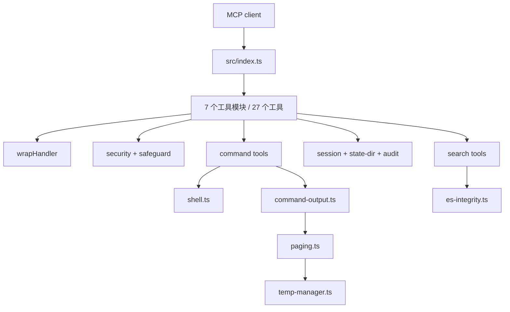

# Enhanced Terminal MCP 项目总览

## 速答

这是一个给 AI 客户端使用的终端 MCP 服务。客户端通过 stdio 连接，服务端注册 27 个工具，覆盖命令执行、文件操作、搜索、系统管理、归档和运行状态查看。

项目的主线已经比较完整：入口、跨平台 shell、安全拦截、统一返回格式、会话保存、审计、临时目录和大输出分页都已经接上；安全层和命令执行是最重要的核心。

当前项目不是“全部收尾”的状态，主要有三件事需要注意：

1. Everything 可选依赖的 resolver 已完成，但搜索入口和 npm 发布裁剪还没完成，feature 的 S3-S5 仍是 pending。
2. 当前工作树本身有一批未提交改动，不能把它当成干净的发布基线。
3. 编译和延迟测试通过；lint 目前因当前改动的格式问题失败。全量测试第一次出现过一个临时目录 TTL 时间边界失败，单独重跑和第二次全量均通过，说明这里至少存在测试稳定性风险。

## 结构和运行主线

- `src/index.ts:35` 创建 MCP server，依次注册七组工具；随后初始化临时资源和 session，最后连接 stdio。
- 命令工具集中在 `src/tools/command.ts:251`，三个命令入口都会经过命令预检、限流、安全确认、shell 解析，再进入 `src/command-output.ts:264` 的共享输出流程。
- `src/shell.ts:127` 负责 Windows shell 选择，顺序是显式路径、项目内 pwsh、PATH 中 pwsh、Windows PowerShell 5.1；结果按进程缓存。`src/shell.ts:272` 统一构造最终子进程参数。
- `src/security.ts:176` 负责路径校验，`src/security.ts:351` 提供不可关闭的危险命令硬拦截；`src/safeguard.ts:89` 再处理 strict / normal / off 三种破坏性操作策略。
- 所有工具 handler 通过 `src/wrap.ts:31` 统一处理 telemetry、只读缓存和结果转换，避免每个工具各自实现一套返回格式。
- 状态和大输出分别落在 `.etmcp`、`session.ts`、`audit.ts`、`paging.ts` 和 `temp-manager.ts`；分页写入先进入 staging，再发布成最终缓存目录。

## 工具和测试范围

- 七组工具分别位于 `src/tools/command.ts`、`files.ts`、`manage.ts`、`search.ts`、`system.ts`、`archive.ts`、`utility.ts`。
- 当前源码目录有 37 个 TypeScript 文件，测试目录有 41 个测试文件；测试主要在 `tests/unit/`，MCP 客户端行为和延迟测试在 `tests/` 根目录。
- `pool.ts` 目前只是 inactive stub，实际命令执行不走进程池；`context.ts` 主要给 prompt 注入当前上下文，不是主要执行链。
- `vitest.config.ts:10` 纳入 unit、visibility 和 e2e 测试；测试串行执行，避免共享 session、进程和环境变量互相干扰。

## 当前未收口项

### Everything M3

`src/es-integrity.ts:156` 已经实现显式环境变量路径和 `.etmcp/tools/es.exe` 路径的解析、普通文件检查、固定 SHA-256、fingerprint 失效和并发复用。

但 `src/tools/search.ts:75` 和 `src/tools/search.ts:178` 仍消费旧的 `ensureEsExeIntegrity()` 兼容入口，当前 `everything_search` 的提示仍指向恢复仓库里的 `es_tool/es.exe`，还没有完成设计里要求的显式错误区分和完整安装提示。`package.json:10` 也仍把 `es_tool/es.exe` 列在 npm 发布文件中。对应 feature 文件中的 S3、S4、S5 仍为 pending。

### 发布物卫生

`npm pack --dry-run` 当前确认会包含 `es_tool/es.exe`。同时，`build/` 中还留有源代码已经不存在的旧 `middleware.*` 和多组测试编译产物；由于发布配置包含整个 `build/`，这些旧文件也会进入包。它们不影响当前 TypeScript 编译，但会让发布物变脏，应该随发布收口一起处理。

### 测试稳定性和格式

- `npm run lint` 当前失败，原因集中在未提交的 `src/es-integrity.ts` 和 `tests/unit/es-integrity.test.ts`：导入排序和 Biome 格式未同步。
- `npm test` 首次运行有 1 个 `temp-manager` TTL 用例失败，失败位置是 `tests/unit/temp-manager.test.ts:462`；单独重跑该用例、第二次全量运行均通过。该用例使用 100ms TTL，时间余量很小，后续最好把它视作潜在 flaky 测试观察。
- Vitest 还提示 `tests/unit/utils.extended.test.ts:32` 的 `vi.unmock()` 不在模块顶层；目前只是 warning，但未来 Vitest 版本可能升级为错误。

## 已做的验证

本次基于当前工作树执行了只读验证，临时目录统一使用 `E:\Codex_Temp`：

- `npm run build`：通过。
- `npx tsc --noEmit`：通过。
- `npm run lint`：失败，见上面的格式问题。
- `npm test`：第二次全量运行通过，39 个测试文件、537 个测试通过；第一次运行的单个 TTL 失败已单独复跑通过。
- `npm run test:latency`：通过，24 个延迟 e2e 用例通过。
- `git diff --check`：通过。
- `npm pack --dry-run`：命令通过，但确认发布物仍包含 `es_tool/es.exe` 和旧 build 产物。

## 结论边界

这份记录是对当前代码和工作树的总览，不代表已经验收或适合直接发布。下一步最自然的顺序是：先完成 `publish-es-optional` 的 S3-S5，再做发布物清理和最终文档同步；临时目录 TTL 用例和 Biome 格式问题也应在最终验收前处理。
