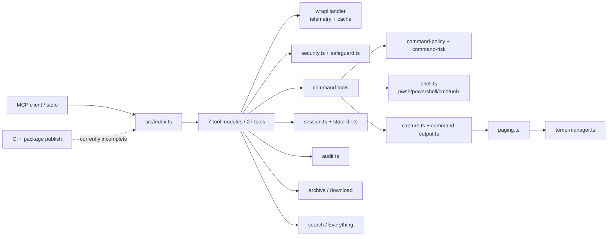

# Enhanced Terminal MCP 生产就绪审计

## 问题与范围

本次审计回答两个问题：

1. 当前仓库的架构、实现、测试和发布链路是否可以直接作为生产版本发布。
2. 如果不能，哪些问题必须先修，哪些属于部署边界或后续硬化。

原始审计基线为 `main` 分支代码 HEAD `974f4aca8bfe05c38dac0cf06225713b1ccb5034`。随后已完成 `hardening-contract-and-profiles`、`kill-process-identity` 与 `dependency-and-bootstrap-release` 三条 feature；当前工作区还包含 `process-supervisor-and-cancellation` 的未验收部分实现和 CodeStable 进度回写，剩余 P0/P1 结论不能因为代码已接线就视为解除。仓库根目录没有 `.codegraph/`，因此代码关系以 Serena 符号读取、源码行号、测试和实际命令结果为准。

## 速答

当前项目已经不是原型：入口、工具分组、统一 `ToolResult`、安全双层、Windows shell 解析、流式输出、分页缓存、会话持久化、审计和临时资源治理都已经形成完整主线。

但它还不能被无条件描述为“生产就绪”。准确结论是：

- **单用户、本机、stdio、宿主本身提供权限隔离的个人 Agent 场景**：基础能力接近可用；本轮已关闭 `kill_process` 的 name wildcard/PID identity 高危项，以及生产依赖、npm/source bootstrap 和 package evidence 这组 P0 发布问题；`process-supervisor-and-cancellation` 已开始接入全局 process lifecycle，但当前 timeout/cancel registry 清理回归仍失败，仍需完成全局 process lifecycle、统一资源预算、路径/秘密/网络边界和阻断 CI。
- **互联网暴露、多租户、恶意输入或需要强隔离的场景**：不合格。项目自己已经明确声明完整 shell 执行是 defense-in-depth 而不是 sandbox；当前还存在未闭合的资源上限、symlink/TOCTOU、SSRF、敏感状态落盘和子进程树清理边界。

## 关键证据

1. **运行时主线已接通，但边界是本地 stdio 而非沙箱**：`src/index.ts:45-107` 创建 MCP server、注册七组工具、初始化 temp/session、连接 `StdioServerTransport` 并注册退出处理；`README.md:105,149-163,179-188` 明确说明无目录 allowlist、完整 shell 不是 sandbox。
2. **安全层有实质防护；原进程名终止高危遗漏已在本轮修复**：原始基线中的 `src/tools/system.ts` 直接调用 `getKillSpec`，`src/platform.ts` 可生成 Windows `/IM` 或 Unix `pkill`，曾可扩大为全进程终止。`kill-process-identity` 已改为精确枚举 + identity token/start-time proof + PID/name XOR；当前 `getKillSpec` 只生成 verified PID spec，provider 不再执行 name matching。全局 child-process supervisor 和 process tree lifecycle 仍由后续 feature 负责。
3. **外部输入的 schema 没有形成统一资源预算**：`src/tools/command.ts:319-325,456-457,652-655` 的 timeout、duration、commands 数组和命令字符串没有有限值、整数、长度或数量上限；实际 Zod 3 `z.number()` 接受 `Infinity`，当前编译后的 schema 也接受 `timeout: Infinity`、`duration: Infinity` 和 10001 条 batch commands。
4. **文件安全检查对已存在目标做了 realpath 二次校验，但读路径和不存在目标仍有窗口**：`src/tools/files.ts:61-63` 的 `read_file` 只做 lexical `validatePath`，`list_directory`、`file_info`、`make_directory` 也只做同类检查；写入路径在 `src/tools/files.ts:168-207` 中先校验、再 `mkdir`/写文件，非存在目标的父目录 symlink 和检查到写入之间仍可能发生 TOCTOU。
5. **状态和日志可能持久化秘密或原始命令**：`src/session.ts:91-100,107-112,161-175` 保存自定义 env 值和命令历史；禁止 env key 的比较区分大小写，Windows 下 `path`/`node_options` 等大小写变体未被同一黑名单拦截。`src/tools/command.ts:408-423,555-568,630-635`、`src/tools/command.ts:542` 和 `src/safeguard.ts:294-296` 将命令原文放入 audit 或日志路径，项目没有统一的命令/路径/错误脱敏层。
6. **代码门禁与依赖审计已经通过本 feature 的发布收口，但整体门禁仍不等于全项目生产就绪**：最终质量门禁实测 50 files/630 tests、latency 24/24、工具覆盖率 61.05%/50.90%/63.63%/64.00%；主 coverage 49 files/606 tests，Statements 81.38%、Branches 73.70%、Functions 86.33%、Lines 84.90%；`pnpm audit --prod` 当前为 0 vulnerabilities，package verifier/clean consumer 也已通过。此前门禁曾出现 `tests/unit/temp-manager.test.ts` 100ms TTL 假设造成的波动，本轮工具覆盖率连续 3 轮通过；剩余不合格项集中在全局 process lifecycle、统一预算、路径/秘密/SSRF/archive、MCP conformance 和 canonical CI gate。

## 细节展开

### 1. 当前实现的生产基础

- TypeScript strict、ESM、Node.js `>=20`、`pnpm-lock.yaml` 锁定，`package.json:3-24,31-42` 的构建和测试脚本清晰。
- `src/result.ts:44-60,97-114,343-367` 提供统一成功/错误结构、错误码、`structuredContent` 和 MCP `isError` 转换；这是比较适合 Agent 链式调用的接口基础。
- `src/tools/command.ts` 三个命令工具汇聚到 `runCommandOutput`；`src/capture.ts:57-119` 负责子进程、超时和原始字节捕获；`src/command-output.ts:260-568` 负责 scanner、内存 retention、分页 staging、容量失败降级和输出 envelope。
- `src/security.ts:124-145,176-243,250-355` 有路径穿越、系统目录、敏感文件、危险命令和 hard block；`src/safeguard.ts:152-205,289-343` 有 strict/normal/off 与 Elicitation/risk-gated 分层。这些设计值得保留，但它们是 best-effort policy，不等于 OS 权限隔离。
- `src/state-dir.ts` 和 `src/temp-manager.ts` 已经有固定 project root、legacy 迁移、staging、heartbeat、容量 reservation 和清理机制；`src/paging.ts:677-824` 对 cache id、文件组成、meta 数值和读取范围做了校验。

### 2. 必须修复后才能发布的风险

| ID | 优先级 | 现象与影响 | 证据 | 修复方向 |
|---|---|---|---|---|
| SEC-01 | P0（已解除） | kill_process 曾允许 wildcard/name matching，可能扩大到全进程。 | kill-process-identity acceptance、Windows/Linux/macOS identity tests 和静态残留检查。 | 已收敛为严格 PID/name XOR、精确名称唯一枚举、identity proof/recheck、critical/self/parent protection、PID-only termination；全局 process lifecycle 仍由 supervisor 承接。 |
| SEC-02 | P0（已解除） | 生产依赖审计曾解析到 `fast-uri@3.1.2`、`ip-address@10.2.0`、`hono@4.12.27`、`@hono/node-server@1.19.14`、`body-parser@2.2.2`，报告 4 high/6 moderate/2 low。 | 初始 `pnpm audit --prod --json`；更新后 `pnpm run audit:prod` 返回 No known vulnerabilities found；当前锁定 fast-uri 3.1.6、ip-address 10.5.0、hono 4.13.5、@hono/node-server 1.19.17、body-parser 2.3.0。 | 已保持 SDK 1.29.0 和 zod v3 兼容基线，仅刷新声明范围内传递依赖；后续由 security-and-mcp-conformance-gates 继续把 audit 纳入阻断 CI。 |
| REL-01 | P0（已解除） | npm 包与 README 曾混淆 source setup；setup.bat 不在 npm package，且 stale build/source map/package evidence 没有自动证明。 | package verifier、pnpm pack --dry-run、clean consumer 和 source bootstrap 实测。 | 已将 README 拆成 source/npm 两条路径，prepack clean build、inline source map、LICENSE、package files 和源码侧 verifier 已落地；npm consumer 不依赖 setup.bat、pnpm、checkout 或 runtime download。 |
| REL-02 | P0 | 资源边界可被未信任输入绕过：`Infinity` 被命令 timeout/duration schema 接受；batch commands 无数量上限；watch 没有命令限流；`writeRateLimit` 定义但没有任何业务调用。多请求下没有 active process、总并发、总 wall-time 或总工作量上限。 | `src/tools/command.ts:319-325,456-457,652-655,668-690`; `src/ratelimit.ts:70-85` | 建立统一 `finiteInt`/`boundedString`/`boundedArray` schema；限制命令长度、batch 数量、timeout/duration、搜索结果/深度、读取行数和 URL 长度；所有会产生 I/O/进程的工具接入限流；增加全局执行 semaphore、active process budget、MCP AbortSignal 取消和总输出/总 wall-time budget。 |
| SEC-03 | P1 | 文件安全检查在 read path、非存在目标和父目录 symlink 上不完整；检查与实际操作之间存在 TOCTOU。单用户可信主机风险较低，多进程/本地攻击者/服务包装场景会放大为越权读写。 | `src/tools/files.ts:61-63,168-207,267-268,362-367,404-416`; `src/tools/manage.ts:104-123`; `src/security.ts:216-243` | 将 realpath/parent realpath 校验收敛为共享 helper；对写/删/移动使用 no-follow 或目录句柄语义，原子创建使用 exclusive flags；对 read/list/info 明确是否允许 symlink，若不允许则统一拒绝；补 symlink、父目录替换和并发攻击测试。 |
| SEC-04 | P1 | session.json 保存 env 值与命令历史，日志/audit/错误消息保存命令原文；Windows env 黑名单大小写敏感，`path`/`node_options` 变体存在持久化注入风险。 | `src/session.ts:16-27,91-112,161-175`; `src/tools/utility.ts:313-358`; `src/tools/command.ts:408-423,542,555-568,630-635` | 默认不持久化 env value 和原始命令，或做明确 opt-in；敏感 key 使用规范化大小写 + deny/allow policy；命令、URL、路径和 error detail 进入统一 redactor；状态文件/日志/cache 使用 owner-only 权限并提供清理/轮换策略；`MCP_SECRETS_SCAN=strict` 作为服务部署 profile 的默认建议。 |
| REL-03 | P1 | timeout 只 kill shell 子进程，不保证 Windows 子进程树结束；MCP 请求取消没有接入 capture；异常路径可能在返回后仍有子进程存活。 | `src/capture.ts:37-55,107-119`; `src/stream.ts:53-64`; `src/index.ts:82-96` | Windows 使用 Job Object 或 `taskkill /T` 兜底，Unix 使用独立 process group 并杀组；保存 child handle/active registry；将 MCP cancellation signal 传到 capture；shutdown 等待 active children/audit/session flush，超时才强制退出。 |
| REL-04 | P1 | download 只校验 HTTP/HTTPS，不阻止 loopback/private/link-local/metadata host，也不验证重定向目标；下载、压缩、解压没有内容长度、解压后大小、成员数或 zip bomb 预算。 | `src/security.ts:365-381`; `src/tools/archive.ts:115-149`; `src/platform.ts:217-231` | 生产 profile 增加 host/IP 解析与 SSRF deny/allow policy，并对每次 redirect 重新校验；限制 response bytes、文件大小、压缩比、成员数量、解压路径；优先使用库级 HTTP/ZIP API，避免只依赖外部命令的隐式行为。 |

### 3. 测试和门禁问题

- 在启动 `process-supervisor-and-cancellation` 前，`pnpm run build`、`pnpm exec tsc --noEmit`、`pnpm run lint` 均通过；当前 supervisor 中断点的增量验证见 6.5，不能沿用此前全绿结论覆盖未验收改动。此前 build 入口导出的版本为 `4.0.0`，MCP e2e 工具数为 27。
- 当前最终 `pnpm run gate` 通过 50 个文件/630 个用例；`pnpm run test:coverage` 通过 49 个文件/606 个用例，Statements 81.38%、Branches 73.70%、Functions 86.33%、Lines 84.90%；工具层覆盖率连续 3 轮通过 7 个文件/54 个用例，Statements 61.05%、Branches 50.90%、Functions 63.63%、Lines 64.00%。覆盖率数字可作为基线，但工具 handler 主体仍主要依赖子进程 e2e，不能把 64% 工具层 lines 解释成高强度 hostile-input coverage。
- `pnpm run test:latency` 通过 24/24，但 CI 将 latency 设置为 `continue-on-error: true`，因此性能回归不会阻断 merge。
- `vitest.config.ts:10-12` 只设置 suite 内不并发，没有设置 `fileParallelism: false`。`tests/unit/temp-manager.test.ts:26,146-154` 将 TTL 设为 100ms，却在完整 suite 的文件并行和磁盘负载下假设 cleanup 一定在 TTL 内不发生。两次 `pnpm run gate` 分别出现过 `finalizeStaging` 的 Windows `EPERM rename` 和该 100ms TTL 断言失败；targeted test 与一次独立 full test 均通过，足以证明发布门禁不稳定。
- 主覆盖率 `pnpm run test:coverage` 已配置 80/80/70/80 阈值，但 `package.json:39` 的 `pnpm run gate` 和 `.github/workflows/ci.yml:39-42` 都没有调用主覆盖率，只调用工具层覆盖率；这会让主阈值在 CI 中失去阻断作用。
- 在 supervisor 增量实施前，没有看到官方 MCP conformance suite、取消/信号、symlink race、zip bomb、SSRF、wildcard kill、敏感状态权限和 clean npm consumer 的自动验证；clean npm consumer 已由 dependency feature 补齐，supervisor 的取消/信号自动验证仍未完全通过。

建议先把 TTL 用例改成 fake timers/宽裕 TTL，给 Windows rename 增加有界 transient retry 或稳定的测试隔离，再将 `test:coverage`、`pnpm audit --prod`、`pnpm pack --dry-run` 和关键安全回归加入阻断门禁。

### 4. 还未阻断发布、但应进入下一轮的缺口

| ID | 优先级 | 现象与影响 | 证据 | 修复方向 |
|---|---|---|---|---|
| PRO-01 | P2 | `ENHANCED_TERMINAL_DISABLE_FILE_INFO=1` 只禁用了 server tool handle，`wrapHandler` 的注册计数已经先自增；日志、health、prompt 仍可能报告 27，而真实 `tools/list` 是 26。 | `src/wrap.ts:32-37`; `src/tools/files.ts:344-387`; `src/tools/utility.ts:451-518` | 以 server 实际注册/启用 surface 作为唯一计数来源，或让 disable 生命周期同步计数；加 27/26 两种配置下的 health/prompt/tools-list 一致性测试。 |
| REL-05 | P1 | `wrapHandler` 没有 catch 未预期异常；直接调用包装器时 handler throw 会 reject，而不是产生 `INTERNAL_ERROR`、telemetry 和统一 MCP 结果。 | `src/wrap.ts:39-76`；当前 build probe：throw `boom` 得到 rejected promise | 在 wrapper 边界统一 catch unknown、记录脱敏错误和 telemetry，并返回 `Errors.internalError`；保留已结构化的 `ToolResult` 原样。 |
| SEARCH-01 | P2（已闭合） | `everything_search` 的 `execFile` callback 忽略 `_e`，CLI 超时、退出失败或输出截断可能被报告为成功的空结果。 → 已由 search-and-adaptive-correctness acceptance 闭合：ManagedProcessError 三分支映射（timedOut→`TIMEOUT`、maxBuffer→`RESOURCE_LIMIT`、其余→`EXECUTION_FAILED` 有限 detail `{exitCode,signal}`），no-match 空输出显式 `complete:true`；search_files CLI 失败记 `EVERYTHING_EXEC_FAILED` warning 后 native fallback。 | `src/tools/search.ts:202-231` | 处理 error/code/signal/maxBuffer/timeout，映射为结构化失败；只有明确的“不可用”才走既定 fallback。 |
| PERF-01 | P2（已闭合） | adaptive timeout 文档写 P95，但实现使用聚合平均延迟 `avgLatency * 3`；实际超时预算与维护者理解不一致。 → 已由 search-and-adaptive-correctness acceptance 闭合：`adaptiveTimeout` 改非 cache-hit 样本 nearest-rank P95×3（上限 4×base、样本 <5 回退 base），注释/ARCHITECTURE/偏斜分布单测三者一致。 | `src/adaptive.ts:11-24`; `codestable/architecture/ARCHITECTURE.md:175` | 要么实现真实滑动 P95，要么把命名、注释、README/架构文档统一改为 average-based heuristic，并为偏斜延迟分布加测试。 |
| OPS-01 | P2 | audit flush/compact 没有串行写入锁、文件大小/日期轮换；写失败会丢弃已从 queue 取出的 entries，health 仍可能显示 `status: "ok"`。 | `src/audit.ts:68-109`; `src/tools/utility.ts:439-475` | 增加单写入队列、失败重试/落盘告警、按 bytes/time rotation 和指标；health 返回 healthy/degraded/failed，而不是无条件 ok。 |
| PRO-02 | P2 | `pool_stats` 是诚实标记的 inactive stub，不是隐藏 bug；但它增加公开 surface，且实际命令每次 spawn。 | `src/pool.ts:1-13,34-50`; `src/tools/utility.ts:378-398` | 如果没有性能预算，删除工具需走契约变更；如果保留，继续保持 `active:false`，不要让文案暗示有预热池。 |

### 5. 文档和 CodeStable 一致性

- 当前代码、`package.json`、README、CHANGELOG 新条目和最新 acceptance 都指向 v4.0.0/27 tools；但 `AGENTS.md:3`、`ARCHITECTURE.md:16,21`、`tests/e2e-latency.test.ts:2` 仍出现 v3.1.0/28 tools 旧口径。
- `CHANGELOG.md:25-69` 的 4.0.0 段仍同时保留“移除 headless surface”和旧的“workspace-delete/headless 已新增、工具数 28、headless 修复”内容，发布读者会得到互相矛盾的升级说明。
- `src/tools/utility.ts:487-499` 的 `usage-guide` 仍写 `NEW in v3.1`，和当前 v4.0.0 发布事实不一致。
- `codestable/compound`、`codestable/issues`、`codestable/requirements` 的受管文档校验通过；旧的 feature/checklist/roadmap 混合目录不能直接用统一 `--require doc_type --require status` 批量校验，因为历史文档和 checklist 本来就不是同一 frontmatter 契约。新的本审计文档按 `cs-explore` 规范归档，旧 overview 和过期的 `safe-block` explore 均保持 `status: outdated`。

### 6. 多轮复核新增发现

对第一版报告和 roadmap 做反向审计后，新增发现如下。它们不是凭空扩展范围，而是第一版已经声明的“资源边界、双 profile、发布验证和秘密治理”在真实代码中仍缺少的具体闭环。

| ID | 优先级 | 新发现 | 证据 | 方案补强 |
|---|---|---|---|---|
| REL-06 | P0（已解除） | npm 包与 source setup 曾混淆；setup.bat 的 pnpm/build/pause 行为不能作为 npm consumer bootstrap。 | dependency-and-bootstrap-release acceptance、setup.bat --no-pwsh --non-interactive、package verifier、clean consumer。 | 已明确 source-only setup 与 npm-runtime bootstrap；setup 校验 Node/pnpm 并支持 non-interactive，npm package 只使用已发布 build/bin，不要求 setup、pnpm、checkout 或 runtime download。 |
| REL-07 | P1（已缓解） | 初始缺口是生产 child process 不只在 `capture.ts`，且 `capture.ts` 的 pending promise 没有队列上限；当前工作树已新增 supervisor 并开始接入 `safeExecFile`、Everything、PowerShell grep、shell probe、系统查询和归档命令，但 timeout/cancel 后 registry cleanup 仍未通过定向回归，因此不能视为已闭合。 → 已由 process-supervisor-and-cancellation acceptance 闭合：registry cleanup 竞态已修复，全部生产 spawn/execFile/probe 经 registry 纳管，pending bytes 有界，timeout/cancel/shutdown 后无残留。 | `src/process-supervisor.ts:189-445`; `src/capture.ts:42-224`; `src/stream.ts:24-120`; `src/utils.ts:51-87`; `src/tools/search.ts:90-332`; `src/tools/system.ts:66-255`; `src/tools/archive.ts:44-180`；`tests/unit/process-supervisor.test.ts:42-76` | descendant/parent budget 与跨平台真实终止 smoke 按 roadmap 归属 `bounded-command-execution` 与 conformance gate。 |
| REL-08 | P0 | 资源预算只写了“有上限”，没有定义 request、单 child、batch、session 四个作用域的共享扣减；目录遍历有硬编码 `maxE=2000`，env 条目数、响应序列化、pending queue、batch 总 wall-time、递归树条目/字节和后代进程数仍未统一。`write_file` 的 Zod `.max()` 还是字符数而非 UTF-8 字节数。 | `src/tools/files.ts:271-329`; `src/tools/utility.ts:113,227-234`; `src/tools/command.ts:319-325,455-460`; `src/utils.ts:10-15`; schema probe 实测 Infinity/超大 batch 均通过 | 引入带父子 scope 的 `BudgetAccount`；补 directory/traversal/tree/descendant/response/env/pending/batch aggregate budgets；所有 byte budget 在编码后计数，所有 config 数值严格解析并有最大值。 |
| SEC-05 | P1 | redaction 只写在 roadmap 的概念层，当前 `fail`/`Errors` 可把原始 command、URL、host、错误和 detail 直接带入返回值；logger、fatal stderr、`usage-guide` 的 `last_cmd` 也没有统一脱敏或控制字符隔离。 | `src/result.ts:127-158,196-264`; `src/logger.ts:21-39`; `src/context.ts:14-25`; `src/index.ts:105-107`; `src/safeguard.ts:262-275,294-296` | 把 `ResultBoundary`、structured error factory、logger 和 prompt/context 都接入同一个 redactor；原始值只能存在短生命周期执行上下文，日志字段须限长、转义控制字符；error/message/detail、确认文本、prompt、audit、history、cache 各自明确允许的脱敏字段。 |
| SEC-06 | P1 | sandboxed profile 仍缺少 host-disclosure/capability 矩阵：`process_list`、`get_system_info`、`network_info` 和 `environment_vars` 会暴露主机信息；`environment_vars` 可按任意 name 读取并被缓存；`session` 恢复的 cwd 只做 lexical 校验，可能把后续命令导向 symlink 目标。 | `src/tools/system.ts:58-188`; `src/tools/utility.ts:270-300`; `src/session.ts:225-243`; `src/cache.ts:183-191`; `src/context.ts:17-24` | 在 profile 契约中定义工具 capability：sandboxed 默认禁用或租户化返回主机信息，环境变量只允许显式 allowlist/key-only，network_info 受 egress policy；`session_state:set_cwd`、恢复 cwd、state/temp/page-cache 路径统一进入 PathPolicy，敏感查询默认不缓存。 |
| SEC-07 | P1 | URL 方案提出“解析地址”，但没有规定连接时如何防 DNS rebinding，也没有处理 `HTTP_PROXY`/`HTTPS_PROXY`/`ALL_PROXY` 对 `curl`/PowerShell 的绕过；只在连接前校验一次 hostname 不能构成 SSRF 闭环。 | `src/security.ts:365-381`; `src/platform.ts:217-231`; `src/tools/archive.ts:130-147`; `NetworkPolicy` 第一版契约仅有 `resolvedAddresses` | 使用可控 HTTP client/agent，默认禁用未验证 proxy；连接 IP、每次 redirect 和 DNS 重新解析均执行 allow/deny，必要时绑定已验证地址；将 `network_info` 的 ping/dns 也纳入 capability/egress policy。 |
| SEC-08 | P1（identity 部分已解除） | 原先只比较 PID/name 无法消除 PID reuse race，Windows /IM 和 Unix pkill 可能批量匹配。 | kill-process-identity acceptance、真实 Windows current/missing PID/force-tree probe、平台单测。 | identity 部分已由 platform token/start-time proof 和 PID-only/tree-bound termination 收口；剩余全局 child process registry、取消和 shutdown 属于 process-supervisor-and-cancellation。 |
| SEARCH-02 | P2（已闭合） | native search、PowerShell grep 和目录 walk 会吞掉权限/遍历错误，仍返回看似成功的部分结果；响应没有 `complete`/`warnings` 语义，Agent 可能把不完整结果当完整事实。 → 已由 search-and-adaptive-correctness acceptance 闭合：新增 `src/partial-result.ts`/`src/native-search.ts`，walk readdir/PS `-ErrorVariable`/Unix grep 非零+有输出/list 子目录不可读均 `complete=false` + warnings 结构化暴露，partial 结果不入 LRU 缓存。 | `src/tools/search.ts:135-150,278-300,366-387`; `src/tools/files.ts:283-319` | 为 search/list 结果增加 `complete`、`warnings`、`truncated` 原因；区分 no-match、partial 和 execution failure；PowerShell 不再静默吞错，达到预算或权限错误时必须结构化暴露。 |
| SYS-01 | P2（已闭合） | Unix `process_list` 的 filter 分支先输出未过滤的 `ps aux --sort=-%mem`，再追加过滤结果；filter 存在时仍可能泄露全部进程列表，且语义不符合参数。 → 已由 search-and-adaptive-correctness acceptance 闭合：重写为 `buildUnixProcessListCommand` 先 `grep -i` 筛选再 `sort -k4,4 -rn` 再 `head` 截断（无未过滤全量段、不依赖 GNU `--sort`），top/filter 有界校验。 | `src/platform.ts:50-69` | 重写为先筛选再排序/截断的参数化过程；对 filter、top 做 finite/bounded 校验，sandboxed profile 只返回受限进程视图。 |
| OPS-02 | P1 | temp/migration lock 的 stale 接管只有时间判断，没有 owner liveness、heartbeat/fencing token；长操作超过 60s 时可能被另一个进程强行接管，导致容量和清理并发失真。状态目录/内部 temp 根创建也没有统一 no-follow/权限初始化。 | `src/temp-manager.ts:370-419`; `src/state-dir.ts:77-85,407-418` | 用可验证 owner、租约 heartbeat 和 fencing token，或 OS 文件锁替代无条件 rm；所有 state/temp/page-cache 根与文件采用 no-follow、owner-only 权限和启动时完整性检查。 |
| REL-09 | P1（部分缓解） | 初始 shutdown 为 fire-and-forget flush + 固定 3 秒 `process.exit`；当前工作树已把 supervisor drain 接到 session/audit flush 之前，supervisor drain 已验收（非 clean 记录 degraded evidence，真实 timeout/cancel/tree/shutdown child 验证通过）；剩余残余是 transport close 与 fatal handler 的统一幂等收口。 | `src/index.ts:88-123`; `src/process-supervisor.ts` | transport close 与 fatal handler 的统一幂等 drain 归属后续 conformance/canonical gate 条目。 |
| SUPPLY-01 | P2（部分解除） | 发布治理仍缺 CI action SHA/permissions、SECURITY.md/Dependabot/CODEOWNERS、云端 provenance 和安装后签名/证明；本 feature 已补齐 tsx devDependency、package-owned patch 定位与原子替换、模式/版本/layout fail-closed、source bootstrap non-interactive、下载超时/大小上限和 staged reparse 检查。 | package.json/pnpm-lock.yaml、scripts/apply-mcp-sdk-patch.mjs、scripts/ensure-pwsh.ps1、setup.bat、dependency-and-bootstrap-release acceptance | 后续 security-and-mcp-conformance-gates 负责固定 action SHA、声明最小权限、上传 SBOM/provenance 和漏洞披露入口；本 feature 的本地 verifier/consumer 证据已完成，不把本地 checksum 当作 provenance。
| DOC-01 | P2 | `codestable/compound/2026-08-28-explore-safe-block-diagnosis.md` 在本轮前仍标记 `active`，正文把已删除的 headless surface 当作当前直接原因，会污染后续检索；本轮已完成标记修正。 | 该文档当前 frontmatter `status: outdated`、`superseded-by`；`CHANGELOG.md:29-33`；`README.md:105` | 保留历史正文作为证据，但不再作为当前状态命中；当前口径统一指向本审计。 |

#### 6.1 复核收口

- **Round 1：代码边界重验**——从实际 build 产物重新探测了工具 schema；`kill_process` wildcard、Infinity/超大 batch、未限定的读取/遍历/搜索/URL 和 action 缺参均仍可被 schema 接受；同时盘点出 setup、child process、系统信息、搜索 partial 和结果脱敏等遗漏。
- **Round 2：方案反向审计**——把每个新问题映射到既有 13 条 feature，补齐了 `RequestContext`、`CapabilityPolicy`、`BudgetAccount`、ProcessIdentity、Network/Archive、AuditWriter、SearchResult 和错误码等可执行契约，并增加了问题—feature—验收矩阵；没有新增第 14 条 feature，避免重复拆分。
- **Round 3：交叉验证**——源码入口、公共输入、状态/输出 sink、锁/路径/网络边界均与 roadmap 覆盖矩阵逐项对照；代码 build、tsc、lint、全量测试、主 coverage、工具 coverage、latency、pack dry-run、audit、实际 tarball 和 clean consumer 均完成验证。依赖 audit 与 source/npm bootstrap 这组 release blocker 已由 dependency-and-bootstrap-release 解除；工具 coverage 连续 3 轮通过，剩余 blocker 已明确归属到后续 feature。
- **Round 4：第一条 feature acceptance 反向核验**——逐条执行 `hardening-contract-and-profiles` 的 15 个场景、startup fail-closed probe、wrapper runtime context probe、过期 budget 同步取消回归、MCP surface/dependency/safety-core 静态检查；发现的 wrapper context 接线、profile 可切换和设计图预算挂载语义偏差均已先修复并重新验证，没有留下新的 feature 内未归属问题。
- **Round 5：kill identity acceptance 反向核验**——实际执行 Windows current-process/missing-PID probe、受控 child process 的 graceful/force-tree termination、5 个相关测试文件 81 个测试、最终 gate 和主 coverage；中途发现并修复了 PowerShell 字符串布尔参数绑定、过期 PID 状态分类、force=false 误强杀、identity record 控制字符和结果 schema 漏项。最终没有发现新的 kill feature 内未归属问题。
- **Round 6：process supervisor 实施中断点核验**——重新核对 child process inventory、supervisor 设计与工作树接线；确认核心 registry、timeout/AbortSignal、capture/stream/execFile/probe/tool context 和 shutdown 顺序已经出现。增量证据为 `tsc --noEmit` 通过、定向 113 个测试中 111 个通过；但 timeout/cancel 场景仍有 2 个 `activeCount` 未清零断言失败，lint 仍有 2 个 error 和 1 个 info，因此该 feature 继续保持 in-progress，不能进入 acceptance。
- **Round 7：process supervisor acceptance 反向核验（代用户执行）**——修复中断点遗留：定位 registry cleanup 竞态根因（close 事件与 termination promise 完成顺序不确定）并实现 child 已退出即双向立即回收，收口 lint 三处，cancel 测试 registry 断言改为 bounded 等待并显式提高 test timeout。三轮审计（横向取证：零裸 spawn/execFile、零同步进程调用、零 /IM/pkill；场景映射：17 场景逐条对应证据；稳定性：13 次以上连续全绿，记录 1 次未复现的并行负载偶发）后 12 checks 全部 passed、17 场景均有证据映射。门禁全绿：build、tsc、lint 0/0、全量 51 文件 639 用例、latency 24/24、tools coverage 59.37/48.55/65.62/63.26、`git diff --check`。未发现新的 feature 内未归属问题。
- **Round 8：bounded-command-execution acceptance 反向核验（代用户执行）**——design/checklist/实现/验收同一会话完成：三个命令工具 schema 收紧 + handler 层 `validateBoundedCommandInput` 二次校验、batch parent BudgetAccount（聚合预检、output 配额、deadline 分类、parallel 共享 ledger）。审计发现并修复 validator 字符计数用 UTF-16 `.length` 而 schema `boundedString` 用 code point 的同源性差异；确认 `budget_input` 为防御分支（聚合预检保证常规流不可达）并如实记录。10 checks 全部 passed；门禁全绿：build、tsc、lint 0/0、全量 52 文件 658 用例、latency 24/24、tools coverage 59.74/48.90/66.32/63.73、新增 29 用例 3 连跑全绿。未发现新的 feature 内未归属问题。
- **Round 9：path-policy-no-follow acceptance 反向核验（代用户执行）**——SEC-03 收口：新增 `src/path-policy.ts`（读语义 real 解析重验、写/删/移 no-follow、原子 staging 写、state/temp 根替换检查）并接入 files 五工具、manage 两工具、session cwd 恢复与 ensureStateDir/ensureRoot。审计逐点核对 files/manage 全部落盘调用已改用解析后路径、黑名单唯一来源保持 security.ts；补充递归删除 junction 目录用例（仅移除链接层、目标内容保留）。10 checks 全部 passed；门禁全绿：build、tsc、lint 0/0、全量 53 文件 678 用例、latency 24/24、tools coverage 60.74/49.63/65.97/64.51、48 用例 3 连跑全绿。行为收紧（symlink→敏感目录读取由可读变拒绝）为设计目的。未发现新的 feature 内未归属问题。
- **当前方案结论**——审计方案本身的编号、feature 归属和验收证据矩阵已闭环；`hardening-contract-and-profiles`、`process-supervisor-and-cancellation`、`bounded-command-execution`、`kill-process-identity`、`path-policy-no-follow` 与 `dependency-and-bootstrap-release` 均已验收为 `done`（最小闭环达成），其余 7 条仍需实现，故当前源码仍不能被描述为无条件生产就绪。`pnpm audit --prod`、npm/source bootstrap、全局 child-process registry、三个命令工具的 finite/bounded 预算边界与文件路径 symlink/TOCTOU 防护已解除；秘密脱敏、网络/archive 预算、其余工具 schema、MCP conformance 和 canonical CI 仍是 release stop。

#### 6.2 第一条 feature 实施状态

`hardening-contract-and-profiles` 已完成实现与 acceptance，roadmap item 已回写为 `done`，验收报告为 `codestable/features/2026-08-28-hardening-contract-and-profiles/hardening-contract-and-profiles-acceptance.md`。已落地：`RequestContext`/profile/capability 类型、strict finite/int/bounded helper、strict integer 配置解析、parent/child `BudgetAccount`、生产硬化错误码及启动时的 `MCP_EXECUTION_PROFILE` fail-closed gate；验收期间补齐了 wrapper runtime context、profile freeze 和过期 budget 的边界。该 feature 没有接管后续 supervisor、路径、网络、秘密或全部工具 schema，因此原始 REL-02、SEC-03、SEC-04、REL-03、REL-04 等剩余发布阻断仍然有效；kill identity 和依赖/bootstrap 阻断分别由后续已完成 feature 收口。

#### 6.3 `kill-process-identity` 实施状态

`kill-process-identity` 已完成实现与 acceptance，roadmap item 已回写为 `done`，验收报告为 `codestable/features/2026-08-28-kill-process-identity/kill-process-identity-acceptance.md`。已落地：严格 PID/name XOR、reject-style process name validator、精确名称唯一枚举、Windows start-time/Process handle 终止脚本、Linux `/proc` start-time/process group、macOS `ps` identity probe、当前 server/parent/critical process 保护、终止后存活确认和 PID-only `getKillSpec`。原始 SEC-01/SEC-08 的 `kill_process` identity 部分已解除；全局 process tree registry、统一 cancellation 和 shutdown drain 仍由 `process-supervisor-and-cancellation` 承接。

#### 6.4 dependency-and-bootstrap-release 实施状态

dependency-and-bootstrap-release 已完成实现与 acceptance，roadmap item 已回写为 done，验收报告为 codestable/features/2026-08-28-dependency-and-bootstrap-release/dependency-and-bootstrap-release-acceptance.md。已落地：SDK 1.29.0 兼容基线内的传递依赖刷新、high/critical audit gate、package-owned fail-closed SDK patch、source/npm 双 bootstrap、Node/pnpm 版本检查、prepack clean build、inline source map、types/LICENSE、package forbidden-file verifier、tarball SHA-256、clean consumer SDK 隔离、CycloneDX SBOM 和 startup smoke。当前 local checksum 没有被宣称为签名或 provenance；CI provenance、action pinning 和 canonical security gate 仍由后续 feature 承接。

#### 6.5 process-supervisor-and-cancellation 实施状态

`process-supervisor-and-cancellation` 已完成实现与 acceptance，roadmap item 已回写为 `done`，验收报告为 `codestable/features/2026-08-28-process-supervisor-and-cancellation/process-supervisor-and-cancellation-acceptance.md`。已落地：`ProcessSupervisor`/`processSupervisor` 全量 registry、active limit 前置检查、timeout/AbortSignal 幂等 termination、Unix 进程组与 Windows PID-only taskkill /T /F、capture pending bytes 有界、`execFileManaged`、RequestContext cancellation 贯穿 command/search/system/archive、shutdown 先 drain 再 flush 并产出 truthful report。验收期间修复 registry cleanup 竞态（timeout/cancel 后 `activeCount` 残留，根因是 close 事件与 termination promise 完成顺序不确定，修复为 child 已退出即双向立即回收）、lint 三处与 cancel 测试 bounded 等待边界。12 个 checks 全部 passed；门禁全绿（全量 51 文件 639 用例、latency 24/24、tools coverage 达标）。原始 REL-07 的 child registry 与 pending queue 部分已闭合；descendant/parent budget 归属 `bounded-command-execution`，transport/fatal 收口归属后续 conformance gate。

#### 6.6 path-policy-no-follow 实施状态

`path-policy-no-follow` 已完成实现与 acceptance，roadmap item 已回写为 `done`，验收报告为 `codestable/features/2026-08-29-path-policy-no-follow/path-policy-no-follow-acceptance.md`。已落地：`src/path-policy.ts`（resolveForRead/resolveForWrite/atomicWriteFile/assertSafeStateRoot）、files 五工具与 manage 两工具的 real 语义、写/删/移 no-follow、覆写原子 staging、session cwd 恢复 real 重验、state/temp 根防替换。原始 SEC-03 的 symlink/TOCTOU 缺口已闭合；归档 Zip Slip 与 set_cwd 入口校验分别归属 `network-and-archive-safety` 与 `tool-wrapper-and-surface-contract`。

#### 6.7 secret-redaction-and-state-protection 实施状态

`secret-redaction-and-state-protection` 已完成实现与 acceptance，roadmap item 已回写为 `done`，验收报告为 `codestable/features/2026-08-29-secret-redaction-and-state-protection/secret-redaction-and-state-protection-acceptance.md`。已落地：`src/secret-governance.ts` 统一 redactor 与 env policy（redactText/redactCommand/redactDetail/sanitizeLogField/redactError/isDeniedEnvKey/validateEnvKeyPolicy/getEnvValueMode/envValueDisplayAllowed/persistentEnvValueAllowed）；`fail()` 单点 ResultBoundary（message/suggestion/detail 全净化）；logger、audit.record、usage-guide last_cmd、risk-gated confirmation、fatal stderr 出口接入；session 默认只持久化 envKeys 与 redacted history（value 持久化需 `MCP_SESSION_PERSIST_ENV_VALUES=1` 且 denied/sensitive 永不落盘）；env deny 大小写规范化（`path`/`node_options` 变体关闭）；`scanContent` 增加 `complete` 语义，strict 下超扫描能力 read/write fail-closed（`RESOURCE_LIMIT`），不完整内容不入共享缓存；`environment_vars` 走 `MCP_ENV_VALUE_MODE`（默认 allowlist）并移出 `CACHEABLE_TOOLS`；session.json 走 `atomicWriteFile`（0o600），audit/state/temp 目录 POSIX 权限收紧。原始 SEC-04/SEC-05 的本范围缺口已闭合；audit writer 轮换/重试/durable spool 与 session revision writer 归属 `audit-health-and-state-writer`，capability/host-disclosure 矩阵归属 `tool-wrapper-and-surface-contract`。门禁全绿（全量 54 文件 709 用例、latency 24/24、tools coverage 60.76/49.56/65.97/64.6）。

#### 6.8 network-and-archive-safety 实施状态

`network-and-archive-safety` 已完成实现与 acceptance，roadmap item 已回写为 `done`，验收报告为 `codestable/features/2026-08-29-network-and-archive-safety/network-and-archive-safety-acceptance.md`。已落地：`src/network-policy.ts`（IP 分类矩阵唯一来源、deny-private/allow-private SSRF 策略按 surface 拆分默认、直连已验证 IP + servername=SNI 关闭 DNS rebinding、redirect 每跳重新解析校验、字节预算与绝对 deadline 跨重试共享、代理环境变量零读取）与 `src/zip-policy.ts`（EOCD/ZIP64/CD manifest、Zip Slip/驱动器号/UNC/保留设备名/链接设备加密条目拒绝、manifest 预检 + 实时计数双路展开预算、压缩比守卫、staging 两阶段解压零残留）；`download_file`/`extract_archive` 从 `Invoke-WebRequest`/`curl`/`Expand-Archive` 换为纯 Node 实现（零新增运行时依赖），`compress_archive` spawn 前源树预算预演，`network_info` ping/dns 接入 egress 校验；9 个配置项拍板进 README。原始 REL-04/SEC-07 的本范围缺口已闭合；capability/host-disclosure 矩阵归属 `tool-wrapper-and-surface-contract`。门禁全绿（全量 56 文件 736 用例、latency 24/24、tools coverage 58.27/47.88/65/61.78）。

#### 6.9 tool-wrapper-and-surface-contract 实施状态

`tool-wrapper-and-surface-contract` 已完成实现与 acceptance，roadmap item 已回写为 `done`，验收报告为 `codestable/features/2026-08-29-tool-wrapper-and-surface-contract/tool-wrapper-and-surface-contract-acceptance.md`。已落地：`src/tool-registry.ts` 以 SDK `RegisteredTool.enabled` 为唯一真源的真实启用计数（banner/health 新增 `tools.enabled/disabled`/usage-guide/safety-info 与 `tools/list` 27/26 三面同源，关闭 PRO-01）；`wrapHandler` try/catch 边界（取消逃逸→`CANCELLED`，其余经 `redactError`→`INTERNAL_ERROR`，telemetry 记录、错误不入缓存，关闭 REL-05）；`MCP_RESPONSE_MAX_BYTES`（默认 2 MiB）响应字节兜底（超限→`RESOURCE_LIMIT`）；session_state/environment_vars/network_info 缺参 handler 层显式 `VALIDATION_ERROR`，隐式 ping 127.0.0.1/localhost 默认删除；`capabilityGate` 接线五个披露面（SEC-06 capability 矩阵部分，local 零行为变化）；PRO-02 以 e2e 断言 `pool_stats.active=false` 固化。设计期发现 SDK 1.29 `normalizeObjectSchema` 对 v3 ZodEffects 返回 undefined 会把 inputSchema 广告成空 schema，故 action 收紧不使用 schema refine；该约束影响后续需要 discriminated union 入参的 feature。门禁全绿（全量 58 文件 752 用例、latency 24/24、tools coverage 59.41/49.52/67/63.31）。

#### 6.10 audit-health-and-state-writer 实施状态

`audit-health-and-state-writer` 已完成实现与 acceptance，roadmap item 已回写为 `done`，验收报告为 `codestable/features/2026-08-29-audit-health-and-state-writer/audit-health-and-state-writer-acceptance.md`。已落地：`src/lock-lease.ts` 统一 temp lock 与 migration lock 的 owner/lease heartbeat/fencing token 语义（staging+rename 原子接管并保留 fence 单调；心跳存活的长持锁不再被 mtime 判 stale 接管——关闭 OPS-02 的"长操作被并发接管"；崩溃 owner 经 `process.kill(pid,0)` liveness 立即接管；corrupt/未知迁移锁保持 fail-closed，兼容 4.5 协议既有契约）；audit serialized writer（单飞行写链，写失败保留队列 5s 退避重试不再 splice 后静默丢，连续 3 次 health failed——关闭 OPS-01 的丢失与假 ok；`record()/flush()/health()` 落 §5.7 契约；entry 截断/queue 丢最旧计 dropped/文件按 `MCP_AUDIT_MAX_FILE_BYTES` 轮换 `audit.jsonl.N`）；session revision writer（revision 比对修复写窗口 dirty 竞态，写后必补写；单飞行 chain 串行化并发保存）；TempManager 跨进程配额（`.quota.json` ledger 在 tempLock 内互见 outstanding，本进程取内存 live 值防双计，死 pid 残留回收，协调文件不计容量）；LRU 超单条上限的 entry 拒绝入缓存并计数；`health://status` 从恒 `ok` 改为 `healthy|degraded|failed` + `components{audit,temp,process,session}` 聚合（temp 需连续 ≥3 次 cleanup 锁失败才 degraded，避免瞬时竞争误报）。实现期审计修复三处关键缺陷：同进程 ledger 双计、release 嵌套抢锁自死锁、协调文件挤占容量预算。门禁全绿（全量 63 文件 786 用例、latency 24/24、tools coverage 59.39/49.79/67.32/63.16）。OPS-01/OPS-02 与 §8.2 "audit writer failure / state writer race / lock fencing" 行闭合；REL-09 剩余的 transport close/fatal handler 统一收口仍归属 conformance gate。

### 7. 推荐修复顺序

这是执行建议，不是对产品边界的替代决策：

1. **Release stop**：`kill_process` identity、SEC-02 依赖 audit、REL-01/REL-06 npm/source bootstrap 和 package evidence、全局 child-process registry/cancellation/shutdown（`process-supervisor-and-cancellation`）、三个命令工具的 finite/bounded schema 与 parent budget（`bounded-command-execution`，最小闭环达成）、文件路径 symlink/TOCTOU/no-follow（`path-policy-no-follow`，SEC-03 收口）、session/audit/logger/prompt/error/cache 的秘密治理与 env 大小写策略（`secret-redaction-and-state-protection`，SEC-04/SEC-05 收口）已完成；`tool-wrapper-and-surface-contract`（#9，REL-05/PRO-01/PRO-02 与 SEC-06 capability 部分收口）与 `audit-health-and-state-writer`（#8，OPS-01/OPS-02 与 lock fencing 收口）已完成；下一步按 DAG 推进 `search-and-adaptive-correctness`（依赖 #3+#9 均已满足）。
2. **Resource stop**：统一所有 MCP 输入的 finite/bounded schema，补 parent/child/batch/tree/response/queue budget、限流和所有 child-process registry，接入 cancellation 与 descendant termination。
3. **Security hardening**：完成 symlink/TOCTOU/no-follow、session cwd/state 根、capability/host disclosure、env key 大小写归一化、状态/日志/result/prompt redaction、状态文件权限和 SSRF/DNS/proxy/ZIP 预算。
4. **Correctness and gate hardening**：修复 search partial-result、Unix process filter、adaptive 语义、100ms TTL flaky 和 Windows rename；CI 加主 coverage、dependency audit、package dry-run、MCP conformance、canonical gate、支持平台和 hostile-input 套件。
5. **Contract/docs closeout**：统一 v4.0.0/27 tools、双 bootstrap、profile/capability、CHANGELOG 旧 headless 历史边界、usage-guide、AGENTS、ARCHITECTURE、SECURITY 和发行说明。

## 未决问题

- 产品目标是否严格限定为单用户本机 stdio；如果未来需要远程或多租户，必须先确定 OS sandbox/容器/Job Object、身份认证、租户隔离和审计留存模型，不能只增加正则。
- 是否允许 `session_state.set_env` 持久化任意用户自定义变量；如果不允许，应把 session 改成只持久化 cwd/非敏感 metadata，并由调用级参数传入临时 env。
- `download_file`、`extract_archive` 和 `compress_archive` 的最大输入/输出预算需要产品确认；没有业务预算就无法安全选择默认值。

## 后续建议

截至 2026-08-29，#1/#2/#3/#4/#5/#6/#7/#8/#9/#11 共 10 条已完成。建议下一步按 DAG 推进 `search-and-adaptive-correctness`（#10，前置 #3+#9 已满足）；#10 完成后 `security-and-mcp-conformance-gates`（#12）依赖全部满足，由其做一次全量 acceptance 级生产审计，最后 `docs-and-architecture-closeout`（#13）收口。

## 相关文档

- `codestable/compound/2026-08-22-explore-enhanced-terminal-overview.md`（已标记 outdated 的上一版项目总览）
- `codestable/architecture/ARCHITECTURE.md`（当前架构入口，已同步三条已完成 feature 与 process-supervisor partial implementation；仍需最终文档收口处理旧 v3.1/28 tools 文字）
- `codestable/features/2026-08-28-process-supervisor-and-cancellation/process-supervisor-and-cancellation-design.md`（supervisor 设计、实施中断点和未验收边界）
- `codestable/features/2026-08-28-dependency-and-bootstrap-release/dependency-and-bootstrap-release-acceptance.md`（依赖、bootstrap、package、SBOM 和 clean consumer 验收）
- `codestable/compound/2026-07-12-decision-command-execution-not-sandbox.md`（shell 执行不是 OS sandbox 的边界决定）
- `codestable/compound/2026-08-28-decision-confirmation-model.md`（v4.0.0 确认模型决定）
- `codestable/roadmap/2026-07-12-remaining-hardening/remaining-hardening-roadmap.md`（剩余 hardening 与明确不做边界）
