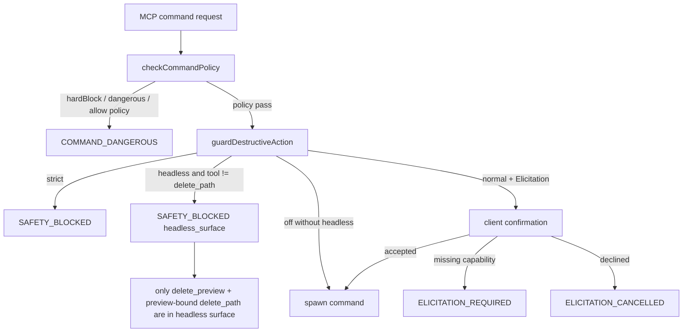

# safe_block 机制诊断

## 问题与范围

用户反馈执行几个与项目有关的普通指令时发生多种拦截。本次只读调查目标是：

- 找到项目中实际对应 `safe_block` 的实现和调用链；
- 区分配置造成的预期阻断、客户端能力造成的阻断，以及命令正则造成的误拦截；
- 使用不产生副作用的字符串策略探针和安全单元测试验证边界；
- 不执行删除、格式化、关机、进程终止、下载或其他危害性指令。

项目没有名为 `safe_block` 的单一函数；用户所说的机制实际由 `safeguard.ts`、`command-policy.ts` 和 `security.ts` 中的多个层共同组成。

## 速答

**当前最直接的原因是运行时配置为 `MCP_SAFETY_MODE=off` + `MCP_CONFIRMATION_MODE=headless`。** 在这个组合下，`off` 只跳过普通 SafeGuard 确认，不会取消 headless 的授权面；headless 只开放 `delete_preview` 和带 preview 的 `delete_path`，`execute_command`、`batch_execute`、`watch_command` 等命令工具会在真正 spawn 前统一返回 `SAFETY_BLOCKED`。本次用无副作用的 `echo safe-block-probe` 已稳定复现该行为。

因此，若目标是让 MCP 执行项目构建、测试、`git` 等普通命令，当前 headless profile 本身就与目标冲突；`MCP_ALLOWED_ROOTS` 只授权受控工作区删除，不是命令执行 allowlist。当前环境中的 `MCP_ALLOWED_ROOTS` 还是另一个 E 盘项目路径，而不是本项目 `D:\ALL MCP\Enhanced Terminal MCP`。

同时，代码确实存在独立的**正则误拦截面**：

1. 默认 `blocklist` 下，`DANGEROUS_PATTERNS` / `HARD_BLOCK_PATTERNS` 对完整命令字符串做未锚定关键词匹配，不判断 token 是否处于参数、脚本名或 `echo` 内容中；例如纯字符串 `echo iex`、`npm run start-process`、`echo -EncodedCommand text`、`echo Stop-Computer` 都会被判定为危险。
2. `MCP_COMMAND_POLICY=allow` 比默认策略更严格：内置 allowlist 没有 `pnpm`、`python`、`find` 等常用项目命令，且 `SHELL_META` 把 `exec` 词本身视为嵌套 shell，因此 `pnpm exec tsc --noEmit` 会被拒绝。当前环境探针显示 policy 是 `blocklist`，所以这一条不是本次 `echo` 拦截的直接原因，但会解释其他 profile 下的“普通命令被拦截”。
3. `normal` 模式下，三个命令工具属于受保护工具；没有 Elicitation 能力的客户端会得到 `ELICITATION_REQUIRED`，`strict` 模式则会直接禁用这些工具。现有审计日志中三类情况都出现过，说明历史运行 profile 并不一致。

## 关键证据

1. **运行时配置直接命中 headless surface。** 本次环境读取结果为 `MCP_SAFETY_MODE=off`、`MCP_CONFIRMATION_MODE=headless`、`MCP_COMMAND_POLICY=blocklist`、`MCP_AUDIT_MODE=errors`；`MCP_ALLOWED_ROOTS` 为 `E:\DSH Plugin 开发\adaptive-reasoning-engine`。这说明当前进程并非单纯的 `off` profile。

2. **SafeGuard 的决策顺序使 headless 优先于 off。** `src/safeguard.ts:180-198` 的顺序是 `strict → headless surface → off → normal/elicitation`；headless 分支只对 `delete_path` 返回 allow，其余工具返回 `reason: "headless_surface"`。启动时 `src/safeguard.ts:127-133` 还会对 `off+headless` 输出告警。

3. **无副作用命令被实际拦截且未 spawn。** 通过 MCP `execute_command` 调用 `echo safe-block-probe`，结果为 `[SAFETY_BLOCKED] ... tool "execute_command" is outside the headless workspace-delete surface.` 该拦截发生在 `src/tools/command.ts:302-319` 的 `guardDestructiveAction` 返回处，命令策略通过后才会到 shell 执行，因此没有产生命令副作用。

4. **普通项目命令在默认 blocklist 的策略层并未被拦。** 对 `pnpm run build`、`pnpm exec tsc --noEmit`、`pnpm run lint`、`pnpm test`、`git diff --check`、`git status --short`、`node --check build/index.js`、`echo safe-block-probe` 等字符串调用 `build/command-policy.js` 的 `checkCommandPolicy`，全部返回 `null`。这把当前直接问题定位到 headless SafeGuard，而不是默认 blocklist。

5. **命令入口会统一执行策略预检，并将策略拒绝包装为 `COMMAND_DANGEROUS`。** `src/tools/command.ts:33-47` 调用 `checkCommandPolicy`，命中后记录 `safety.block` 并返回 `Errors.commandBlocked`；`src/result.ts:204-210` 对 hardBlock、allowlist 和 dangerous pattern 统一使用 `COMMAND_DANGEROUS`。真正的 SafeGuard 拒绝则在 `src/tools/command.ts:318-319`、`:432-433`、`:615-616` 包装为 `SAFETY_BLOCKED`。

6. **正则存在可复现的文本级误判。** `src/command-policy.ts:102-128` 在 blocklist 下调用 `hasDangerousPattern`，而 `src/security.ts:250-297` 的危险模式和 `:316-349` 的 hard-block 模式直接对整串命令做正则测试。本次纯字符串探针结果：`echo iex` 命中 hardBlock，`echo Invoke-Expression` 命中 hardBlock，`npm run start-process`、`echo -EncodedCommand text`、`echo Stop-Computer` 命中 dangerous pattern；作为对照，`Get-Content file.txt -Encoding utf8` 未命中。这些探针没有执行对应字符串。

7. **审计日志证明历史上存在多种阻断来源。** `.etmcp/logs/audit.jsonl:1-2` 和 `:186-188` 记录 `headless_surface`；`:3-11`、`:24-32`、`:48-56` 等记录 `strict`；`:19-23`、`:40-44`、`:181-185` 记录 `ELICITATION_REQUIRED`。审计中的 `safety.decision` 不保存命令参数原文，因此能确认阻断类别，但不能仅凭日志把每一条历史记录映射到用户的具体命令。

8. **安全回归验证通过。** 只运行了 `tests/unit/command-policy.test.ts`、`tests/unit/security-corpus.test.ts`、`tests/unit/safeguard.extended.test.ts`，共 3 个测试文件、32 个测试全部通过；这些测试只做正则/策略和 mock 决策验证，没有执行恶意命令。本次测试产生的 D 盘临时 Node compile cache 已移入项目 trash，未写入 C 盘。

## 细节展开

### 1. 当前拦截链

命令工具的顺序是：

1. `precheckCommand` 调用 `checkCommandPolicy`；
2. 命中 hardBlock、危险模式或 allow policy 时立即返回 `COMMAND_DANGEROUS`；
3. 通过策略后检查限流和输出配置；
4. 调用 `guardDestructiveAction`；
5. 只有 SafeGuard 放行后才解析 shell 并进入 `runCommandOutput`。

所以同样表现为“命令没执行”，实际错误码可能不同：

- `COMMAND_DANGEROUS`：命令策略层拦截，通常可从返回的 `reason` 或 `safety.block` 审计看出具体正则/allowlist 原因；
- `SAFETY_BLOCKED`：strict 或 headless surface 拦截，当前 headless 命令不会进入 spawn；
- `ELICITATION_REQUIRED`：需要交互确认但客户端不支持或无法提供 Elicitation；
- `ELICITATION_CANCELLED`：客户端实际拒绝/取消；
- 路径相关错误：由 `validatePath` / `validateRealPath` 等独立硬边界产生，不属于命令文本策略。

### 2. 为什么 `off` 没有达到直觉上的“全部放开”

项目文档已经把 `off` 定义为“关闭 SafeGuard 确认，hardBlock 仍然有效”，而 headless 又是独立的授权 surface：`README.md:47-51`、`:105`，以及 `codestable/architecture/ARCHITECTURE.md:136`、`:147`、`:157-164`。因此当前组合的实际语义不是“免确认执行任意命令”，而是“取消交互确认，但只保留 headless workspace-delete surface”。

这也是历史修复 `2026-08-23-headless-surface-enforcement-gaps` 的明确结果：`off+headless` 不再重新开放 command、write、archive、download 和 process 工具。它不是随机故障，而是当前配置 profile 的预期边界；但这个边界很容易与“用 off 给无 UI harness 跑项目命令”的旧用法混淆。

### 3. 正则误拦截的结构性原因

`hardBlock` 的设计目标是不可关闭的灾难性底线，因此它在所有安全模式生效；但实际模式表包含了通用的 `\b(?:Invoke-Expression|iex)\b`，并且 blocklist 的 `DANGEROUS_PATTERNS` 也包含通用的 PowerShell 词和参数前缀。匹配器不解析 shell 引号、参数语义、脚本名语义或输出文本语义，只判断整串是否出现模式。

因此以下字符串即使意图只是打印文本或调用同名项目脚本，也会触发：

- `echo iex` → hardBlock；
- `echo Invoke-Expression` → hardBlock；
- `npm run start-process` → dangerous pattern；
- `echo -EncodedCommand text` → dangerous pattern；
- `echo Stop-Computer` → dangerous pattern。

这与 headless 的“整工具面阻断”是两条独立问题：当前 `echo` 探针先通过 command policy，随后被 headless surface 拦；如果改用非 headless profile，同一类包含敏感词的普通命令仍可能在策略层被拦。

### 4. allow 模式的额外限制

`src/command-policy.ts:15-36` 的默认前缀列表覆盖 `npm`、`git`、`node`、`tsc`、`vitest`、`biome` 等，但不包含 `pnpm`。`src/command-policy.ts:38-42` 的 `SHELL_META` 还会拒绝 `$`、重定向、管道、命令分隔符、`eval/source/exec` 和嵌套 shell。它是显式收紧档，不是默认体验；`codestable/compound/2026-07-12-decision-command-policy-allow-optional.md:17-43` 也把这些误拦代价记录为可接受边界。

本次纯策略探针显示：allow 模式下 `pnpm run build` 因首 token 不在 allowlist 被拒，`pnpm exec tsc --noEmit` 因 `exec` 词被 shell meta 规则拒，`git status`、`node --check build/index.js`、`echo safe-block-probe` 则可通过。当前运行时 policy 是 `blocklist`，因此不应把 allow 模式结果误当作当前直接原因。

## 未决问题

- 现有审计日志的 `safety.decision` 只记录 decision、confirmation mode、reason/source 和 error code，不记录命令参数；无法仅凭历史日志判断用户之前每一条被拦命令到底是 headless、strict、Elicitation 缺失还是正则命中。
- 当前配置来自运行时环境，代码仓库没有记录是谁或哪个客户端设置了 `MCP_CONFIRMATION_MODE=headless`；需要在 MCP 客户端的 server profile 中继续追溯配置来源。
- 本次没有改动 `security.ts`、`command-policy.ts` 或 `safeguard.ts`，因此没有验证任何放宽策略后的兼容性或安全回归影响。

## 后续建议

如需继续处理，建议另立 issue 将“headless profile 不适合执行项目命令”和“命令危险词的文本级误拦截”拆成两个独立问题，先分别定义授权边界与误报验收标准，再决定是否修改安全核心规则。

## 相关文档

- `src/safeguard.ts`
- `src/command-policy.ts`
- `src/security.ts`
- `src/tools/command.ts`
- `codestable/issues/2026-08-23-headless-surface-enforcement-gaps/headless-surface-enforcement-gaps-report.md`
- `codestable/compound/2026-07-12-decision-command-policy-allow-optional.md`
- `codestable/compound/2026-07-11-decision-hardblock-uncloseable-baseline.md`
- `codestable/architecture/ARCHITECTURE.md`
