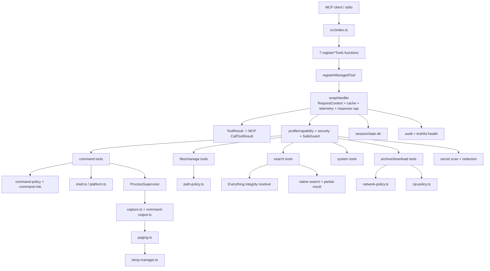

# Enhanced Terminal MCP 当前项目地图

## 问题与范围

这份探索回答：`Enhanced Terminal MCP` 当前到底是什么、从 MCP 请求到子进程/文件/网络操作经过哪些层、哪些能力是真正接通的、状态和发布物如何治理，以及现在还剩哪些项目级边界。

本次以当前 `main` 工作树和源码为准：实际 `HEAD` 为 `16d1996`，工作树 clean；`STATUS.md` 中记录的 `1308020` 是较早快照字段，不能作为当前 HEAD 依据。2026-08-22 的旧项目总览已经标记为 `outdated`；2026-08-28 的 production-readiness audit 仍是生产审计依据，本文件补充一份偏 onboarding 的代码地图。

## 速答

这是一个单包、TypeScript ESM、Node.js ≥20 的 MCP stdio server，面向本机 AI 客户端提供 7 类、默认 27 个工具，另外提供 `health://status` / `audit://log` 两类资源和 `usage-guide` / `safety-info` 两个 prompt。它的核心不是一个“简单执行 shell 字符串”的脚本，而是一条由工具 schema、请求上下文、策略与安全校验、受监管 child process、原始字节输出治理、状态/审计和统一 `ToolResult` 组成的运行链。

心智模型如下：

工具面按代码中的注册器划分为：

| 类别 | 工具 | 数量 |
|---|---|---:|
| 命令执行 | `execute_command`、`batch_execute`、`watch_command` | 3 |
| 文件 I/O | `read_file`、`write_file`、`list_directory`、`file_info`、`make_directory` | 5 |
| 文件管理 | `copy_move`、`delete_path` | 2 |
| 搜索 | `search_files`、`everything_search`、`grep_content` | 3 |
| 系统 | `get_system_info`、`process_list`、`kill_process`、`network_info`、`environment_vars` | 5 |
| 归档/下载 | `compress_archive`、`extract_archive`、`download_file` | 3 |
| 运维/状态 | `telemetry_report`、`cache_stats`、`cache_invalidate`、`session_state`、`pool_stats`、`temp_stats` | 6 |
| **合计** |  | **27** |

设置 `ENHANCED_TERMINAL_DISABLE_FILE_INFO=1` 时，`file_info` 会被禁用，真实启用面变为 26；工具数量不是硬编码，而是读取 SDK `RegisteredTool.enabled` 的动态 registry。

## 关键证据

1. **入口和生命周期已形成完整主线。** `src/index.ts:48-132` 先固定 execution profile、创建 `McpServer`、初始化 SafeGuard、注册七组工具与资源/prompt，再初始化 temp/session、连接 `StdioServerTransport`；退出时先 drain managed child，再 flush session/audit；`src/index.ts:135-140` 的 fatal 出口会先净化错误文本。该证据支撑“这是一个完整的 MCP server composition root”，而不是若干独立脚本。

2. **工具 surface 有单一的真实启用计数来源。** `src/tool-registry.ts:31-70` 用 `registerManagedTool` 保存 SDK `RegisteredTool` 句柄，`getRegisteredToolCount()` / `getEnabledToolNames()` 只统计 `enabled` 工具；`src/tools/files.ts:389-433` 展示 `file_info` 的条件禁用。该证据支撑 27/26 的 `tools/list`、banner、health 和 prompt 可以保持一致。

3. **三个命令工具共享同一条受限执行链。** `src/tools/command.ts:374-493` 展示单命令的互斥输入、handler 二次预算校验、policy、rate limit、output limits、SafeGuard、shell invocation、`context.signal` 和 `runCommandOutput`；`src/tools/command.ts:530-744` 展示 batch 的全量预检、parent budget、串行/并行 worker、output/deadline/stop skip；`src/command-output.ts:264-580` 展示原始字节捕获、流式 secret matcher、内存 retention、spill、分页 finalize 和错误状态汇总。

4. **子进程生命周期不是由各工具自行管理。** `src/process-supervisor.ts:282-371` 将 child 放入 active registry，并统一接入 timeout、AbortSignal、清理和 active 上限；`src/process-supervisor.ts:439-498` 负责 shutdown drain 和 graceful/force termination。`src/shell.ts:125-217` 负责 Windows shell 候选解析，`src/shell.ts:270-284` 是 flavor 到最终参数的唯一调用构造入口。

5. **安全是分层的，且明确不等于 OS sandbox。** `src/command-policy.ts:102-128` 先执行不可关闭的 `hardBlock`，再按 blocklist/allowlist 判断；`src/safeguard.ts:290-343` 在 strict 或 risk-gated 下执行策略/风险确认；`src/path-policy.ts:40-165` 对读路径做 realpath 重验、对写路径做 no-follow 和父链检查，并提供 staging 写；`src/profile.ts:62-105,116-164` 固定 execution profile 和 capability policy。当前默认 profile 是 `local-trusted-shell`，`sandboxed-production` backend 默认不可用并 fail-closed。

6. **搜索、网络和归档都有专门的边界层。** `src/native-search.ts:38-135` 与 `src/partial-result.ts:58-112` 把遍历/读取失败转为 `complete=false`、有界 warnings 和取消；`src/network-policy.ts:214-267,323-383` 做 DNS/IP 分类、SSRF surface 策略、逐跳校验、下载字节/截止时间预算和已验证 IP 直连；`src/zip-policy.ts:172-322,431-484` 做 EOCD/ZIP64 manifest、成员路径/kind/加密/预算校验，再进入 staging 解压并实时计数。

7. **状态、临时产物和审计都有持久化/恢复治理。** `src/state-dir.ts:23-131` 固定 `realpath(process.cwd())` 作为 project root，默认使用 `.etmcp`，并将目录创建推迟到真实写入；`src/session.ts:49-322` 维护 cwd/env/history、revision writer 和安全恢复；`src/audit.ts:143-192,309-382` 对日志做脱敏、有界队列、串行写入、重试和 health；`src/temp-manager.ts:556-697,717-799` 提供 staging、reservation、lease/fencing、TTL/LRU 和跨进程容量治理；`src/paging.ts:485-581,739-824` 将大命令输出以 v2 page cache 的原始字节和字符索引形式发布/读取。

8. **质量和交付链路已分层，但 canonical release gate 仍待收口。** `package.json:31-42` 定义 build、tsc、lint、全量 test、latency、工具层 coverage 和本地 `pnpm run gate`；`.github/workflows/ci.yml:1-43` 当前在 Ubuntu 做 lint/tsc、在 Windows Node 22/24 做 build/test/tools coverage，latency 为 non-blocking；`scripts/verify-package.mjs:111-218` 验证实际 tarball、manifest、入口、source map、禁发文件和 SHA-256，`scripts/verify-clean-consumer.mjs:134-202` 验证 package-owned SDK 隔离、SBOM 和 startup smoke。

## 细节展开

### 1. 入口、协议和统一结果

`src/index.ts` 是 composition root。启动顺序可以概括为：

1. `initializeExecutionProfile()` 读取并冻结 `MCP_EXECUTION_PROFILE`。
2. 创建 MCP `McpServer`，调用 `initSafeGuard(server)`。
3. 依次注册 command、file、manage、search、system、archive、utility 七个注册器。
4. 注册固定 `audit://log` 以及带 `?limit=N` 的 resource template。
5. 初始化 `TempManager`，等待 `session.loaded`，确保请求进入前已完成状态恢复。
6. 连接 `StdioServerTransport`；收到 SIGTERM/SIGINT 时停止 pool/temp timer，先 `processSupervisor.shutdown(3000)`，再 flush session 和 audit。

工具 handler 返回 `ToolResult`，成功结果同时保留人类可读 `content` 和机器可读 `structured`；错误由 `fail()` 统一生成并携带 31 个错误码体系中的 `retryable`、`suggestion`、`param`、`detail`。`toCallToolResult()` 再把它转换为 MCP `content`、`structuredContent` 和错误时的 `isError`。`wrapHandler` 还会把 SDK `extra` 转成 `RequestContext`，捕获未预期异常（取消映射为 `CANCELLED`，其他映射为脱敏后的 `INTERNAL_ERROR`），并执行 `MCP_RESPONSE_MAX_BYTES` 响应上限。

### 2. 七组工具的真实职责

- `command.ts`：三个命令工具都走 shell invocation + managed child + 共享输出治理。`execute_command` 同时支持执行命令和通过 `cache_id` 读取已分页输出；`batch_execute` 在真正 spawn 前做全批 policy/输入预算预检，并用共享 parent ledger 管理输入、输出和 deadline；`watch_command` 使用 watch window 语义，在限定时长后终止并返回捕获状态。
- `files.ts`：`read_file` 支持按行读取和 strict secret-read 阻断；`write_file` 进行内容扫描，覆写时走 SafeGuard 和 atomic staging；`list_directory` 有递归深度/条目预算、循环保护和 partial-result；`file_info` 可选关闭；`make_directory` 走统一写路径策略。
- `manage.ts`：`copy_move` 对源使用 real 读语义、对目标使用 no-follow 写语义，并在成功后失效相关缓存；`delete_path` 需要明确递归意图，符号链接只删除链接本身而不跟随目标。
- `search.ts`：`search_files` 在 Windows 上优先使用经过固定 SHA-256 校验的 Everything，隐式不可用或 CLI 失败时 native fallback；显式错误配置 fail-closed。`everything_search` 是 Windows-only 的直接 Everything 面；`grep_content` 按 PowerShell、Unix grep、native 三层路径运行，并把部分失败显式暴露。
- `system.ts`：`get_system_info` / `process_list` 查询宿主；`kill_process` 只接受 PID 或精确名称二选一，使用平台 identity proof、self/parent/critical-process 保护和终止后确认；`network_info` 做 config/connections/ping/dns；`environment_vars` 按 allowlist/full/keys 策略展示值并脱敏。
- `archive.ts`：`compress_archive` 保留跨平台外部压缩命令，但 spawn 前预演源树成员数/字节；`extract_archive` 使用纯 Node ZIP policy 和 staging；`download_file` 使用纯 Node HTTP(S) 实现、SSRF/redirect/byte/deadline policy 和有限重试。
- `utility.ts`：提供 telemetry、LRU cache、session、temp 和 pool 的观测/控制面，并注册 `health://status`、`usage-guide`、`safety-info`。`pool_stats.active` 明确为 `false`，因为 `src/pool.ts` 仍是 inactive stub，实际执行不走预热池。

### 3. 关键执行链与跨平台差异

普通命令请求的实际链路是：

`MCP extra → RequestContext → wrapHandler cache check → handler schema/二次校验 → command policy → rate limit → output limit → SafeGuard/risk gate → shell spec → ProcessSupervisor → capture/command-output → session/audit → ToolResult/MCP response`。

Windows 默认 `MCP_SHELL=pwsh`，解析顺序为显式 `MCP_POWERSHELL_PATH`、仓库内 bundled pwsh、PATH 中 pwsh、Windows PowerShell 5.1；显式路径无效会直接失败，shell 解析结果按进程缓存，改环境变量或安装 pwsh 后需要重启。`MCP_SHELL=powershell|cmd` 是兼容模式。Unix 走 `/bin/sh -c`。`safeExecFile` 和 Everything/grep/system/archive 等参数化 child 也经 `execFileManaged` 纳入 supervisor；`safeExec` 仍是给内部 shell 调用方使用的兼容封装。

三个命令工具的 output runtime 以 Buffer 为基础做 stdout/stderr actual byte 计数；默认 memory threshold 为 1 MiB、stdout retained 上限为 50 MiB、stderr retained 上限为 1 MiB、temp 总预算为 1 GiB。超出内存阈值时尝试 spill 到 page cache；secret 命中会清空 retained/fallback 并禁止缓存；分页缓存发布后由 `cache_id/page/pageSize` 读取，不会重新执行命令。`LRUCache` 默认 128 条、30 秒滑动 TTL，只缓存 `read_file`、`file_info`、`list_directory`、`get_system_info`、`search_files`、`grep_content` 六个只读工具；partial 结果和 `environment_vars` 不进入共享缓存。

### 4. 安全模型和应用边界

项目有两层不同性质的安全机制：

- `security.ts` 是不可关闭的输入底线：路径穿越/系统目录/敏感文件、URL 协议和 host 形状、危险命令以及 `hardBlock`。它是 best-effort 检查，不承诺在任意 shell 整串执行下实现形式化隔离。
- `safeguard.ts` 是可配置的操作策略：`strict` 阻断受保护工具，`normal` 默认逐次 Elicitation，`off` 关闭常规破坏性确认但不关闭 `hardBlock`；`MCP_COMMAND_CONFIRMATION=risk-gated` 时 ordinary 命令放行，batch >5、watch >60s、破坏性残余和性能类命令升级为带风险原因的确认。

`MCP_EXECUTION_PROFILE` 是更高层的部署边界声明。`local-trusted-shell` 兼容当前个人 Agent 行为；`sandboxed-production` 只允许宿主显式声明 capability，但当前默认 availability 为 false，因此选择它会启动失败并返回 `SANDBOX_UNAVAILABLE`，不会静默落回本机 shell。这个 profile/capability 层、命令黑名单和 SafeGuard 都不能被描述成 OS sandbox；若未来要做远程、多租户或恶意输入隔离，仍需明确的 OS/container/Job Object、身份认证和租户隔离方案。

### 5. 状态、秘密和可观测性

状态根默认是固定 project root 下的 `.etmcp`，不随 `session_state.set_cwd` 或单次 command `cwd` 漂移。启动、恢复读取和 resource 查询尽量不创建目录；真正要写 session、audit、temp 或 page cache 时才创建，并在 POSIX 下使用收紧的目录/文件权限。旧 `.enhanced-terminal-mcp` 只迁移约定的 `session.json` 与 `logs/audit.jsonl`，不迁移 temp/未知文件。

session 保存 cwd、有限的 env 语义和最近命令历史，但默认只持久化 env key 与 redacted history；env value 只有显式 opt-in 且通过 deny/sensitive policy 才可能落盘。审计入队前就做 detail/error 脱敏，再执行 entry/queue 字节上限、丢最旧计数、串行写链、失败退避重试和按大小轮换。health 会聚合 audit、temp、process、session 四个组件，状态是 `healthy|degraded|failed`，不再恒定返回 `ok`。

### 6. 测试、构建和发布

- 源码当前 56 个 `.ts` 文件，测试目录当前 66 个 `*.test.ts` 文件；单元/组件测试集中在 `tests/unit/`，MCP client 子进程 e2e 和 visibility/latency 测试在 `tests/` 根目录。
- `vitest.config.ts` 使用 V8 coverage，主 coverage 排除 `src/index.ts`、`src/tools/**` 和测试源码，因为工具行为主要由真实子进程 e2e 验证；`vitest.tools-coverage.config.ts` 为工具层提供独立阈值。
- `pnpm run build` 先清理 `build/` 再由 tsc 生成 JS、声明、source map；`setup.bat` 是源码 checkout 的 Node/pnpm/build/可选 bundled pwsh bootstrap，不属于 npm consumer 入口。
- npm consumer 只使用 `build/index.js` bin；`prepack` clean build，`postinstall` 仅对 package-owned `@modelcontextprotocol/sdk@1.29.0` 应用 fail-closed 的 `required: []` 兼容 patch。package verifier 和 clean consumer verifier 分别验证 tarball 卫生、source map、SDK 隔离、SBOM 和启动 smoke。

## 当前状态与边界

截至仓库状态快照，生产硬化 roadmap 共 13 条 feature，#1–#11 已完成，#12 `security-and-mcp-conformance-gates` 已满足依赖但仍 planned，#13 `docs-and-architecture-closeout` 等待 #12。最近记录的 `pnpm run gate` 为 EXIT=0：全量 66 文件/835 用例、latency 24/24，工具层 coverage 为 `64.72/54.39/71.42/68.52`（具体指标顺序以门禁输出和配置为准）。本次探索没有重新执行 gate，因此这里引用的是仓库现有快照证据。

下一阶段的真实 release stop 仍是：hostile-input 与 MCP conformance、跨平台真实 smoke、主 coverage 纳入阻断门禁、依赖 audit/package verifier/action pinning/最小权限统一进 canonical CI gate，以及 transport close/fatal handler 的最终收口。随后 #13 需要把现状文档统一到 v4.0.0/27/26 和当前安全边界。

## 文档一致性观察

代码主线已经以 v4.0.0 为准，但部分现状文档仍待 #13 统一：

- `README.md:13` 仍写“20 error codes”，而 `src/result.ts:20-52` 当前有 31 个错误码。
- `codestable/architecture/ARCHITECTURE.md:89,151,157` 仍分别保留“7 个缓存工具”和“20 个错误码”等历史文字；当前 `src/cache.ts:195-202` 实际白名单为 6 个。
- `src/tools/utility.ts:556` 的 `usage-guide` 仍有 `NEW in v3.1` 段落。
- `CHANGELOG.md:90` 保留了历史阶段的“28 tools”描述；当前实现和可见性 e2e 以 27/26 为准。
- `STATUS.md:7` 的 current HEAD 字段落后于实际 `git rev-parse --short HEAD` 的 `16d1996`；其 roadmap 下一步和 clean/gate 快照仍可作为状态参考，但 HEAD 需以 Git 为准。

这些是文档同步问题，不改变本次对源码行为的判断；不要把旧文字当成当前工具/错误码/缓存面契约。

## 未决问题

- #12 是否已经把主 coverage、依赖审计、package 验证、hostile-input、MCP conformance、跨平台 smoke 和 action pinning 统一纳入唯一阻断 CI gate。
- #13 完成后，README、CHANGELOG、usage-guide、ARCHITECTURE、STATUS、SECURITY/维护入口是否全部与当前实现一致。
- 如果产品边界从“单用户本机 stdio”扩展到远程、多租户或强隔离，必须先补 OS sandbox、认证和租户隔离设计，不能只继续增加正则规则。

## 后续建议

后续工作最自然的入口是按 roadmap DAG 先完成 #12 的 conformance/security gate，再由 #13 做最终文档与架构现状收口。

## 相关文档

- `STATUS.md`：当前任务快照、roadmap 进度和已知坑。
- `CS-AUTOMATION.md`：CodeStable 全流程的 agent 自动执行授权边界。
- `README.md`：用户可见工具清单、环境变量和 source/npm 使用方式。
- `codestable/architecture/ARCHITECTURE.md`：长期架构现状与 ADR 入口；部分历史文字待 #13 同步。
- `codestable/compound/2026-08-28-explore-production-readiness-audit.md`：生产就绪审计与剩余 release stop。
- `codestable/roadmap/2026-08-28-production-hardening/production-hardening-roadmap.md`：13 条生产硬化子 feature 的规划与契约。
- `codestable/compound/2026-08-22-explore-enhanced-terminal-overview.md`：已过期的上一版项目总览。
