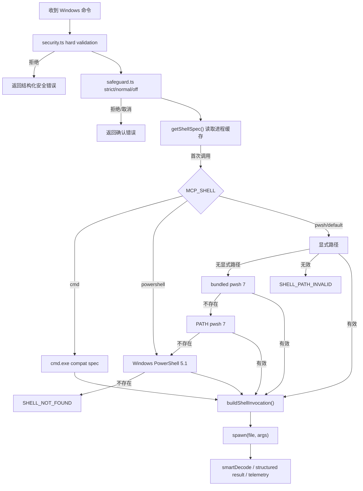

# Windows 默认 PowerShell shell 设计

> 状态：`approved`（2026-08-16 用户整体 review 放行，含 1.4 节三个取舍）。执行清单见 `powershell-default-shell-checklist.yaml`。
>
> **实现勘误（2026-08-16，随实现回填）**：
> 1. 「pwsh 7 原生 UTF-8」前提在中文 Windows 不成立——实测 pwsh 7 管道输出同为 GBK；UTF-8 preamble 统一应用到 pwsh 7 与 5.1 两个 flavor（成功标准 3 不变）。
> 2. flavor 集合补充 `unix`（非 Windows 固定档：`/bin/sh`，不进入 Windows 候选流程，Unix 行为零变化）。
> 3. 平台 spec 的 PS 目标在 cmd 兼容档下回退 v3.1 的 `powershell.exe`（escape hatch 下 PS 类内部命令保持旧默认行为）；对应新增 `powerShellTarget(spec)` 适配器。
> 4. grep_content 的 PS 脚本由 `param()` 位置参数改为单引号内联转义（`''`）——preamble 前置与 `param()` 必须首语句的语法冲突。

## 0. 术语约定

| 术语 | 本文定义 | 防冲突结论 |
|------|----------|------------|
| Shell mode | 用户通过 `MCP_SHELL` 选择的策略：`pwsh` / `powershell` / `cmd` | 不是实际可执行文件版本 |
| Shell flavor | 实际执行器类别：pwsh 7、Windows PowerShell 5.1 或 cmd | 由解析结果确定 |
| Shell spec | 一次解析得到的可执行文件、启动参数、flavor、来源和版本 | 替代当前只返回字符串的 `getShell()` |
| Shell invocation | 某条命令最终交给 `spawn` 的 `file + args` | PowerShell 编码前缀和 cmd 包装只在这里生成 |
| Bundled pwsh | 项目目录 `tools/pwsh/pwsh.exe` 下的固定版本便携包 | 不入 Git，不等同于 PATH 全局安装 |
| Bootstrap | `setup.bat` 显式触发的下载、校验和原子安装流程 | 运行时解析器绝不联网、绝不自动安装 |
| Hard validation | `security.ts` 对危险命令和关键资源的无条件拦截 | 与 `safeguard.ts` 的 strict/normal/off 确认策略分层 |

## 1. 决策与约束

### 1.1 需求摘要

**用户目标**

Windows 用户通过 `execute_command`、`batch_execute`、`watch_command` 及相关内部执行路径运行命令时，默认获得现代 PowerShell 语义和稳定 UTF-8 输出；项目可固定 pwsh 7，不要求管理员权限，也能随时切回原 cmd 行为。

**成功标准**

1. 默认 `MCP_SHELL=pwsh` 时按“显式路径 → 项目便携 pwsh 7 → PATH pwsh 7 → Windows PowerShell 5.1”解析，结果在进程生命周期内稳定。
2. 命令工具、平台 spec、PowerShell 搜索路径和仍保留的辅助执行器统一消费同一份 shell spec，不再各自写死 `cmd.exe` / `powershell.exe`。
3. pwsh 7 与 5.1 的中文 stdout/stderr 均可稳定解码为 UTF-8；cmd 兼容路径保持原 `chcp 65001` 行为。
4. `MCP_SHELL=cmd` 可恢复旧默认；`MCP_SHELL=powershell` 可显式强制 Windows PowerShell 5.1。
5. PowerShell 新增的注入/破坏面在任何 `MCP_SAFETY_MODE` 下先经过 hard validation。
6. 便携包安装使用固定版本、官方 SHA256、项目内 staging 和原子替换；失败不留下半安装目录，也不破坏已有有效版本。
7. 运行期从不下载依赖；未找到候选 shell 时返回可操作的结构化错误，而不是静默改用未知执行器。

**明确不做**

- 不改变 Unix 默认 shell；仍使用 `$SHELL` 或 `/bin/sh`。
- 不使用 winget、MSI 或系统全局安装。
- 不移除 cmd 兼容路径，不承诺所有 cmd 语法在 PowerShell 默认下无感兼容。
- 不在 MCP 运行期下载或自动升级 pwsh。
- 不激活、重构或扩大当前未被生产命令使用的 ProcessPool；只保持其 shell 构造语义一致。
- 不把便携 pwsh、下载包、staging、日志或测试临时数据提交到 Git。
- 本阶段不写 requirement；feature 验收后再按落地现状 backfill。

### 1.2 复杂度档位

- 健壮性 = **L3**（偏离项目内部工具默认 L2）：外部路径、版本探测、网络下载、哈希和所有失败分支必须有明确语义。
- 结构 = **modules**（偏离默认 functions）：shell 选择是被多个工具消费的横切能力，独立成 `src/shell.ts`。
- 可测试性 = **tested**（偏离默认 testable）：纯选择逻辑、调用构造、bootstrap 失败路径和主命令链都要有证据。
- 兼容性 = **cross-version + 可回退**：支持 pwsh 7、Windows PowerShell 5.1 和 cmd；默认行为会变化，因此不宣称“完全无感 backward-compatible”。
- 确定性 = **reproducible**：便携包固定版本和哈希，不在运行时查询 latest。
- 其余维度走项目内部工具默认：reasonable、team、active、logged、validated。

### 1.3 关键决策

| 决策 | 本稿选择 | 被拒方案 / 原因 |
|------|----------|-----------------|
| 能力归属 | 新建 `src/shell.ts` 管 shell discovery、缓存和 invocation；`platform.ts` 保留 OS spec | 全塞入 `platform.ts` 会把环境发现、缓存和 spec 计算继续混在一起 |
| 默认模式 | `pwsh`，允许自动回退 5.1 | 缺 pwsh 就整体不可用，不符合本地工具的可恢复性 |
| 显式路径 | `MCP_POWERSHELL_PATH` 最高优先；必须是绝对文件路径并通过版本探测 | 配错后静默忽略会掩盖部署错误 |
| 显式路径失败 | fail closed，返回 `SHELL_PATH_INVALID`，不继续自动候选 | 用户明确指定路径时不应悄悄跑别的 executable |
| 自动候选失败 | 记录候选与失败原因后尝试下一项；全部失败返回 `SHELL_NOT_FOUND` | 静默用 cmd 会改变用户声明的 mode |
| 非法 mode | 返回 `INVALID_SHELL_MODE`，不回退默认值 | 配置拼写错误必须可见 |
| 调用方式 | 所有新路径使用 `spawn(file, args)`；不把 PowerShell executable 填给 Node `exec({shell})` | Windows `exec` 会注入 cmd 风格 `/d /s /c` 参数 |
| 编码 | pwsh 7 与 5.1 均由 invocation 统一加 UTF-8 preamble（zh-CN 实测 pwsh 7 管道输出同为 GBK）；cmd 保留 chcp | 每个工具自行拼前缀容易漂移 |
| Bootstrap staging | 使用仓库 D 盘内 `tools/.pwsh-staging/`，禁止使用 `$env:TEMP` | 当前 `$env:TEMP` 位于 C 盘，不符合本任务存储边界 |
| 安装原子性 | 下载、验 hash、解压、版本探测都在 staging；全部通过后再替换 `tools/pwsh` | 直接解压到最终目录会产生半安装状态 |
| 固定制品 | PowerShell 7.6.5 win-x64；SHA256 `32eb8f6cdce08f86e987d625a2733e54ac3e289ae7e1621b14c0b5bcec2434ea` | 不使用 latest URL；实现前仍须从官方 release metadata 复核一次 |
| 缓存 | 第一次解析的成功或失败结果缓存到进程退出；环境变量变化需重启 | 每条命令重复 stat/which/version probe 会增加延迟并产生漂移 |
| 安全顺序 | `hasDangerousPattern` → safeguard 确认 → shell invocation → spawn | shell 切换不能绕过现有双层安全模型 |

### 1.4 整体 review 必须确认的取舍

1. `setup.bat` 中 pwsh 下载/校验失败时，本稿选择**安装失败并停止成功提示**；用户可跳过 bootstrap，运行期再回退 5.1。
2. 显式 `MCP_POWERSHELL_PATH` 无效时，本稿选择**硬失败而非自动回退**。
3. `pool.ts` 只同步 shell spec，不激活 `acquire()`、不把进程池接入生产命令链。

## 2. 名词与编排

### 2.1 名词层

#### 现状

- `src/platform.ts` 的 `getShell()` 只返回 executable 字符串；Windows 固定为 `cmd.exe`。
- `wrapCommand()` 负责 cmd 的 `chcp 65001` 前缀，但只有 `safeExec` 消费。
- `CommandSpec` 只有 `file` / `args` / 可选 shell 字段；平台的 5 个 PowerShell spec 写死 `powershell.exe`。
- `command.ts` 三个 handler、`search.ts`、`quickExec` 和 `ProcessPool` 各自拼 shell 与参数。
- 当前没有统一的 shell 来源、版本、错误码或可观测信息。

#### 变化

新增名词由 `src/shell.ts` 维护；`platform.ts` 兼容重导出旧 `getShell` / `wrapCommand`，避免一次性打断既有 import：

| 名词 / 契约 | 必要字段或行为 |
|-------------|----------------|
| `ShellMode` | `"pwsh" \| "powershell" \| "cmd"` |
| `ShellSpec` | `file`、`flavor`、`source`、可选 `version` |
| `ShellInvocation` | 交给 `spawn` 的 `file` 与 `args[]` |
| `ResolveShellOptions` | 可注入 `env`、`projectRoot`、`exists`、`which`、`probeVersion`，保证选择逻辑可确定测试 |
| `ShellResolutionError` | `INVALID_SHELL_MODE` / `SHELL_PATH_INVALID` / `SHELL_NOT_FOUND`，附非敏感 attempted 来源 |
| `resolveShell(options)` | 纯选择与版本校验，不读写全局缓存 |
| `getShellSpec()` | 进程级缓存入口 |
| `buildShellInvocation(command, spec)` | 唯一的 flavor → 参数/编码转换入口 |

**输入 → 输出示例**

| 输入 / 环境 | 可观察输出 |
|-------------|------------|
| 默认 mode + bundled `pwsh.exe` 7.6.5 有效 | `ShellSpec { flavor: "pwsh", source: "bundled", version: "7.6.5" }` |
| `MCP_POWERSHELL_PATH=D:\missing\pwsh.exe` | 抛 `SHELL_PATH_INVALID`，不继续候选 |
| `MCP_SHELL=cmd` | `ShellSpec { file: "cmd.exe", flavor: "cmd", source: "compat" }` |
| `buildShellInvocation("Write-Output 你好", pwshSpec)` | `pwsh.exe -NoLogo -NoProfile -NonInteractive -Command "Write-Output 你好"` |

### 2.2 编排层

#### 现状

当前拓扑是多个平行分支：命令工具直接选择 cmd，平台 spec 与搜索工具直接选择 PowerShell 5.1，辅助执行器各自决定 shell。选择结果无法统一观测，编码、安全和参数构造容易分叉。

#### 变化

1. 所有 Windows 执行入口先完成现有 hard validation 和 safeguard，再读取同一份 cached `ShellSpec`。
2. `resolveShell` 只负责确定 executable/flavor/source/version；`buildShellInvocation` 只负责把命令变成 `file + args`。
3. 平台 spec 保持可注入：调用方可传 `ShellSpec`，单测不依赖本机 PATH。
4. Bootstrap 与运行期严格分离：`setup.bat` 可以调用 `ensure-pwsh.ps1`；MCP server 运行时只发现本地候选，不联网。
5. 主生产路径先接通 `execute_command`，再复用到 batch/watch、platform spec 与 grep；辅助路径最后同步。

#### 跨层纪律

- **错误语义**：显式配置错误不回退；自动候选失败可继续下一项；全部失败返回已尝试来源和建议，但不得泄露环境变量中的秘密值。
- **缓存与并发**：解析结果在进程内只创建一次；并发首调用共享同一结果。修改环境变量、安装新 pwsh 或替换 bundle 后必须重启 server。
- **安装幂等性**：相同有效版本直接跳过；新版本在 staging 完整校验后原子替换；任何失败清理 staging，保留原有效目录。
- **可观测性**：首次选中记录 flavor/source/version；从 pwsh 回退 5.1 记录一次 warn；cmd 显式模式记录 info；不逐命令重复刷日志。
- **安全性**：新增 `-EncodedCommand` / `-enc`、`Invoke-Expression` / `iex`、`Start-Process`、关机/执行策略及系统根目录递归删除模式；hard validation 在 off 模式仍生效。
- **输出**：5.1 的 UTF-8 preamble 只在 invocation 层拼接；stdout/stderr 仍走现有字节捕获和 `smartDecode`。
- **Unix 边界**：非 Windows 分支不进入新 resolver 的 Windows 候选流程，现有调用结果不得变化。

### 2.3 挂载点清单

1. 环境变量：`MCP_SHELL` — 新增默认值和三种 mode；`MCP_POWERSHELL_PATH` — 新增显式 executable 配置。
2. Windows setup：`setup.bat → scripts/ensure-pwsh.ps1` — 新增显式 bootstrap 步骤。
3. 项目便携包登记：`tools/pwsh/.version` — 新增固定版本标记；`tools/pwsh/` 与 `tools/.pwsh-staging/` 加入 ignore。
4. 默认命令执行策略：Windows 的 command 工具入口改为消费 central shell spec；移除该挂载后即恢复旧 cmd 默认。

### 2.4 推进策略

1. **结构基线**：先完成第 2.5 节的只搬不改行为微重构。
   - 退出信号：兼容导出不变，TypeScript build 与现有 platform/utils 测试通过。
2. **编排骨架**：建立 shell spec、纯解析器、缓存和 invocation，先用注入候选跑通分支。
   - 退出信号：优先级、非法 mode、显式路径错误和无候选错误都可独立观察。
3. **Bootstrap 节点**：完成项目内 staging、SHA256、版本探测和原子安装。
   - 退出信号：已安装跳过、hash 失败不落盘、成功生成正确 `.version`。
4. **主生产链最小闭环**：接通 execute → batch/watch → platform/search，并切换 Windows 默认。
   - 退出信号：真实命令能证明 flavor/version，中文输出正确，cmd 逃生舱可用。
5. **安全与辅助链**：补 PowerShell hard validation，并同步 safeExec、quickExec、pool 的 shell 构造。
   - 退出信号：危险模式在 off 下仍拦截；辅助路径不再写死 cmd/powershell；不激活 pool。
6. **兼容与交付**：补环境变量/部署文档、范围反向检查和全量回归。
   - 退出信号：第 3 节每个场景都有证据，Unix 和既有工具行为无非预期回归。

### 2.5 结构健康度与微重构

#### 评估

- `src/platform.ts` — 223 行；职责包括 OS 常量、shell 选择和多组平台命令 spec。本次若继续加入候选发现、版本探测、缓存和 invocation，会形成新的独立职责。
- `src/tools/command.ts` — 259 行；三个 handler 属于同一工具域，本次虽改 3 处，但都应收敛为消费统一 invocation，不需要先拆文件。
- `src/tools/search.ts` — 323 行；只替换一个 PowerShell 执行入口，改动密度低。
- `src/security.ts` — 234 行；新增规则仍属于现有 hard validation 职责。
- `src/utils.ts`、`src/stream.ts`、`src/pool.ts` 均小于 150 行，改动局部。

#### 结论：做微重构

**搬什么**

- 将现有 `getShell` / `wrapCommand` 从 `src/platform.ts` 搬到新 `src/shell.ts`。

**搬到哪**

- `src/shell.ts` 成为 shell 解析与 invocation 的唯一归属；`platform.ts` 暂时兼容重导出旧符号。

**行为不变怎么验证**

- 原签名和返回值不变；Windows 仍为 cmd + chcp，Unix 仍为 `$SHELL` / `/bin/sh`。
- build、现有 `platform.test.ts` 与 `utils*.test.ts` 全绿；迁移步骤不修改任何工具默认行为。

**步骤序列**

1. 新建 `src/shell.ts` 并原样移动两个函数。
2. 在 `platform.ts` 重导出，在现有调用方保持兼容 import。
3. 运行编译和现有相关测试，确认行为不变后才开始 feature 逻辑。

#### 超出范围的观察

- `src/pool.ts` 的 `ProcessPool.acquire()` 当前没有生产调用方。
  → 本 feature 只同步 shell 构造，不激活进程池；是否接入生产链应另走独立 feature/refactor。

## 3. 验收契约

### 3.1 正常场景

1. 项目存在有效 bundled pwsh 7，触发普通命令 → 选中 source=bundled，`$PSVersionTable.PSVersion.Major` 输出 7。
2. 配置有效 `MCP_POWERSHELL_PATH`，同时存在 bundled/PATH pwsh → 显式路径胜出，并只记录一次 env source 日志。
3. 无 bundled、PATH 有 pwsh 7 → 选中 PATH pwsh，中文 stdout/stderr 无乱码。
4. 无 pwsh 7、系统有 PowerShell 5.1 → 自动回退 5.1，记录 warn，中文输出仍为正确 UTF-8。
5. `MCP_SHELL=powershell` 且系统 5.1 可用 → 不尝试 bundled/PATH pwsh。
6. `MCP_SHELL=cmd` → cmd 风格 `set X=Y` / `%X%` 与现有 chcp 行为可用。
7. execute、batch、watch、platform spec 和 grep 在同一进程内 → 观察到相同 flavor/source，不出现平行选择。

### 3.2 边界与错误场景

8. `MCP_SHELL` 为未知值 → 返回 `INVALID_SHELL_MODE`，不 spawn、不静默回退。
9. 显式 executable 路径不存在、不是文件或版本探测失败 → 返回 `SHELL_PATH_INVALID`，不继续候选。
10. 自动候选逐个失败 → 最终返回 `SHELL_NOT_FOUND`，包含可操作建议和非敏感 attempted 来源。
11. 并发首次调用 resolver → 只执行一次候选探测，所有调用得到同一结果。
12. bootstrap 目标版本已有效安装 → 不下载、不修改 `tools/pwsh`。
13. 下载 hash 不匹配、zip 解压失败或版本不是 7 → 安装失败，staging 被清理，原有效目录保持不变。
14. bootstrap 成功 → `tools/pwsh/pwsh.exe` 可执行，`.version` 为 `7.6.5`，下载包和 staging 已清理。
15. `-EncodedCommand` / `-enc`、`Invoke-Expression` / `iex`、`Start-Process` 及新增破坏性模式 → 即使 `MCP_SAFETY_MODE=off` 也被 hard validation 拒绝。

### 3.3 范围反向核对

- Unix 上 `getShell` / 命令结果不应因本 feature 改变。
- 仓库中不应出现 winget/MSI/全局安装调用。
- MCP server 运行路径不应包含下载、解压或 latest 版本查询。
- 不应删除 cmd mode，也不应把 ProcessPool.acquire 接入生产命令链。
- Git 状态中不应出现 `tools/pwsh`、`tools/.pwsh-staging`、zip 或临时下载文件。
- 本任务受控临时数据不应写入 C 盘或 `$env:TEMP`。
- 所有既有测试和 build 必须通过；新增证据覆盖正常、回退、配置错误、bootstrap 原子性和安全硬拦。

## 4. 与项目级架构文档的关系

本 feature 会改变系统级可见的 Windows 命令执行骨架，acceptance 阶段必须回写 `codestable/architecture/ARCHITECTURE.md`：

1. 新增 `shell.ts` 模块职责，以及 command/platform/search/auxiliary 执行路径如何消费统一 shell spec。
2. 记录 Windows 解析顺序、`MCP_SHELL` / `MCP_POWERSHELL_PATH`、进程级缓存和重启生效约束。
3. 记录“bootstrap 可联网、runtime 绝不联网”以及固定版本/哈希/原子安装边界。
4. 记录 hard validation 先于 safeguard、5.1 UTF-8 preamble 和 cmd 逃生舱。

当前 `requirements/` 没有对应能力文档，frontmatter 的 `requirement` 保持 null；feature 验收后再按实际落地行为 backfill，不在 design 阶段提前写现状。
