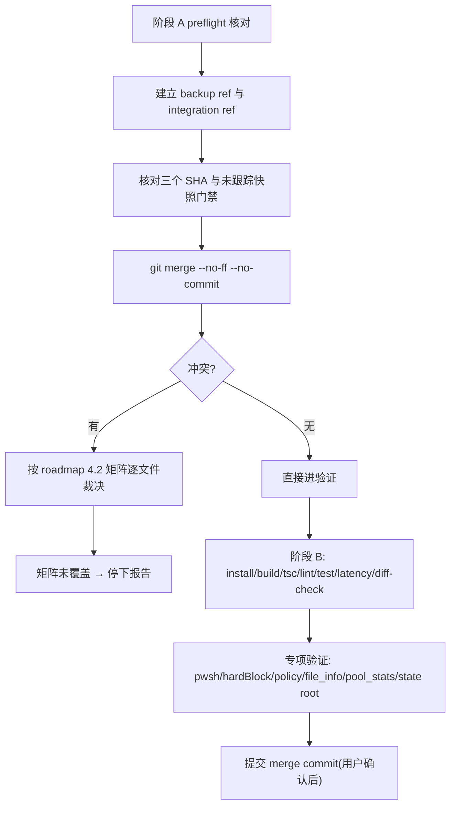

# merge-e-hardening-base 设计

> 状态：`approved`。依据：roadmap `merge-e-hardening-into-d` 全部契约（第 4 节硬约束）已经用户逐点 review 并拍板（2026-08-19），本 design 只做 feature 级编排，不重复契约内容、不改变任何可观察行为。冲突裁决、shell 契约、安全/依赖/tool surface 基线、`.etmcp` 迁移协议一律以 roadmap 4.1–4.5 为准。
>
> **执行期调整记录（2026-08-19）**：文档替换 commit `990f988`（旧 merge-plan 删除 + 新 roadmap 入库）先于 merge 落盘，D 实际 HEAD 变为 `990f988`。因此：
> - `backup/pre-merge-20260819` 指向 `990f988`（merge 前真实可回滚点），而非 roadmap 写死的 `7eea862`——否则 `reset --hard` 会同时回滚 roadmap 文档，违反 roadmap 4.1 回滚第 4 条"不得留下两份有效 roadmap"。
> - D 合并输入的**代码内容**仍等同于 `7eea862`（两者 diff 仅在 `codestable/roadmap/`），fetch 后重新计算 merge-base 仍必须等于 `d430224`。
> - 该调整不改变 roadmap 任何行为契约，仅修正回滚锚点。

## 0. 术语约定

本 feature 新增/消费的 Git 名词：

| 术语 | 定义 |
|------|------|
| backup ref | `backup/pre-merge-20260819` → `990f988`，merge 前可回滚锚点，验收完成前不删除 |
| integration ref | `integration/e-main`，fetch E 仓库 main 的本地引用，fetch 后必须等于 `e28f2e9` |
| 未跟踪集合快照 | merge 前记录的 D 工作区 untracked 文件列表，merge 后核对 `.serena/` 未进 staged diff |
| merge 事务 | `git merge --no-ff --no-commit` 起到用户确认 commit 为止的整段工作状态 |

代码侧名词（shell/安全/状态）沿用 roadmap 4.2–4.5 与既有 ARCHITECTURE 术语表，不新增。

## 1. 决策与约束

### 1.1 需求摘要

**用户目标**

D 主线一次性吸收 E 的 24 个 hardening commit，同时完整保留 D 的 pwsh shell 契约、`file_info` 开关与文档现状；merge 全程可回滚，未经用户同意不落 merge commit。

**成功标准（= roadmap 5.1 可观察结果）**

1. D main 同时包含两条历史（`git log --graph` 可见 merge commit 两侧祖先）。
2. 普通 Windows 命令通过 D 的 pwsh 契约执行（flavor/source 可观测）。
3. E 的 hardBlock、命令 policy、audit、rate limit、session 生效。
4. `pool_stats.active=false`。
5. tool count 27（默认）/ 26（`ENHANCED_TERMINAL_DISABLE_FILE_INFO=1`）。
6. Node `>=20.0.0`、SDK `1.29.0`（精确 + overrides）、zod v3、零依赖 postinstall 基线固定。
7. 每个冲突文件有明确裁决记录，build/tsc/lint/test/latency 全绿。

**明确不做**

- 不使用 rebase / squash / cherry-pick；不配置 remote、不 push、不建 PR。
- 不提交 `.serena/`；不执行 `git clean`；不删除/移动 E 仓库。
- 不实现 A+ 输出（M2）、不动 Everything 发布边界（M3）、不批量回写文档（M4）。
- 不升级 zod v4；不激活 ProcessPool（采用 E 的 inactive stub）。
- 不做自动旧状态导入：`.etmcp` 迁移协议随 E 代码一并合入即算完成，本 feature 只验证其存在与测试通过，不额外触发真实迁移。

### 1.2 复杂度档位

- 健壮性 = **L3**：Git 事务、冲突裁决、回滚路径、环境 preflight 都有显式失败语义。
- 结构 = **modules**：合并结果保持 E 的模块划分（`audit.ts` / `command-policy.ts` / `state-dir.ts` / `temp-manager.ts` 等独立文件），D 的 `shell.ts` 独立保留。
- 可测试性 = **tested**：阶段 B 门禁 + 专项验证全部留证据。
- 兼容性 = **cross-version**：Node 18 明确退役，基线升到 `>=20.0.0`。
- 确定性 = **reproducible**：三个固定 SHA、固定依赖版本、固定裁决矩阵。
- 其余维度走默认。

### 1.3 关键决策

| 决策 | 本稿选择 | 被拒方案 / 原因 |
|------|----------|-----------------|
| merge 方式 | `git merge --no-ff --no-commit integration/e-main`，人工裁决后统一 commit | rebase/squash 丢历史；自动 ours/theirs 违反 roadmap 4.2 |
| 冲突裁决 | 严格按 roadmap 4.2 矩阵逐文件执行；矩阵未覆盖的冲突立即停下来报告 | 不允许自动选择 |
| backup 锚点 | `990f988`（实际 merge 前 HEAD） | 指向 `7eea862` 会在回滚时丢失 roadmap 文档 commit |
| 测试结构 | 采用 E 的 `tests/unit/`，D 的 src 内联 `*.test.ts` 随之迁移删除 | 保留两套测试布局会造成双份维护 |
| pool | 采用 E 的 inactive stub，`pool_stats` 固定 `active:false` | 保留 D 的预热池等于激活未验证能力 |

## 2. 名词与编排

### 2.1 名词层

**现状**

- D 侧独有：`shell.ts`（`ShellSpec`/`resolveShell`/`buildShellInvocation`）、`shell.test.ts` 等 11 个 src 内联测试。
- E 侧独有：`audit.ts`、`command-policy.ts`、`es-integrity.ts`、`paging.ts`、`state-dir.ts`、`temp-manager.ts`、`version.ts`、`tools/utility.ts`；测试统一在 `tests/unit/`。
- 两侧同存但均修改：`security.ts`、`result.ts`、`stream.ts`、`session.ts`、`pool.ts`、`cache.ts`、`safeguard.ts`、`scan.ts`、`adaptive.ts`、`regex.ts`、`context.ts`、`index.ts`、`platform.ts`、`wrap.ts` + 6 个 `tools/*.ts`。

**变化**

- 合并后名词集合 = E 全量模块 + D 的 `shell.ts` + D 的 `file_info` 开关。D 内联测试迁移到 `tests/unit/` 布局。
- `package.json` / `package-lock.json` 采用 E 基线（含 `files` 含 `es_tool/es.exe`——M3 再移除）。
- 状态名词统一为 `<projectRoot>/.etmcp`（roadmap 4.5），E 代码合入即携带。

### 2.2 编排层

**现状**：两条历史互不相交，D 只有 3 个 commit 的增量（pwsh、file_info 开关、旧 merge plan）。

**变化**：merge 后命令执行链按 roadmap 4.4 固定顺序组装（input validation → checkCommandPolicy → hardBlock/blocklist/allow → rate limit → SafeGuard → shell resolution(D) → spawn → output capture → audit / structured result）；shell 选择与 invocation 消费 D 的 `shell.ts`，其余加固消费 E 实现。

#### 跨层纪律

- **错误语义**：merge 冲突只认 roadmap 4.2 矩阵；`SHELL_PATH_INVALID` / `INVALID_SHELL_MODE` / `SHELL_NOT_FOUND` 语义保持 D 现状不变。
- **幂等性**：backup/integration ref 建立前先核对指向，已存在且指向正确即复用，不强制改写。
- **并发 / 顺序**：全部 Git 操作串行执行；merge 状态存续期间不做任何其他写操作。
- **可观测点**：每个阶段门禁输出留痕（命令 + 结果摘要），冲突裁决按文件记录"裁决依据 = roadmap 4.2 第 N 行"。
- **安全性**：merge 全程不动 `security.ts` 的裁决权——按矩阵取 D 的 PowerShell 注入防护与 E 的间接执行/解释器/管道绕过规则的**并集**；hardBlock 全模式不可关闭（E 侧 decision `hardblock-uncloseable-baseline` 继承）。

### 2.3 挂载点清单

1. Git refs：`backup/pre-merge-20260819`、`integration/e-main`（删除即失去回滚与追溯能力）。
2. `package.json`：engines/dependencies/overrides/postinstall 基线（回退即破坏 Node 20/SDK 1.29 契约）。
3. `src/shell.ts` 与 E 各加固模块的共存关系（删除 `shell.ts` 即回退 E 的 shell 行为）。
4. `tests/unit/` 布局（拆除即失去 E 的测试基线）。
5. `.gitignore` 增加 `.etmcp/` 与旧 `.enhanced-terminal-mcp/`（roadmap 4.5 要求）。

### 2.4 推进策略

1. **阶段 A preflight**：固定 SHA、Node 版本、TEMP/TMP/npm cache 非 C 盘、ref 可用性、E 工作树。退出信号：核对项全部通过并留痕。
2. **ref 事务**：建 backup + fetch integration，核对 SHA 与 merge-base，快照未跟踪集合。退出信号：三个 SHA 一致，`.serena/` 确认排除。
3. **merge 与冲突裁决**：`--no-ff --no-commit`；冲突按 4.2 矩阵逐文件解决。退出信号：`git diff --name-only --diff-filter=U` 为空，裁决记录完整。
4. **依赖与结构收敛**：package/lock 采用 E 基线，D 内联测试迁往 `tests/unit/`。退出信号：`npm install` 成功，无孤儿测试文件。
5. **阶段 B 门禁 + 专项验证**。退出信号：全部命令绿 + 7 个专项各有证据。
6. **merge commit**：用户确认后提交，commit message 记录裁决摘要。退出信号：`git status` 仅剩 `.serena/` 未跟踪，`git log --graph` 显示双祖先。

### 2.5 结构健康度与微重构

- merge 本身是结构性操作，冲突裁决天然伴随"选择哪一侧结构"。**本次不做超出矩阵的微重构**：所有裁决只允许在"取 D / 取 E / 取并集 / 矩阵规定的组合"四选一，不顺手优化。
- 退出信号：冲突解决 diff 中不存在矩阵之外的创造性改动。
- **超出范围的观察**：
  - D 的 `context.ts` 与 E 合并后的 `pool.ts` 均为"未接入生产"的预留能力，是否退役建议另走 issue/refactor。
  - 两侧 `safeguard.ts`、`scan.ts` 的差异细节在 implement 阶段逐个核对，若出现矩阵未覆盖的语义分歧立即停下。

## 3. 验收契约

### 3.1 正常场景

1. preflight：三个固定 SHA 核对通过（D 侧以 `990f988` 为 HEAD、代码内容与 `7eea862` 等价）；Node `>=20`；TEMP/TMP/npm cache 指向非 C 盘。
2. ref 事务：backup 指向 `990f988`；integration 指向 `e28f2e9`；merge-base 重新计算 = `d430224`；`.serena/` 在快照中且最终未进 staged diff。
3. merge 后 `npm run build` / `npx tsc --noEmit` / `npm run lint` / `npm test` / `npm run test:latency` / `git diff --check` 全绿。
4. `pool_stats` 结构化结果含 `active:false`；默认注册 27 个工具，设 `ENHANCED_TERMINAL_DISABLE_FILE_INFO=1` 后 26 个。
5. 默认 `MCP_SHELL=pwsh` 下真实命令经 bundled/PATH pwsh 或 5.1 执行，中文输出无乱码（消费 D 的 shell 契约）。

### 3.2 边界与错误场景

6. hardBlock 在 `strict` / `normal` / `off` 三模式下均拦截 PowerShell 注入与 E 侧新增模式。
7. `MCP_COMMAND_POLICY=allow` 拒绝 shell 拼接/管道/嵌套 shell；`batch_execute` 任一命令预检失败时整批不部分执行。
8. `MCP_BATCH_RATE_MODE=batch|per_command` 两种模式均可观察。
9. state root 固定 `projectRoot`，`session_state set_cwd` 后状态路径不漂移。
10. merge 中若出现矩阵未覆盖的冲突：停止、报告、等待用户裁决，不产生自动选择痕迹。

### 3.3 范围反向核对

- Git 历史中不存在 rebase/squash/cherry-pick 产物；remote 仍为空。
- `.serena/` 不在任何 commit 中；未执行 `git clean`。
- zod 仍为 v3；`patch-package` 仅在 devDependencies；postinstall 指向零依赖脚本。
- 未实现 M2/M3 内容（无分页 cache 逻辑改动、无 `es.exe` 发布边界改动）。
- README/AGENTS/ARCHITECTURE 未提前改写（文档同步归 M4）。

## 4. 与项目级架构文档的关系

本 feature 只交付"可运行的合并基线"，**不回写** `ARCHITECTURE.md` / `requirements/` ——roadmap 第 8 节规定文档同步统一在 M4 按最终实现执行。本 feature 结束时仅在 acceptance 中记录"当前文档与代码已知的差异点清单"，作为 M4 的输入。
