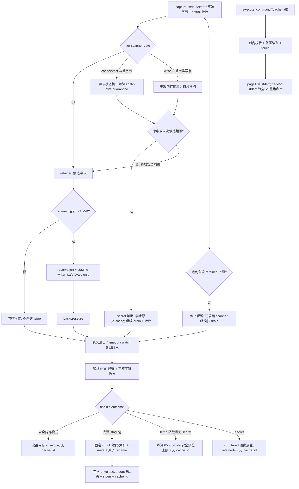

# command-output-spill-paging 设计

> 状态：`approved`（2026-08-20 用户整体 review 通过）。依据：roadmap `merge-e-hardening-into-d` 的 A+ 输出契约（4.6–4.12）已在 roadmap 阶段经用户逐点拍板；2026-08-20 又确认以“原始字节候选状态机 + 每流 8192-byte quarantine + scan-before-persist”替换固定尾缀 regex。共享契约已先同步回 roadmap，本 design 只做 feature 级编排（现状 → 变化、切片、验收契约映射），不另起冲突口径。
>
> 并入范围：issue `2026-08-19-cmd-powershell-inline-mojibake`（P2，已 confirmed）按用户拍板随本 feature 一并处理。

## 0. 术语约定

| 术语 | 定义 |
|------|------|
| A+ 捕获 | 三个命令工具共享的同一套字节捕获实现：内存模式 / 溢写模式 / 保留上限 / backpressure / 真实退出（roadmap 4.6 状态机） |
| command-output 编排层 | 位于三个 handler 与底层 capture/paging/temp/scanner 之间的共享 workflow；统一负责 scanner gate、spill transaction、finalize、降级和 envelope，不接管 policy/SafeGuard/shell 选择 |
| 内存模式 | stdout+stderr 保留量 ≤ `MCP_COMMAND_MEMORY_OUTPUT_BYTES`（默认 1 MiB）时纯内存返回，不落盘、无 cache_id |
| 溢写模式 | 首次超过内存阈值后才进入溢写准备；安全前缀通过 scanner gate 后才懒创建 staging，首次响应只含第 1 页 + `cache_id`，`paged=true` 不等于截断 |
| scan-before-persist | stdout/stderr 原始字节必须先经过 tier 对应的增量 scanner；只有已证明安全的前缀可进入 staging，命中原文和未决 quarantine 从不先落盘再删除 |
| quarantine | 每流从最早未决 secret 候选起保留的有界原始字节区，固定最多 8192 bytes；超过仍未决即 fail-closed，不是可配置缓存 |
| retained / actual 字节 | actual = 实际收到；retained = 仍保留可返回/缓存。超限后 retained 停涨、actual 续涨（drain 计数） |
| page cache v2 | 新分页缓存：`stdout.bin`/`stderr.bin`/`stdout.idx`/`meta.json` 四文件 + 二进制字符索引 + staging 原子发布（roadmap 4.9/4.10） |
| cache_id v2 | `page-cache-<13位毫秒>-<32位小写hex>`（node:crypto）；旧格式（8 位随机）不再可读 |
| envelope | `CommandOutputEnvelope`：execute/watch 结果与 batch completed item 共用的命令输出对象（roadmap 4.6 类型定义）；batch 顶层另包 results/summary，错误分支仍带诊断字段 |
| 字符 | Unicode code point（中文/单 emoji 计 1，不做 grapheme 分割、不做 normalization，`\r\n` 计 2） |
| secret 安全响应 | 任一启用 scanner 的 tier 命中后，structured stdout/stderr 为空且 retained/total_chars 归零；固定占位只放在 `content`，不含命中内容/command/cwd |
| fallback preview | 最终未命中 secret、但 temp 容量/锁/writer 失败时，从 scanner 已释放的每流最多 65536-byte 内存安全前缀生成；只统计实际返回字节，不创建 cache/page |

## 1. 决策与约束

### 1.1 需求摘要

**用户目标**：替换 D/E 合并后现有的"内存截断 + 超限报错 + 字符串整存整取分页"旧输出处理，让三个命令工具共享 A+ 捕获、溢写分页、资源治理、secret 策略和结构化 envelope；同时修复 cmd/powershell 链路行内非 ASCII 乱码。

**成功标准（= roadmap 5.2 可观察结果 + 并入 issue）**：

1. 小输出（≤1 MiB）不落盘、不创建 temp/cache_id，直接全量返回。
2. 中等输出（1 MiB～各流上限）完整分页，首次响应只含第 1 页，`truncated=false`、`paged=true`。
3. 超限输出（stdout>50 MiB / stderr>1 MiB）不杀进程，继续 drain 计数并正确标记 truncated。
4. error/timeout 的 `structuredContent` 保留 envelope 诊断字段与可用 `cache_id`，不丢 `error.detail`。
5. GBK、UTF-8 BOM、emoji/CRLF 页边界、backpressure、TTL/LRU、容量门禁、secret 四档和任意 chunk 切分均有回归证据；fault injection 能证明 secret 原文从未进入 staging/meta/audit。
6. `MCP_SHELL=cmd|powershell` 下 `echo 中文测试` 输出与 pwsh 链路一致（乱码 issue 闭环）。

**有意行为变更（roadmap 授权，逐条可观察，需用户确认）**：

| # | 旧行为（现状代码） | 新行为（A+） |
|---|---|---|
| B1 | stdout 超 `MCP_COMMAND_MAX_OUTPUT_BYTES` → 杀进程 + `EXECUTION_FAILED` | 不杀进程，drain 计数；成功退出可 `ok:true, truncated:true`，非零/timeout 保留真实错误语义 |
| B2 | 输出超 pageSize（2000 字符）即落盘分页 | 仅超 1 MiB 内存阈值才溢写；小输出即使超 pageSize 也全量返回（supersede decision `paging-cache-on-demand`） |
| B3 | `MCP_COMMAND_MAX_OUTPUT_BYTES` 是唯一内存上限 | 变为 stdout 保留上限；新增 `MCP_COMMAND_MEMORY_OUTPUT_BYTES`（1 MiB 切换）、`MCP_COMMAND_MAX_STDERR_BYTES`（1 MiB）、`MCP_TEMP_MAX_TOTAL_BYTES`（1 GiB）；四者进程级缓存，无效值 spawn 前 `VALIDATION_ERROR` |
| B4 | cache_id 为 `page-cache-<ts>-<8位随机>`，meta.json 存 command/cwd/stderr 全文 | cache_id v2（13 位毫秒 + 32 位 hex）；旧格式缓存读取返回 `PATH_NOT_FOUND`；meta.json 字段白名单，不存敏感内容 |
| B5 | execute_command：`cache_id` 与 `command` 同传时静默取 cache_id；command 模式可传 `page` | 严格二选一；同传/同缺、command 模式带 `page`、cache 模式带 `command/cwd/timeout` 均 `VALIDATION_ERROR` |
| B6 | watch_command duration 到期按 timeout 分支返回；超输出上限 → `EXECUTION_FAILED` | duration 到期 = 正常窗口结束（`ok:true, timed_out:false, capture_limit_reached:true`）；终止失败稳定返回 detail=`watch_termination_failed`；输出治理同 B1 |
| B7 | batch 单条结果为 `{command,stdout,stderr,ok,latency_ms}`，parallel 按 4 条分批等待 | 每条独立捕获/cache；并发 1/4 的有界 work queue；结果与输入等长有序，未调度项显式 `skipped`，单条失败不破坏整批结构 |
| B8 | cache 翻页每页重复 stderr；原失败命令的后续页没有独立读取语义 | stderr 仅首次响应和 page 1 返回；page>1 为空但统计完整。成功读出原失败命令的页时当前调用 `isError:false`，envelope 保留原失败 |
| B9 | secret 判断可在原始输出写入 staging 后进行；固定尾缀无法覆盖无上限 regex 候选 | scanner 固定在 writer 前；每流 8192-byte quarantine，未决超限 fail-closed，secret 原文永不落 staging |

**明确不做**（roadmap 2.2 + 本 feature 边界）：

- 不新增第 27 个以外的工具；分页读取复用 `execute_command({cache_id})`，不加独立 stderr 分页工具。
- 不把命令工具改成后台 job API；首次响应始终等待真实退出或 watch 窗口结束。
- 不改变命令 policy、SafeGuard、shell 选择优先级（roadmap 4.3）；Unix/macOS 仍 `/bin/sh -c`。
- 不引入 argv-only 执行模型或 OS sandbox；不迁移旧格式分页缓存（TTL 内自然消亡）。
- 不提前回写 README/AGENTS/ARCHITECTURE/requirements/decision（统一归 M4，见第 4 节）。
- 不动 `es.exe` 发布边界（M3）；不激活 ProcessPool。

### 1.2 复杂度档位

按"对外发布的库/服务"默认组合（L3 + modules + budgeted + public + stable + logged + tested + validated），偏离项：

- **性能 = budgeted（显式预算）**：内存阈值 1 MiB、保留上限 50/1 MiB、temp 总量 1 GiB；超限后内存不随 actual output 线性增长（backpressure + drain 丢弃）。
- **并发 = thread-safe+**：同进程 async mutex 管 reservation；跨进程容量/cleanup/read 共用 temp root 短期排他锁；batch 用并发 1/4 的 work queue，各命令独立捕获且按输入顺序组装结果。
- **安全 = hardened（偏离 validated）**：cache_id 四重校验（格式 / 词法路径 / lstat 非 symlink-junction / 规范化后仍在 temp root）；meta/索引/文件大小一致性；原始字节 scanner + 8192-byte quarantine 在写盘前 fail-closed；损坏缓存不猜编码、不退化整文件读取。
- **兼容性 = current-only（有意偏离）**：B1–B9 为可观察行为变更，旧分页缓存不可读；已获 roadmap 授权，本次整体 review 只确认整稿一致性。

### 1.3 关键决策

| 决策 | 本稿选择 | 被拒方案 / 原因 |
|------|----------|-----------------|
| 捕获与编排边界 | 新建 `src/capture.ts` 只负责 child lifecycle、原始字节、backpressure、drain 和计数；另建 `src/command-output.ts` 统一 scanner gate、spill transaction、finalize、降级与 envelope。`src/stream.ts` 保留给 `safeExec`/`quickExec`/版本探测等小输出内部调用 | 把全部逻辑塞进 capture.ts 会让进程生命周期和持久化/协议耦合；塞进 stream.ts 或 command.ts 会继续扩大既有职责并难以供三工具复用 |
| 分页存储 | 重写 `src/paging.ts`：原始字节 + 版本化二进制字符索引（1024 code point 检查点）+ staging→rename 原子发布；翻页二分最近检查点后增量解码 | 沿用整文件加载在 50 MiB 下不可接受；逐字符 offset 表体积过大 |
| 资源治理 | 扩展 `src/temp-manager.ts`：懒创建、增量 reservation、跨进程短锁、staging heartbeat lease、崩溃恢复、固定清理顺序、stats 新字段；cache 读取在校验/范围读取/touch 的短临界区共享锁，最终 cache 保持四文件 | 新建第二个资源管理器会出现两套 TTL/LRU；给最终 cache 留永久 lease 文件会破坏固定格式并增加恢复歧义 |
| secret 扫描 | 共享 pattern registry + 原始字节候选状态机；stdout/stderr 独立、每流固定 8192-byte quarantine，scanner 在 writer 前，编码歧义和超长未决候选安全侧 fail-closed | 固定尾缀 + regex 无法覆盖 `{32,}`/`\s*`/`*` 等无上限候选；先写 staging 再删仍让 secret 原文短暂落盘；整流 buffering 无内存上限 |
| envelope 收敛 | `src/result.ts` 定义 envelope schema/工厂，`src/command-output.ts` 组装共享结果，command.ts 三 handler 只做入口语义；batch completed result 复用 envelope、skipped result 用显式 union | handler 各自拼字段会漂移；让 skipped 伪装为 exit failure 会制造不存在的进程结果 |
| 原失败命令翻页 | cache read 是新的读取调用：读取成功 `isError:false`，但 immutable envelope 继续 `ok:false` 并保留原 error；读取设施失败才 `isError:true` | 把成功翻页也标成 MCP error 会诱使客户端停止取页；把原 error 清掉又会丢命令事实 |
| 乱码修复 | 在共享输出解码层 `src/command-output.ts` 做原始字节编码判定（Windows 无 BOM 且非法 UTF-8 → GBK），`src/shell.ts` 的 shell 选择与 invocation 不变（实现根因定位：cmd 管道原始字节为 GBK，pwsh/powershell 为 UTF-8，invocation 本身无需改） | 独立排期——用户已拍板并入本 feature |

## 2. 名词与编排

### 2.1 名词层

**现状**

- `src/stream.ts` `StreamResult`：字符串聚合（`Buffer.concat().toString()` 默认 UTF-8），stdout 10MB 上限、超限 SIGTERM 杀进程，stderr 1MB 静默截断；消费者为 command.ts 三工具、`utils.safeExec`、`shell.ts` 版本探测、`quickExec`。
- `src/paging.ts` `PageCache`：字符串整存整取（`stdout.txt`/`stderr.txt`/`meta.json`），meta 存 command/cwd/stderr 全文；cache_id 旧格式（8 位 `Math.random` 字符）；翻页 `readFile` 整文件 + `slice`。
- `src/temp-manager.ts`：`init()` 即 `mkdir temp`；TTL + LRU 数量淘汰；无容量概念、无 reservation/lease；`TempStats` 五字段。
- `src/scan.ts`：单次字符串扫描，`SCAN_CONTENT_MAX_BYTES=4 MiB` 以上跳过；tier off/write/cache/strict 仅服务 write_file 与 LRU 缓存路径。
- `src/result.ts`：`withErrorSchema`（M1 落地）保证错误分支不丢 structuredContent；命令工具成功字段分散（`stdout/stderr/exit_code/cache_id/page/...`）。
- `src/shell.ts`：cmd 分支 `chcp 65001 >nul && <cmd>` 在无控制台管道下不改码页解析（乱码 issue 线索，根因 implement 首步确认）。

**变化**

- 新增 `src/capture.ts`：`CommandCapture` 只管理 child lifecycle、stdout/stderr 原始字节事件、backpressure、drain、终止原因和 actual 计数；不感知 page/cache/envelope。
- 新增 `src/command-output.ts`：共享 A+ workflow，组合 capture、tier scanner、内存/溢写状态、TempManager transaction、finalize 和 envelope；四个输出环境变量在 spawn 前进程级校验，无效即 `VALIDATION_ERROR`。
- 共享 secret pattern registry：whole-string `scanContent` 与命令输出 matcher 使用同一组定义；流式 matcher 为原始字节候选状态机，每流 8192-byte quarantine，固定在 writer 前，并以差分/属性测试防止两种 matcher 漂移。
- `src/paging.ts` 重写为 `PageCacheV2`：四文件原子发布、固定 chunk 顺序索引、范围读取、一致性校验；page 1 返回 retained stderr，page>1 返回空 stderr 但保留完整统计。
- `src/temp-manager.ts` 扩展：`TempStats` 增 `active_dirs`/`reserved_bytes`；懒创建、增量 reservation、跨进程短锁、staging heartbeat lease 和崩溃恢复；最终 cache 无 lease 控制文件。
- `src/result.ts`：`CommandOutputEnvelope` / `CacheDisabledReason` / `BatchCommandResult` 类型与 zod schema；新增已授权公共错误码 `SECRET_DETECTED`，错误分支仍保留 envelope 与 `error.detail`。
- `src/tools/command.ts`：execute_command 严格双模式；batch 使用并发 1/4 work queue 和 completed/skipped union；watch 区分 window end 与 timeout；三个 handler 复用 command-output 编排层。audit 新增 action `command.output.read`（不记 command/cwd/内容）。
- `src/command-output.ts`：cmd/powershell 行内非 ASCII 修复（根因定位：Windows 无 BOM 且非法 UTF-8 → GBK 解码，见 `detectOutputEncoding`）；`src/shell.ts` 的 shell 选择与 invocation 不变。

**接口示例**

```ts
// 来源：roadmap 4.6-4.8；实现挂载于 src/tools/command.ts outputSchema
type BatchCommandResult =
  | ({ index: number; command: string; status: "completed"; latency_ms: number } & CommandOutputEnvelope)
  // skipped 表示从未创建子进程；不带 ok、latency 或任何伪造的执行/输出字段
  | { index: number; command: string; status: "skipped"; skip_reason: "stop_on_error" }

interface BatchCommandOutput {
  results: BatchCommandResult[] // 与输入等长，按 index 排列
  all_ok: boolean
  completed: number
  failed: number
  skipped: number
  summary: string
}
```

```text
// 来源：roadmap 4.7-4.8；execute_command cache 读取模式
输入:  { cache_id: "page-cache-...", page: 2 }
缓存元数据: 原命令 exit_code=2, error.code=EXECUTION_FAILED
结果: 当前 CallToolResult isError=false；envelope ok=false，保留原 error/exit_code；stdout=第2页，stderr=""

输入:  cache tier 下输出命中 secret
结果: 命令退出事实不变；无 cache_id，truncated=true，cache_disabled_reason=secret_detected；structured stdout/stderr=""、retained/total_chars=0，固定占位只在 content

输入:  strict tier 下输出命中 secret
结果: isError=true，error.code=SECRET_DETECTED；structured stdout/stderr=""、retained/total_chars=0，只有 actual 非敏感统计，无原始输出或分页文件
```

### 2.2 编排层



**现状**：command.ts 三工具各自调 `spawnStream` 拿字符串结果，超 pageSize 才走 `pageCache.cache()` 落盘；超限直接报错；watch/batch 与单发各写各的处理分支。

**变化**：三工具 handler 保留各自输入、policy、rate limit、SafeGuard、shell 与响应差异，但统一把已解析 invocation 交给 `command-output.ts`。该层驱动 `capture.ts` 并按上图完成 scanner gate、spill transaction、finalize、降级和 envelope；分页读取走独立只读支线，不经过 command policy/SafeGuard/rate limit，也不重跑命令。

#### 跨层纪律

- **错误语义**：参数互斥/配置无效/越界页 → `VALIDATION_ERROR`（越界 detail 带 `total_pages`）；非法/过期 cache_id → `PATH_NOT_FOUND`；索引/meta 损坏 → `EXECUTION_FAILED` + `cache_corrupt`；cache 锁超时 → retryable `EXECUTION_FAILED` + `cache_lock_timeout`；strict 命中 → `SECRET_DETECTED`。错误分支保留 envelope 与 `error.detail`。成功读取原失败命令的 cache 页时当前调用 `isError:false`，envelope 保留原失败事实。
- **降级与计数**：secret 策略 > temp 容量/锁/writer 降级；scanner 一旦启用就继续扫 drain。内部 `COMMAND_OUTPUT_FALLBACK_PREVIEW_BYTES=65536` 按每流维护 scanner 已释放的安全原始前缀，不可配置、不创建 temp；失败时 stdout 最多返回 effective `pageSize` 个 code point，stderr 最多返回该 64 KiB 缓冲的完整字符。缓存失败不伪装成命令失败，ok/exit/timeout 由真实结果决定；`retained_*_bytes` 只计最终实际返回/缓存的命令输出字节，删除 staging、内部未返回预览、被抑制输出和 drain-only quarantine 均不计 retained。
- **幂等性**：分页读取不重跑命令；只有锁内校验与范围读取成功才刷新滑动 TTL（即使原命令失败）；非法 ID、越界、读取失败不刷新。发布原子，rename 成功前不暴露 cache_id。
- **并发 / 顺序**：batch 用并发 1/4 work queue；失败只停止尚未调度项，active 全部收尾，结果按输入 index 排列。TempManager 同进程 mutex + 跨进程短锁保护 reservation、cleanup 和 page read 短临界区；锁失败不无界等待。
- **watch 终止**：duration 是 `watch_window` 原因，不是 timeout；正常结束 `timed_out=false, capture_limit_reached=true`。温和/强制终止后仍未确认关闭才返回 `watch_termination_failed`，已捕获安全诊断不丢。
- **分页响应**：stdout 是唯一分页主流。首次响应/page 1 带 retained stderr；page>1 固定 `stderr=""`，但 stderr encoding/bytes/truncated 字段保持完整，page 字段本身足以表示未携带 stderr。
- **可观测点**：audit `command.execute`（现状）+ `command.output.read`（新增，只记 cache_id/页码/读取量）；`temp_stats` 增 `active_dirs`/`reserved_bytes`；`cache_disabled_reason` 机读化降级原因。
- **安全性**：cache_id 四重校验；scanner 是共享 pattern registry 的保守超集，编码歧义/超长未决候选允许安全侧 false positive，不允许 registry match false negative；只有 scanner 释放的字节能进 staging，meta/audit 不存 command/cwd/输出副本/env/secret 原文。任一启用 scanner 的 tier 命中后两个流同时全量抑制：structured stdout/stderr 为空，全部 retained 统计和 `total_chars` 为 0，空流 encoding 规范化为 `utf8`，占位说明只进入人类可读 `content`；两个 fallback buffer 必须清空。

### 2.3 挂载点清单

1. 三个命令工具的公开 schema：修改 `execute_command` 双模式、`batch_execute` result union、`watch_command` envelope；删除这些 schema 变化则外部能力消失。
2. 输出治理配置入口：新增/修改 `MCP_COMMAND_MEMORY_OUTPUT_BYTES`、`MCP_COMMAND_MAX_OUTPUT_BYTES`、`MCP_COMMAND_MAX_STDERR_BYTES`、`MCP_TEMP_MAX_TOTAL_BYTES`，并扩展既有 `MCP_SECRETS_SCAN` 到命令输出。
3. 状态目录协议：注册 page cache v2 的 `page-cache-*` 四文件布局、cache_id v2 和 staging 原子发布；删除则无法持久分页。
4. 统一错误协议：在公共 `ErrorCode` / output schema 挂入 `SECRET_DETECTED`、cache 降级和完整 envelope；删除则 fail-closed 与机器诊断契约消失。
5. audit 协议：新增 `command.output.read` action；删除则分页读取失去安全审计点。

（乱码修复触点在 `src/command-output.ts` 的原始字节编码判定，属并入 issue 的定点修复，不单列挂载点。）

### 2.4 推进策略

1. **S1 捕获原语与 workflow 骨架**：建立独立 capture 和 command-output 边界，先跑通纯内存 happy path，节点用可替换 sink/finalizer。退出信号：三个工具可经共享入口得到与现状等价的小输出/exit/timeout，stream.ts 既有消费者不变。
2. **S2 scan-before-persist 计算节点**：共享 pattern registry，接入字节状态机、8192-byte quarantine、四 tier、secret 全量抑制响应和 fallback preview。退出信号：任意 chunk 切分差分验证、8191/8192/8193 边界与 >4 MiB drain 场景通过，fault injection 证明命中原文从未落盘。
3. **S3 TempManager transaction**：接通懒创建、增量 reservation、短锁、staging heartbeat、崩溃恢复和固定清理顺序。退出信号：缺失 temp 零副作用、容量/锁降级、TTL/LRU、并发读写清理矩阵通过。
4. **S4 分页持久化与读取**：接通四文件 publish、固定 chunk 编码/索引、范围读取、四重校验和 page 1 stderr 语义。退出信号：BOM/GBK/emoji/CRLF/pageSize/损坏/旧 ID 矩阵通过，读写均不整文件加载，最终 cache 仅四文件。
5. **S5 工具契约与乱码闭环**：三 handler 接入 envelope、batch queue/skipped、watch window、cache read `isError` 差异和 audit；command-output 层先定位再定点修复 cmd/powershell 非 ASCII（原始字节编码判定，shell.ts 不变）。退出信号：三工具 e2e 正常/分页/错误结构完整，三 shell 链路 `echo 中文测试` 一致。
6. **S6 阶段 C 门禁**：roadmap 7.3 全矩阵回归（阈值边界/行为/编码索引/资源/secret）+ `npm run build`/`npx tsc --noEmit`/`npm run lint`/`npm test`/`npm run test:latency`/`git diff --check`。退出信号：全绿并留痕。

### 2.5 结构健康度与微重构

##### 评估

- `src/tools/command.ts`（547 行）同时承载三个 schema、precheck/rate limit/SafeGuard/shell/audit 和结果编排，本次会触及三个 handler；继续加入 scanner/spill/finalize 是明显的新职责。
- `src/paging.ts`（156 行）职责单一，但旧字符串格式与 v2 原始字节/索引契约不兼容，按新契约替换比先搬运更可验证。
- `src/temp-manager.ts`（275 行）仍是统一资源治理归属；本次扩展同一 TTL/LRU/capacity 职责，没有第二个无关概念。
- `src/result.ts`（265 行）、`src/scan.ts`（87 行）、`src/shell.ts`（348 行）均为各自现有职责的定点扩展；shell 只处理已确认乱码 issue。

##### 结论：不做前置微重构

原因：`src/command-output.ts` 是本 feature 必需的新编排边界，不是“只搬不改行为”的前置重构；handler 只保留入口职责。pattern registry 的无行为提取并入 S2 并以 whole-string 现有测试证明等价，不单设阻塞步骤。

##### 超出范围的观察

- `command.ts` 三 handler 的 precheck / rate limit / audit / shell 解析样板高度重复，envelope 落地后可另走 `cs-refactor` 评估；本 feature 不搬。
- `utils.safeExec` / `quickExec` 仍消费旧 `spawnStream` 字符串语义，是否需要字节级解码治理可另行评估；本 feature 不迁移。

## 3. 验收契约

### 3.1 正常场景

1. 非 secret 小输出（空、<1 MiB、=1 MiB、>2000 字符但 ≤1 MiB）：不创建 temp/cache_id，全量返回，`paged=false, truncated=false`；cache/strict 可在内存扫描但不得因此创建状态目录。
2. 安全中等输出（刚超 1 MiB～上限内）：scanner 只向 staging 释放安全字节；首次响应仅 stdout 第 1 页 + retained stderr + `cache_id`，`paged=true, truncated=false`；顺序读到末页与实际 retained stdout 一致，page>1 `stderr=""`，改 `pageSize` 只重算页边界。
3. batch：顺序并发 1、parallel 并发 4 的 work queue 均不批次空等；`results.length===commands.length` 且按 index 排列，`completed+skipped===commands.length`，`failed` 只数 completed 中 `ok=false`，`all_ok` 等价于 `failed===0 && skipped===0`。`stop_on_error` 后未调度项显式 skipped、active 项完整收尾；skipped 不含 `ok`、latency、exit/output/stat/cache。非零/timeout/strict secret 只影响对应 completed result。保持现有空 batch：全零计数、`results=[]`、`all_ok=true`，不 spawn/建 temp/消耗 per-command token。
4. watch：duration 到期返回 `ok=true, timed_out=false, capture_limit_reached=true` 并确认子进程关闭；窗口前非零退出仍 `EXECUTION_FAILED`。
5. 乱码修复：`MCP_SHELL=cmd` 与 `MCP_SHELL=powershell` 下 `echo 中文测试` 返回中文无乱码，与 pwsh 链路一致。

### 3.2 边界与错误场景

6. 超限：stdout=50 MiB / 刚超、stderr=1 MiB / 刚超、双高流量——不杀进程，等待真实退出；成功退出 `ok:true, truncated:true` 且 `stdout/stderr_truncated` 分流标记；retained 尾部收缩在完整字符边界；actual 字节统计完整。
7. 编码矩阵：UTF-8 / UTF-8 BOM（分页剥 BOM）/ 非法 UTF-8（U+FFFD）/ GBK / 多字节跨 chunk / emoji·组合字符·ZWJ·CRLF 页边界；stdout 与 stderr 独立判定。
8. 参数与 cache read：command+cache_id 同传/同缺、command 模式带 page、cache 模式带 command/cwd/timeout → `VALIDATION_ERROR`；读取不进 policy/SafeGuard/rate limit、不重跑命令。成功读取原非零/timeout cache 时当前 `isError=false`，envelope 的 `ok=false`、原 error/exit/timed_out 不变并刷新 TTL。
9. cache 安全：非法格式、路径穿越、symlink/junction、meta/索引/文件大小不一致 → 拒绝；损坏索引 → `EXECUTION_FAILED` + `cache_corrupt`；锁超时 → retryable `EXECUTION_FAILED` + `cache_lock_timeout`；这些失败与越界页均不刷 TTL。
10. 资源：慢写盘 backpressure 无界堆积不发生；降配容量门禁 → `temp_capacity_exceeded`，锁/writer 失败 → `temp_unavailable`，命令语义均不变。非 secret 降级预览每流原始前缀不超过 65536 bytes，stdout 返回不超过 effective `pageSize` 个 code point，retained 统计只计实际返回字节，`paged=false` 且无 cache/page 字段；LRU 数量+容量双维淘汰；崩溃 staging 仅过期 heartbeat 被清；final cache 仅四文件；`temp_stats`/cleanup 不创建缺失 temp。
11. secret scanner：off 不扫；write 只在溢写准备时先重放内存前缀；cache/strict 从首字节扫描。共享 registry 的每个 pattern 在所有可能 chunk 边界与 stdout/stderr 均不漏；>4 MiB drain、EOF、编码歧义、quarantine 8191/8192/8193 和超长无界候选覆盖，未决超限 fail-closed。
12. secret 结果与落盘：write/cache 命中 → `truncated=true, cache_disabled_reason=secret_detected` 且命令退出事实不变；strict → `SECRET_DETECTED` + 非敏感统计。三者 structured stdout/stderr 均为空、`stdout_retained_bytes=stderr_retained_bytes=retained_output_bytes=total_chars=0`、`paged=false`、无 cache/page 字段，占位 `content` 不计输出；各流 truncated 标志按 actual 是否非零计算。容量/锁/writer 降级后仍扫描 drain；后续命中必须清空两个 fallback buffer。scanner/writer/reservation/finalize/rename fault injection 均证明 secret 原文从未进入 staging/meta/audit，最终无 cache_id。
13. 错误与降级 envelope：非零退出/timeout/watch 终止失败保留统计、可用 cache_id、truncated 标记和 `error.detail`；缓存失败预览的 retained 统计只包含最终实际返回的安全原始字节，不包含已删除 staging、内部预览未返回部分、被抑制输出或 drain-only quarantine；空 retained 流 encoding 为 `utf8`。

### 3.3 范围反向核对

- 超输出上限时进程不被 SIGTERM/SIGKILL（除命令自身 timeout 语义）；旧"超限即 `EXECUTION_FAILED`"路径不存在。
- 工具数仍 27/26；分页读取复用 `execute_command`，无新增工具；无后台 job API。
- 命令 policy、SafeGuard、shell 选择优先级（4.3）、Unix `/bin/sh -c` 未变；ProcessPool 未激活。
- final cache 始终只有 `stdout.bin`/`stderr.bin`/`stdout.idx`/`meta.json`；heartbeat/lease 控制文件不得随 rename 发布。
- staging/meta/audit 无 secret 原文，meta.json 也无 command/cwd/输出副本/env；audit 无 `command.output.read` 之外的新 action。
- quarantine 上限不是环境变量，不新增运行时依赖，不复制第二份可独立漂移的 secret pattern registry。
- 小输出路径无 temp 目录创建（`getStateDir()/temp` 不存在时不被创建）。
- README/AGENTS/ARCHITECTURE/requirements/decision 未提前改写（归 M4）；`.serena/` 未进任何 commit。

## 4. 与项目级架构文档的关系

本 feature **不回写** `ARCHITECTURE.md` / `requirements/` / decision——roadmap 第 8 节规定文档同步统一在 M4 按最终实现执行。本 feature 结束时在 acceptance 记录差异清单作为 M4 输入，预计包括：

- 术语表与 ADR-8：流式执行语义更新（capture/command-output 边界、不杀进程、scan-before-persist、8192-byte quarantine、page cache v2）；ADR-9 之外新增 `command.output.read` audit action。
- 资源上限节：四个新环境变量与默认值；`temp_stats` 新字段。
- 状态目录结构节：`page-cache-*` 新布局（`stdout.bin`/`stderr.bin`/`stdout.idx`/`meta.json`）与 staging。
- decision `paging-cache-on-demand` 被 A+ 取代，需 supersede（B2）；`temp-manager-reuse` 语义扩展（懒创建/容量/reservation）需更新。
- requirements backfill：command output 能力无对应 req，由 M4 评估（本 feature frontmatter `requirement: null`）。
- 乱码 issue 修复后，ARCHITECTURE 的 shell 契约节与 issue 闭环状态。
