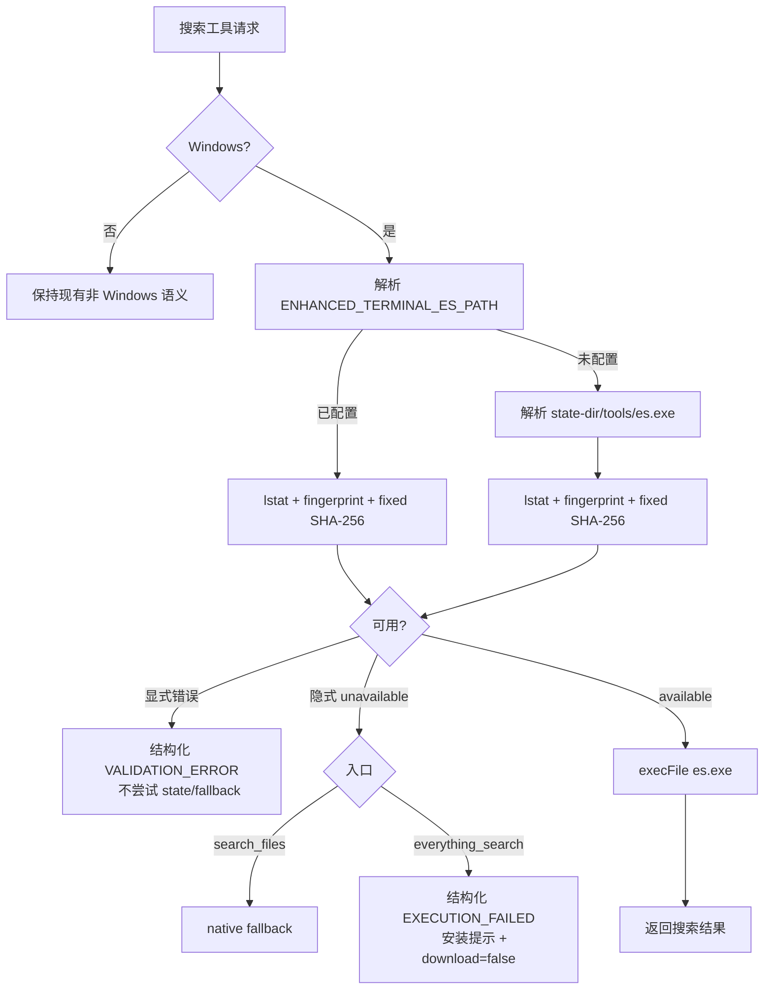

# publish-es-optional 设计

> 状态：`approved`。本设计严格消费 roadmap `merge-e-hardening-into-d` 第 4.13 节，不改变固定 hash、解析顺序、零下载和 `search_files` / `everything_search` 的差异契约。

## 0. 需求摘要

### 用户目标

让 Windows 上的 Everything 加速从“仓库随包捆绑”变成“用户本地可选提供”，同时保留原生搜索 fallback，并防止错误或被替换的 binary 被执行。

### 核心行为

- 解析顺序固定为 `ENHANCED_TERMINAL_ES_PATH` → `<state-dir>\\tools\\es.exe` → unavailable。
- 使用固定 SHA-256 `5101b3a6d9542de378e077f4b8c66c4e608d3bff088092427749b65fbb18b342`。
- 显式路径存在但不可用时硬失败，不静默切换到 state 路径；未显式配置且 binary 不可用时，`search_files` 走原生 fallback。
- `everything_search` 在 binary 不可用时返回结构化失败和安装提示，明确 `download_performed=false`。
- npm package 不包含 `es.exe`；安装期、启动期、运行期均不下载。

### 成功标准

固定 hash 的显式路径和 state 路径均可成功执行；所有错误来源可区分；binary 缺失时不影响 `search_files` 原生搜索；`npm pack --dry-run` 输出不包含 `es.exe`；全量质量门禁通过。

### 明确不做

- 不下载 Everything，不新增 postinstall 下载器，不维护平台包。
- 不把 `everything_search` 扩展到非 Windows，不为其他平台构造 Everything 等价物。
- 不读取仓库内 `es_tool/es.exe` 作为生产默认路径；仓库副本只保留为开发/测试 fixture。
- 不在本 feature 更新 README、ARCHITECTURE、requirements 或历史 decision；最终当前口径统一由 M4 同步。
- 不引入新的运行时依赖，不重构无关搜索逻辑，不改变既有命令、权限和缓存协议。

## 1. 决策与约束

### 1.1 硬约束来源

roadmap 第 3.3、4.2、4.13、7.4 和 7.5 节是本 feature 的硬约束，尤其是：

- 显式配置错误 fail-closed，不能回退隐藏配置错误。
- state 路径缺失或 hash 不匹配只能表示 unavailable，不能读取仓库 binary 代替。
- 每次执行前复核文件 fingerprint；size、mtime 或 file identity 变化必须重新 hash。
- resolver 和错误处理路径不得包含下载调用。

### 1.2 代码维度

- 健壮性：L3 hardened。环境变量、路径、文件类型、权限、hash、子进程入口均有明确失败语义。
- 结构：modules。完整性、解析和诊断归 `es-integrity`；搜索工具只消费解析结果。
- 性能：budgeted。成功缓存只跳过未变化文件的重复 hash；每次调用仍做有界 `lstat` fingerprint，hash 只在 fingerprint 变化时执行。
- 可读性：public。公开工具的失败 detail 和安装提示可被 MCP client 直接理解。
- 可观测性：logged。缺失、非普通文件、读取失败、hash mismatch 和 fallback 均有不泄露内容的日志。
- 可测试性：verified。resolver、路径优先级、fingerprint 失效、fallback、package dry-run 和无下载证据均有验证。
- 特殊维度：resolution deterministic；成功路径 idempotent；并发解析共享 in-flight promise；当前发布契约采用 current-only 的生产路径切换，但 `search_files` 的隐式 fallback 保持兼容。

### 1.3 关键选择

| 决策 | 本稿选择 | 被拒方案 / 原因 |
|---|---|---|
| 生产 binary 来源 | 显式环境变量或固定 state 路径 | 继续读取 `es_tool/es.exe` 会让 npm 发布物边界失效 |
| 显式路径错误 | 返回结构化配置错误且不尝试第二路径 | 静默 fallback 会掩盖拼写、权限或供应链配置错误 |
| 隐式 state 路径错误 | resolver 返回 unavailable；`search_files` 原生 fallback，`everything_search` 结构化失败 | 把普通 `search_files` 变成硬失败会破坏已有 fallback 产品边界 |
| 完整性缓存 | 每次先 fingerprint，未变化才复用成功结果；变化即重新 hash | 只按进程缓存路径会在文件替换后继续执行旧判断 |
| 无 binary 安装体验 | 给出固定 hash、环境变量名、默认路径和 `download_performed=false` | 自动下载违反零联网运行期和供应链边界 |
| 测试 fixture | 继续保留仓库 `es_tool/es.exe`，只通过显式测试路径使用 | 删除 fixture 会让本地完整性和跨平台测试失去稳定输入 |

## 2. 名词层与编排层

### 2.1 名词层：现状 → 变化

**现状**

- `src/es-integrity.ts` 只校验固定的仓库相对路径 `es_tool/es.exe`，成功路径按进程缓存，失败返回 `null`。
- `src/tools/search.ts` 的 `search_files` 和 `everything_search` 共享 `ensureEsExeIntegrity()`；因此显式配置、state 路径和“不可用原因”尚未进入工具契约。
- `package.json#files` 显式包含 `es_tool/es.exe`，所以 npm 发布物仍携带 binary。

**变化**

- `es-integrity` 提供带来源和失败原因的解析结果：成功结果以 `source=explicit|state` 标识来源；失败结果保留实际来源并以 `available=false` + `diagnostic.reason` 表示 `unavailable`，从而区分显式配置错误与隐式缺失。
- 生产默认路径改为 `getStateDirSync()/tools/es.exe`；`ENHANCED_TERMINAL_ES_PATH` 解析为显式路径。仓库 `ES_EXE_PATH` 仅保留为开发/测试 fixture 兼容导出，不再作为 resolver 默认值。
- 完整性检查先 `lstat` 确认普通文件并取得 fingerprint，再按需计算固定 SHA-256；每次 resolver 调用都复核 fingerprint。
- 诊断对象至少包含 `reason`、`expected_sha256`、`env_name`、`default_path`、`download_performed=false`，必要时包含非敏感的 configured path 和实际 hash。
- `package.json#files` 移除 `es_tool/es.exe`，但不删除仓库 fixture 或 `.gitattributes` 的二进制管理规则。

统一结果示例：

```text
ENHANCED_TERMINAL_ES_PATH=<valid fixed-hash file>
→ source=explicit, available=true, execute that file

ENHANCED_TERMINAL_ES_PATH=<missing path>
→ source=explicit, available=false, reason=explicit_path_missing
→ search_files: VALIDATION_ERROR, no fallback

(no env) + <state-dir>\\tools\\es.exe missing
→ source=state, available=false, reason=state_path_missing
→ search_files: native fallback; everything_search: EXECUTION_FAILED + install detail
```

### 2.2 编排层：现状 → 变化

**现状**

当前两个 Windows 搜索入口直接调用完整性校验：`search_files` 校验失败后继续 native walk，`everything_search` 校验失败后返回普通 `EXECUTION_FAILED`。解析层无法表达“显式路径坏了”和“未配置 binary”的差异。

**变化**



解析 workflow 只有一个生产入口，两个 handler 只负责入口差异：

1. 读取环境变量并决定 explicit/state 分支；空字符串按未设置处理。
2. 对候选路径执行普通文件检查和 fingerprint；显式路径的任何检查错误立即形成 hard configuration failure。
3. 对 fingerprint 未命中的候选计算 hash；固定 hash 通过才发布 `available` 结果。
4. 解析失败不创建 state/tools 目录，不触发下载，不读取仓库 fixture。
5. `search_files` 对 implicit unavailable 进入现有 native walk；`everything_search` 生成固定诊断 detail。
6. 可执行路径在 `execFile` 前仍通过现有工具的 Windows-only、路径和参数边界；本 feature 不改变 Everything 参数协议。

### 2.3 挂载点

按“删除后 feature 是否消失”收紧为四个挂载点：

1. **完整性解析挂载点**：`src/es-integrity.ts`，登记来源、fingerprint、hash 和诊断。
2. **搜索入口挂载点**：`src/tools/search.ts`，接入显式 hard failure、隐式 fallback 和 Everything 安装提示。
3. **发布边界挂载点**：`package.json#files`，从发布物排除 `es.exe`。
4. **验证挂载点**：`tests/unit/es-integrity.test.ts`、搜索工具测试与 package dry-run 检查，证明生产路径、fallback 和零下载边界。

不把 `README.md`、ARCHITECTURE 或 CHANGELOG 列为本 feature 挂载点；它们属于 M4 最终同步。

### 2.4 推进策略

1. **解析编排骨架**：定义候选来源、结果 union 和诊断字段，保持 `ensureEsExeIntegrity()` 兼容包装；退出信号是 resolver 可区分 `source=explicit|state` 与 `available=false` 的 unavailable 诊断。
2. **完整性计算节点**：实现普通文件检查、fingerprint、固定 hash、成功缓存和并发 in-flight；退出信号是替换文件后必重新 hash，错误不执行。
3. **搜索契约接入**：更新两个搜索入口；退出信号是 `search_files` 仅对 implicit unavailable fallback，`everything_search` 始终返回结构化安装提示。
4. **发布裁剪节点**：移除 package files 中的 binary，保留源码 fixture；退出信号是 `npm pack --dry-run` 不含 `es.exe`。
5. **验证与反向核对**：补路径优先级、文件类型、hash/fingerprint、fallback、诊断和无下载测试；退出信号是 M3 专项与现有全量门禁通过。

### 2.5 结构健康度与微重构

本次不做前置微重构。理由：`es-integrity.ts` 当前职责单一且短，适合承载候选解析和完整性结果；`search.ts` 虽包含三个搜索入口，但 M3 只在两个既有分支接入一个 resolver，抽出独立模块会扩大变更面而不改变职责边界。若后续需要重划搜索 handler 或发布能力，另走 `cs-refactor`。

## 3. 验收契约

每条均以输入/触发 → 可观察结果表达：

1. 显式环境变量指向存在且 hash 正确的普通文件 → resolver 只使用该路径，返回 `source=explicit`，不检查 state fallback。
2. 显式路径不存在、是目录、是 symlink、不可读或 hash mismatch → resolver 返回显式配置失败；`search_files` 返回结构化 `VALIDATION_ERROR`，不执行 native fallback；`everything_search` 返回结构化失败。
3. 未设置环境变量且 state binary 存在且 hash 正确 → 两个入口使用 state 路径，生产路径不指向仓库 `es_tool`。
4. 未设置环境变量且 state binary 缺失/非普通文件/不可读/hash mismatch → `search_files` 走原生 fallback；`everything_search` 返回失败 detail，包含固定 hash、默认路径、环境变量名和 `download_performed=false`。
5. 显式路径和 state 路径同时存在但显式路径坏 → 显式错误优先，不尝试 state 路径。
6. 已成功解析后替换文件内容、size、mtime 或 file identity → 下一次调用重新计算 hash；旧成功结果不得继续授权执行。
7. 多个并发首次解析请求 → 共享 in-flight 检查，不产生重复 hash/不返回互相矛盾的来源。
8. 每个成功或失败解析路径 → 无任何 `fetch`、HTTP、下载、postinstall 安装或启动期写入 binary 的调用。
9. `everything_search` 在 Windows binary 不可用 → `isError=true`、`EXECUTION_FAILED` 和结构化 detail；detail 不包含秘密原文。
10. `search_files` 在 Windows binary 不可用且无显式配置 → 仍能通过 native walk 返回匹配文件及 `search_ms`。
11. 非 Windows 调用 `everything_search` → 保持 Windows-only 失败和 `search_files` 建议，不触发 resolver 或下载。
12. `npm pack --dry-run` → 输出文件列表不包含 `es.exe` / `es_tool/es.exe`；仓库工作树中的 fixture 仍存在供开发测试使用。
13. 现有 `es-integrity` hash 格式、搜索参数、工具数量、policy/SafeGuard/audit 语义 → 不因 M3 改变。

### 明确不做反向核对

- 不接受“binary 缺失就自动下载安装”。
- 不接受读取仓库 `es_tool/es.exe` 作为默认生产路径。
- 不接受显式环境变量错误后静默 fallback。
- 不接受把 Everything 失败伪装成空搜索结果。
- 不接受把 `es.exe` 通过 `files`、postinstall 或构建复制重新带入 npm 包。

## 4. M4 交接

M3 完成后只回写 roadmap item 和本 feature acceptance。M4 需要按最终实现同步：

- README 的 Everything 可选、固定 hash、零下载和 fallback 说明。
- ARCHITECTURE 的 resolver 来源、fingerprint 规则和搜索入口差异。
- CHANGELOG、相关 requirements/decision 与 package 发布边界。
- `package.json` / `.gitignore` / fixture 说明的最终统一口径。

## 5. 可卸载边界

若移除本 feature，应同时移除 resolver 的 explicit/state 解析、搜索入口的安装提示与显式 hard failure、package files 的发布裁剪及对应测试；既有 native `search_files` fallback 和非 Everything 搜索能力仍应保留。该边界证明 M3 没有把下载、平台包或无关搜索逻辑耦合进来。
