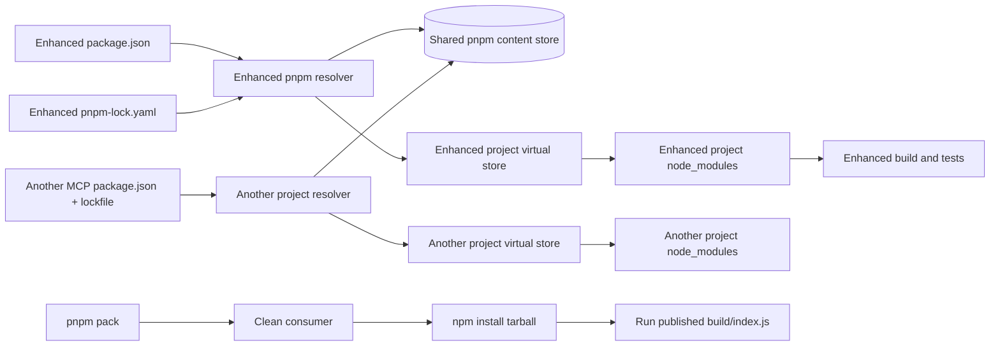

# pnpm Shared Dependency Store Design

> Status: `approved` (2026-08-22 user approved implementation). This document covers the proposed dependency-management migration only. It does not change source runtime behavior, add a cross-repository workspace, or share a runtime `node_modules` directory.

## 0. Requirement Summary

### User goal

Let Enhanced Terminal MCP use the same pnpm dependency content store as other MCP projects, following the useful part of the Adaptive Reasoning Engine MCP setup, while keeping Enhanced Terminal MCP an independent project.

### Core behavior

- Enhanced Terminal MCP becomes a standalone pnpm project with one root package.
- The project declares `packageManager: "pnpm@11.21.0"` and uses `pnpm-lock.yaml` as its only project lockfile.
- pnpm may reuse the machine-level content store. On the current machine, `pnpm store path` resolves to `E:\pnpm\v11`.
- The shared store path is machine configuration, not a hard-coded path in `package.json`, the lockfile, or the published package.
- Enhanced Terminal MCP keeps its own project `node_modules`, project virtual store, package identity, scripts, and lockfile.
- Different projects and different dependency versions may coexist in the shared content store.
- npm remains supported for consumers installing the published package; this feature changes project development/install management, not the public package install contract.

### Success criteria

1. A clean checkout can install with `pnpm install --frozen-lockfile` using the committed `pnpm-lock.yaml`.
2. A second isolated pnpm project can use the same configured content store without sharing Enhanced Terminal MCP's `node_modules` or lockfile.
3. Reinstalling from the populated store works offline or without downloading already-present package content.
4. Enhanced Terminal MCP resolves dependencies through its own project entry points; it does not use `NODE_PATH`, a global runtime directory, or a hand-written cross-project symlink.
5. Existing dependency versions and the `@modelcontextprotocol/sdk` override remain unchanged unless a separate dependency-upgrade decision is approved.
6. `pnpm run build`, `pnpm exec tsc --noEmit`, `pnpm run lint`, `pnpm test`, and `pnpm run test:latency` remain green.
7. `pnpm pack` produces a package that a clean npm consumer can install and run without relying on the workspace checkout.
8. All controllable temporary, cache, test, and build output paths remain on a non-C drive, and the shared store is not created under the user profile or Windows temp directory.

### Explicitly out of scope

- Do not create a parent `pnpm-workspace.yaml` that combines Adaptive Reasoning Engine MCP and Enhanced Terminal MCP.
- Do not share one runtime `node_modules` directory between MCP projects.
- Do not use `NODE_PATH`, manual symlinks, junctions, or a global runtime directory as a replacement for pnpm resolution.
- Do not move Enhanced's virtual store to an external per-project directory in this feature. That is a separate optimization and must not be confused with the shared content store.
- Do not migrate, rewrite, or reconfigure Adaptive Reasoning Engine MCP.
- Do not force all MCP projects to use identical dependency versions.
- Do not add runtime dependencies, change MCP tool behavior, or alter security, command, session, or output contracts.
- Do not keep both `package-lock.json` and `pnpm-lock.yaml` as competing sources of truth after migration.
- Do not hard-code `E:\pnpm` into implementation files, package metadata, lockfiles, or published artifacts; repository documentation may mention the current machine as an example, while another machine may use a different pnpm store path.

## 1. Decisions and Constraints

### 1.1 Current evidence and boundary

Enhanced Terminal MCP is currently a single-root npm project. It has `package.json` and `package-lock.json`, no `pnpm-workspace.yaml`, and no `pnpm-lock.yaml`. Its published entry point remains `build/index.js`, and its postinstall script is a zero-dependency SDK patch.

The current pnpm installation is `11.21.0`. Its content store is outside this repository and currently resolves to `E:\pnpm\v11`. Adaptive Reasoning Engine MCP also keeps project-specific runtime entry points; the reusable part is the pnpm content store, not a shared runtime directory.

Evidence locations for the current contract are `package.json` (package identity, scripts, dependencies, and overrides), `package-lock.json` (npm resolution), and `README.md` / `AGENTS.md` (project commands, publishing, and non-C storage rules).

### 1.2 Complexity dimensions

- Robustness: **L3** for lockfile, install, path, and rollback checks; dependency drift must be visible rather than silently accepted.
- Structure: **project-boundary only**; no runtime source-module refactor is needed.
- Performance: **reasonable**; reuse the content store and avoid duplicate downloads, without changing MCP runtime execution.
- Readability: **public** for README and maintainer instructions, so a new contributor can understand the two different kinds of pnpm storage.
- Evolvability: **stable**; the package manager and lockfile become part of the project contract.
- Testability: **tested**; install, resolution, package, and existing application gates all need evidence.
- Determinism: **reproducible**; the lockfile and pinned pnpm version control project resolution, while the store path remains environment configuration.
- Compatibility: **backward-compatible** for npm consumers of the published package.
- Idempotency: **idempotent**; repeating install or rebuilding the project must not create a second project identity or a second lockfile.

### 1.3 Proposed choices

| Decision | Proposed choice | Rejected alternative and reason |
|---|---|---|
| Project shape | Keep Enhanced Terminal MCP as one standalone root package | A cross-MCP workspace would couple unrelated release and lockfile boundaries |
| Shared resource | Reuse pnpm's content-addressable store, currently `E:\pnpm\v11` | A shared runtime `node_modules` would make project isolation and publishing ambiguous |
| Project runtime entry | Keep a project-owned `node_modules` and project virtual store | `NODE_PATH`, junctions, or a manually shared runtime tree bypass pnpm's resolution model |
| Package manager pin | Add `packageManager: "pnpm@11.21.0"` | Leaving the manager unpinned makes lockfile and install behavior vary between machines |
| Lockfile migration | Convert the existing npm lock resolution into `pnpm-lock.yaml`, then remove `package-lock.json` after verification | Keeping two lockfiles allows npm and pnpm to drift apart |
| Dependency versions | Preserve the current manifest and resolved versions in the first migration | Simultaneously upgrading SDK, Vitest, or Node types would make failures hard to attribute |
| Store path declaration | Keep the path in pnpm/user/machine configuration and document the rule | Writing `E:\pnpm` into implementation or package metadata would break other machines and consumers |
| Published package | Continue publishing a normal npm-compatible package and verify it from a clean consumer | Testing only inside the repository could hide broken package contents or workspace links |
| External virtual store | Defer it to a separate feature | It is an independent disk-layout choice, not required to share dependency content |

## 2. Name Layer and Orchestration Layer

### 2.1 Name layer: current -> change

**Current**

- The project identity is a root `package.json` with npm scripts and a committed `package-lock.json`.
- Dependencies are declared in the existing `dependencies`, `devDependencies`, and `overrides` sections.
- Repository instructions and README examples use npm commands.
- The project runtime is entered through its own `node_modules` and compiled `build/` output.

**Change**

- Add the pnpm manager pin without changing the package name, version, `main`, `bin`, `files`, engines, dependencies, overrides, or public MCP API.
- Replace the npm lockfile source of truth with a pnpm lockfile generated from the existing dependency resolution, with no intentional version upgrade in this feature.
- Keep package scripts semantically the same; project-facing instructions use `pnpm run` and `pnpm install`.
- Treat the following as separate concepts:

```text
Shared content store: reusable package content, for example E:\pnpm\v11
Project virtual store: Enhanced-only pnpm package layout
Project node_modules: Enhanced-only module entry points
```

Representative behavior:

```text
pnpm install
  -> read Enhanced package.json + pnpm-lock.yaml
  -> reuse or populate the configured shared content store
  -> build Enhanced's project virtual store and node_modules links

pnpm run build / pnpm test
  -> execute against Enhanced's own project dependency entry points

pnpm pack
  -> create a package independent of the checkout
  -> clean npm consumer installs the tarball and runs build/index.js
```

### 2.2 Orchestration layer: current -> change

**Current**

The project install flow is npm-specific: the manifest and npm lockfile are read by npm, then npm creates the local dependency tree. The documentation and verification commands follow the same path.

**Change**



The shared store is the only shared node in this diagram. Each project keeps a separate resolver context, virtual store, `node_modules`, lockfile, package identity, and release lifecycle.

The migration workflow is:

1. Read the current manifest and npm lockfile without changing dependency intent.
2. Use the existing npm lockfile as the input to `pnpm import`, then review the generated pnpm lockfile for resolution drift.
3. Install into Enhanced's own project entry points using the configured shared content store.
4. Run the existing build, type, lint, unit, and latency gates.
5. Pack the project and validate it from a clean npm consumer outside the repository's dependency tree.

### 2.3 Feature mount points

Using the rule "if this is removed, does the feature disappear?", the feature has four mount points:

1. **Project package-manager contract**: the pinned pnpm identity and single lockfile rule.
2. **Dependency resolution boundary**: pnpm's configured shared content store plus Enhanced-owned virtual store and `node_modules`.
3. **Maintainer workflow boundary**: install, build, test, lint, and package instructions that must use the same project manager.
4. **Release verification boundary**: clean package creation and consumer installation proving the project still publishes independently.

The MCP source modules, command handlers, security rules, and runtime state directory are not feature mount points because this feature must not alter them.

### 2.4 Delivery strategy

1. **Baseline and path preflight**: record current manifest versions, lockfile state, Node/pnpm versions, store path, virtual-store behavior, and non-C write locations. Exit signal: the baseline is reproducible and the store path is outside C drive.
2. **Manager and lockfile conversion**: add the project manager pin, run `pnpm import` from the current npm lockfile, and review the generated pnpm lockfile. Exit signal: frozen install accepts the lockfile without an intentional dependency upgrade.
3. **Project isolation proof**: install Enhanced and a temporary isolated consumer against the same content store. Exit signal: both have independent lockfiles and runtime entry points, and neither depends on the other's `node_modules`.
4. **Workflow and documentation alignment**: update project instructions and package commands while preserving package script names and npm consumer instructions. Exit signal: a new maintainer can tell shared content storage from project runtime storage.
5. **Publish and full verification**: run package creation, clean npm consumer verification, application quality gates, and path/cache audits. Exit signal: published behavior and existing MCP behavior remain unchanged.

### 2.5 Structural health and micro-refactor

No prerequisite micro-refactor is proposed. This feature changes package metadata, lockfile, documentation, and verification workflow; it does not add a runtime responsibility to an existing source file. Splitting source modules or introducing a dependency abstraction would increase risk without helping the shared content-store goal and should be handled as a separate `cs-refactor` feature if later needed.

## 3. Acceptance Contract

Each item is expressed as a trigger/input followed by an observable result.

1. A clean checkout with the committed manifest and pnpm lockfile runs `pnpm install --frozen-lockfile` -> installation succeeds without changing dependency intent or creating a second lockfile.
2. The configured pnpm store is inspected before installation -> `pnpm store path` resolves to the intended non-C location, currently `E:\pnpm\v11`; no C-drive fallback is used.
3. Enhanced is installed and a separate temporary pnpm consumer is installed with an overlapping dependency -> both use the same configured content store while retaining distinct lockfiles, virtual stores, and `node_modules` entry points.
4. Enhanced's project `node_modules` is removed while the shared content store remains populated, then an offline/frozen reinstall is attempted -> already-present package content is reused without a network download.
5. A temporary consumer requests a different version of a dependency -> pnpm keeps both required versions available in the shared content store, and Enhanced still resolves the version in its own lockfile.
6. Enhanced resolves a dependency at runtime -> the resolved path belongs to Enhanced's project dependency entry point; it does not use `NODE_PATH`, another MCP's `node_modules`, or a hand-written global link.
7. The project is inspected for workspace metadata -> no cross-repository `pnpm-workspace.yaml`, `workspace:*` dependency, or parent workspace registration is introduced.
8. `pnpm run build`, `pnpm exec tsc --noEmit`, `pnpm run lint`, `pnpm test`, and `pnpm run test:latency` are run after installation -> all existing gates pass and MCP tool behavior is unchanged.
9. `pnpm pack` is run from the project -> the package contains the existing public entry point and release files, but no project-only virtual store, lockfile, temporary test data, or shared-store path.
10. A clean npm consumer installs the generated package tarball with its cache and temp paths redirected to non-C storage -> installation succeeds, the postinstall patch remains functional, and `build/index.js` starts without the workspace checkout.
11. The manifest is compared before and after migration -> package name, version, entry points, engines, dependencies, overrides, and runtime scripts are unchanged except for the explicit pnpm manager metadata.
12. Installation, build, test, and package commands are repeated -> results are idempotent; no duplicate lockfile, cross-project runtime directory, or uncontrolled cache appears.
13. A dependency is unavailable from the configured store during an intentionally offline install -> pnpm reports a clear failure; the project does not silently fall back to npm or C-drive temp storage.
14. The shared store configuration is absent or points to an unavailable non-C path -> the project reports the configuration problem and stops the controlled install path; it does not silently create a new store under C drive.

### Explicitly rejected acceptance outcomes

- A shared `node_modules` directory is counted as success.
- The project only works when launched from Adaptive Reasoning Engine MCP's checkout.
- A `package-lock.json` is kept as a second active lockfile.
- `package.json`, `pnpm-lock.yaml`, source code, or a published artifact contains a machine-specific `E:\pnpm` path.
- npm consumers must install pnpm or know the local workspace layout to run the published package.
- A migration is declared complete based only on `pnpm install`; application and clean-package gates are also required.

## 4. Migration and Rollback Boundary

The first implementation must be a low-surprise migration:

- Use the existing manifest and npm lockfile as migration input; use `pnpm import` rather than an unconstrained fresh resolution.
- Review the generated pnpm lockfile for accidental upgrades, unexpected packages, and the SDK override before removing the npm lockfile.
- The zero-dependency SDK `postinstall` script resolves the package from the package-owned `node_modules` first, then from npm's `INIT_CWD` and local-prefix `node_modules`; this keeps the patch working with pnpm project links and npm's hoisted consumer layout.
- Do not change runtime source files unless a verification failure proves a package-manager compatibility issue, and then stop for a separate decision rather than expanding this feature implicitly.
- Keep the migration reversible through one scoped commit: reverting the feature restores the npm lockfile and npm project instructions without touching MCP runtime data.
- Do not clean or delete an existing shared store as part of migration. Only project-generated dependency directories and temporary test fixtures may be removed, and their exact paths must be recorded.

## 5. Uninstall Boundary

If this feature is removed, remove the pnpm manager metadata, pnpm lockfile, pnpm-specific project instructions, and migration verification fixtures, then restore the npm lockfile and npm development workflow. Do not remove `E:\pnpm\v11` or any other shared store: it is external machine content and may be used by other MCP projects. The published package's public entry point and runtime code remain independent of this feature.
