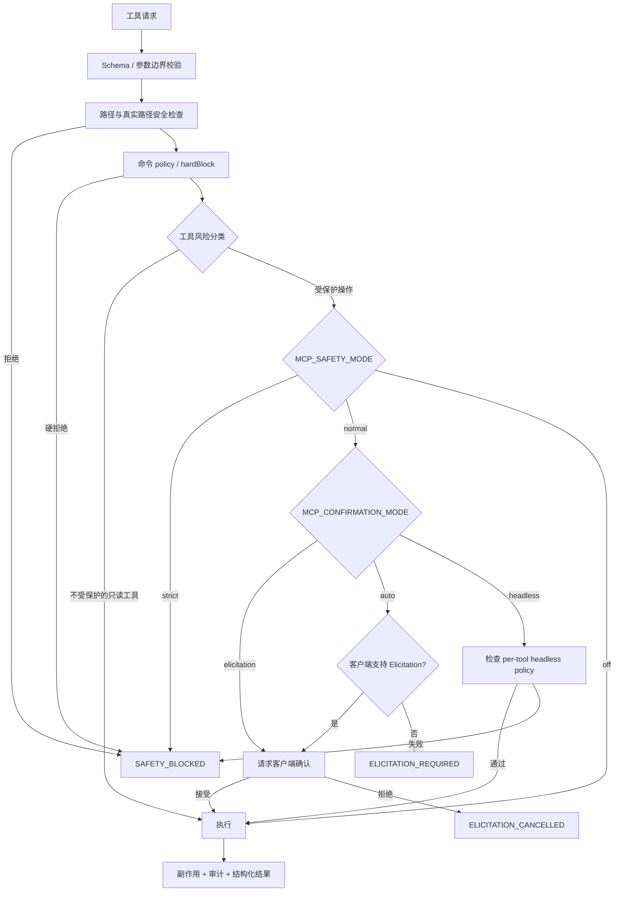

# Harness Headless Safety Design

> 状态：`draft`。本稿只定义方案，不授权源码实现；用户 review 通过后再抽取 checklist，进入 implement 阶段。

## 0. Requirement Summary

### User goal

让 Enhanced Terminal MCP 同时服务于两类客户端：支持 MCP `Elicitation` 的桌面客户端，以及通常没有交互确认接口的 AI harness。harness 不应因为服务端等待或调用 UI 确认而无法完成一个已经由宿主授权的本地工作区操作。

### Core behavior

- 保留 `MCP_SAFETY_MODE=strict|normal|off` 的兼容语义；不把 `normal` 静默改成 `off`。
- 新增独立的确认通道配置 `MCP_CONFIRMATION_MODE=elicitation|headless|auto`，把安全强度和交互方式分开；未设置时等价于现有 `elicitation` 路径。
- 默认 `MCP_SAFETY_MODE=normal` 的桌面行为保持不变：当前受保护工具仍走 Elicitation；普通命令不在本 feature 中改变默认 normal 语义。
- `headless` 不是关闭安全检查：路径穿越、敏感路径、系统路径、命令策略、关键进程保护和 `hardBlock` 继续生效。
- headless 下只提供 workspace 删除操作：`delete_preview` 和 `delete_path`；目标必须受人类或宿主在启动时设置的 `MCP_ALLOWED_ROOTS` 限制，Agent 不能通过工具参数扩大范围。写入、移动、archive、网络、任意 shell 和进程操作不在本 feature 的 headless surface 内，默认拒绝并另立 feature。
- `auto` 只在客户端支持 Elicitation 时弹出确认；不支持时返回结构化 `ELICITATION_REQUIRED`，不得自动降级为无确认执行。
- 只有实际收到用户拒绝或取消时才返回 `ELICITATION_CANCELLED`；客户端没有该能力时不得伪装成“用户取消”。
- 所有 headless deletion 先通过只读 preview，再由一次性 confirmation id 绑定目标、递归标志和预览快照，降低误删与重试漂移风险；单文件和递归目录不分叉。
- 命令工具的默认 normal 行为保持不变；headless 任意 shell 不在本 feature 中开放，避免把 cwd allowlist 误当成 shell sandbox。

### Success criteria

1. 支持 Elicitation 的桌面客户端在 `MCP_SAFETY_MODE=normal` 下行为不变，危险操作仍要求交互确认。
2. 没有 Elicitation 的 harness 在显式配置 `MCP_CONFIRMATION_MODE=headless` 和有效 `MCP_ALLOWED_ROOTS` 后，可以完成允许根目录内的文件/目录删除，不等待 stdin 或 UI；其他 mutator 不在本 feature surface 内。
3. headless 对允许根目录外、系统目录、敏感目录和路径穿越仍返回结构化安全拒绝，不执行副作用。
4. 没有确认能力且未启用 headless 时，服务返回 `ELICITATION_REQUIRED`；实际用户拒绝时才返回 `ELICITATION_CANCELLED`。
5. 递归删除 preview 的路径、类型、数量、大小和过期信息可被 harness 解析；提交不匹配或过期的 confirmation id 不执行删除。
6. 默认 normal 的 `execute_command`、`batch_execute`、`watch_command` 行为保持兼容；headless command 不在本 feature 的允许 surface 内。
7. headless 删除配置、确认来源、拒绝原因和删除结果进入审计记录，但不把 secret 原文写入 audit。
8. 现有 MCP 工具 schema、发布入口和非安全相关行为保持兼容；未配置新环境变量时保持旧桌面默认路径。

### Explicitly out of scope

- 不删除、削弱或重写 `security.ts` 的系统路径、敏感路径、路径穿越和 hardBlock 硬边界。
- 不把 `MCP_SAFETY_MODE=off` 变成新的默认值，也不把 off 作为 harness 的隐式降级方案。
- 不声称用命令黑名单实现形式化 shell 沙箱；任意 shell 的最终隔离仍需要 OS / 宿主 sandbox。
- 不在本 feature 中让 headless 自动放行 `kill_process`；进程授权需要单独的 process allowlist feature。
- 不在本 feature 中开放 headless `write_file`、`copy_move`、archive、`execute_command`、`batch_execute`、`watch_command`、`download_file` 或 `kill_process`；这些分别另立 mutator、command/argv、network authorization 和 process allowlist feature。
- 不在本 feature 中完成所有写操作的通用 diff preview；第一阶段只对递归删除定义完整 preview/commit 契约。
- 不为每个 MCP 客户端实现 UI 适配器；桌面 UI 仍由客户端负责，服务端只使用 MCP 能力协商和结构化结果。
- 不修改与本功能无关的运行时、输出分页、shell resolver、依赖管理或临时资源策略。

## 1. Decisions and Constraints

### 1.1 Current evidence and conflict boundary

当前 `safeguard` 设计将使用场景定义为个人本地开发，选择 MCP Elicitation 作为确认方式，并规定不支持 Elicitation 的客户端拒绝执行。当前实现进一步把 `delete_path`、写入/移动/归档、进程操作和三个命令工具放进统一的 Elicitation 工具集合；因此没有交互确认能力的 harness 在 `normal` 下会被系统性阻塞。

本 feature 不否定旧设计的桌面客户端路径，而是补充一个显式的 harness 路径：

| 现有决策 | 本 feature 的处理 |
|---|---|
| `strict` 对受保护操作直接拒绝 | 保留 |
| `normal` 默认通过 Elicitation 确认 | 未配置新变量时完全保留；普通命令不在本 feature 中改成免确认 |
| 不支持 Elicitation 时拒绝 | 保留为 `auto/elicitation` 的 fail-closed 结果，但改用 `ELICITATION_REQUIRED` |
| `off` 跳过 SafeGuard、硬底线仍在 | 保留兼容性，不作为 headless 设计入口 |
| headless 探针使用 `off` | 迁移到显式 `headless` profile；旧探针在本 feature 验收前不主动改写 |
| blocklist 命中危险命令 | 现有 command policy 在 spawn 前直接拒绝，不进入 Elicitation；本 feature 不改变该顺序 |

相关现状输入：`src/safeguard.ts` 的保护工具集合与确认分支、`src/tools/manage.ts` 的删除前置检查、`src/result.ts` 已存在的 `ELICITATION_REQUIRED` / `ELICITATION_CANCELLED` 错误码，以及旧 `safeguard` design 和架构 ADR-5。

### 1.2 Complexity dimensions

- Robustness: **L3**。安全模式、客户端能力、allowlist、preview 状态和错误码必须 fail-closed，不能依赖文本提示让 Agent 猜下一步。
- Structure: **跨层编排扩展**。安全底线、确认决策、工具 handler 和能力资源需要保持职责分离；不借 feature 顺手重划 source 模块。
- Performance: **reasonable**。普通只读工具不应因为等待 UI 阻塞；preview 只统计目标范围，confirmation id 使用短期状态。
- Readability: **public**。配置、错误、能力状态和 preview 必须能被人和 harness 直接理解。
- Evolvability: **stable**。旧 `MCP_SAFETY_MODE` 继续有效，新确认通道可在未来扩展为其他宿主授权来源。
- Testability: **tested**。至少需要无 Elicitation harness、桌面 Elicitation、headless allowlist、拒绝、过期 token 和 hardBlock 的可观察证据。
- Determinism: **reproducible**。headless 许可来自启动环境，不来自 Agent 在单次请求中提交的 `confirm: true`。
- Compatibility: **backward-compatible**。未配置 `MCP_CONFIRMATION_MODE` 时不改变当前桌面默认行为。
- Idempotency: **idempotent**。preview 可重复；confirmation id 单次使用；删除已不存在的目标仍遵守现有错误契约。

### 1.3 Proposed choices

| Decision | Proposed choice | Rejected alternative and reason |
|---|---|---|
| 确认通道 | 新增 `MCP_CONFIRMATION_MODE`，默认兼容 `elicitation`，显式支持 `headless` | 继续把 `MCP_SAFETY_MODE` 同时当作风险等级和 UI 开关，概念混杂 |
| headless 授权来源 | 启动时的人类/宿主配置 + `MCP_ALLOWED_ROOTS` | 从 Agent 请求参数读取 `confirm: true`，这只是自我声明，不是授权 |
| allowlist 语义 | 使用平台路径分隔符解析多个绝对根；规范化后做边界匹配 | 仅做字符串前缀匹配，会把 `project-a` 错当成 `project-ab` 的子路径 |
| headless 配置 | 只新增必填的 `MCP_ALLOWED_ROOTS`；headless surface 固定为 `delete_preview` / `delete_path` | 用一个 headless 开关同时放行文件、网络、shell 和进程操作 |
| 无 Elicitation 结果 | `ELICITATION_REQUIRED`，携带 mode/capability/suggestion 结构化 detail | 返回 `Operation cancelled by user`，会把能力缺失误报为用户拒绝 |
| 实际用户拒绝 | `ELICITATION_CANCELLED` | 与能力缺失共用 `SAFETY_BLOCKED`，无法路由恢复动作 |
| 递归删除 | 新增只读 `delete_preview` + 一次性 confirmation id；headless 只允许删除 | 让 `delete_path` 接受裸 `confirm: true`，或顺手开放其他 mutator |
| 其他 mutator | headless 第一阶段一律拒绝 `write_file`、`copy_move`、archive、download、command 和 process | 用 workspace 根目录一次性授权所有副作用 |
| 能力发现 | health/capability 结果报告 safety、confirmation、allowlist 摘要 | 让 harness 先试一次破坏性工具再从错误中猜配置 |

### 1.4 Trust boundary

配置来源按信任方向划分：

```text
人类 / 宿主启动配置
  -> safety mode / confirmation mode / allowed roots / command policy
  -> 服务端建立不可由 Agent 扩大的执行边界

Agent 工具参数
  -> 只能选择边界内的目标和动作
  -> 必须经过统一 schema、路径、policy 和状态校验
```

`MCP_ALLOWED_ROOTS` 只允许由启动环境或受信配置注入；工具参数不能写入、追加或覆盖它。headless 模式缺少有效 allowlist 时，所有文件系统写入/删除默认拒绝。

headless profile 的配置契约如下：

```text
MCP_CONFIRMATION_MODE=headless
MCP_ALLOWED_ROOTS=<path.delimiter 分隔的绝对路径列表>
```

`MCP_ALLOWED_ROOTS` 使用运行平台的 `path.delimiter`（Windows 为 `;`，Unix 为 `:`），启动时解析为绝对、规范化根目录；任一根不存在、不是目录、包含空项或自身/祖先是 reparse point 时，headless server fail-closed。allowlist 根是授权边界而不是可删除目标；target 必须是某个根的严格后代，target 等于根本身或位于所有根之外时拒绝。headless 本 feature 只检查 `delete_preview` / `delete_path` 的 target path、目标父路径和递归树；其他 path mutator 不属于本 feature 的 headless surface。

`auto` 的能力来源是 MCP initialize 阶段的 client capability；明确声明不支持、能力缺失，或 SDK 无法读取该能力时均按“不支持”处理。显式 `elicitation` 模式可以调用 Elicitation，但调用返回 unsupported/method-not-found 时映射为 `ELICITATION_REQUIRED`；只有客户端返回拒绝/取消才映射为 `ELICITATION_CANCELLED`。

## 2. Name Layer and Orchestration Layer

### 2.1 Name layer: current -> change

**Current**

- `MCP_SAFETY_MODE` 同时表达 strict/normal/off 风险策略和是否走 Elicitation。
- `normal` 下受保护工具统一调用确认；客户端没有 Elicitation 时产生拒绝。
- `ELICITATION_REQUIRED` 与 `ELICITATION_CANCELLED` 已存在于错误码表，但当前工具层常把 SafeGuard 返回值包装为 `SAFETY_BLOCKED`。
- `delete_path` 直接接收目标路径和 `recursive`，没有只读的删除计划/快照契约。

**Change**

新增以下稳定概念：

```typescript
type ConfirmationMode = "elicitation" | "headless" | "auto";

type SafetyDecision =
  | { status: "allow"; source: "policy" | "elicitation" | "headless" }
  | { status: "required"; reason: "elicitation"; clientSupportsElicitation: boolean }
  | { status: "declined"; source: "elicitation" }
  | { status: "blocked"; reason: "strict" | "path" | "policy" | "hard_block" };
```

确认模式解析规则固定为：环境变量未设置时为 `elicitation`；`strict` 在确认模式之前生效；`off` 只跳过 SafeGuard，不跳过 `security.ts` 和 command policy；`headless` 只有在 `MCP_CONFIRMATION_MODE=headless` 且 headless 配置通过时才生效；`auto` 不得隐式切换为 headless。

错误码语义保持机读、互斥：

```text
ELICITATION_REQUIRED  = 需要确认，但当前客户端/模式无法提供确认
ELICITATION_CANCELLED = 客户端实际返回拒绝或取消
SAFETY_BLOCKED        = strict、path、policy 或 hardBlock 阻断
VALIDATION_ERROR      = preview 过期、preview 参数不匹配或 preview 统计预算耗尽
```

统一映射契约：

```text
SafetyDecision.required -> ELICITATION_REQUIRED, retryable=false
SafetyDecision.declined -> ELICITATION_CANCELLED, retryable=false
SafetyDecision.blocked  -> SAFETY_BLOCKED, retryable=false
stale/used preview      -> VALIDATION_ERROR, retryable=true, suggestion=delete_preview
```

新增的 headless 配置摘要不返回完整敏感环境值，只返回规范化根目录是否存在、根数量和确认模式。路径详情仅在已有审计边界允许时返回。

本 feature 产生的 capability 结果以及由本 feature 决策的 ToolResult success/error envelope，都在现有 `meta` 对象中追加 `safety_protocol_version: 2`；不重写其他工具的既有 meta 字段。旧客户端无法识别该字段时按已有 generic ToolResult/error 处理，不因版本值单独拒绝；新客户端根据该字段解析 `ELICITATION_REQUIRED`、`ELICITATION_CANCELLED` 和 preview detail。

### 2.2 Orchestration layer: current -> change



headless 下的文件操作额外经过：

```text
规范化目标路径
  -> 与 MCP_ALLOWED_ROOTS 做真实边界匹配
  -> 递归删除先读取 preview 状态
  -> confirmation id 绑定目标和快照
  -> 再执行 fs 操作
```

`auto` 只负责选择交互方式，不负责授权升级；没有 Elicitation 时只能返回 `ELICITATION_REQUIRED`。只有启动配置明确指定 `headless`，才允许走 headless 分支。

受保护工具的 headless 矩阵固定如下：

| 工具/操作 | headless 默认 | 放行条件 |
|---|---|---|
| `delete_path` | 允许 | 所有目标必须是 `MCP_ALLOWED_ROOTS` 的严格后代，不能等于授权根；每次删除都必须有未过期、单次使用且快照未变化的 preview id；非空目录还必须 `recursive=true`；目标、父路径和目标树含 reparse point 时拒绝 |
| `write_file` | 拒绝 | 本 feature 不提供 headless 写入授权，另立 mutator feature |
| `copy_move` | 拒绝 | 本 feature 不提供 headless 移动/复制授权，另立 mutator feature |
| `compress_archive` / `extract_archive` | 拒绝 | 本 feature 不提供 headless archive 授权，另立 mutator feature |
| `download_file` | 拒绝 | 本 feature 不提供 headless 网络授权，另立 network authorization feature |
| `kill_process` | 拒绝 | 本 feature 不提供 headless 进程授权，另立 process allowlist feature |
| `execute_command` / `batch_execute` / `watch_command` | 拒绝 | 本 feature 不提供 headless 任意 shell；另立 command/argv feature |

该矩阵优先于“工具是否位于 `ELICITATION_TOOLS` 集合”的旧实现细节；普通 normal 桌面路径仍按现有集合走 Elicitation。

headless delete 统一遵守以下 reparse 规则：target、目标父路径或递归树任一为 symlink、junction 或其他 reparse point，直接返回 `SAFETY_BLOCKED`；不得只检查字符串路径或只检查最终文件。写入、移动、archive 等其他 path mutator 不因这条规则获得 headless 授权。

普通命令工具继续遵守现有 command policy 顺序；本 feature 不改变 command precheck，也不把命令纳入 headless 删除授权：

```text
hardBlock 命中          -> 直接拒绝，不创建子进程
blocklist 危险模式      -> 现有 policy 直接拒绝，不进入 Elicitation
allow policy 不在白名单 -> 直接拒绝，不创建子进程
通过 policy 的命令      -> 继续按旧 normal/off 语义处理
```

本 feature 不把 `blocklist` 命中的危险模式改成可确认执行，也不提供 headless command bypass；如果未来需要“受限 argv 命令”或“危险命令先 preview、再人工确认”，另立 command/argv feature。这样与当前 `checkCommandPolicy()` 的 precheck 顺序保持一致。

递归删除 preview 的生命周期和输出契约固定为：

```json
{
  "path": "E:\\workspace\\.task-temp\\old-run",
  "type": "directory",
  "recursive": true,
  "file_count": 120,
  "directory_count": 8,
  "total_bytes": 269808011,
  "snapshot": {
    "algorithm": "sha256-lstat-v1",
    "entry_count": 128,
    "digest": "<hex>"
  },
  "preview_id": "<opaque-id>",
  "expires_at": "2026-08-23T12:00:00.000Z"
}
```

Schema 约束：`type` 只能是 `file` 或 `directory`；`expires_at` 使用 UTC ISO-8601；`preview_id` 是不透明字符串，客户端不得解析其内部结构。

提交递归删除时，`delete_path` 的输入扩展为：

```json
{
  "target_path": "E:\\workspace\\.task-temp\\old-run",
  "recursive": true,
  "preview_id": "<opaque-id>"
}
```

headless 下单个文件、空目录和非空递归目录的删除都必须携带 preview id；非空目录仍必须 `recursive=true`。`preview_id` 绑定完整删除范围，不改变现有 `target_path` / `recursive` 参数语义。

1. `delete_preview` 接受目标路径和 `recursive`；单文件/空目录可用 `recursive=false`，非空目录必须 `recursive=true`；执行 `lstat` 统计且不跟随 symlink/junction，目标树中发现 reparse point 直接返回 `SAFETY_BLOCKED`。
2. `sha256-lstat-v1` 的输入是按 UTF-8 字节序、使用 `/` 分隔符的相对路径排序的条目序列；每条序列化为无空格 canonical JSON 数组 `[relative_path, type, size_decimal_string, mtime_ns_decimal_string, is_reparse]`，条目之间用单个 `\n` 拼接后计算 SHA-256，小写 hex 输出；文件内容不读入 digest。实现使用 bigint `lstat` 获取 `size` / `mtimeNs`，避免平台精度差异。单次 preview 最多统计 `100000` 个条目，超过或在 `30s` 内无法完成时返回 `VALIDATION_ERROR`，不生成 id。
3. preview id 只在当前 server 进程内保存 `5min`，单次提交后原子消费；server 重启、id 过期、重复使用或跨进程提交都视为无效。preview 只提供操作绑定，不提供授权。
4. `delete_path` 提交时在同一 server 进程的 mutator mutex 内重新执行同一范围的 `lstat` 摘要比较；路径、类型、大小、mtime 或 reparse 状态任一变化，都返回 `VALIDATION_ERROR`，detail 使用 `reason=preview_stale`，suggestion 为重新调用 `delete_preview`。
5. mutex 不宣称跨进程 OS 级原子删除；同一 allowlist workspace 在多个 server 进程之间并发 headless delete 属于明确不支持的运行边界，headless harness 必须在启动前保证 workspace 独占或提供外部 OS sandbox/锁。server 不把进程内 mutex 宣称为跨进程授权证明。

### 2.3 Feature mount points

按“删除该项后 feature 是否消失”收紧为四个挂载点：

1. **确认决策层**：统一处理 mode、Elicitation 能力、headless policy 和错误语义。
2. **headless 边界层**：解析和校验启动时的 allowed roots，阻止 Agent 自行扩大授权。
3. **递归删除计划层**：提供 preview、快照绑定和一次性 confirmation id。
4. **能力与审计层**：让 harness 发现当前确认能力、授权模式和可恢复错误，并记录实际授权来源。

### 2.4 Delivery strategy

1. **契约骨架**：先定义确认模式、错误码语义、allowlist 边界和 capability 摘要。退出信号：旧桌面模式和新 headless 模式的状态转移无歧义。
2. **决策层接入**：将 SafeGuard 从返回裸字符串改为结构化 `SafetyDecision`，保留旧工具错误 envelope 的兼容映射。退出信号：未支持 Elicitation、实际取消、strict/path/policy 阻断能被区分。
3. **headless 边界**：加入受信根目录解析和操作前检查。退出信号：根内允许、根外拒绝、敏感/系统路径在所有 mode 下拒绝。
4. **删除 preview**：加入递归目录统计、过期和单次使用的 confirmation id。退出信号：preview 不产生副作用，参数或快照不匹配时删除不发生。
5. **workspace-delete 边界**：把 target、父路径、递归树 reparse 和 mutator mutex 规则接入 workspace-delete surface。退出信号：根内允许、根外/reparse/竞态变化拒绝，且不把该 surface 误当成 shell sandbox。
6. **能力、审计和回归**：报告确认模式/能力并记录授权来源。退出信号：桌面、无 Elicitation harness、workspace-delete headless、错误恢复路径均有可观察证据。

### 2.5 Structural health and micro-refactor

本 feature 不做前置微重构。`safeguard.ts`、`result.ts` 和工具 handler 已有明确职责；虽然 `command.ts` 较大，但把命令风险分类、SafeGuard 决策和输出编排拆开会涉及调用关系和错误语义变化，超出“只搬不改行为”的微重构边界。

若实现阶段发现必须拆分 `command.ts` 才能保持职责清晰，应另立 `cs-refactor`，不把结构重划偷偷并入本 feature。

## 3. Acceptance Contract

每条都采用“输入/触发 → 可观察结果”格式，覆盖正常、边界和错误路径。

1. 未设置 `MCP_CONFIRMATION_MODE` 的桌面客户端调用普通受保护操作 -> 行为仍等价于当前 `MCP_SAFETY_MODE=normal`，支持 Elicitation 时弹出确认。
2. `MCP_CONFIRMATION_MODE=elicitation` 且客户端没有 Elicitation -> 操作不执行，返回 `ELICITATION_REQUIRED`，detail 明确 `clientSupportsElicitation=false` 和恢复建议。
3. `MCP_CONFIRMATION_MODE=elicitation` 且客户端明确拒绝 -> 操作不执行，返回 `ELICITATION_CANCELLED`；不返回“客户端不支持”。
4. `MCP_CONFIRMATION_MODE=auto` 且客户端没有 Elicitation -> 操作不执行，返回 `ELICITATION_REQUIRED`；不会自动切换 headless。
5. `MCP_CONFIRMATION_MODE=headless` 但 `MCP_ALLOWED_ROOTS` 缺失、为空、包含空项、相对路径或无效目录 -> server 在接受请求前 fail-closed，返回 `VALIDATION_ERROR` 和可定位的配置错误。
6. headless 删除 allowlist 内的单个文件 -> 先取得匹配的 preview id，再通过路径、allowlist、policy 和 hardBlock 检查后删除成功，审计记录 `authorization_source=headless`。
7. headless 删除 allowlist 外的文件或目录，或目标等于 allowlist 根 -> 返回 `SAFETY_BLOCKED`，不调用实际删除；相邻前缀目录不能被误认为子目录。
8. 任意 mode 删除系统目录、敏感目录、敏感文件或路径穿越目标 -> 返回 `SAFETY_BLOCKED`，包括 `off` 和 headless。
9. 对单文件、空目录和非空目录执行 `delete_preview` -> 分别验证 `recursive=false/true` 规则，并返回规范化路径、类型、递归标志、文件数、目录数、总字节数、快照、过期时间和 preview id，不产生文件系统副作用。
10. 使用正确 preview id 和完全匹配的 `target_path` / `recursive` 提交递归删除 -> 在 mode 和 allowlist 都允许时执行一次；重复使用 id、id 过期或参数不匹配时不执行。
11. headless 下 preview 后任一条目路径、类型、大小、mtime 或 reparse 状态变化 -> 返回 `VALIDATION_ERROR`、`detail.reason=preview_stale`，不删除并建议重新 preview；不得静默扩大或缩小原确认范围。
12. 默认 normal 桌面客户端调用普通 `execute_command` / `batch_execute` / `watch_command` -> 保持现有 Elicitation 行为，不因本 feature 改变默认模式。
13. headless `delete_path` 的 target、目标父路径或递归树是 reparse point，或规范化后不在 allowlist 内 -> 返回 `SAFETY_BLOCKED`，不产生删除副作用；allowlist 根自身/祖先是 reparse point 时 headless server 不能接受请求。
14. headless 新建目标的最近已存在父目录不在 allowlist 内 -> 返回 `SAFETY_BLOCKED`，不创建父目录或目标。
15. `delete_preview` -> `structuredContent` 与设计中的 JSON schema 字段一致；digest 使用 `sha256-lstat-v1`，preview id、过期时间和计数可被 harness 解析。
16. `delete_preview` 统计超过 `100000` 条目或 `30s` -> 返回 `VALIDATION_ERROR`，不生成 preview id，不产生删除副作用。
17. preview 校验与 `fs` 删除在同一 server 进程的 mutator mutex 内执行；重启前或其他 server 进程创建的 id 不被接受；跨进程并发 headless delete 由 harness/OS 独占边界负责。
18. `batch_execute` 中一个命令被 policy 拒绝 -> 遵守现有整批预检契约，不出现未经授权的部分执行。
19. `auto` 模式读取 MCP initialize 的 client capability；能力缺失、声明不支持或探测调用返回 unsupported -> 返回 `ELICITATION_REQUIRED`，不自动切换 headless。
20. capability/health 查询 -> 返回以下结构化摘要，不泄露完整 secret 环境值或未授权的完整根路径；所有 feature-owned success/error envelope 的 `meta.safety_protocol_version` 均为 `2`：

```json
{
  "safety_protocol_version": 2,
  "safety_mode": "normal",
  "confirmation_mode": "headless",
  "elicitation_supported": false,
  "allowed_roots": { "configured": true, "count": 1 },
  "headless_surface": "workspace-delete"
}
```

21. `MCP_AUDIT_MODE=all` 时执行成功、拒绝、取消和配置错误 -> 审计能区分 `authorization_source`、`decision` 和 `error_code`；secret 原文不进入 audit。
22. 重启 server 后 headless 配置不变 -> 状态目录、确认模式和 allowlist 解析结果一致；所有重启前 preview id 失效；修改配置后按现有 shell/state 进程缓存规则重启生效。
23. unset 新增环境变量并回到现有桌面 profile -> 旧 `normal` / Elicitation 兼容路径恢复；不需要保留 headless 状态。
24. headless 调用 `write_file`、`copy_move`、archive、`execute_command`、`batch_execute`、`watch_command`、`download_file` 或 `kill_process` -> 返回 `SAFETY_BLOCKED`，不执行副作用，也不因这些工具生成或接受 workspace-delete preview id。

### Explicitly rejected acceptance outcomes

- 通过把默认模式改成 `off` 来让 harness 测试变绿。
- 只检查 `target_path.StartsWith(allowedRoot)` 而不做规范化后的分隔符边界判断。
- 在错误文本中写“user cancelled”，但实际没有发生客户端确认调用。
- Agent 在单次工具请求中提交 `confirm: true` 就获得超出启动配置的权限。
- headless 下因为关闭 Elicitation 而跳过 `security.ts`、command policy 或 hardBlock。
- 仅凭 `pnpm test` / 单元测试通过就宣布 MCP 客户端兼容；必须有真实无 Elicitation harness 的协议级证据。

## 4. Migration, Compatibility and Rollback Boundary

### Migration

- 第一阶段只增加确认模式、workspace allowlist、错误语义、workspace-delete 边界和删除 preview；不改变旧环境变量的默认值。
- 桌面客户端继续使用 `MCP_SAFETY_MODE=normal` + Elicitation。
- harness 启动 profile 显式设置 `MCP_CONFIRMATION_MODE=headless` 与 `MCP_ALLOWED_ROOTS`；不能依赖 `MCP_SAFETY_MODE=off` 作为长期集成约定。
- 现有 headless/CI 探针在本 feature 完成前可以继续使用 `off`，但 acceptance 应新增 workspace-delete headless profile 证据，并把 off 只保留为兼容/调试路径。
- 新错误码优先复用已存在的 `ELICITATION_REQUIRED`、`ELICITATION_CANCELLED`；`SAFETY_BLOCKED` 收紧为安全/策略阻断，避免扩大错误码面。这个错误语义修正是有意的可观察变化，混合版本客户端必须同时识别旧 `SAFETY_BLOCKED` 和新 Elicitation 错误码。
- acceptance 收尾必须把新确认模式、headless allowlist、逐工具矩阵和错误语义回写到架构/用户配置文档；design 阶段不提前改现状架构条目。

### Compatibility

- 未设置 `MCP_CONFIRMATION_MODE` 时，现有客户端观察到的默认 `normal` 行为不变。
- 现有工具名称和成功结果字段保持不变；新增 preview/capability 只扩展工具面和结构化 detail。
- 默认 normal 的执行/拒绝边界保持不变；无 Elicitation 时将旧的泛化 `SAFETY_BLOCKED` 修正为已有的 `ELICITATION_REQUIRED`，这是本 feature 唯一明确的错误语义迁移，响应 `meta` 必须带安全协议版本，文档要求消费者兼容两种错误码。
- 现有 `off` 的 hardBlock、系统路径和敏感路径边界继续有效；本 feature 不把 off 重新定义成强沙箱。
- 审计增加字段时保持旧字段可读；消费者不能依赖完整路径以外的 secret 环境值。

### Rollback

移除本 feature 时：

1. 删除 headless confirmation 配置和 allowlist 解析入口。
2. 删除 preview/confirmation id 的新增 surface。
3. 恢复 SafeGuard 的旧错误映射和 Elicitation 入口。
4. 保留 `security.ts` 硬边界、hardBlock、现有审计和旧 `MCP_SAFETY_MODE` 配置。

回滚不删除用户状态目录、不清理 allowlist 指向的工作区、不修改 MCP 客户端配置；旧桌面 profile 应可直接继续运行。

## 5. Locked Decisions Before Checklist

为避免 implement 阶段再次自行解释，本稿把审核中出现的两个分歧锁定如下：

1. headless profile 强制要求至少一个有效 `MCP_ALLOWED_ROOTS`；本 feature 不提供无根目录的 delete profile，`kill_process` 仍一律拒绝。
2. headless surface 只包含 workspace-delete；`write_file`、`copy_move`、archive、`execute_command` / `batch_execute` / `watch_command`、`download_file` 和 `kill_process` 在本 feature 中一律拒绝，分别另立 mutator、command/argv、network authorization 和 process allowlist feature。
3. `delete_path` 的 target、目标父路径和递归树都拒绝 reparse point；preview 提交在 mutator mutex 内重新校验快照；跨进程并发由 headless harness/OS 独占前提负责。
4. preview token 只在当前 server 进程内有效，存活 `5min`，单次原子消费；重启、过期、重复使用、跨进程使用和快照变化均不执行删除。

本文件通过 review 后，才从第 2.4 节抽取 `{slug}-checklist.yaml`；在此之前不改 `src/**`、不改 `ARCHITECTURE.md` 的现状条目、不更新 roadmap 状态，也不生成 acceptance 文档。
