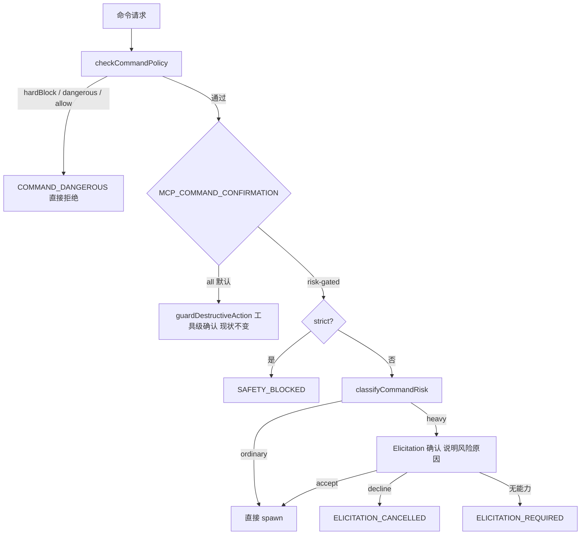

# command-risk-gated-confirmation 设计

> **2026-08-28 修订（范围扩展，已定稿）**：本 feature 合并实施两件事——(1) 整体拆除 headless surface 机制；(2) 命令分级确认。原草案"明确不做 #1（headless surface 不变）"约束废除。合并拍板与官方依据见 `codestable/compound/2026-08-28-decision-confirmation-model.md`；拦截实证见 `codestable/compound/2026-08-28-explore-safe-block-diagnosis.md`。

## 0. 术语约定

| 术语 | 定义 | 防冲突结论 |
|---|---|---|
| risk-gated | 新增命令确认模式名（`MCP_COMMAND_CONFIRMATION=risk-gated`）：普通命令免确认、重命令按风险分级确认 | 源码无 `risk` 命名冲突；不使用 `tiered`（与 secret scan 的 "tiers" 区分） |
| CommandRiskLevel | 命令风险分级：`ordinary`（免确认）/ `heavy`（确认）。灾难级不进分级，由既有 hardBlock 承载 | 不新增第三级，避免与 hardBlock 语义重叠 |
| headless 拆除 | 整体移除 headless surface 机制：`MCP_CONFIRMATION_MODE` 环境变量（含 `auto` 值）、`MCP_ALLOWED_ROOTS`、`delete_preview` 工具、`src/headless-policy.ts`、`src/workspace-delete.ts` 及全部引用 | 官方 MCP Roots 已于 2026-07-28 版废弃（SEP-2577："informational guidance rather than an access-control mechanism"）；安全最佳实践将文件系统限制归于宿主沙箱职责；危险操作走 Elicitation 逐次确认；scope minimization 明确反对一刀切高摩擦笼子 |
| 批量规模 | `batch_execute` 的命令条数。阈值 5：≤5 免确认，>5 申请 | 与现有 batch 并发上限（4）是两个概念，不改并发实现 |
| 说明原因 | heavy 确认消息必须携带被判 heavy 的具体原因（命中哪条规则） | 对应"及时制止并向用户说明原因寻求权限" |

## 1. 决策与约束

### 需求摘要

**做什么**：

1. **拆除 headless surface**——目录笼子机制与官方 MCP 设计哲学冲突（Roots 已废弃、文件系统限制属宿主职责），且与交互场景根本冲突：误配即全工具面锁死（实证：`off+headless` 下 `echo safe-block-probe` 被 `headless_surface` 拦截，未 spawn，见 explore-safe-block-diagnosis）。
2. **命令分级确认**——三个命令工具加"命令分级"决策闸：低风险命令直接执行不打扰；批量 >5、破坏类残余、性能类、长 watch 在执行前经 Elicitation 向用户说明原因并请求权限；灾难级维持 hardBlock 不可关闭硬拦。

**为谁**：个人/本机 AI agent（Kimi Code 这类）通过 MCP 使用本 server。现状 normal 全确认太吵、off 全放太裸、headless 是删除专用笼子——缺"按命令风险分级"这一档。

**成功标准**：

1. 默认配置（不设新变量）行为与现状完全一致：normal 全确认、off 全放（hardBlock/blocklist 除外）、strict 全拒。
2. `risk-gated` 下：ordinary 命令零确认直接执行；heavy 命令必然经过一次可观察确认请求，消息包含风险原因；`off+risk-gated` 组合下 heavy 仍确认（见 A12）。
3. hardBlock 命中在**任何**模式/组合下直接被拒，不降级为弹窗。
4. headless 代码/环境变量/工具**零残留**；用户旧配置中的残留值变为惰性死配置（不再解析，不告警不报错）。
5. 工具数 28→27（`ENHANCED_TERMINAL_DISABLE_FILE_INFO=1` 时 26）。
6. 版本 3.1.0→4.0.0（破坏性，CHANGELOG 记录迁移说明）。

**明确不做**：

1. **不改 `HARD_BLOCK_PATTERNS` 清单与其"不可关闭、直接拒绝"语义**（DEC-001）。灾难级命令不弹窗。
2. **不改 `DANGEROUS_PATTERNS`**——heavy 破坏类只覆盖 `checkCommandPolicy` 放行后的**残余破坏面**。注意分界：`Remove-Item -Recurse -Force <盘符绝对路径>` 被 blocklist 直接拒（`security.ts:275-287`）、到不了 heavy；`rm -rf D:\...`（非根）与两者的相对路径写法可到 heavy。语料必须含三种措辞对照钉住分界（P1）。
3. 不改变非命令工具（`delete_path`/`write_file`/`copy_move`/archive/`download_file`/`kill_process`）的既有确认行为（仅删除其 headless 排除分支）。
4. 不新增错误码——复用 `ELICITATION_REQUIRED` / `ELICITATION_CANCELLED` / `SAFETY_BLOCKED`；错误码表零新增零删除。
5. 不做运行时资源监控——"大性能"用命令特征与结构化参数判定；资源监控另立 feature。
6. 单设 `MCP_SAFETY_MODE` 时 strict/normal/off 三档语义不变；`risk-gated` 与 `off` 的组合行为见交互矩阵（组合新增行为，非修改既有单变量语义）。
7. 不把 risk-gated 设为默认（D1=B 属安全核心默认变更，需另立决定）。
8. 不做任何形式的目录/工作区授权——官方 Roots 路线已废弃，不重新引入。

### 复杂度档位

| 维度 | 档位 | 偏离原因 |
|---|---|---|
| 安全性 | hardened | 安全核心变更（safeguard 决策逻辑删改 + 新增分级闸）；威胁模型含恶意提示词诱导 agent 发起重命令、用户误点确认 |
| 健壮性 | L3 | 命令文本、环境变量均是外部输入 |
| 兼容性 | breaking（4.0.0） | 删公开工具 `delete_preview`、删两个环境变量、`delete_path` schema 移除 `preview_id`、`health://status` 移除 `confirmation_mode`/`headless_surface` 字段、safety-info prompt 文案同步；默认 all 行为零变化 |
| 可演进性 | stable | `MCP_COMMAND_CONFIRMATION` 契约长期有效；heavy 规则表是唯一易变面（受语料治理约束） |

### 关键决策（已定稿，原"待拍板"项全部落定）

**D1 配置形态 = A**：新增 `MCP_COMMAND_CONFIRMATION=all|risk-gated`，默认 `all`（= 现状）。理由：不动任何现有用户确认行为，风险面最小。

**D2 灾难级处置 = A**：hardBlock 命中=直接拒绝、不弹窗（DEC-001 不动）。"极度危险"中可救级别（项目内递归删除等）由 heavy 确认层覆盖。

**D3 批量阈值 = 5**（用户指定）：`batch_execute` 条数 >5 判 heavy 整批一次确认；≤5 且无 heavy 条目整批免确认。与 parallel 并发无关。

**D4 heavy 覆盖面（定稿）**：必含 batch>5、破坏类残余规则、性能类词表（`install`/`ci`/coverage/全量测试等，以验收语料为准）；**加** `watch_command` 的 `duration` 参数（毫秒，schema 缺省 5000）有效值 >60000 判 heavy——结构化入参确定性判定，不走文本启发。

**D5 headless 处置 = 整体拆除**：`MCP_CONFIRMATION_MODE` 整个移除——`auto` 与 `elicitation` 在 `decideDestructiveAction` 中行为逐分支相同（均最终 elicit/required），headless 移除后无存在价值；`MCP_ALLOWED_ROOTS` 失去全部读者；`delete_preview` 工具删除；`delete_path` 回归纯 Elicitation 保护（security.ts 硬底线不变；headless 专属的 reparse 专项拒绝随模块消失，交互场景由确认兜底，官方模型允许）。cda0ac7 引入的"非 allow 决策写 `safety.decision` 审计"**保留**（官方对齐的可观测性），仅去掉 detail 的 `confirmation_mode` 字段。

**P1-P3 设计约束（评审修订，纳入范围）**：

- **P1 残余面边界**：heavy 破坏类只覆盖 policy 放行后的命令；验收语料含"相对路径 / 非根绝对路径 / 盘符绝对路径"三种措辞对照，钉住策略层与分级层分界。
- **P2 off 组合**：risk-gated 下命令工具的分级判定先于 off 分支——ordinary 放行、heavy 仍确认（off 只豁免 ordinary）；init 检测 `off+risk-gated` 组合并打日志（沿用原 headless+off 告警的位置与风格）。
- **P3 词表治理**：风险词按 token 语义匹配（整串分词，防子串误伤）；run-script 命令（`pnpm/npm/yarn run X`）检查脚本名 X 而非首 token `pnpm`；验收语料作为 fixtures 入库并被单测消费，词表/阈值改动必须过语料（对齐 roadmap "禁止开放式补正则"纪律）。

**前置依赖**：无（Elicitation/audit/policy 通道均复用）。**前置提交**：state-dir 懒创建改动先按 scoped-commit 规则提交（README/ARCHITECTURE 文档与本 feature 重叠）。

### 官方对齐审计（MCP 现行版 2026-07-28 规范，2026-08-28 查证）

| 规范要求 / 动向 | 本 server 现状 | 结论 |
|---|---|---|
| 人在回环 SHOULD：工具调用应有用户可拒绝的确认 | normal 模式 Elicitation 确认 + 本 feature risk-gated 分级 | **本 feature 即主落地** |
| Roots 废弃（SEP-2577），目录限制归宿主 | 拆除 `MCP_ALLOWED_ROOTS`/headless surface | **本 feature 落地** |
| Logging 工具废弃（stderr / OpenTelemetry 替代） | logger 仅写 stderr，未声明 logging 能力 | 天然合规，零改动 |
| Sampling 废弃 | 从未使用 | 合规，零改动 |
| 工具 annotations（readonly/destructive/idempotent hints） | 28/28 工具全覆盖 | 合规，零改动 |
| outputSchema + structuredContent + 执行错误 `isError` 可自纠错 | 统一 ToolResult 协议 + withErrorSchema + 20 错误码带 suggestion | 合规，零改动 |
| 服务器 MUST：输入校验 / 限流 / 输出净化 | security.ts 硬底线 + ratelimit + secret scan | 合规，零改动 |
| 无会话状态 → 显式句柄（不透明、有界 TTL） | paging `cache_id`、temp staging 租约均带 TTL | 合规，零改动 |
| 工具列表确定性排序、无 listChanged 需求 | 静态注册，顺序确定 | 合规，零改动 |
| 新 wire 模型：`_meta` 逐请求版本、`server/discover`、`resultType: input_required`（MRTR 确认重试）、experimental Tasks | SDK 1.29.0 pinned；未采用 | **暂缓**（见 §2.5），生态就绪后另立 feature |

> 审计结论：协议机制层本 server 已与现行规范对齐，唯一结构性偏差就是确认模型（本 feature 修复）；2026-07-28 的新 wire 模型依赖客户端生态（Kimi Code 等仍为握手时代客户端），不纳入本轮。

## 2. 名词与编排

### 2.1 名词层

#### 现状（拆除前）

- `SafetyMode = "strict" | "normal" | "off"`、`ConfirmationMode = "elicitation" | "headless" | "auto"` — `src/safeguard.ts:10-11`
- 决策序 strict → headless → off → normal — `src/safeguard.ts:180-199`
- `ELICITATION_TOOLS` 含三个命令工具，normal 下全部走工具级确认 — `src/safeguard.ts:34`
- `guardDestructiveAction` / `evaluateDestructiveAction` — `src/safeguard.ts:155,248`
- `checkCommandPolicy` → `COMMAND_DANGEROUS` — `src/command-policy.ts:106-128`
- 错误码 `ELICITATION_REQUIRED` / `ELICITATION_CANCELLED` / `SAFETY_BLOCKED` — `src/result.ts:27-29`
- 审计 `safety.decision`（detail 无命令原文）— `src/safeguard.ts:161-178`

#### 变化

**删除清单（headless 拆除）**：

| 文件 | 删除内容 |
|---|---|
| `src/headless-policy.ts` | 整个模块（153 行） |
| `src/workspace-delete.ts` | 整个模块（314 行） |
| `src/index.ts:19,52-53` | `initHeadlessPolicy` import 与启动调用 |
| `src/safeguard.ts` | `ConfirmationMode` 类型、`_confirmationMode` 状态、`MCP_CONFIRMATION_MODE` 解析、`getConfirmationMode`、`isHeadlessWorkspaceDeleteTool`、`isHeadlessExcludedTool`、决策序 headless 分支、headless+off 启动告警 |
| `src/tools/manage.ts` | `delete_preview` 注册/schema/handler（≈L206-258）、`delete_path` 的 `preview_id` 参数与 headless 分支（≈L272-310）、`workspaceDeleteFailure`、`authorization_source: "headless"` 审计分支、audit detail 的 `confirmation_mode` |
| `src/tools/files.ts:40-56,199-201,436-438` | `headlessSurfaceBlock` 及 write_file / make_directory 两个调用点 |
| `src/tools/utility.ts:457,463,522,524` | health 与安全信息输出的 `confirmation_mode`、`headless_surface` 字段 |

**新增**：

- 环境变量 `MCP_COMMAND_CONFIRMATION`：`all`（默认，现状）| `risk-gated`。解析失败回退 `all` 并 `logger.warn`（对齐 `MCP_SAFETY_MODE` 解析风格 `src/safeguard.ts:108-114`）。
- 类型 `CommandRiskLevel = "ordinary" | "heavy"`；`CommandRisk = { level, category, reason }`（`category` ∈ batch/performance/destructive/watch；`reason` 是给用户看的说明文本）。
- 纯函数 `classifyCommandRisk(command, context): CommandRisk`：输入命令文本 + 上下文（batch 条数、工具名、watch 时长），输出分级与原因；无共享状态；规则表独立成数据（词表+阈值），不散在 if/else。
- 新模块 `src/command-risk.ts` 承载以上（属实现清单，非挂载点）。

**变化**：risk-gated 下命令工具跳过工具级 `guardDestructiveAction`，改走新决策入口 **`guardCommandByRisk(toolName, command, context)`**（safeguard.ts 内新增；实现返回结构化 `{ decision: SafetyDecision; risk: CommandRisk }` 以便调用方精确映射 `ELICITATION_REQUIRED`/`ELICITATION_CANCELLED`，替代草案的 string 风格；内部 classify → ordinary 放行 / heavy 走 `elicitInput` 注入风险原因，复用 `src/safeguard.ts:214-228` 通道），heavy 拒绝由调用方（command.ts `commandSafetyGate`）按既有 decision 映射为 `ELICITATION_CANCELLED` / `ELICITATION_REQUIRED`，错误体附风险原因。

**不变**：`checkCommandPolicy` / hardBlock / 错误码表 / 非 allow 决策审计。

接口示例：

```
// 输入 → 输出（正常路径）
classifyCommandRisk("echo hello", { tool: "execute_command" })
  → { level: "ordinary" }
classifyCommandRisk("rm -rf ./node_modules/.cache", { tool: "execute_command" })
  → { level: "heavy", category: "destructive", reason: "递归删除路径 ./node_modules/.cache（项目内破坏操作）" }
classifyCommandRisk("echo a", { tool: "batch_execute", batchSize: 6 })
  → { level: "heavy", category: "batch", reason: "批量执行 6 条命令，超过 5 条批量上限" }
classifyCommandRisk("pnpm install", { tool: "execute_command" })
  → { level: "heavy", category: "performance", reason: "命中性能类命令词 install" }
classifyCommandRisk("tail -f app.log", { tool: "watch_command", durationMs: 120000 })
  → { level: "heavy", category: "watch", reason: "监控时长 120s 超过 60s 阈值" }

// run-script token 语义（P3）：检查脚本名，不误伤首 token
classifyCommandRisk("pnpm run build", ...) → ordinary（build 未入词表）
classifyCommandRisk("pnpm run ci", ...)   → heavy（脚本名 ci 命中性词表）

// P1 分界对照（三种措辞）
"rm -rf ./x"                       → policy 放行 → heavy（destructive）
"rm -rf D:\\proj\\x"（非根）        → policy 放行 → heavy（destructive）
"Remove-Item -Recurse -Force D:\\x" → policy 直接拒（COMMAND_DANGEROUS），不进分级

// env 解析
parseCommandConfirmationMode(undefined) → "all"   // 默认兼容
parseCommandConfirmationMode("risk-gated") → "risk-gated"
parseCommandConfirmationMode("什么") → "all"       // 非法值回退 + logger.warn
```

### 2.2 编排层



**决策序定稿**：strict →（risk-gated：classify → ordinary 放行 / heavy 确认）→ off → normal。risk-gated 分支**先于** off（P2：off 只豁免 ordinary）。非命令工具决策序：strict → off → normal（headless 层消失）。

#### 现状

三个命令工具的固定管线（`src/tools/command.ts`）：`precheckCommand`（policy）→ rateLimit → limits → `guardDestructiveAction`（工具级一刀切）→ spawn。拓扑：线性 pipeline。

#### 变化

1. risk-gated 下，命令工具跳过工具级 `guardDestructiveAction`，改为 `classifyCommandRisk` → ordinary 直接放行 / heavy 走带风险原因的 Elicitation。
2. `batch_execute`：先逐条 policy 预检（现状保留），再按**总条数与逐条分类**分级——>5 条或任一条 heavy 则整批一次确认（消息含条数与逐条风险摘要）；≤5 且全部 ordinary 整批免确认。
3. `watch_command`：结构化时长 >60s 判 heavy（D4）；其余同 execute。
4. strict 优先于分级；`off+risk-gated` 时 ordinary 放行、heavy 仍确认（P2，init 打组合日志）。

#### 跨层纪律

- **错误语义**：全部复用现有错误码；无新码、无新失败路径。heavy 被拒/无能力时与现有工具级确认返回同一错误体，仅 message 增加风险原因。
- **幂等性**：`classifyCommandRisk` 纯函数，同输入同输出；确认流程无状态变更。
- **并发/顺序**：单条命令按 分类→确认→spawn 顺序；batch 先分类后确认，确认通过前不 spawn 任何一条（沿用"整批预检、任一失败不部分执行"纪律 `src/tools/command.ts:427-433`）。
- **可观测点**：heavy 决策（accept/decline/required）走既有 `safety.decision` 审计，detail 增加 `risk_level` / `risk_category`（不写命令原文，与现状一致）；ordinary 放行不额外审计（噪声）；policy 硬拦走既有 `safety.block`。
- **健壮性**：规则表正则避免灾难性回溯（线性模式优先、无嵌套量词）；分类输入超长时 fail-safe 判 heavy（交用户过目）并记 debug 日志，宁可多确认不崩溃。
- **扩展点**：heavy 判定规则表是唯一易变面，独立成数据；改动必须过入库语料（P3 治理）。

### 2.3 挂载点清单

**删除**：`src/index.ts:19,52-53`（initHeadlessPolicy）；`src/safeguard.ts` headless 分支与 `MCP_CONFIRMATION_MODE` 解析；`src/tools/manage.ts` delete_preview/preview_id；`src/tools/files.ts:199-201,436-438`；`src/tools/utility.ts:457,463,522,524`。

**修改**：`src/tools/command.ts:318/432/615`（三工具确认调用点）；`src/safeguard.ts` 决策序与 `safety.decision` detail。

**新增**：`MCP_COMMAND_CONFIRMATION` 解析入口（随 `src/command-risk.ts`）；`guardCommandByRisk` 分级决策入口（位于 `src/safeguard.ts`）。

> 判据核对：删掉以上任一项，对应行为即不存在。`src/command-risk.ts`、规则表、内部 import 属实现清单，不算挂载点。

### 2.4 推进策略

对应 checklist S0-S6：

```
S0 headless 拆除：删两模块 + 五文件清理 → 旧 env 惰性、27 工具、默认 all 零变化
S1 command-risk 模块：解析 + 纯函数 + 规则表数据化 → 语料 fixtures 全部符合预期
S2 三工具接入：risk-gated 分支 + batch 整批一次确认 → all 模式零变化；ordinary 免确认/heavy 必确认
S3 决策闭环：heavy Elicitation 三态 + audit risk 字段 + strict/off 交互 → 三态可观察、审计正确
S4 测试同步：删 3 旧文件、改 2、新增语料单测与 e2e → 全量绿
S5 文档与版本：README/ARCHITECTURE/CHANGELOG/4.0.0 → 文档与实现一致
S6 验收沉淀：五门禁 + 实证 + acceptance + decision 回填 → 门禁全绿、YAML 校验过
```

### 2.5 结构健康度与微重构

##### 评估

- `src/tools/command.ts` — 681 行（>500 偏胖）；三个工具各自重复"precheck → rateLimit → limits → guard"四段；本次改动要在 3 个 handler 各插分级调用，改动密度中等。
- `src/safeguard.ts` — 拆除后约 220 行；职责更纯（纯三档 + 分级分支）。
- headless 拆除是净减法（-500 行左右），改善整体健康度。

##### 结论：不做微重构

同原论证：插入点语义独立、每处 3-5 行；抽"安全前戏管线"涉及三处行为一致重构，收益不抵本 feature 风险面扩大。

##### 超出范围的观察

- 命令工具"四段安全前戏"结构重复，未来可抽共用执行管线 → 建议后续走 `cs-refactor`，本 feature 不动。
- explore-safe-block-diagnosis 记录的正则文本级误拦（`echo iex` 命中 hardBlock、`npm run start-process` 命中 dangerous）属 security core 已知边界（DEC-001"已知边界"），本 feature 不动；如需治理另立 issue。
- **SDK 1.29.0 → 1.30.0 升级与 2026-07-28 新 wire 模型**（`_meta` 逐请求版本、`server/discover`、`resultType: input_required` 的 MRTR 确认重试、experimental Tasks 长任务）：SDK 1.30 已跟踪 draft，但客户端生态（Kimi Code 等）尚未跟进，且升级牵动 postinstall 补丁脚本（零依赖 `apply-mcp-sdk-patch.mjs` 需重验）；待主流客户端支持 MRTR 后另立 feature 评估，本 feature 的 Elicitation 继续走 SDK 既有 `elicitInput` 通道（2025-06-18 语义，向后兼容）。

## 3. 验收契约

### 关键场景清单

| # | 输入 / 触发 | 期望可观察结果 |
|---|---|---|
| A1 | 未设置 `MCP_COMMAND_CONFIRMATION`（默认 all），`execute_command` 任意命令 | 行为与现状完全一致（normal 仍工具级确认 / off 放行） |
| A2 | `risk-gated` + normal，`echo hello` / `git status` / `node -v` | 免确认直接执行，无 elicitInput 调用 |
| A3 | `risk-gated`，`pnpm run build`（未命中 heavy 规则） | 免确认直接执行 |
| A4 | `risk-gated`，`batch_execute` 5 条普通命令 | 整批免确认执行 |
| A5 | `risk-gated`，`batch_execute` 6 条命令 | 整批一次确认，消息含批量条数与风险原因；拒绝则整批不执行（`ELICITATION_CANCELLED`），无部分执行 |
| A6 | `risk-gated`，`rm -rf ./node_modules/.cache` | heavy 确认，消息说明破坏原因 |
| A7 | 任意模式/组合，`rm -rf /` 等 hardBlock 命中 | 直接 `COMMAND_DANGEROUS` 拒绝，不出现确认请求 |
| A8 | `risk-gated`，`watch_command` 结构化时长 >60s | heavy 确认（category=watch） |
| A9 | `risk-gated` + 客户端无 Elicitation 能力，heavy 命令 | 返回 `ELICITATION_REQUIRED`，不执行 |
| A10 | heavy 被拒 / 确认通过 | 拒绝 → `ELICITATION_CANCELLED`；确认 → 执行且审计 `safety.decision` 含 `risk_level`/`risk_category`、不含命令原文 |
| A11 | `risk-gated` + strict | 命令工具仍全拒（strict 优先），分级不生效 |
| A12 | `risk-gated` + off | 普通命令放行；heavy 命令仍确认（**组合新增行为**：risk-gated 分支先于 off，off 只豁免 ordinary；init 打组合日志） |
| A13 | 非法值 `MCP_COMMAND_CONFIRMATION=foo` | 回退 `all`，启动日志告警，行为同 A1 |
| A14 | `risk-gated` + off/normal + 任一非命令工具（如 `write_file`） | 行为与现状一致：off 放行 / normal 仍确认——risk-gated 仅作用于三个命令工具 |
| R1 | 旧配置残留：`MCP_CONFIRMATION_MODE=headless` + `MCP_ALLOWED_ROOTS=...` 启动 | 惰性：变量不再被解析，无拦截、无崩溃、无告警 |
| R2 | `tools/list` | 27 个工具（`FILE_INFO=0`）/ 26 个（`=1`）；`delete_preview` 不存在 |
| R3 | off + all | 与现状一致：hardBlock/blocklist 之外全放行 |
| R4 | `delete_path`（normal，确认后） | 正常删除；schema 无 `preview_id` 参数 |
| R5 | `risk-gated`，`Remove-Item -Recurse -Force D:\\x`（盘符绝对路径） | `COMMAND_DANGEROUS` 直接拒（policy 层），不进分级（P1 分界） |

### 明确不做的反向核对项

- src/ 下 grep 无 `headless` / `Headless` / `MCP_ALLOWED_ROOTS` / `MCP_CONFIRMATION_MODE` / `delete_preview` / `DeletePreview` / `workspace-delete` 残留。
- `HARD_BLOCK_PATTERNS`、`hardBlock` 函数体、`DANGEROUS_PATTERNS` 零 diff（DEC-001 + 明确不做 #2）。
- `src/result.ts` 错误码表零新增零删除。
- 非命令工具确认语义零改动（headless 排除分支删除除外）。
- 默认 all（未设新变量）确认行为与基线测试一致（e2e/单元无回归）。
- 代码中不应出现运行时资源测量（CPU/内存采样）逻辑。
- 验收语料作为 fixtures 入库并被单测消费（P3 治理）。

## 4. 与项目级架构文档的关系

- **名词**：`CommandRiskLevel` / `MCP_COMMAND_CONFIRMATION` → `ARCHITECTURE.md` 术语与环境变量节；`MCP_CONFIRMATION_MODE` / `MCP_ALLOWED_ROOTS` / `delete_preview` 从 README/ARCHITECTURE 各节移除。
- **动词骨架**：决策序 strict → 分级 → off → normal → `ARCHITECTURE.md` §3.1 与 ADR-5 相邻条目；headless surface ADR 标记 superseded；新增 risk-gated ADR 行。
- **跨层纪律**：risk-gated 与 off/strict 交互矩阵 → `ARCHITECTURE.md` 已知约束节；README 环境变量表增（MCP_COMMAND_CONFIRMATION）删（两旧变量）行；推荐配置写入用户文档；`AGENTS.md` 关键技术事实的安全双层行（现仅 `MCP_SAFETY_MODE`）补 `MCP_COMMAND_CONFIRMATION`（安全核心行为变化需同步 AI 协作口径）。
- 关联架构 doc：`ARCHITECTURE.md`（ADR-5 安全双层、ADR-16 命令 policy）；不新建子系统 doc。
- 决定沉淀：`codestable/compound/2026-08-28-decision-confirmation-model.md`（supersedes 2026-08-23-harness-headless-safety 与 2026-08-23-headless-surface-enforcement-gaps 的 headless 相关结论）。
- 需求回写：新能力首次出现，`requirement` 留空，由 acceptance 阶段触发 `cs-req` backfill。
