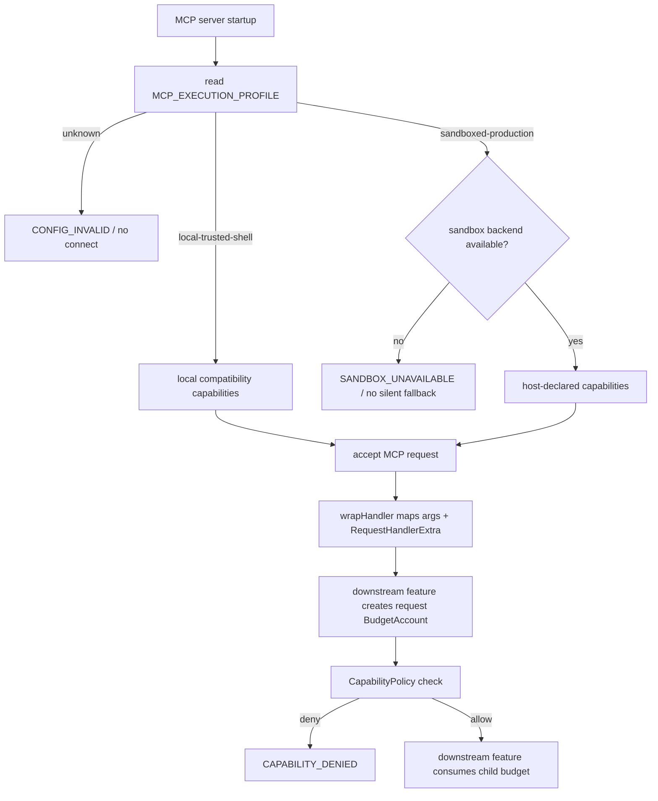

# hardening-contract-and-profiles 设计

> 本 feature 从 `production-hardening` roadmap 的第一条起头。用户已通过“继续推进”明确要求进入实现推进；本设计只落地共享契约和 profile fail-closed 基础，不提前实现 process tree、路径 no-follow、秘密扫描、SSRF 或归档逻辑。

## 0. 术语约定

| 术语 | 定义 | 防冲突结论 |
|---|---|---|
| `RequestContext` | MCP SDK handler 的可信请求上下文，包含 runtime 生成的 request id、transport scope、启动时固定的 profile 和 cancellation signal | 不从 tool arguments 读取 request id、tenant、profile 或 signal；不与 `src/context.ts` 的 prompt context 混用 |
| `ExecutionProfile` | server 启动时选择的执行边界：`local-trusted-shell` 或 `sandboxed-production` | 不替代 `MCP_SAFETY_MODE`；前者描述执行隔离能力，后者描述安全确认策略 |
| `Capability` | 工具能够申请的主机能力，如 shell、argv、主机进程查看、环境变量读取、网络出口和文件写入 | 不是认证角色，也不是 MCP client 自报的权限；由宿主启动配置提供 |
| `CapabilityPolicy` | 根据 profile 和宿主已声明能力判断某个请求是否可以使用某项能力 | 不把 blacklist/regex 当 OS sandbox；不承担未来的用户认证和多租户模型 |
| `BudgetAccount` | 具备父子 scope 的资源账本，统一扣减输入、输出、磁盘、队列、进程和响应预算，并共享截止时间/取消信号 | 不与现有 `src/ratelimit.ts` 的 token bucket 混用；限流解决请求频率，预算解决单次及父子工作量 |
| `InputBudget` | 公开 MCP 输入的字段级字符、byte、count、depth 和响应上限 | 所有 byte 上限按实际编码后的字节计算，不把 JavaScript code unit 当作文件 byte |
| `strict config integer` | 完整匹配十进制整数且满足 finite safe integer、最小值和最大值的配置值 | 不使用 `parseInt` 的前缀容忍；非法配置不能生成无限或不可控上限 |
| `HardeningConfigError` / `ProfileError` | 配置或 profile 启动校验失败时携带稳定 `code`/`param` 的内部错误对象 | 只用于 fail-closed 边界，不把原始配置、命令或宿主秘密写入错误 detail |
| `SANDBOX_UNAVAILABLE` | 请求的 `sandboxed-production` backend/宿主能力不可用时的 fail-closed 错误 | 不允许自动降级到 `local-trusted-shell` |

## 1. 决策与约束

### 需求摘要

**做什么**：把生产硬化 roadmap 中跨 feature 共享的名词和边界先固定下来，提供可以被 command、process、path、secret、network、audit 和 gate feature 直接消费的 TypeScript 契约；同时把执行 profile 的选择和不可用行为接入 server 启动入口。

**为谁**：维护 Enhanced Terminal MCP 的开发者、后续 feature 实现者和发布审核者。目标是每个后续 feature 不再重新发明“什么是一个请求、谁负责取消、资源预算怎么扣、sandbox 不可用怎么办”的答案。

**成功标准**：

1. `RequestContext` 能从 MCP handler 的 `extra` 映射出 runtime `requestId`、`sessionId/scope` 和 `AbortSignal`，调用者无法通过 arguments 伪造这些值。
2. 未设置 `MCP_EXECUTION_PROFILE` 时保持 `local-trusted-shell` 兼容行为；未知 profile 在 server 连接前以 `CONFIG_INVALID` fail-closed。
3. 当前尚未实现 sandbox backend，因此选择 `sandboxed-production` 时在连接前返回 `SANDBOX_UNAVAILABLE`，绝不静默回退到完整 shell；后续 execution backend feature 可以通过明确的 availability 注入解除该状态。
4. 共享 Zod helper 拒绝 `NaN`、`Infinity`、负数、非整数、超范围数值、超长字符串和超数量数组；配置整数拒绝 `100evil`、科学计数法、溢出和负值。
5. `BudgetAccount` 的 parent/child scope 共享剩余预算、截止时间和取消信号；重复 close、零额 reserve 和子账本创建具有确定语义。
6. `CapabilityPolicy` 的 sandbox 默认 deny 主机 shell、主机进程查看、完整环境变量读取和网络出口；没有宿主隔离证明不能宣称 production sandbox 可用。
7. 既有 20 个错误码保持字符串兼容，只增加 roadmap 已定义的未来错误码，不改变现有工具的 `isError` 语义。

**本 feature 覆盖**：

- `RequestContext`、`ExecutionProfile`、`Capability`、`CapabilityPolicy` 的共享类型和默认实现；
- strict finite/int/bounded schema helper；
- strict configuration integer parser 及兼容的 `envInt` 安全适配；
- `InputBudget`、`ExecutionLimits`、`BudgetAccount` 的父子预算基础；
- `MCP_EXECUTION_PROFILE` 启动解析与 sandbox unavailable fail-closed；
- 生产硬化相关错误码的兼容注册和针对性单测。

**明确不做**：

- 不在本 feature 中启动或实现 Windows Job Object、Unix process group、PID identity、process tree kill；由 `process-supervisor-and-cancellation` 和 `kill-process-identity` 实现。
- 不在本 feature 中改写所有工具的 schema、文件操作、网络访问、archive 解压或秘密扫描；本 feature 只提供 helper 和契约，具体接入由后续条目完成。
- 不在本 feature 中实现远程 HTTP transport、认证、多租户、计费或租户状态隔离；共享多租户服务另开 roadmap。
- 不改变既有 `MCP_SAFETY_MODE`、`MCP_COMMAND_POLICY`、`MCP_COMMAND_CONFIRMATION`、`hardBlock` 和危险命令语料语义。
- 不把应用层 `CapabilityPolicy` 或 `BudgetAccount` 描述为 OS sandbox；`sandboxed-production` 的真正隔离仍必须来自宿主 backend。
- 不新增运行时第三方依赖；继续使用现有 Zod v3 和 Node.js 标准库。

### 复杂度档位

| 维度 | 档位 | 偏离原因 |
|---|---|---|
| 健壮性 | L3 | 所有外部 MCP 输入和运行时配置都必须确定性拒绝或安全回退 |
| 结构 | modules | 契约、profile/capability、预算和 schema helper 是不同职责 |
| 性能 | budgeted | 预算要覆盖 bytes/count/deadline，reserve/child 不得产生不可控复制 |
| 可读性 | public | 类型是后续 feature 共同消费的公共契约 |
| 可演进性 | stable | 字段语义是 roadmap 后续 feature 的硬约束，必须向后兼容 |
| 安全性 | hardened | profile fail-closed、能力默认拒绝和预算绕过直接影响信任边界 |
| 可观测性 | instrumented | profile、capability denied、预算拒绝和配置错误要可观察且不含秘密 |
| 可测试性 | verified | 共享不变量必须有单测、边界表和 parent/child 验证 |
| 并发 | thread-safe | Node 单线程不等于 async 状态安全，账本不能出现负值 |
| 兼容性 | backward-compatible | 新 profile 未配置时不改变现有 local 行为 |
| 确定性 | deterministic | 同一配置/上下文/预算输入得到同一结果 |

### 关键决策

**D1 共享契约单独成模块**：新增独立 contract/profile 模块，`result.ts` 只补错误码，`utils.ts` 只保留兼容数字环境变量适配；不把新概念堆入万能 util。

**D2 profile 在启动时固定**：`MCP_EXECUTION_PROFILE` 只能在 server 启动阶段解析，不能由 tool arguments 或单次请求切换。默认 `local-trusted-shell`；`sandboxed-production` 无 backend 时 fail-closed。

**D3 capability 默认最小权限**：local profile 保持现有本机产品能力；sandbox profile 默认拒绝主机进程查看、完整环境、完整 shell 和网络出口，只有宿主声明的 capability 才能放行。

**D4 预算采用共享 parent ledger**：`BudgetAccount.child()` 在 parent ledger 上建立 scope view，不复制独立额度；batch、parallel、retry、capture 和响应序列化共享 parent 账本。

**D5 strict validation 与兼容适配分离**：对外 schema 使用 finite/int/length/byte helper；历史 `envInt` 的合法配置值保持兼容，非法值不得由 `parseInt` 前缀容忍。

**D6 错误码只增不改**：补入 roadmap 已批准的资源、取消、sandbox、SSRF、archive、状态、capability、PID identity、partial-result 和 config 错误码；既有错误码字符串、`isError` 和客户端可见字段保持兼容。

**D7 不提前实现后续行为**：本 feature 只提供契约、parser、budget 和 startup fail-closed；真实 OS backend、工具接入和资源策略由对应 roadmap item 实现。

### 前置依赖

roadmap 条目无前置依赖。实现前已读取 `AGENTS.md`、`ARCHITECTURE.md`、相关 requirements、生产就绪审计、command-output/state-dir/safety 决策和 roadmap 全文；未发现与当前 feature 冲突的 active decision。

## 2. 名词与编排

### 2.1 名词层

#### 现状

- MCP handler 当前由 `wrapHandler(toolName, fn(args))` 接收 arguments，未把 SDK `RequestHandlerExtra` 的 `requestId`、`sessionId` 和 `signal` 形成项目级契约，见 `src/wrap.ts`。
- 项目没有统一 `ExecutionProfile`、`Capability`、`InputBudget` 或 parent/child budget 类型；命令输出只有 `CommandOutputLimits`，作用域局限于输出留存。
- `src/result.ts` 已有 `ErrorCode`、`ToolResult` 和 `StructuredError`，但尚未注册生产硬化 roadmap 需要的新错误码。
- `src/utils.ts:10-15` 的 `envInt` 使用 `parseInt`，会接受数字前缀且没有统一最大值；各模块自行读取配置。
- `src/tools/*` 的 Zod 输入 schema 对部分字符串、数组和数字没有统一有限值/长度/数量约束。

#### 变化

新增项目级共享名词：

```ts
type ExecutionProfile = "local-trusted-shell" | "sandboxed-production";

interface RequestContext {
  requestId: string | number;
  scopeId: string;
  profile: ExecutionProfile;
  signal: AbortSignal;
  sessionId?: string;
  authInfo?: unknown;
}

type Capability =
  | "shell-execution" | "argv-execution" | "host-process-inspection"
  | "host-environment-read" | "network-egress" | "filesystem-write";

interface CapabilityDecision {
  allowed: boolean;
  code?: "CAPABILITY_DENIED" | "SANDBOX_UNAVAILABLE";
  reason?: string;
}

type BudgetKind = "input" | "output" | "disk" | "queue" | "process" | "response";

interface BudgetAccount {
  readonly scope: "request" | "batch" | "child" | "session";
  readonly deadlineAt: number;
  reserve(kind: BudgetKind, amount: number): boolean;
  remaining(kind: BudgetKind): number;
  child(scope: "batch" | "child"): BudgetAccount;
  readonly abortSignal: AbortSignal;
  close(): void;
}
```

数值和字符串 helper：

- `finiteNumber(min, max)`：拒绝 `NaN`、正负 `Infinity` 和范围外数值；
- `finiteInt(min, max)`：在 finite 基础上拒绝小数；
- `boundedString(maxChars, maxBytes)`：同时限制 Unicode code point 和 UTF-8 bytes；
- `boundedArray(item, maxItems)`：限制数量并限制单项；
- `parseStrictInteger(raw, options)`：完整十进制整数解析，拒绝前缀、科学计数法、溢出和负值；
- `readExecutionProfile(env)`：只接受两个 profile，未知值返回 `CONFIG_INVALID`；
- `initializeExecutionProfile(env, availability)` / `getActiveExecutionProfile()`：启动时校验并冻结进程级 profile，后续请求不得重新读取或切换；
- `assertProfileAvailable(profile, availability)`：sandbox backend 不可用时返回 `SANDBOX_UNAVAILABLE`，不回退。

`BudgetAccount` 只保存计数、deadline、closed 和取消状态，不保存 command、path、URL 或 env 内容。`CapabilityPolicy` 只消费启动时的 profile/host capability，不把调用方字符串当作授权材料。

### 2.2 编排层



#### 现状

当前启动流程是 `McpServer` 创建 → SafeGuard 初始化 → 工具/资源/prompt 注册 → temp/session 初始化 → `server.connect()`，见 `src/index.ts`。`wrapHandler` 负责 telemetry/cache，但没有统一 request context、profile 和预算账本。

#### 变化

1. server 启动最早阶段解析 profile，在注册/连接前完成合法性和 backend availability 检查。
2. wrapper 适配 MCP SDK `(args, extra)`，生成不可伪造的 `RequestContext`；业务 handler 不各自猜 `extra` 字段。
3. 后续执行 feature 按工具和 profile 的已配置 limits 创建 request-scope `BudgetAccount`；batch/child/retry 使用 parent ledger 派生 child view，取消和 deadline 由 parent 传播。本 feature 不在 `wrapHandler` 内猜测全局默认额度，也不自动创建没有调用方会消费的账本。
4. 后续 feature 通过 `CapabilityPolicy.check()` 做明确判定；拒绝返回 `CAPABILITY_DENIED`，profile 不可用返回 `SANDBOX_UNAVAILABLE`。
5. 下游 schema 接入同一套 finite/bounded 规则；本 feature 只提供基础，不改写全部工具 schema。

#### 跨层纪律

- profile 只在启动时读取一次；未知值不能静默按 local 处理。
- request id、scope、signal、host capability 不能由 MCP arguments 覆盖。
- reserve 对负数、NaN、Infinity 和非安全整数 fail-closed；child 不得重置 parent；close 幂等。
- parent abort 后所有 child signal 必须 aborted；预算耗尽映射 `RESOURCE_LIMIT`，取消映射 `CANCELLED`。
- 既有 `ErrorCode` 值和 `isError` 保持不变；新错误只扩展类型表。
- 只记录 profile、capability 名、预算类型、剩余额度和错误码，不记录原始 command/path/URL/env。
- 应用层 capability 和预算不能替代 OS sandbox；没有 availability 证据只能失败。

### 2.3 挂载点清单

1. `MCP_EXECUTION_PROFILE`：新增启动配置 key，默认 `local-trusted-shell`，支持值仅为两个 profile。
2. server startup profile gate：在 transport `connect` 前挂载 profile 解析和 availability fail-closed 检查。
3. shared contract exports：新增供后续 feature 导入的 context、profile/capability、strict schema helper 和 `BudgetAccount` 模块入口。
4. `ErrorCode`/structured error compatibility surface：新增 roadmap 批准的错误码常量，既有错误码字符串保持不变。
5. `wrapHandler` runtime context adapter：将 MCP `(args, extra)` 转为 `RequestContext`；原有只接收 `args` 的 handler 保持兼容。
6. `envInt` compatibility adapter：历史环境变量入口改用 strict integer parser，保留合法配置的既有读取路径。

本 feature 不新增 MCP tool、resource、prompt 或 transport；不改变现有业务工具的用户可见成功路径。

### 2.4 推进策略

1. **契约骨架**：建立 types、错误码和 profile/capability API → TypeScript 编译通过，所有术语有唯一导出。
2. **验证节点**：实现 finite/int/string/array/strict-config helper → 边界输入得到确定性拒绝或安全默认。
3. **预算节点**：实现 parent/child `BudgetAccount`、deadline、AbortSignal 和 close → 账本不出现负数或 child 越权。
4. **profile 节点**：实现 profile 解析、capability 默认矩阵和 sandbox availability gate → unknown/sandbox unavailable 在 connect 前 fail-closed。
5. **兼容接入**：补错误码集合和安全的 `envInt` 适配 → 旧合法配置和旧错误码行为保持兼容。
6. **验证收尾**：新增单元/属性式边界测试并运行质量门禁 → checklist 场景全部可观察。

### 2.5 结构健康度与微重构

##### 评估

- `src/result.ts`：约 370 行，职责集中在 ToolResult/错误码/协议转换；只增加错误码常量，不拆协议工厂。
- `src/index.ts`：约 108 行，职责是 server 启动编排；新增 profile gate 是自然延伸，不在其中实现 capability/预算细节。
- `src/utils.ts`：约 100 行，只保留兼容 `envInt` 适配，不堆新的 contract 类型。
- 新增 contract/profile 模块分别承载类型/校验/预算与 capability/profile 决策，不形成万能模块。

##### 结论：不做

本 feature 不做微重构。现有文件修改点少且职责清晰；如果后续 `wrapHandler`、`result.ts` 或 `index.ts` 因真实接入变胖，另走 `cs-refactor`。

## 3. 验收契约

### 关键场景清单

1. 未设置 `MCP_EXECUTION_PROFILE` → 解析为 `local-trusted-shell`，既有 server 可继续启动。
2. 设置两个合法 profile → 得到对应枚举值，不接受大小写变体或隐式别名。
3. 设置空白、未知或超长 profile → connect 前返回 `CONFIG_INVALID`，不连接、不降级。
4. 选择 `sandboxed-production` 且无 sandbox backend → 返回 `SANDBOX_UNAVAILABLE`，不得调用 local shell backend。
5. handler extra 含 `requestId`、`sessionId`、`signal` → context 正确映射，arguments 同名字段不能覆盖。
6. 传入 `NaN`、`Infinity`、`-Infinity`、小数、负数、零边界和超最大值 → 按 helper 契约确定性拒绝或接受明确允许的零值。
7. 传入 `100evil`、`1e3`、负值或超 `Number.MAX_SAFE_INTEGER` → 不被当成合法配置额度。
8. ASCII 与多字节 Unicode 在相同字符数下 → 以 UTF-8 byte 上限作最终判定。
9. 多个 child 竞争 parent 额度 → 共享账本，任何 child 不能越过 parent 剩余额度。
10. parent deadline 到期或 signal abort → child signal aborted，后续 reserve 返回 false/取消状态。
11. 重复 close、close 后 reserve、零额 reserve → 结果稳定且无负账本。
12. local capability 检查 → 按兼容矩阵允许，不读取 arguments 伪造能力。
13. sandbox capability 检查 → shell/host process/full env/network 默认 `CAPABILITY_DENIED`，宿主明确声明后只允许对应项。
14. 既有错误码字符串、ToolResult 和 MCP `isError` 转换保持兼容，新错误可构造。
15. 完成后不新增 tool/resource/prompt，不改变 command policy、SafeGuard 和 shell 实际执行行为。

### 明确不做的反向核对

- 本 feature 不实现 Job Object、pidfd、process group 或 HTTP client。
- 不从 tool arguments 接受 profile、principal、scope 或授权 token 作为可信来源。
- `sandboxed-production` 不得在 backend 不可用时自动变为 `local-trusted-shell`。
- 既有 `ErrorCode` 字符串、`MCP_SAFETY_MODE`、`MCP_COMMAND_POLICY`、`MCP_COMMAND_CONFIRMATION` 和 hardBlock 规则不被改写。
- 不新增运行时依赖或改变 npm package 文件清单。

## 4. 与项目级架构文档的关系

acceptance 阶段需要把以下稳定事实回写到 `codestable/architecture/ARCHITECTURE.md`：

- `RequestContext`、`ExecutionProfile`、`CapabilityPolicy` 和 `BudgetAccount` 的职责与边界；
- `MCP_EXECUTION_PROFILE` 默认值、合法值和 sandbox unavailable fail-closed 语义；
- strict input/config helper 约束，以及 parent/child budget 不能重置的跨 feature 纪律；
- 新错误码集合及其与既有 `ToolResult`/`isError` 的兼容关系。

本 feature 不新增用户故事 requirement：它是现有能力的生产边界基础，后续用户可见能力在对应 feature acceptance 时判断是否需要 `cs-req` 回写。`README.md`、`AGENTS.md` 和现状 architecture 的最终 profile/版本文字留到 `docs-and-architecture-closeout`，本 feature 不提前把计划写成现状。
