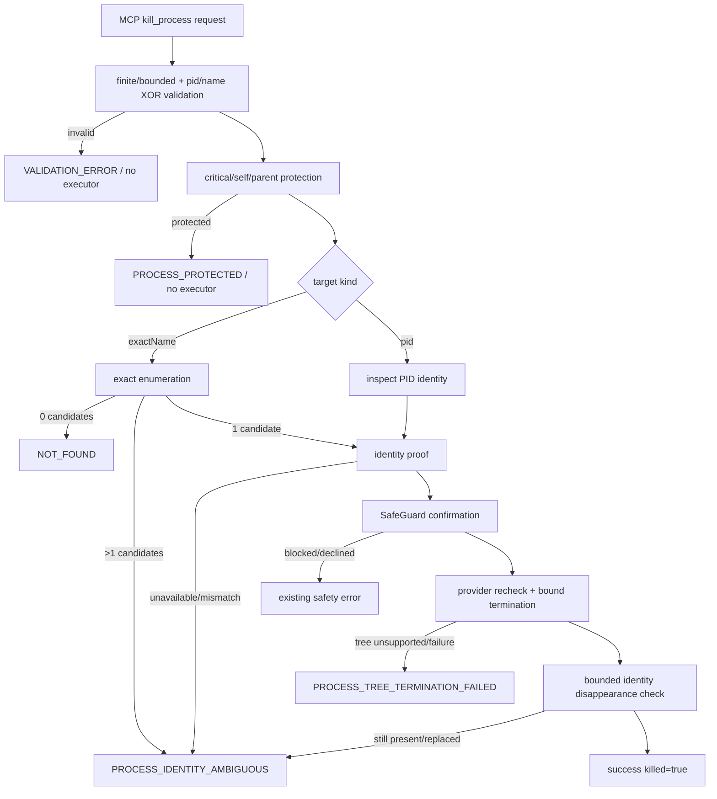

# kill-process-identity 设计

> 本 feature 从 `production-hardening` roadmap 的第 4 条起头。用户已明确要求继续执行并由代理代为完成审核；本设计按 roadmap 5.8 的共享契约直接进入实现。
>
> 本 feature 只修复“目标身份是否明确、终止凭据是否绑定”的高危边界；process registry、统一 cancellation、全量 child-process supervisor 和 shutdown drain 由 `process-supervisor-and-cancellation` 负责。

## 0. 术语约定

| 术语 | 定义 | 防冲突结论 |
|---|---|---|
| `KillTarget` | handler 校验后的单一终止目标：`pid` 或 `exactName` 二选一，附 `force` | 不接受调用方提供 `identityToken` 或 `expectedStartTime`；这些只能由 provider 现场取得 |
| `ProcessIdentity` | 平台探测得到的 PID、精确名称、启动时间、opaque identity token、进程组/树范围 | token 是终止前后比对凭据，不是用户权限或认证身份 |
| `ProcessIdentityProvider` | 负责精确枚举、PID identity probe 和绑定 identity 的平台终止适配器 | 不把 `taskkill /IM`、`pkill` 或未经 proof 的 `process.kill(pid)` 当作安全实现 |
| `ExactProcessName` | 无 wildcard、路径分隔符和控制字符的有界进程可执行名；Windows 忽略 `.exe` 后缀差异，Unix 保留平台大小写语义 | 不调用现有 `sanitizeProcessName` 做静默删字符；非法输入直接拒绝，避免 `foo*bar` 变成另一个目标 |
| `identity proof` | 终止前可重新取得并与原 token/start time 比对的 OS 进程身份材料 | 无法取得可靠 proof 时 fail-closed，不返回成功 |
| `tree termination` | `force=true` 时对已验证目标的 Windows process tree 或 Unix process group 执行终止 | 不等同于任意 name 批量 kill；进程组/Job 范围必须来自已验证目标 |
| `PROCESS_IDENTITY_AMBIGUOUS` | 目标不存在、多个候选、PID 被替换、启动时间/token 不一致或身份无法可靠读取时的安全错误 | 这些状态不能降级成“找不到所以继续杀”或成功 |

## 1. 决策与约束

### 需求摘要

**做什么**：修复 `kill_process` 当前允许的 wildcard/模糊名称、PID 与 name 同时传入、PID reuse race 和未经 identity proof 直接构造 kill command 的风险。

**为谁**：维护者、AI agent 和需要停止失控本机进程的用户。用户可以提供一个 PID，或一个精确进程名；系统必须在身份不唯一或不稳定时拒绝操作。

**成功标准**：

1. `pid` 与 `name` 必须二选一；缺失、同时提供、非 finite integer、越界 PID、空白/wildcard/路径型名称均在执行前返回 `VALIDATION_ERROR`。
2. name 路径先做精确枚举，候选数为 0 返回明确 `NOT_FOUND`，候选数大于 1 返回 `PROCESS_IDENTITY_AMBIGUOUS`，不得调用任何终止命令。
3. PID 路径和 name 唯一候选都必须先取得 `ProcessIdentity`；身份读取失败、启动时间/token 不可用或前后不一致时返回 `PROCESS_IDENTITY_AMBIGUOUS`。
4. 终止适配器在同一个平台调用边界内重新校验 identity，并把 proof 绑定到终止操作；禁止生成 Windows `/IM` 和 Unix `pkill` name 命令。
5. 关键系统进程、当前 MCP server、当前 server 的 parent 进程和已验证的保护范围均拒绝；既有 `isCriticalProcess` 和 SafeGuard 语义保持生效。
6. `force=false` 只处理已验证的单目标温和终止路径；`force=true` 才请求已验证目标的 tree/process-group termination。平台无法提供对应能力时返回 `PROCESS_TREE_TERMINATION_FAILED`，不假称已清理。
7. 终止返回成功前必须在有界等待内确认目标 identity 不再存在；仍存在、权限失败、identity 变更和终止异常都返回结构化失败。
8. 默认 provider 的平台解析、输入校验、重名/PID reuse/保护进程和 fake executor 都有回归测试；测试不触发真实危险进程终止。

**本 feature 覆盖**：

- `kill_process` 的严格输入和错误映射；
- `ProcessIdentity` / `ProcessIdentityProvider` 共享接口；
- Windows identity probe/handle-bound termination；
- Linux `/proc` start-time token 和 process group termination；
- macOS `ps` start-time probe 和 identity recheck；
- PID-only、无 wildcard 的兼容 `getKillSpec`；
- fake provider/executor 测试接缝和审计安全摘要。

**明确不做**：

- 不实现全局 process supervisor、active child registry、统一 timeout/cancellation 或 shutdown drain；归属 `process-supervisor-and-cancellation`。
- 不重写 `process_list` 的 partial-result、Unix filter 或 host disclosure；归属后续 system/search feature。
- 不修改 `DANGEROUS_PATTERNS`、`HARD_BLOCK_PATTERNS`、`hardBlock`、`MCP_SAFETY_MODE` 或命令 policy 规则表；只复用既有保护入口。
- 不允许 tool arguments 提供 `identityToken`、`expectedStartTime`、任意执行器路径或原始 shell 命令。
- 不新增运行时第三方依赖，不新增 MCP tool/resource/prompt，不改变其它工具成功路径。

### 复杂度档位

| 维度 | 档位 | 偏离原因 |
|---|---|---|
| 健壮性 | L3 | 终止是不可逆操作，所有输入、权限、身份变化和平台失败必须明确失败 |
| 结构 | modules | provider、平台解析、handler policy 和已有命令 spec 是不同职责 |
| 性能 | budgeted | 枚举、identity recheck 和退出确认必须受单次时间预算限制，不能无限扫描/等待 |
| 可读性 | public | identity token、精确名称和错误语义需要后续 feature 可读懂并复用 |
| 可演进性 | stable | provider interface 将被后续 supervisor/平台 backend 消费 |
| 可观测性 | logged | 只记录目标类别、PID、错误码和 proof 状态，不记录原始命令或敏感环境 |
| 可测试性 | verified | fake provider/executor 覆盖终止前不调用、identity mismatch 和平台 spec 不变量 |
| 安全性 | hardened | 针对 wildcard、PID reuse、重名和 process-tree 越权设计 |
| 并发 | deterministic | 终止前 identity recheck、单目标选择和成功确认必须有确定顺序 |
| 兼容性 | backward-compatible | tool 名称和 `force` 字段保留；name 不唯一时由原先隐式批量改为显式拒绝 |

### 关键决策

**D1 目标互斥且不静默优先**：`pid` 和 `name` 不能同时出现；旧的“同时提供时优先 pid”行为会隐藏调用错误，改为 `VALIDATION_ERROR`。

**D2 名称先精确枚举**：不再把 name 交给系统命令的 wildcard/name matching；唯一候选才能转成 identity，零候选和多候选都不调用终止。

**D3 proof 由 provider 取得并绑定**：用户不能提供 token/start time；provider 负责 probe、终止前 recheck 和平台调用，handler 只消费 identity 结果。

**D4 平台能力不足就失败**：Windows 不支持可靠 tree/handle 绑定或 Unix 无法取得 start-time proof 时返回结构化错误，不回退到 `/IM`、`pkill` 或裸 PID kill。

**D5 保护优先于 SafeGuard**：关键系统进程、当前 worker 和 parent 在 provider 调用前拒绝；既有 SafeGuard 仍负责 strict/normal/off 和确认通道。

**D6 成功必须可观察**：provider 只有在终止调用成功且有界确认目标不再存在时才返回成功；不能把 spawn/command exit 0 直接当作目标已消失。

**D7 只扩展既有错误面**：使用 `VALIDATION_ERROR`、`NOT_FOUND`、`PROCESS_PROTECTED`、`PROCESS_IDENTITY_AMBIGUOUS`、`PROCESS_TREE_TERMINATION_FAILED` 和 `EXECUTION_FAILED`，不改变既有错误码字符串。

### 前置依赖

`hardening-contract-and-profiles` 已完成并为 `done`，提供 `RequestContext`、strict finite/bounded helper、共享错误码和后续 capability/budget 语义。本 feature 不等待 process supervisor，因为身份安全可以先以 provider 层独立落地；完整 child 生命周期由后续 feature 接管。

## 2. 名词与编排

### 2.1 名词层

#### 现状

- `src/tools/system.ts` 的 `KillProcessInput` 中 `pid`、`name` 都是 optional；handler 没有拒绝两者同时存在或两者都缺失。
- `src/platform.ts:getKillSpec` 可以把 name 直接转为 Windows `/IM name` 或 Unix `pkill name`；`sanitizeProcessName` 只做删字符，不能证明目标唯一。
- `src/tools/system.ts` 只在输入 name/pid 上调用 `isCriticalProcess`，随后直接调用 `safeExecFile`，没有读取启动时间、identity token 或终止后的存活状态。
- 现有 `ErrorCode` 已包含 `PROCESS_PROTECTED`、`PROCESS_IDENTITY_AMBIGUOUS` 和 `PROCESS_TREE_TERMINATION_FAILED`，但 handler 尚未按 identity 失败分类使用。

#### 变化

新增共享 provider 契约（实际名称和字段以实现阶段为准，但语义固定）：

```ts
interface KillTarget {
  pid?: number;
  exactName?: string;
  force: boolean;
}

interface ProcessIdentity {
  pid: number;
  name: string;
  startedAt: number;
  token: string;
  ownedByCurrentWorker: boolean;
  processGroupId?: number;
}

interface ProcessIdentityProvider {
  findByExactName(name: string): Promise<ProcessIdentity[]>;
  inspectPid(pid: number): Promise<ProcessIdentity | ToolError>;
  terminate(identity: ProcessIdentity, force: boolean, tree: boolean): Promise<void | ToolError>;
}
```

handler 的公开行为：

```text
  { name: "worker.exe", force: true }
  → 唯一精确候选 + identity proof
  → provider 绑定 proof 执行 tree termination
  → 确认目标消失
  → { killed: true, pid, name, tree: true }

{ name: "worker*" }
  → VALIDATION_ERROR，不进入 provider

{ pid: 1234, name: "worker.exe" }
  → VALIDATION_ERROR，不按 pid 静默优先

{ pid: 1234 }
  → identity token 不匹配 / 无法取得
  → PROCESS_IDENTITY_AMBIGUOUS，不执行终止
```

平台 token 规则：

- Windows：基于进程对象的 start time/handle proof；PowerShell 脚本只使用固定代码和 positional args，不把用户输入插入脚本文本；不使用 `/IM`。
- Linux：读取 `/proc/{pid}/stat` 的 start-time token，终止前重新读取并校验；tree 路径使用已验证 process group，不调用 `pkill`。
- macOS：使用受限 `ps` probe 取得可重验的 start-time token；终止前重新 probe，无法稳定解析时 fail-closed。

### 2.2 编排层



#### 现状

当前流程是 `system.ts` schema → `isCriticalProcess` → `guardDestructiveAction` → `getKillSpec` → `safeExecFile`。名称路径没有唯一枚举，PID 路径没有 identity proof，`safeExecFile` 成功也不会确认目标进程已经消失。

#### 变化

1. handler 先做严格输入解析；不使用 `value || default`，不把非法名称静默消毒成另一个名称。
2. 关键进程、当前 worker PID、parent PID 和危险 process group 在执行器之前保护。
3. name 通过 provider 精确枚举，只有一个候选可继续；pid 通过 provider inspect。
4. SafeGuard 仍在实际终止前执行，strict/normal/off 语义不改变；确认描述只使用已校验的有限名称/PID 摘要。
5. provider 在平台边界内重新校验 token/start time，再执行单目标或已验证 tree/process-group termination。
6. provider 在有界窗口内确认 identity 不存在；失败返回结构化错误，不返回 `killed=true`。
7. `getKillSpec` 仅保留已验证 PID 的平台 spec 兼容能力；name 不再能生成 `/IM` 或 `pkill`。

#### 跨层纪律

- 输入验证、critical/self/parent protection 和 identity proof 必须发生在任何终止副作用之前。
- provider 返回的 token 不进入用户输入，也不进入普通日志/ToolResult detail；日志只记录 `target_kind`、PID、result code 和 proof 状态。
- name 多候选必须拒绝，不能自动选择第一个；PID/name 同时出现必须拒绝，不能沿用旧的 PID 优先。
- identity mismatch、权限失败、目标消失和 tree unsupported 分别保持可观察，不统一伪装成成功或普通 no-op。
- 终止命令只使用 argv/固定 PowerShell 脚本；禁止字符串拼接用户名称形成 shell command。
- `force=true` 的 tree 范围由 identity provider 计算；无法证明范围时返回 `PROCESS_TREE_TERMINATION_FAILED`。
- `ProcessIdentityProvider` 以依赖注入方式进入 system tool，fake provider 可以验证“失败时未调用 terminate”。

### 2.3 挂载点清单

1. `kill_process` input/handler boundary：将旧 optional pid/name 入口改为严格 XOR + identity-aware workflow。
2. `ProcessIdentityProvider` default implementation：新增平台 identity probe、精确枚举、绑定终止和成功确认入口。
3. `getKillSpec` compatibility surface：收敛为 verified PID-only spec，禁止 name 生成 `/IM`/`pkill`。
4. process identity test seam：`registerSystemTools` 接受可选 provider 依赖，fake executor/provider 不触发真实 kill。
5. identity error mapping：复用现有结构化错误码，区分 validation、not found、ambiguous、protected 和 tree termination failure。

本 feature 不新增 MCP tool/resource/prompt，不接管全局 child registry，不修改 SafeGuard 核心规则表。

### 2.4 推进策略

1. **契约和输入节点**：定义 `ProcessIdentity` / provider / strict target parser，补齐 XOR、wildcard、保护边界和错误映射的退出信号。
2. **平台 proof 节点**：实现 Windows、Linux、macOS 的 identity probe/精确枚举和 PID-only termination adapter；退出信号是无 `/IM`/`pkill` 的 provider path、可解析 token 和 fail-closed。
3. **handler 编排节点**：将 `kill_process` 接入 provider、SafeGuard、self/parent protection 和有界成功确认；退出信号是 fake provider 下所有决策路径可观察。
4. **兼容 surface 节点**：收敛 `getKillSpec` 和现有 platform tests，确保只生成 PID 参数并保留 force 的平台语义。
5. **验证节点**：补 fake executor/provider、平台解析、重名/PID reuse/保护进程和 no-side-effect 测试，运行 build/tsc/lint/test/latency/coverage。
6. **验收收尾节点**：逐条核对本 design 第 3 节，更新 architecture、roadmap item、acceptance report 和审计报告。

### 2.5 结构健康度与微重构

##### 评估

- `src/tools/system.ts` 已经承载 5 个系统工具；继续把 Windows/Unix identity probe 内联进去会混合 schema、授权、平台解析和副作用。
- `src/platform.ts` 适合保留纯 `CommandSpec` 兼容构造，但不适合承载异步 probe、JSON 解析和 process lifecycle。
- `src/security.ts` 的 `sanitizeProcessName` 仍服务 `process_list`，本 feature 不改其既有行为；kill 输入必须另有 reject-style validator。

##### 结论：做有限模块拆分，不做行为性重构

新增独立 `src/process-identity.ts` 承载 provider、平台 probe、token 解析和终止确认；`system.ts` 只保留输入/保护/编排。`platform.ts` 只把 `getKillSpec` 收敛为 PID-only。该拆分是职责隔离而非顺手重写；对外工具名称和其它系统工具行为保持不变，编译、既有系统测试和 fake provider 测试作为退出证据。

## 3. 验收契约

### 关键场景清单

1. `{}` → `VALIDATION_ERROR`，不调用 provider/终止执行器。
2. `{pid: 1234, name: "worker.exe"}` → `VALIDATION_ERROR`，不按 PID 静默优先。
3. `pid` 为 `NaN`、`Infinity`、小数、负数、0 或超过平台安全上限 → `VALIDATION_ERROR`，不执行。
4. name 为空、超长、含 `*`/`?`、路径分隔符、控制字符或 shell 特殊目标语义 → `VALIDATION_ERROR`，不通过 `sanitizeProcessName` 静默改写。
5. 精确名称无候选 → `NOT_FOUND`，不执行 terminate。
6. 精确名称多个候选 → `PROCESS_IDENTITY_AMBIGUOUS`，不执行 terminate，提示改用 PID。
7. PID identity probe 成功 → 得到非空 token/start time；critical/self/parent 保护在 provider terminate 前生效。
8. 终止前 token/start time 变化或身份无法取得 → `PROCESS_IDENTITY_AMBIGUOUS`，不执行终止。
9. Windows 生成的 spec/脚本不含 `/IM`，Unix 不含 `pkill`；仅使用已验证 PID/handle/group。
10. `force=false` 与 `force=true` 的终止范围可观察；tree/process-group 能力不可用时返回 `PROCESS_TREE_TERMINATION_FAILED`。
11. 终止命令报告成功但目标仍存在 → 不返回 `killed=true`，返回结构化失败。
12. 关键系统进程、当前 server PID、parent PID 和危险 process group → `PROCESS_PROTECTED`，SafeGuard/identity provider 均不被绕过。
13. fake provider/executor 记录调用顺序：所有 validation/ambiguity/protected/mismatch 场景均在 terminate 前短路。
14. 既有 `PROCESS_PROTECTED`、`VALIDATION_ERROR`、`EXECUTION_FAILED` 和 `isError` 兼容，新增 identity/tree 错误使用现有字符串。
15. 不新增 MCP surface，不修改其它系统工具、command policy、SafeGuard/hardBlock 和运行时依赖。

### 明确不做的反向核对

- 本 feature 不实现全局 process supervisor、active registry、统一 cancellation、shutdown drain 或所有 child process 纳管。
- 不执行按名称的 Windows `/IM`、Unix `pkill`，不允许 `getKillSpec(undefined, name)` 产生终止 spec。
- 不接受 tool arguments 中的 identity token、start time、执行器路径、shell command 或授权 token。
- 不通过删除/放宽关键进程黑名单来解决测试或功能问题。
- 不改变 process_list 的 partial-result、Unix filter 或 environment_vars 的 host disclosure 语义。

## 4. 与项目级架构文档的关系

acceptance 阶段需要把以下稳定事实写入 `codestable/architecture/ARCHITECTURE.md`：

- `ProcessIdentity` / `ProcessIdentityProvider` 的职责和 token/start-time proof 边界；
- `kill_process` 的 PID/name XOR、精确名称唯一候选和 no-wildcard/no-pkill 约束；
- Windows/Linux/macOS provider 的 fail-closed 方向和 force/tree 范围；
- `PROCESS_IDENTITY_AMBIGUOUS` / `PROCESS_TREE_TERMINATION_FAILED` 与既有错误协议的兼容关系；
- 本 feature 仍不等于全局 process supervisor 或 OS sandbox，后续 feature 继续承接 lifecycle 和 sandbox backend。

本 feature 不新增用户故事 requirement：它是现有 kill 能力的安全边界修复，用户可见的错误/输入行为属于既有工具契约的收敛；acceptance 阶段不新增 `codestable/requirements/` 文档。
