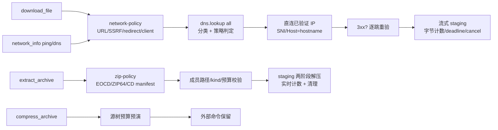

# network-and-archive-safety 设计

> 阶段：阶段 1（设计定稿）
> 创建日期：2026-08-29
> 状态依据：roadmap 第 7 条；用户已授权代理代为执行 CodeStable 全流程，design 由代理按 roadmap 既定范围审定并批准。
> 关联归档：REL-04（download/archive 无 SSRF 与预算）、SEC-07（DNS rebinding/proxy 绕过）；§5.6 NetworkPolicy/ArchivePolicy 契约为硬约束；证据矩阵 REL-04/SEC-07 行归本 feature。

## 0. 术语约定

- **SSRF restricted 范围**：loopback（127/8、::1）、private（RFC1918 10/8、172.16/12、192.168/16、CGNAT 100.64/10、unique-local fc00::/7）、link-local（169.254/16 含云 metadata 169.254.169.254、fe80::/10）、unspecified（0.0.0.0、::）与 multicast/reserved。IPv4-mapped IPv6 先归一为 IPv4 再判。
- **deny-private / allow-private**：SSRF 策略两档。deny-private 拒绝 restricted 范围目标；allow-private 仅拒绝 unspecified/multicast/reserved（诊断与内网场景保留）。
- **直连绑定（bind-to-validated-IP）**：DNS 解析 → 对每个解析结果执行策略校验 → 用通过校验的 IP 作为连接目标（HTTPS 同时设 `servername` 为原 hostname，SNI 与证书校验仍对域名），响应期间不再二次解析——DNS rebinding 窗口收敛到"解析后连接前"，且连接目标已校验。
- **ZIP manifest**：从 End-of-Central-Directory（含 ZIP64）解析出的全部成员清单：规范化路径、kind（file/directory/symlink/device）、压缩/展开字节数、加密与 method 标志。
- **两阶段解压**：阶段 1 仅读 manifest 并完成全部成员校验（零写入）；阶段 2 才向 staging 目录实际解压并实时计数，失败清理 staging。

## 1. 决策与约束

### 需求摘要（roadmap 第 7 条 + §5.6 契约 + audit REL-04/SEC-07）

- `download_file` 换成纯 Node `node:http`/`node:https` 客户端：URL 解析与凭据拒绝 → SSRF 策略校验 → 直连已验证 IP → 手动 redirect（每跳重新走完整校验）→ 流式落盘 staging 并按实际字节计数，超预算/超时/取消即中止并清理。
- `extract_archive` 换成纯 Node ZIP 读取/解压器（零新增运行时依赖）：manifest 解析 → 成员路径/kind/预算全量校验 → staging 两阶段解压（实时计数展开字节）。
- `compress_archive` 保留外部命令，增加源树输入预算预演（member 数 + 总字节超限在压缩前拒绝）。
- `network_info` 的 ping/dns 目标接入同一 SSRF 校验函数（egress 面收口；capability 矩阵仍归 #9）。
- proxy：不支持。客户端不读取 `HTTP_PROXY`/`HTTPS_PROXY`/`ALL_PROXY`（纯 node:http 天然不读），文档声明"proxy: disabled"。

### 生产默认值配置表（roadmap §9 要求拍板）

| 环境变量 | 默认值 | 语义 |
|---|---|---|
| `MCP_SSRF_MODE` | 未设置 | 未设置时按面拆分默认：download=deny-private、network_info=allow-private；显式设 `deny-private`/`allow-private` 时两 surface 统一采用 |
| `MCP_DOWNLOAD_MAX_BYTES` | 104857600 | 单次下载实际接收字节上限（100 MiB），跨重试共享 |
| `MCP_DOWNLOAD_TIMEOUT_MS` | 120000 | 下载总 deadline（含 redirect 链与重试），用绝对时间戳判定 |
| `MCP_DOWNLOAD_MAX_REDIRECTS` | 5 | redirect 跳数上限，每跳重新校验 |
| `MCP_ARCHIVE_MAX_MEMBERS` | 10000 | 归档成员数上限（extract manifest 与 compress 源树共用） |
| `MCP_ARCHIVE_MAX_MEMBER_BYTES` | 268435456 | 单成员展开字节上限（256 MiB，CD 预检与实际计数双重执行） |
| `MCP_ARCHIVE_MAX_EXPANDED_BYTES` | 1073741824 | 全部成员展开字节总和上限（1 GiB，预检 + 实时计数） |
| `MCP_ARCHIVE_MAX_INPUT_BYTES` | 1073741824 | compress 源树总字节上限（1 GiB，压缩前预演） |
| `MCP_ARCHIVE_MAX_RATIO` | 200 | 展开字节数/压缩字节数上限；仅当展开量 > 64 MiB 时参与判定（避免小文件高压缩比误报） |

所有数值经 `envInt`（strict integer 解析）读取，非法值回落默认。

### 明确不做

- 不引入新运行时依赖（不引 undici/zip 库；`node:http`/`node:https`/`zlib`/自写 ZIP 读取器足够）。
- 不实现 proxy 支持（含 NO_PROXY 解析）；不做代理认证。
- 不做 gzip/chunked 传输解码之外的内容解压（如内容嗅探后的二次解压）。
- 不改 `validateUrl`/`validateHost` 的既有词法判定（security.ts 只复用不修改）；网络策略新增为独立模块。
- 不实现 ZIP 写入侧（compress 仍走外部命令）；不解密加密 zip（method/flag 命中即拒绝）。
- 不把 SSRF 策略当认证边界：本模块只约束 server 发起的出站连接目标；capability 矩阵归 `tool-wrapper-and-surface-contract`。
- Windows reparse point 在 staging→output 移动阶段由既有 rename 语义处理，不做额外 ACL 收紧。

### 现状证据与根因

- `security.ts:368-382` `validateUrl` 只查协议；`platform.ts:211-226` `getDownloadSpec` 生成 `Invoke-WebRequest -MaximumRedirection 5` / `curl --max-redirs 5`——redirect 全程自动跟随且不重验，host 无任何 IP 校验（`http://169.254.169.254/` 可直接读云 metadata）。
- `archive.ts:163-178` 下载 `withRetry` 整命令重跑，无字节上限、无总 deadline；body 大小不受控。
- `platform.ts:161-172` `getExtractSpec` 走 `Expand-Archive`/`unzip -o`——无 manifest、无 Zip Slip/绝对路径/驱动器号校验、symlink/hardlink/device entry 照单全收、无展开预算。
- `archive.ts:44-66` compress 无源树预算；`src/tools/archive.ts` 三工具路径校验仍是 `validatePath`+`validateRealPath` 旧组合（path-policy 未接入）。
- `system.ts` network_info 仅 `validateHost` 字符白名单，可对内网任意主机做 ping/dns 探测（SEC-07 egress 面）。

## 2. 设计方案

### 2.1 新模块 `src/network-policy.ts`

- `parseUrlPolicy(url)`: `URL` 解析 → protocol 必须 http/https → hostname 非空 → 含 userinfo 凭据拒绝（`URL_INVALID`，§5.6"URL credentials 默认拒绝"）→ port 有限整数。
- `classifyIp(ip)`: 返回 `"normal" | "restricted" | "forbidden"`（restricted=SSRF 范围；forbidden=unspecified/multicast/reserved，任何模式都拒）。IPv4-mapped IPv6 归一后判定。
- `getSsrfMode(surface)`: 读 `MCP_SSRF_MODE`，未设置按 surface 缺省（download=deny-private，network_info=allow-private），非法值回落默认。
- `resolveTarget(hostname)`: `net.isIP` 命中 → 直接分类（零 DNS）；否则 `dns.promises.lookup(hostname, {all: true})`，返回全部地址与分类结果；解析失败 → `HOST_INVALID`。
- `validateTarget(hostname, surface)`: resolveTarget + 按模式判定；返回 `{addresses, policy}` 或结构化错误（`SSRF_BLOCKED`/`HOST_INVALID`）。
- `downloadToFile(url, saveReal, {signal, kind})`: 主循环——
  1. `parseUrlPolicy` → `validateTarget` → 取第一个通过校验的地址；
  2. `http/https.request({ host: address, port, path, headers: { Host: hostname } })`，https 额外 `servername: hostname`（证书仍按域名校验，`rejectUnauthorized` 默认开启）；
  3. 3xx + `Location` → 相对地址基于当前 URL 解析 → **重新走第 1 步完整校验**，跳数 ≤ `MCP_DOWNLOAD_MAX_REDIRECTS`，否则 `RESOURCE_LIMIT`；
  4. 2xx：先 `mkdir` save 目录（缺父时 recursive 创建，保持 write_file 语义），流式写入 saveReal 同目录 exclusive staging（`wx` 0o600），逐 chunk 计数——超 `MCP_DOWNLOAD_MAX_BYTES` → destroy + 清理 staging + `RESOURCE_LIMIT`；deadline（绝对时间）每 chunk 检查，超 → `TIMEOUT`；`signal.aborted` → 清理 + `CANCELLED`；
  5. 成功 `rename(staging, saveReal)`，返回 `{bytes, finalUrl, status}`。
- 混合解析结果的 deny 语义：deny-private 模式下解析结果中**任一**地址命中 restricted 即整体拒绝（对抗 DNS 多记录混淆）；allow-private 取第一个非 forbidden 地址连接。
- 重试：`withRetry` 保留，但字节计数与 deadline 跨尝试共享（闭包内累计值 + 绝对 deadline）；每次尝试失败清理自己的 staging。
- 环境代理变量全程不读取；`User-Agent` 固定标识。

### 2.2 新模块 `src/zip-policy.ts`

- manifest：定位 EOCD（尾部扫描）→ ZIP64 locator/EOCD（存在即采用其 entryCount/cdSize/cdOffset）→ 遍历 Central Directory（0x02014b50）：flags（bit0 加密拒绝）、method（0 stored / 8 deflate 之外拒绝）、sizes（0xFFFFFFFF → ZIP64 extra field 0x0001）、external attrs（unix mode = `attrs >>> 16`）、name（UTF-8 优先，回退 latin1）。
- `validateMemberName(name)`: `\` 归一为 `/` → 拒绝绝对路径（`/` 开头）、Windows 驱动器号（`X:`）、`..` 段、空段之外的空名、NUL/控制字符、Windows 保留设备名（CON/PRN/AUX/NUL/COM1-9/LPT1-9 等，作为任意路径段的基础名）、超长（>1024）；归一化结果为 extraction 相对路径。
- `classifyEntry(entry)`: 目录名（`/` 结尾）→ directory；unix mode 命中 `S_IFLNK` → symlink（拒绝）、`S_IFCHR`/`S_IFBLK`/`S_IFIFO` → device（拒绝）；其余 file。加密判定：flags bit0（传统加密）与 bit6（强加密）均拒绝。**解压侧结构上不创建链接**：写入路径只产生普通文件与目录，即便未知变体漏过 mode 分类也不会产生 symlink/hardlink。
- `readManifest(archiveReal, budget)`: 完整读取并校验所有成员——成员数、单成员展开字节、展开总和、压缩比（仅展开量 > 64 MiB 时判定 ratio）、路径合法性；任何失败返回 `ARCHIVE_LIMIT`/`ARCHIVE_FAILED`，零写入。
- `extractArchive(manifest, {outputReal, signal})`: staging = `<outputReal>/.etmcp-extract-<pid>-<ts>/` → 逐成员：local header（0x04034b50）文件名必须与 CD 名一致（防 header 欺骗）→ stored 直拷 / deflate 用 `zlib.createInflateRaw()` 流式展开，**逐 chunk 实际计数**，成员级与总和级预算命中即中止 → 写入 staging 对应相对路径（目录 entry 只 mkdir）；成功后把 staging 顶层条目逐个 `rename` 到 outputReal（目标已存在则先删，对齐 `-Force` 语义）→ 删除 staging；任何失败 → `fs.rm(staging, {recursive, force})` + `ARCHIVE_LIMIT`/`ARCHIVE_FAILED`/`CANCELLED`。
- 压缩比守卫同段生效于实时计数（CD 谎报大小不能绕过：预检拦 CD 数字，实计数拦实际流）。

### 2.3 工具接线（archive.ts / system.ts）

- `download_file`：`save_path` 走 `resolveForWrite`（path-policy）；URL 走 network-policy；staging 位于 save 目录；错误码映射 SSRF_BLOCKED/URL_INVALID/HOST_INVALID/RESOURCE_LIMIT/TIMEOUT/CANCELLED。
- `extract_archive`：`archive_path` 走 `resolveForRead`、`output_dir` 走 `resolveForWrite`（目录语义，mkdir recursive）；两阶段解压；output schema 增加 `extracted`（成员数）与 `bytes`（展开字节）可选字段。
- `compress_archive`：source/output 走 path-policy 读/写语义；源树预演 walk（受 `MCP_ARCHIVE_MAX_MEMBERS` 计数上限约束，防预演本身被超大目录拖垮）统计文件数 + 总字节，超 `MCP_ARCHIVE_MAX_INPUT_BYTES`/`MAX_MEMBERS` → spawn 前 `RESOURCE_LIMIT`；其余流程不变。
- `network_info`：`ping`/`dns` 的 target 先 `validateHost`（既有词法）再 `validateTarget(target, "network_info")`；config/connections 动作不受影响（无用户目标）。

### 2.4 兼容与行为收紧

- 行为收紧（feature 目的，acceptance 记录）：download 对 restricted 范围目标默认拒绝（`allow-private` 可退）；redirect 每跳重验（内网跳转被拒）；下载有 100 MiB 上限；extract 拒绝 traversal/symlink/device/加密/超预算归档；compress 超预算源树被拒。
- 兼容保留：`extract_archive`/`compress_archive`/`download_file` 工具名、参数名、成功路径主字段不变；e2e compress→extract 自兼容（Compress-Archive 的反斜杠 entry 名经归一化处理）；Unix `zip` 产物同样可读。
- 错误码全部复用既有：`SSRF_BLOCKED`、`HOST_INVALID`、`URL_INVALID`、`ARCHIVE_LIMIT`、`ARCHIVE_FAILED`、`RESOURCE_LIMIT`、`TIMEOUT`、`CANCELLED`。

## 3. 挂载点

| 文件 | 变更 |
|------|------|
| `src/network-policy.ts`（新增） | URL/SSRF/解析/直连客户端/redirect 循环 |
| `src/zip-policy.ts`（新增） | ZIP manifest 读取、成员校验、两阶段解压引擎 |
| `src/tools/archive.ts` | 三工具接入 path-policy + 新策略；schema 增 bounds |
| `src/tools/system.ts` | network_info egress 校验接入 |
| `README.md` | 9 个新环境变量文档 |
| `tests/unit/network-policy.test.ts`、`tests/unit/zip-policy.test.ts`（新增） | IP 分类矩阵、redirect、manifest/恶意归档 |
| `tests/unit/tools/archive.test.ts`、e2e | 恶意 zip 场景、download SSRF 场景 |

删除判据：移除两新模块与三处工具接线后，download 回到 spawn-curl 语义、extract 回到 Expand-Archive——feature 完全消失。

## 4. 实现维度

- 维度档位：安全性=信任边界最高档（fail-closed、双重计数、逐跳重验）；健壮性 B+（二进制解析需对截断/越界/谎报字段防御）；性能 B（解压流式零全量驻留；manifest 一次读入 CD 受成员预算约束）。其余走默认档位。
- 不做微重构：`archive.ts`（186 行）在接线中自然瘦身（download/extract 主体移入新模块）；`platform.ts` 的 `getDownloadSpec`/`getExtractSpec` 保留但不再被 download/extract 调用（compress 仍用），标记注释避免误用。超出范围观察：`platform.ts` 兼容重导出面较大，建议后续 `cs-refactor` 收敛。
- 平台特性：Windows 下 `dns.lookup` 走系统解析；junction/reparse 在 staging 移动阶段依赖 rename 既有语义；ZIP name 编码按 flag bit 11 处理（Compress-Archive 产物为 UTF-8 或 ANSI，回退 latin1 兜底）。

## 5. 验收场景

1. `download_file` 默认拒绝 `http://127.0.0.1/`、`http://10.0.0.1/`、`http://192.168.1.1/`、`http://169.254.169.254/`、`http://[::1]/`、`http://100.64.0.1/` → `SSRF_BLOCKED`；`MCP_SSRF_MODE=allow-private` 时对本地测试服务器下载成功。
2. 含 `user:pass@` 凭据的 URL → `URL_INVALID`；非 http/https 协议 → `URL_INVALID`。
3. 公网 URL redirect 到内网 IP/localhost → 中途拒绝（allow-private 下允许跟随本地链）；跳数超过 5 → `RESOURCE_LIMIT`。
4. 下载体超过 `MCP_DOWNLOAD_MAX_BYTES`（测试用小阈值）→ `RESOURCE_LIMIT` 且无 staging 残留；deadline 到点 → `TIMEOUT` 且清理；RequestContext 取消 → `CANCELLED` 且清理。
5. extract 恶意成员：`../evil.txt`、`/etc/evil`、`C:\evil`、`a/../../evil` → `ARCHIVE_LIMIT`（零写入）；unix mode symlink entry、字符设备 entry → `ARCHIVE_LIMIT`。
6. zip bomb：CD 声明展开总量超限 → manifest 阶段拒绝；CD 谎报小值但实际流超限（构造 stored 条目谎报）→ 实时计数阶段拒绝且 staging 清理；高压缩比（展开 >64 MiB 且 ratio>200）→ 拒绝；加密条目 → 拒绝。
7. 正常 zip（stored + deflate 混合、嵌套目录、中文文件名）解压成功，成员计数与字节数正确；本地 header 文件名与 CD 不一致 → 拒绝。
8. compress 源树超 `MCP_ARCHIVE_MAX_INPUT_BYTES`/`MAX_MEMBERS` → spawn 前 `RESOURCE_LIMIT`；正常压缩不受影响（e2e compress→extract 自兼容回归）。
9. network_info ping/dns 目标在 `MCP_SSRF_MODE=deny-private` 下对 restricted 地址拒绝；默认模式 localhost 诊断不受影响。
10. 既有兼容：全量 gate 通过；`validateUrl`/`validateHost`/security.ts 零改动；platform.ts 的 `getDownloadSpec`/`getExtractSpec` 保留不调用。

## 6. 反向检查与明确拒绝

- 不接受把 IP 策略判定复制进多处（唯一分类函数在 network-policy.ts；system.ts/archive.ts 只调用）。
- 不接受"先解析后二次信任 hostname 再连"的实现：连接目标必须是已校验地址本身。
- 不接受只信 CD 声明大小的解压（必须有实时计数路径，且两路预算独立生效）。
- 不接受在解压/下载失败时残留 staging（所有失败路径必须清理，测试覆盖）。
- 不接受通过环境变量把 ZIP 成员校验或 SSRF restricted 判定整个关闭（`allow-private` 只放开 restricted 段，forbidden 段永不放行）。
