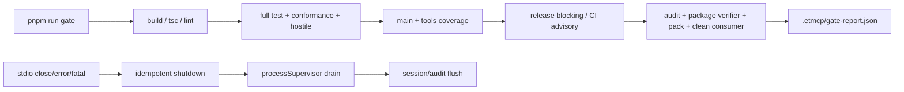

# Acceptance · security-and-mcp-conformance-gates（production-hardening #12）

> 阶段：阶段 3（验收闭环）
> 验收日期：2026-08-29
> 关联方案：`codestable/features/2026-08-29-security-and-mcp-conformance-gates/security-and-mcp-conformance-gates-design.md`
> 验收口径：当前 Windows/Node 24 本地证据 + workflow 静态矩阵证据；Linux/macOS runner 的实际执行由 CI 矩阵产生，本次不将未运行的远程结果写成本地通过。

## 1. 接口契约核对

### 名词层与挂载接口逐项核对

| 设计契约 | 代码落点 | 结果 |
|---|---|---|
| canonical gate / `GateReport` | `scripts/canonical-gate.mjs:13-213`；报告位于 `.etmcp/gate-report.json`，阶段有 `passed`/`failed`/`skipped`/`advisory_failed` | 一致。release 默认阻断 latency，`--ci` 只显式记录 advisory |
| MCP conformance | `tests/mcp-conformance.test.ts:39-231`；复用 `tests/support/mcp-server.ts:47-151` 启动真实 `build/index.js` | 一致。覆盖 initialize、surface、resources、prompts、call、错误、risk-gated、profile、cancel、disconnect |
| hostile-input corpus | `tests/fixtures/mcp-hostile-input-corpus.json` + `tests/hostile-input.test.ts:19-82` | 一致。动态展开超长数组/字符串，危险 case 不执行真实破坏动作 |
| platform smoke | `tests/platform-smoke.test.ts:20-76`；`.github/workflows/ci.yml:41-64` 的 OS/Node matrix | 一致。当前本地 Windows/Node 24 通过，其他 runner 由 CI matrix 执行 |
| release evidence | `package.json:31-38`、`scripts/canonical-gate.mjs:182-213`、`scripts/verify-package.mjs`、`scripts/verify-clean-consumer.mjs` | 一致。audit、coverage、pack、package verifier、clean consumer 均进入同一 gate |
| transport/fatal 生命周期 | `src/index.ts:49-176` | 一致。transport error/close、uncaught exception、unhandled rejection 进入幂等 shutdown；fatal code 保留并脱敏 |

### 编排图核对

方案中的 gate 图和运行时图均有实际落点：

`src/index.ts`、`scripts/canonical-gate.mjs`、新增测试入口和 workflow 之间的调用方向与设计一致，没有发现未落地的设计节点。

## 2. 行为与决策核对

### 需求摘要逐项验证

- [x] `pnpm run gate` 变为唯一 canonical release gate，运行 build、tsc、lint、full test、主 coverage、工具层 coverage、latency、audit、package verifier、实际 pack 和 clean consumer。
- [x] `pnpm run gate -- --ci` 复用同一脚本；CI latency 的 non-blocking 语义变成脚本内显式 `advisory_failed`，workflow 不再用 `continue-on-error` 隐藏阶段。
- [x] 真实 MCP client 能验证 27/26 surface、schemas、resources、prompts、structured output、错误、Elicitation required、cancellation、disconnect 和 sandbox profile fail-closed。
- [x] hostile corpus 覆盖命令、搜索、文件、进程、网络、归档、session action 等公开输入边界，并验证 sentinel/副作用不变。
- [x] CI 采用固定完整 action SHA、`contents: read` 权限和 Windows/Linux/macOS × Node 20/22/24 smoke matrix。
- [x] transport close/error/fatal 统一进入 supervisor drain → session/audit flush，fatal error code 保留并对 stack 做脱敏/限长。

### 关键决策落地

- [x] 保留既有安全核心：本次 diff 未触碰 `src/security.ts`、`src/safeguard.ts`、`src/command-policy.ts`、`src/result.ts` 的安全规则/错误码行为；新增测试只验证既有契约。
- [x] 不实现 `sandboxed-production` backend；conformance 验证无 backend 时得到 `SANDBOX_UNAVAILABLE`，没有静默降级。
- [x] 不新增 runtime dependency；gate 使用 Node 内置 `child_process`/`fs`/`path`，测试复用现有 SDK。
- [x] latency 采用既有语义的明确化：release gate 阻断，CI `--ci` advisory；不是通过提高阈值来消除负载抖动。
- [x] Windows rename 采用有界退避，lock heartbeat 改为串行续租并在释放前等待在途续租；不使用无限重试。

### 跨层纪律核对

- [x] gate fail-fast：首次 gate 的 `pnpm.cmd` EINVAL 曾实际生成 failed/skipped report，修复 Windows launcher 后成功；阶段状态由 `runStage()` 统一写入。
- [x] report 不保存完整命令输出；`safeSummary()` 对控制字符和常见 credential=value 形式做限长/脱敏，完整输出只留在当前终端日志。
- [x] conformance 由 SDK client 触发，成功和错误都经过 MCP transport；没有只测内部 handler 的假 conformance。
- [x] hostile 输入中的 schema-invalid case 与 handler-invalid case 分开断言；`Infinity`/`NaN` 等不可安全 JSON wire 的值由既有直接入口测试覆盖，本 feature 未伪造 wire 结果。
- [x] cancellation/disconnect 的测试使用 bounded wait；runtime shutdown 通过 `shuttingDown` 保证幂等。
- [x] platform unsupported 能力没有被当成成功：Everything 缺失在 smoke 中不作为 Unix failure，sandbox backend 不可用显式返回 failure。

### 挂载点反向核对

| 挂载点 | 实际落点 | 可卸载性 |
|---|---|---|
| package scripts | `package.json` 的 `test:conformance`、`test:hostile-input`、`test:platform-smoke`、`gate` | 删除这些 scripts 和 canonical script 后，新增 gate 功能消失，不影响工具业务主线 |
| canonical gate | `scripts/canonical-gate.mjs` | 删除后只失去统一门禁编排，不影响 server runtime |
| conformance/hostile/platform evidence | `tests/mcp-conformance.test.ts`、`tests/hostile-input.test.ts`、`tests/platform-smoke.test.ts`、fixture、support helper | 删除后对应证据面消失；无生产依赖引用 |
| CI integration | `.github/workflows/ci.yml` | 删除后 CI 不再阻断/上传该证据，代码和本地 gate仍可运行 |
| transport lifecycle | `src/index.ts` 的 transport/process hooks | 删除后运行期 transport/fatal 无法进入统一 shutdown，属于本 feature 的唯一 production runtime 挂载点 |

反向 grep 结果：本 feature 的生产代码引用集中在 `package.json`、`scripts/canonical-gate.mjs`、`src/index.ts`、`src/lock-lease.ts`、`src/temp-manager.ts`；测试引用集中在新增 suite/support、`tests/unit/lock-lease.test.ts`；架构/roadmap/status/changelog 文档回写已列入本报告。没有发现清单外的隐藏注册点。

拔除沙盘：移除 canonical script、package scripts、三类测试/support/fixture、CI job、transport hooks、lock heartbeat/rename 稳定性 patch 以及相关文档回写后，既有 27-tool runtime、旧的独立测试和既有 release verifier 仍可保留；不会遗留对新模块的 import 或 package dependency。

## 3. 验收场景核对

### 3.1 Canonical gate 与报告

- [x] **S1** `pnpm run gate` → 11 个阶段全部通过，退出码 0。
  - 证据：`gate-report.json` 的 release report；build、typecheck、lint、test、coverage-main、coverage-tools、latency、dependency-audit、package-verifier、pack-consumer、clean-consumer 全为 `passed`。
- [x] **S2** 阶段失败 → fail-fast + report failed/skipped。
  - 证据：首次运行因 Windows `spawnSync pnpm.cmd EINVAL` 在 build 阶段失败，report 明确记录 build failed、后续阶段 skipped；修复后正常运行。
- [x] **S3** report 安全 → 只保留有限阶段摘要，不保存完整输出/用户环境值。
  - 证据：`scripts/canonical-gate.mjs:47-51,168-179`；最终 report 为 JSON 阶段状态，无完整测试/命令输出。
- [x] **S4** D 盘临时范围 → gate env 将 TEMP/TMP/TMPDIR/npm cache/state 指向项目 `.etmcp/gate-work`。
  - 证据：`scripts/canonical-gate.mjs:13-41`；clean consumer/package verifier 均在项目 `.etmcp` 范围运行。
- [x] **S5** 主/工具 coverage 阻断 → 两个 coverage 阶段通过。
  - 证据：主 coverage `82.21/75.09/85.5/85.22`；工具 coverage `64.72/54.39/71.42/68.52`；阈值来自现有 Vitest 配置且未降低。
- [x] **S6** audit/package/consumer → 依赖 audit、package verifier、实际 pack、clean consumer 全通过。
  - 证据：`No known vulnerabilities found`；package verifier 229 files、required/forbidden/source-map/Node syntax checks passed；clean consumer package-owned SDK 1.29.0、consumer SDK 1.30.0、96 个 production SBOM components、startup smoke passed。

### 3.2 MCP conformance

- [x] **S7** initialize → 真实 stdio client 连接成功，server name/version 和 tools/resources/prompts capability 可读取；stdout 未混入协议外输出。
- [x] **S8** tools/list → 默认 27 个唯一工具、`delete_preview` 不存在；`file_info` disabled 配置为 26；input/output schema 为 object，input `required` 为数组，annotations 类型正确。
- [x] **S9** resources → `audit://log`、health template、带 `?limit=1` 的 audit read 均通过 MCP resource result 校验。
- [x] **S10** prompts → `usage-guide`、`safety-info` 可 list/get，消息 role/content 结构通过。
- [x] **S11** tools/call success → `telemetry_report`、普通 `execute_command` 返回 content + structuredContent，并由 SDK client output schema 校验通过。
- [x] **S12** tools/call error → `session_state.set_cwd` 缺 cwd 返回 `isError=true`、`VALIDATION_ERROR`、`param=cwd`，没有 rejected promise。
- [x] **S13** risk-gated/hardBlock → 六条 harmless batch 命令返回 `ELICITATION_REQUIRED` 且不执行；`rm -rf /` 保持危险硬拦语义。
- [x] **S14** sandboxed profile → `MCP_EXECUTION_PROFILE=sandboxed-production` 非零退出，fatal code 保留为 `SANDBOX_UNAVAILABLE`。
- [x] **S15** MCP cancellation → 长运行 watch 通过 request `AbortSignal` 在 bounded window 内 settle，之后 server 仍能响应 telemetry。
- [x] **S16** client disconnect → 长运行 stdio session 在 bounded transport window 内关闭并完成 server cleanup。
- [x] **S17** fatal → `reportFatal()` 保留已知 `ErrorCode`，message/stack 经过 redaction 和限长，进程非零退出；profile fail-closed 通过此场景直接验证。

### 3.3 Hostile input

- [x] **S18** command timeout/page/batch bounds → `timeout=0`、`pageSize=10001`、101 条 batch、watch duration=0 均在 MCP schema 层拒绝；无 spawn 副作用。
- [x] **S19** search/list bounds/ReDoS → depth/results/query overflow 和 `(a+)+$` 通过 protocol/handler error 路径拒绝。
- [x] **S20** process identity → pid/name 同时出现为 `VALIDATION_ERROR`，wildcard name 在 schema 层拒绝；不会调用终止 provider。
- [x] **S21** path/network/archive → traversal、invalid URL、非法 archive/output path 在请求前返回 policy error；sentinel、download、copy、extract 目标保持不存在/不变。
- [x] **S22** action-dependent fields → `session_state`、`environment_vars`、`network_info` 缺字段返回对应 `VALIDATION_ERROR` 和 param，不使用隐式 localhost/default no-op。
- [x] **S23** schema 与 handler 双层 → corpus 中 protocol-invalid 和 tool-invalid 两类分别有断言；既有直接 handler 单测继续覆盖不可 wire 的非有限数值。
- [x] **S24** no side effects/redaction → hostile suite 1/1 通过，`sentinel.txt` 内容保持 `keep-this-file`，不存在 download/copy/extract 产物；审计/报告无未脱敏 corpus 原文。

### 3.4 Platform smoke 与供应链

- [x] **S25** platform matrix → `.github/workflows/ci.yml:41-64` 明确配置 Windows/Linux/macOS × Node 20/22/24；当前宿主 Windows/Node 24 的 platform smoke、conformance、hostile 三个脚本通过。Linux/macOS/Node 20/22 的实际 runner 结果需由该 CI workflow 运行后提供，本地没有将其冒充已执行。
- [x] **S26** Everything/shell capability → Windows 当前 bundled pwsh 7 路径正常，Everything state binary unavailable 被 resolver 记录并 native fallback；Unix smoke 不依赖 Everything。
- [x] **S27** action policy → workflow YAML parse 通过；所有 `uses:` 均为 40 位 SHA：checkout v4.2.2、pnpm/action-setup v4.0.0、setup-node v4.4.0、upload-artifact v4.6.2；权限为 `contents: read`，无 workflow `continue-on-error`。
- [x] **S28** release evidence → canonical gate 实际执行 audit、package verifier、pack-consumer 和 clean consumer；package forbidden files 为空、source maps 自包含、SDK 隔离/SBOM/startup smoke 通过；checksum 没有被命名为 provenance/signature。
- [x] **S29** flake stability → lock-lease 定向 5 次、paging 定向 5 次均通过；两次完整 gate（`--ci` 与 release）均通过，未使用无限 retry 或全局 timeout 放宽。

### 3.5 明确不做的反向核对

- [x] **S30** `pnpm-lock.yaml` 未修改，`package.json` 只新增 scripts；没有新增 runtime dependency、远程 transport、认证、多租户或 sandbox backend。
- [x] **S31** `src/security.ts`、`src/safeguard.ts`、`src/command-policy.ts`、`src/result.ts` 未进入本次 diff；hardBlock/SafeGuard/default policy/error code/工具业务 output 未被改写。
- [x] **S32** `delete_preview`、`MCP_CONFIRMATION_MODE`、`MCP_ALLOWED_ROOTS` 没有新增 runtime 引用；测试仅把 `delete_preview` 作为“应不存在”断言，未重新引入 headless surface。
- [x] **S33** `src/pool.ts` 未修改，conformance 仍断言 `pool_stats.active=false`。
- [x] **S34** canonical gate 未调用 setup/bootstrap/download；`scripts/ensure-pwsh.ps1`、Everything fixture 和 npm consumer 边界未改变。
- [x] **S35** release report/verifier 文案区分 local SHA-256、SBOM 和 CI provenance；没有本地签名或 attestation 冒充。

## 4. 术语一致性

- `canonical gate`、`GateReport`、`MCP conformance`、`hostile-input`、`platform smoke`、`release evidence` 在 design、checklist、脚本、测试和 workflow 中保持同名同义。
- `release` 与 `--ci` 是同一 canonical script 的显式运行模式；前者 latency blocking，后者 latency advisory，报告 status 明确可区分。
- `SANDBOX_UNAVAILABLE` 表示 backend 不可用的 fail-closed 启动错误，不被描述成 sandbox 已实现。
- `unsupported` 表示当前 OS/能力不适用，不等于测试成功；Everything 仅是 Windows 可选能力。
- `checksum`、`SBOM`、`provenance` 分别表示内容摘要、依赖清单和 CI 构建来源证明，没有互相替代。
- 禁止词/遗留 surface 反向搜索仅在新测试断言和设计的“不做”核对中出现，没有进入运行时注册或配置解析。

## 5. 架构归并

已实际更新 [codestable/architecture/ARCHITECTURE.md](../../architecture/ARCHITECTURE.md)：

- [x] 外部资产索引加入 `scripts/canonical-gate.mjs`，明确其是唯一 release/CI gate、有限 report 出口且不进入 npm package。
- [x] ADR-23 记录 canonical gate、真实 MCP conformance、hostile/platform suites、CI action SHA/最小权限、release evidence 和 transport drain/flush 顺序。
- [x] 测试与覆盖策略更新为主 coverage + 工具 coverage + conformance/hostile/platform smoke；明确 CI required job 与平台矩阵。
- [x] 发布验证更新为 gate 已纳入 audit/pack/consumer，且保留 local checksum 不替代 provenance 的边界。
- [x] 与既有架构文档的关系保持：#12 只记录当前 gate/生命周期事实，#13 继续负责旧 v3.1/28 tools 等历史文字的最终一致性收口。

架构总入口不需要新增独立模块图；ADR-23 已补系统级名词、动词骨架和跨层纪律。没有新增 requirement，因为本 feature 是既有发布/安全能力的验证收口，不新增用户业务故事。

## 6. requirement 回写

无 requirement 回写。方案 frontmatter 的 `requirement` 留空；本 feature 没有新增 MCP tool、用户业务能力或新的产品边界，只把已有安全/协议/发布约束变成可重复 gate 和 evidence。现状由 roadmap、architecture、README、package scripts 和本 acceptance 共同表达。

## 7. roadmap 回写

- [x] `production-hardening-items.yaml` 的 `security-and-mcp-conformance-gates` 已从 `planned` 更新为 `done`，绑定 `2026-08-29-security-and-mcp-conformance-gates`，并通过 YAML 校验。
- [x] `production-hardening-roadmap.md` 第 12 项已补齐 status、design/checklist/acceptance 入口和验收回写；问题—feature—证据矩阵已更新为 #1–#12 完成、#13 负责文档收口。
- [x] `STATUS.md` 已更新为 12/13 done、真实 HEAD `16d1996`、69/845 测试和最新 gate 指标；下一步只剩 #13。
- [x] `codestable/compound/2026-08-28-explore-production-readiness-audit.md` 已更新到 #1–#12 done，并保留 Linux/macOS runner 作为外部 CI 证据边界。

## 8. AGENTS.md / CLAUDE.md 候选盘点

发现一个值得以后复用的候选，但本次不擅自写入 AGENTS：

- **候选 1**：本项目的完整验证必须从 `pnpm run gate` 进入；CI 若要保留 latency advisory，应调用同一入口的 `pnpm run gate -- --ci`，并把 `TEMP/TMP/TMPDIR`、npm cache、MCP state 固定到非 C 盘项目 `.etmcp` 范围。

这条是稳定工作流规则，当前已写入 `README.md`、架构文档、feature design/acceptance 和 gate script；是否进一步沉淀到 `AGENTS.md` 由后续用户决定。

## 9. 遗留

- Linux/macOS 以及 Node 20/22 的 platform matrix 需要在真实 CI runner 执行并保留 artifact；本地 Windows/Node 24 已通过，不把远程未执行结果写成已验证。
- `pnpm run lint` 目前退出码为 0，但仍有 9 个已有 warning：`src/temp-manager.ts` 的未使用 `id` 和 `tests/unit/network-policy.test.ts` 的未使用 `req` 参数；本 feature 没有顺手修改无关 warning。
- `tests/e2e-latency.test.ts` 的旧文件头仍包含 v3.1 历史文字，`CHANGELOG.md` 仍保留旧版本的 28-tools 历史段；属于 #13 文档收口，不影响当前 gate 行为。
- 本 feature 未生成 CI provenance/签名；`actions/upload-artifact` 只上传 gate/coverage evidence，真正的 CI provenance 仍由 GitHub/发布系统职责边界提供。
- 工作树保留上轮未跟踪的 `codestable/compound/2026-08-29-explore-enhanced-terminal-project-map.md`，不属于本 feature，不应混入 #12 scoped commit。
