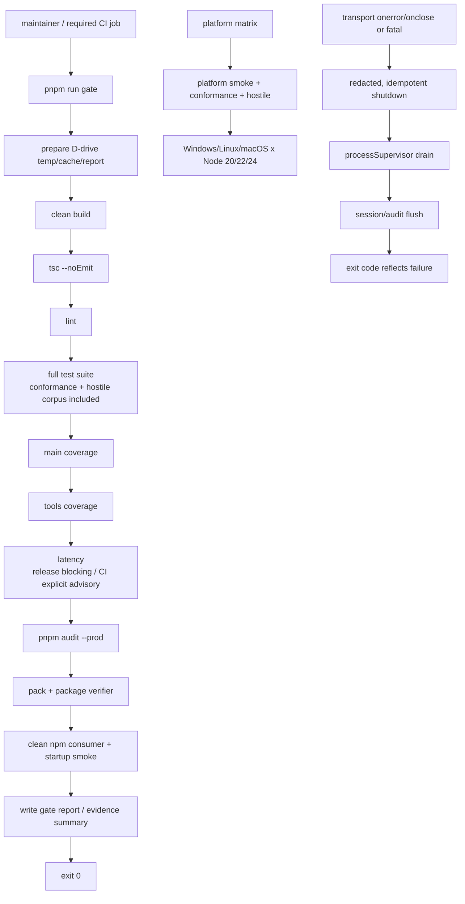

# security-and-mcp-conformance-gates 设计

## 0. 术语约定

- **canonical gate**：项目唯一的阻断门禁编排入口；本 feature 约定为 `pnpm run gate`，本地维护者和 CI 调用同一个入口，不在 workflow 中复制另一套命令链。
- **MCP conformance**：通过官方 MCP SDK `Client` 与真实 stdio server 交互，验证 initialize、tools、resources、prompts、tools/call、structured result、output schema、错误和 cancellation 的协议可观察行为；不把静态类型检查当成协议验证。
- **hostile-input suite**：对公开工具参数和 profile/配置边界使用可追溯 corpus 的对抗输入验证。测试只验证拒绝、结构化错误和无副作用，不执行真实破坏性命令。
- **platform smoke**：在项目已声明支持的 Node 20/22/24 与 Windows/Linux/macOS 组合上，运行最小真实 server/client、shell、文件、搜索和系统查询路径；Everything 只在 Windows 作为可选能力验证。
- **release evidence**：门禁产生的测试、coverage、audit、pack、package verifier、clean consumer 和 gate report 证据。SHA-256 只表示内容摘要，不能代替 CI provenance 或签名。
- **release-blocking**：步骤失败即返回非零并阻止后续发布；允许的非阻断项必须在名称和报告中明确标记，不能通过 `continue-on-error` 隐藏必需检查。

## 1. 决策与约束

### 需求摘要

生产硬化前 11 条 feature 已把运行时安全/资源/结果契约落入代码，但当前本地 gate、CI 和发布验证仍是分散的：主 coverage 没进入 gate，CI 没有调用本地 canonical gate，MCP 协议/hostile input/跨平台矩阵缺少统一阻断入口，action pinning 和最小权限没有被代码化，transport close/fatal 生命周期也缺少验收证据。

本 feature 面向项目维护者和 CI/release 系统，目标是把这些既有契约转成可重复、可审计、失败即见的验证链。

成功标准：

1. `pnpm run gate` 是唯一完整阻断入口，至少覆盖 build、tsc、lint、全量测试、主 coverage、工具层 coverage、MCP conformance/hostile-input、当前平台 smoke、latency、生产依赖 audit、实际 package verifier 和 clean consumer。
2. CI 的 required job 从同一个 canonical 入口调用 `pnpm run gate -- --ci`；平台矩阵运行同一套 conformance/hostile-input/smoke 测试，并明确标出仅 Windows 可用的 Everything 能力。默认 `pnpm run gate` 用于 release，CI 模式只保留现有 latency non-blocking 语义并把结果写入报告。
3. gate 每个阶段都有可观察状态和退出码，失败不被吞掉；生成的 gate report 不含秘密，测试临时数据、npm cache 和 package 临时物均落在项目 D 盘 `.etmcp` 范围。
4. 真实 MCP client 能验证工具 surface、schema、resources、prompts、structured result、错误 envelope、Elicitation required、取消和 profile fail-closed。
5. CI workflow 使用固定 action commit SHA 和最小 `contents: read` 权限；不新增运行时依赖，不重新引入 headless surface。
6. `src/index.ts` 对 transport close/error 与启动/运行期 fatal 使用幂等的脱敏退出路径，先处理 managed child，再 flush 状态和审计。

### 复杂度档位

- 健壮性 = L3：这是对外发布 server 的安全/协议门禁，失败路径必须显式、可审计、可重试或阻断。
- 结构 = layers：gate 编排、测试套件、运行时 transport 生命周期和 CI workflow 各自有边界，不能把命令链复制进多个入口。
- 性能 = budgeted：门禁本身有测试/发布耗时，但不引入无界重试；platform smoke 采用最小场景，canonical gate 保留既有 latency 和资源阈值。
- 可读性 = public：gate 名称、报告阶段、CI job 和发布证据要让维护者能直接定位失败层。
- 可演进性 = stable：`pnpm run gate`、测试脚本名、报告阶段名和 release evidence 字段作为内部稳定契约；新增检查只能追加明确阶段，不能改变既有阶段语义。
- 可观测性 = instrumented：阶段状态、退出码、测试/coverage/audit/package 摘要可见；不得记录命令原文或秘密。
- 可测试性 = verified：真实 stdio client、配置矩阵、hostile corpus、平台矩阵和失败注入都要有可重复证据。

### 关键决策

1. **一个 canonical gate，workflow 不复制门禁命令。** `package.json` 的 `gate` 指向项目内零运行时依赖的 gate 编排脚本；CI required job 只调用这个入口。测试脚本仍可被平台 smoke 或调试单独调用，但不能形成第二套“看似完整”的发布链。
2. **主 coverage 从“可运行脚本”升级为阻断证据。** 现有 V8 主 coverage 排除工具层和 e2e 子进程的原因保持不变；本 feature 只把 `test:coverage` 加入 canonical gate，并保留 `test:coverage:tools` 的独立底线，不改变阈值或把排除项伪装成全覆盖。
3. **latency 的当前语义显式化。** canonical gate 默认 release 模式中的 latency 为阻断阶段，以满足 `pnpm run gate` “一次干净通过”的 release 语义；CI 通过同一脚本的显式 `--ci` 模式运行 latency、记录结果但保留当前 PR non-blocking 约束；平台矩阵的最小 smoke 不重复运行完整 latency。若将来要改变 PR/nightly/release 的阻断关系，必须另立产品/门禁决策。
4. **不实现 sandbox backend。** `sandboxed-production` 仍按既有契约启动 fail-closed；conformance 只证明 `SANDBOX_UNAVAILABLE`/capability denial 的可观察语义，不把测试通过描述成 OS 隔离。
5. **hostile input 使用安全 corpus，不运行破坏动作。** 可 wire 的超长/越界/缺参/路径/URL/regex/PID-name/action 输入经真实 MCP call 验证；`Infinity`/`NaN` 等不能可靠通过 JSON wire 的值，在已有直接 handler/schema 单测或独立解析测试中覆盖。任何 corpus case 必须有预期错误类别或明确的 protocol error。
6. **不新增运行时依赖。** gate 编排使用 Node 内置 `child_process`/`fs`/`path`；MCP conformance 复用现有 SDK；测试不引入第三方 fuzz framework。
7. **保留本地 checksum、SBOM、provenance 的职责边界。** local verifier 生成 tarball checksum、clean consumer 生成 SBOM；CI 只上传 gate evidence 并按 workflow 权限/固定 action 策略运行，不把本地 checksum 叫作签名或 provenance。

### 明确不做

- 不修改 `DANGEROUS_PATTERNS`、`HARD_BLOCK_PATTERNS`、`hardBlock`、SafeGuard 决策语义、默认 `MCP_COMMAND_POLICY`、错误码兼容表或工具业务行为。
- 不增加远程 HTTP transport、多租户认证、租户配额或 OS/container/Job Object sandbox backend。
- 不激活、删除或重设计 `ProcessPool`；只验证 `pool_stats.active=false` 的既有诚实契约。
- 不把 `continue-on-error` 用于 canonical gate 的必需阶段，也不通过提高 timeout、降低 coverage、放宽 hostile 预期来掩盖 flake。
- 不在 gate 中下载 pwsh、Everything 或其他运行时资产；source bootstrap 与 npm consumer 的既有边界保持不变。
- 不做现有测试 helper 的大范围重构；只修复已确认会影响 gate 可信度的 TTL/rename 稳定性问题。
- 不在本 feature 中统一所有旧文档历史文字；#13 负责最终 v4.0.0/27/26 文档收口。本 feature 只更新必要的 gate/status/release evidence 现状。

## 2. 名词与编排

### 2.1 名词层

#### 现状

- `package.json` 已有 `build`、`test`、`test:coverage`、`test:coverage:tools`、`test:latency` 和 `gate`，但当前 `gate` 没有主 coverage、audit、package verifier、clean consumer 或统一报告。
- `vitest.config.ts` 已定义主 coverage 阈值；`vitest.tools-coverage.config.ts` 已定义工具层独立阈值；现有 e2e/visibility/risk 测试已能启动真实 `build/index.js`。
- `.github/workflows/ci.yml` 分开运行 lint/tsc、Windows test/tools coverage 和 non-blocking latency，没有一个 job 表达完整 release gate；action 仍使用 tag 而非固定 SHA，workflow 没有顶层最小权限声明。
- `src/index.ts` 已有启动失败脱敏和 SIGTERM/SIGINT shutdown，但 transport 事件没有成为同一套运行期退出编排的显式入口。

#### 变化

- 新增内部 `GateStage`/`GateReport` 概念：每个阶段至少有稳定名称、命令/测试入口、开始/结束状态、退出码和有限摘要；报告只保存状态与安全摘要，不保存命令输出全文。
- 新增 hostile corpus 记录形状：`id`、目标工具、参数、预期结果类别、是否允许触发 I/O。只允许安全验证 case；破坏性工具用拒绝前置路径或 mock/静态边界验证，不产生真实删除/下载/杀进程动作。
- 新增 conformance 断言集合：协议初始化信息、能力、工具/资源/prompt surface、schema shape、成功/错误结果、Elicitation required、cancellation、disconnect 和 unsupported profile 的可观察输出。
- 新增 platform smoke 结果维度：操作系统、Node major、shell/Everything 能力状态和测试结果；不把 Windows-only Everything 缺失当作 Unix failure。

### 2.2 编排层

#### 主流程图

#### 现状

当前 gate 是 `&&` 字符串链，虽然本地能运行 build/tsc/lint/test/latency/tools coverage，但阶段命名、主 coverage、release checks 和报告没有统一编排。CI 又复制了其中一部分并把 latency 标成 `continue-on-error`，因此“本地 green”与“CI required”不是同一份证据。

当前 MCP 协议测试主要分散在 `e2e-latency.test.ts`、`tool-visibility.test.ts`、`safeguard.test.ts` 和 `command-risk-gated.test.ts`；它们验证了重要行为，但没有一个覆盖 initialize → list → read/get/call → error/cancel 的 conformance 套件。安全和各模块单测已经存在，#12 不重复实现业务逻辑，只把缺失的跨模块边界组织成阻断测试。

当前 `main()` 的 shutdown 函数在 `server.connect()` 之后声明并只绑定 OS signals；SDK 的 transport 自身会把 close/error 交给 `Protocol`，但应用层没有明确记录并复用相同的 drain/flush/fatal 出口。

#### 变化

1. canonical gate 依次运行所有阻断阶段；任一阶段失败立即停止后续阶段，finally 写入有限 gate report。实际 package/consumer 阶段使用项目 D 盘 `.etmcp` 临时范围，结束时清理一次性 tarball/consumer。
2. `pnpm test` 继续作为全量测试入口，新 conformance/hostile 测试纳入默认 include；额外的 `test:conformance`、`test:hostile-input`、`test:platform-smoke` 仅提供平台矩阵和局部排查入口，不取代 full test。
3. CI required Windows job 调用同一 canonical 入口 `pnpm run gate -- --ci`；另设平台 smoke 矩阵执行轻量真实 MCP client/server 验证。所有 required action 使用固定 commit SHA，顶层权限默认为 `contents: read`。
4. `src/index.ts` 将 transport handler 在 `connect()` 前挂入：transport error 记录脱敏错误并进入 shutdown，transport close 记录生命周期事件并进入同一个幂等 shutdown；启动/运行期 fatal 统一走脱敏错误报告和非零退出。
5. 对已确认的时间/文件系统竞态，采用增大 TTL margin、等待可观察状态而不是固定脆弱 sleep、并在 Windows rename 前后明确释放句柄/等待链的方式修复；不得用无限 retry 或吞错处理。

#### 跨层纪律

- gate 的核心 stage 失败语义是 fail-fast + non-zero；报告保留已完成、失败和未运行阶段，不能把 skipped 写成 passed。只有 latency 在显式 `--ci` 模式下可记录为 advisory，且必须有独立 stage 名和结果。
- MCP conformance 使用真实 SDK 校验 `outputSchema`；成功与错误均必须保持可解析的 structured result。不会绕过 `toCallToolResult` 或直接断言内部实现细节。
- hostile suite 的每个 case 必须证明没有执行危险副作用；涉及文件的 case 使用 `.etmcp/test-tmp`，涉及命令的 case 只使用 `echo`/`node` 安全命令或在 spawn 前拒绝。
- disconnect/cancel 只允许触发一次 shutdown；重复 signal、transport close、fatal callback 不得重复 flush、重复终止或覆盖原始失败状态。
- platform smoke 的 unsupported 能力必须显式记录为 unsupported/expected，不可静默变成成功；Everything unavailable 在 Unix 是预期条件，在 Windows 由 resolver 契约区分。
- action pinning 只改变 CI 供应链表达，不改变 server runtime；CI 不执行 `setup.bat` 的交互 pause，也不在 npm consumer 中依赖 source checkout。
- 不把失败测试的 stdout/stderr 全文塞进 gate report；命令、URL、路径、环境变量和错误摘要沿用现有 redaction/有限 detail 规则。

### 2.3 挂载点清单

按“删除后 feature 是否从用户/系统视角消失”判断，本 feature 的系统挂载点为：

1. `package.json` scripts：`gate` 及 conformance/hostile/platform smoke 入口 — 修改为暴露唯一的验证契约。
2. `scripts/canonical-gate.mjs`：canonical gate 编排和有限报告出口 — 新增验证系统的唯一实现入口。
3. `tests/` 与 `tests/fixtures/` 的 conformance/hostile/platform smoke 注册 — 新增可重复的协议与对抗输入证据面。
4. `.github/workflows/ci.yml`：required gate、平台矩阵、固定 action SHA、权限和 evidence upload — 将验证契约接入 CI。
5. `src/index.ts` transport close/error/fatal 生命周期 hook — 让运行期连接故障进入既有 graceful shutdown 契约。

### 2.4 推进策略

1. **编排骨架**：建立 canonical gate 的阶段模型、D 盘临时范围、fail-fast 和有限报告；先用已有命令接通完整链路。
   - 退出信号：gate 能依次执行已存在的 build/tsc/lint/test/coverage/latency/audit/package/consumer 阶段，并在任一阶段失败时返回非零且留下阶段状态。
2. **协议节点**：补真实 stdio MCP conformance 和 profile/cancellation/disconnect 观察场景。
   - 退出信号：initialize、surface、resource、prompt、call、schema/error、cancellation 和 unsupported profile 均有可重复结果。
3. **安全输入节点**：补 corpus 驱动 hostile-input 套件，覆盖越界、缺参、路径/URL/regex、PID/name 和 action 约束。
   - 退出信号：每个 corpus case 有明确预期类别，危险 case 无副作用，非法输入不会进入不应发生的 spawn/写入。
4. **平台节点**：补 Windows/Linux/macOS 与 Node 20/22/24 的最小 smoke 入口，区分 expected unsupported 能力。
   - 退出信号：平台矩阵的 smoke/conformance/hostile 阶段有明确通过或显式 unsupported 证据。
5. **运行时节点**：接通 transport close/error/fatal 的幂等 shutdown，并修复已确认的 TTL/Windows rename 稳定性问题。
   - 退出信号：取消、断连、signal 和 startup fatal 场景不会留下 managed child，状态/审计 flush 顺序可观测。
6. **CI/发布节点**：把 canonical gate 接入 required workflow，固定 action SHA/权限，上传 gate/release evidence。
   - 退出信号：workflow 不再复制门禁链或对 required 阶段 `continue-on-error`，本地 gate 与 CI required gate 命令一致。
7. **验收节点**：执行全量 gate、平台 smoke、静态供应链检查和反向范围审计。
   - 退出信号：design/checklist 每个场景都有证据，roadmap #12 可标记 done，#13 仅剩文档统一。

### 2.5 结构健康度与微重构

##### 评估

- `scripts/canonical-gate.mjs`：全新文件，职责单一，承载阶段编排/报告；不需要微重构。
- `package.json`：约 65 行，已有 scripts 集中且职责明确；本次只改 scripts 映射，不拆文件。
- `.github/workflows/ci.yml`：约 44 行，当前 job 结构简单；新增 required gate/platform matrix 后仍按 job 责任分层，不把 YAML 命令复制为多个 gate。
- `src/index.ts`：约 140 行，composition root 同时承担启动和 shutdown 是自然职责；本次只把已存在的 shutdown 声明提前并挂 transport handler，不改变工具注册和业务流程。
- 既有 e2e 测试 helper 有少量重复，但本 feature 的新增 conformance/hostile/platform 套件可以各自保持短小；把所有 helper 抽成跨测试框架基础库会改变测试边界。

##### 结论：不做

本 feature 不做微重构。新增 gate 脚本、测试 fixture 和平台 smoke 文件已经把职责隔离；`src/index.ts` 的生命周期调整是局部编排接线，不需要先搬代码。现有测试 helper 的统一属于后续 `cs-refactor` 候选，不阻塞本 feature。

## 3. 验收契约

### 3.1 Canonical gate 与报告

1. 运行 `pnpm run gate` → 依次经过 build、tsc、lint、full test、main coverage、tools coverage、latency、audit、package verifier 和 clean consumer，成功返回 0。
2. 让任一独立阶段返回非零 → gate 返回非零，后续阶段不被伪造为 passed，报告标记 failed/skipped。
3. gate 运行结束 → report 含阶段名、状态、退出码、耗时和有限摘要；不含秘密、完整命令输出或用户环境值。
4. gate 运行期间 → 测试临时目录、npm cache、tarball 和 clean consumer 都位于项目 D 盘 `.etmcp` 下；结束后一次性 consumer/tarball 清理，不改用户源码。
5. `pnpm run test:coverage` 的主 coverage 低于现有阈值 → gate 阻断；`test:coverage:tools` 低于工具层阈值 → gate 阻断。
6. `pnpm audit --prod`、package verifier 或 clean consumer 失败 → gate 阻断，并区分 audit/package/consumer 阶段。

### 3.2 MCP conformance

7. 真实 client 连接 server → initialize 返回协议版本、server name/version 和声明能力，stdout 不出现非 MCP 协议文本。
8. `tools/list` → 默认返回 27 个唯一工具；关闭 `file_info` 时返回 26 个；每个工具的 input/output schema 是 object，`required` 形状符合 SDK 兼容补丁，annotations 字段类型正确；`delete_preview` 不存在。
9. `resources/list` / `resources/templates/list` / `resources/read` → 能发现并读取 health/audit 资源，`audit://log?limit=N` 的 limit 被安全夹取；响应符合 MCP resource result。
10. `prompts/list` / `prompts/get` → 能发现并获取 `usage-guide`、`safety-info`，消息角色/content 结构符合 MCP。
11. 调用安全只读工具和普通 `execute_command` → 返回 `content` + `structuredContent`，client 使用已声明 outputSchema 校验通过。
12. 调用缺参/非法 action 或安全拒绝场景 → 返回 `isError=true` 和结构化 `error.code`；不以 rejected promise 或裸字符串破坏 MCP response schema。
13. `MCP_COMMAND_CONFIRMATION=risk-gated` 下调用 heavy command，客户端不声明 Elicitation → 返回 `ELICITATION_REQUIRED`，不执行命令；hardBlock 场景直接保持现有危险错误语义。
14. 以 `MCP_EXECUTION_PROFILE=sandboxed-production` 启动当前 server → 在 backend 不可用时非零退出并可观察 `SANDBOX_UNAVAILABLE`，不静默降级到 local shell。
15. 对运行中的安全长命令发送 MCP cancellation → client 侧得到取消结果/错误，server 侧 child 被 supervisor 终止并从 active registry 清除。
16. client disconnect/transport close 或 transport error → server 进入一次幂等 graceful shutdown，先 supervisor drain，再 session/audit flush；重复 close/signal 不重复执行清理。
17. startup exception、uncaught exception 或 unhandled rejection → fatal 输出经既有 redaction/有限长度处理，进程返回非零，不能把原始秘密写到 stdout/stderr。

### 3.3 Hostile input

18. corpus 中的命令超长、timeout/duration 越界、batch 超量、page 参数非法 → `VALIDATION_ERROR` 或 `RESOURCE_LIMIT`，且 spawn 前拒绝。
19. corpus 中的搜索/list pattern、query、file pattern、depth、results、top/filter 越界或 ReDoS pattern → 结构化拒绝，不进入无界遍历/regex 执行。
20. corpus 中的 `pid + name` 同时出现、wildcard/name path、self/parent/critical process → validation/protected/ambiguous 错误，不能扩大终止范围。
21. corpus 中的 traversal、敏感路径、symlink/no-follow、invalid URL、private/forbidden host、Zip Slip/member/device entry → 对应 policy 错误，不能产生写入/网络请求/解压残留。
22. `session_state`、`environment_vars`、`network_info` 缺少 action-dependent 参数 → `VALIDATION_ERROR` 指向缺失 param，不静默使用 localhost、空值或错误 action。
23. 对可 wire 的无效 JSON 参数以及直接 handler 入口分别执行边界测试 → SDK schema 和 handler 二次校验语义一致，不能只依赖 MCP SDK 解析层。
24. hostile corpus 全部运行后 → 测试工作目录中不存在由 case 产生的危险副作用；审计/报告不包含未脱敏原始输入。

### 3.4 Platform smoke 与供应链

25. Node 20/22/24、Windows/Linux/macOS 矩阵 → 至少完成 server spawn、initialize、tools/list、一个只读工具、一个普通命令、资源/prompt 读取和安全错误 call；不支持能力显式标记。
26. Windows 平台 → shell resolver 的 bundled/PATH/fallback 语义和 Everything unavailable/available 分支有 smoke 证据；Unix 不因 Everything 缺失失败。
27. workflow 中所有第三方 action → 使用固定完整 commit SHA；workflow/job 权限最小为 `contents: read`，无 required stage 使用 `continue-on-error`；latency 的 CI advisory 由 canonical gate 的显式模式处理。
28. source checkout/npm consumer 运行已有 verifier → package manifest、禁发文件、source map、SDK patch 隔离、SBOM 和 startup smoke 结果纳入 gate report；本地 checksum 不被标记为 provenance/signature。
29. 已知 TTL/Windows rename 竞态场景 → 稳定重复运行通过；失败必须暴露为失败，不能靠无限 retry 或扩大全局 timeout 隐藏。

### 3.5 明确不做的反向核对

30. 代码中没有新增 runtime dependency、远程 transport、认证、多租户或 sandbox backend。
31. `security.ts` 的 hardBlock/dangerous patterns、SafeGuard 核心、命令 policy 默认值和现有工具名字/业务 output 没有被本 feature 修改。
32. 没有重新引入 `delete_preview`、`MCP_CONFIRMATION_MODE`、`MCP_ALLOWED_ROOTS` 或 server 侧 workspace allowlist/headless surface。
33. `ProcessPool` 仍报告 `active=false`，没有因为 gate 或 smoke 而激活预热 shell。
34. CI 没有把 `setup.bat` 当 npm consumer 安装器，也没有在 postinstall/runtime 下载 pwsh 或 Everything。
35. release evidence 没有把 local SHA-256 冒充数字签名、SLSA provenance 或 CI attestation。

## 4. 与项目级架构文档的关系

本 feature 的系统级变化是“验证与退出边界成为可重复的阻断协议”，不是新增业务工具：

- **名词**：将 `canonical gate`、`GateReport`、conformance、hostile-input、platform smoke 和 release evidence 作为验证层术语；不改变运行时 ToolResult/错误码契约。
- **动词骨架**：架构入口需要记录本地 `pnpm run gate` 与 CI required job 共用同一入口、平台 smoke 独立验证、transport failure 进入 supervisor drain → state/audit flush 的顺序。
- **跨层纪律**：补充“required gate 不得通过 `continue-on-error` 隐藏”“unsupported 必须显式”“local checksum 不等于 provenance”“报告不携带秘密”的约束。
- **回写范围**：acceptance 阶段更新 `STATUS.md`、production-hardening roadmap/items 和 `CHANGELOG.md` 的 #12 现状；`ARCHITECTURE.md` 只增加 canonical validation/transport lifecycle 的当前事实。完整旧 v3.1/28 tools/错误码/cache 文本统一由 #13 负责。

本 feature 不新增 requirement：它是对既有发布和安全契约的验证收口；如果 acceptance 发现新的对外业务语义，应停止并另行走 requirement/roadmap 评估。
