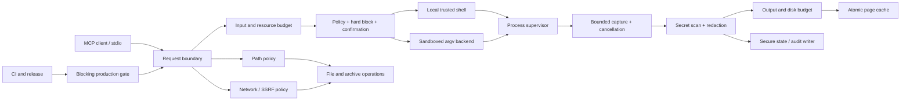

# Enhanced Terminal MCP 生产硬化路线图

## 1. 背景

2026-08-28 对 Enhanced Terminal MCP v4.0.0 做全仓库生产就绪审计后，确认项目已经具备完整的 MCP stdio 工具服务主线：工具注册、统一结果协议、命令执行、跨平台 shell、安全策略、流式输出、分页缓存、session、audit、temp manager、测试和发布脚本均已存在。

同时，审计发现当前实现不能无条件视为生产就绪。最严重的问题集中在几个共同根因上：`kill_process` 的进程身份边界不安全；输入和工作量预算不统一；shell 子进程树和 cancellation 没有统一管理；路径校验存在 symlink/TOCTOU 窗口；session、audit、logger 的秘密治理不统一；download/archive 缺少 SSRF 和解压预算；生产依赖审计失败；npm 包缺少 README 所需的 bootstrap 文件；CI 没有把主 coverage、依赖审计和发布包验证纳入阻断门禁。

本 roadmap 的目标不是继续堆叠危险命令正则，而是建立一套可被多个 feature 共同遵守的生产边界，并把当前项目收敛为两种明确 profile：

- `local-trusted-shell`：单用户、本机、stdio、宿主本身可信，保留完整 shell 体验，但所有输入、资源、进程、路径和秘密边界必须显式治理。
- `sandboxed-production`：远程、多租户、恶意输入或强隔离场景，使用 argv 执行和 OS 级隔离；任意 shell 字符串只能作为受控本机 profile 的能力，不能作为安全边界。

本 roadmap 的共同结论是：应用层策略、黑名单和正则是防误操作层；真正的生产隔离必须由 Job Object、process group、容器、受限 token、seccomp、只读文件系统或等价 OS 能力提供。

## 2. 范围与明确不做

### 本 roadmap 覆盖

- 统一 MCP 请求输入、错误和 resource budget 契约；
- profile/capability 矩阵、主机信息披露边界和配置解析契约；
- 进程身份校验、wildcard kill 防护和 process tree 生命周期；
- `execute_command` / `batch_execute` / `watch_command` 的 timeout、cancellation、并发和输出预算；
- symlink、reparse point、no-follow 和 TOCTOU 防护；
- session/env/history/audit/logger/cache 的秘密脱敏与安全持久化；
- download、redirect、SSRF、压缩/解压大小和 archive member 安全；
- audit writer、health 状态、temp quota、cache budget、session writer；
- `wrapHandler` 异常边界、工具实际数量和 `everything_search` 错误契约；
- SDK/传递依赖、npm package、bootstrap、SBOM、provenance 和 clean consumer 验证；
- MCP conformance、hostile-input、跨平台 smoke、CI 阻断门禁和文档收口。
- search/list 的 partial-result 语义、所有 child process 入口清单和 release governance。

### 明确不做

- **不**把继续增加 regex 作为任意 shell 的形式化安全方案。shell 字符串的完整安全隔离属于 OS sandbox / container / VM 主题，不能由本 roadmap 的策略层伪装完成。
- **不**在 npm `postinstall` 阶段自动联网下载 pwsh；pwsh bootstrap 继续由显式 setup 流程负责。
- **不**把 `MCP_COMMAND_POLICY=allow` 强行改为所有用户的默认模式；它会改变当前任意 shell 产品能力。生产强隔离应使用 `sandboxed-production` backend。
- **不**在本 roadmap 内新增远程 HTTP transport、身份系统或多租户业务模型；如果产品要远程服务化，应另开包含认证、租户、配额和网络边界的 roadmap。
- **不**把 `sandboxed-production` 描述成共享多租户服务。本 roadmap 只定义“由宿主提供身份和隔离的单请求/单 worker 执行上下文”；共享网关的认证、租户、计费和跨请求配额仍属于另一个 roadmap。
- **不**在本 roadmap 内贸然激活 `ProcessPool`；是否删除或真正接入属于独立性能/协议决策，本路线只要求其对外状态诚实。
- **不**顺手重写现有 requirements/architecture 现状档案；子 feature 验收完成后再由对应工作流回写实际落地的现状。

## 3. 目标部署模型



### 3.1 `local-trusted-shell`

适用条件：

- MCP server 由单一可信用户在本机启动；
- transport 是 stdio；
- 宿主应用负责进程权限和工作区隔离；
- 不把 server 当成互联网服务或多租户执行器。

允许保留完整 shell，但必须满足：

- `kill_process` 只接受明确进程身份；
- 命令和工具输入全量有界；
- 每次执行受 active process、wall-time、output 和 disk budget 约束；
- timeout/cancel 终止整棵子进程树；
- session/audit/logger 不保存未脱敏秘密；
- 路径操作采用 no-follow/parent validation 策略；
- download/archive 受网络和大小策略保护。

### 3.2 `sandboxed-production`

适用条件：

- 调用者不可信；
- server 由远程服务、CI 平台或其他不可信调用者所在宿主承载；共享多租户网关的认证/租户模型不在本 profile 内；
- 需要抵抗命令注入、文件越权、资源耗尽和网络绕过。

硬要求：

- 默认使用 argv/非 shell 执行；
- 每个请求进入独立的受限执行上下文；
- Windows 至少使用 Job Object + 受限 token，必要时使用 AppContainer、Windows Sandbox 或 VM；
- Linux 使用非 root 容器、seccomp、只读根文件系统和受控网络；
- 禁止把宿主的完整 `process.env`、工作区全路径和 credential 直接传给执行器；
- shell backend 只能显式启用并标记为非强隔离能力。

### 3.3 Profile 选择、失败语义和 capability 矩阵

profile 必须在 server 启动时确定，不能由 MCP 请求参数切换。建议新增 `MCP_EXECUTION_PROFILE=local-trusted-shell|sandboxed-production`：默认保持 `local-trusted-shell` 以兼容现有本机 stdio 行为；选择 `sandboxed-production` 时，如果宿主没有声明所需的隔离 backend、审计能力或网络策略，启动必须 fail-closed，并返回 `SANDBOX_UNAVAILABLE`，不能静默降级为完整 shell。

| 能力 | `local-trusted-shell` | `sandboxed-production` |
|---|---|---|
| `execute_command` / `batch_execute` / `watch_command` | 可使用已有 shell，但受 policy、budget 和 supervisor 约束 | 默认 argv backend；shell 只能由宿主显式授权 |
| `kill_process` | 只允许通过 identity 校验的目标，名称多匹配必须拒绝 | 默认只允许终止当前 worker 自己创建的子进程 |
| 文件工具 | 受 PathPolicy；宿主负责最终工作区边界 | 受 PathPolicy + OS sandbox 根目录，禁止跨 worker 访问 |
| `process_list` / `get_system_info` | 可用，但输出需限长并脱敏 | 默认禁用或只返回宿主提供的租户/worker 摘要 |
| `environment_vars` | 默认只显示 key 或显式允许的非敏感值，不缓存任意值 | 只允许 capability allowlist，禁止读取宿主完整环境 |
| `network_info` / `download_file` | 遵守网络校验和显式 egress 策略 | 默认 deny；允许时每次连接和 redirect 都重新授权 |
| `MCP_SECRETS_SCAN` / audit | 推荐 `strict`；audit 写入失败必须可见 | 强制 `strict` + audit enabled；writer 不健康时拒绝高风险操作 |

请求上下文中的 `requestId`、transport/session scope 和 `AbortSignal` 必须由 MCP SDK/宿主注入，不能由调用者在 arguments 中伪造。一个 server 进程默认只服务一个可信 stdio client 或一个隔离 worker；若未来由一个进程服务多个租户，必须另行定义 principal、认证、配额和状态隔离协议。

## 4. 模块拆分（概设）

```text
production-hardening
├── hardening-contract       共享输入、错误、profile、budget 契约
├── capability-policy        工具能力、主机信息披露和 egress 授权
├── process-supervisor       process identity、timeout、cancel、process tree
├── execution-backends       local shell 与 sandboxed argv backend
├── path-policy              realpath、no-follow、symlink、TOCTOU
├── secret-governance        scanner、redactor、env policy、secure state
├── network-archive-policy   SSRF、redirect、download、zip limits
├── state-observability      session/audit/temp/cache/health writer
├── tool-contract             wrapper、工具计数、MCP structured result
├── validation-and-gates      hostile input、conformance、coverage、CI
└── release-and-docs          dependency、package、bootstrap、文档收口
```

### 模块 A · hardening-contract

- **职责**：定义跨工具共享的输入边界、错误码、部署 profile、capability、配置解析、资源 budget 和 compatibility 规则。
- **不做**：不直接实现某个工具内部的文件、网络或 shell 行为。
- **触碰现有模块**：`src/result.ts`、各 `src/tools/*.ts`、`package.json`、测试配置。
- **承载的子 feature**：`hardening-contract-and-profiles`、`tool-wrapper-and-surface-contract`。

### 模块 A.1 · capability-policy

- **职责**：根据启动 profile、宿主隔离声明和请求上下文决定工具是否可以暴露主机信息、环境变量、网络和进程能力。
- **不做**：不替代认证系统或 OS sandbox；不把调用者传入的字符串当作 principal/授权凭据。
- **触碰现有模块**：`src/index.ts`、`src/tools/system.ts`、`src/tools/utility.ts`、`src/tools/archive.ts`、`src/tools/command.ts`、`src/context.ts`。
- **承载的子 feature**：`hardening-contract-and-profiles`、`security-and-mcp-conformance-gates`。

### 模块 B · process-supervisor

- **职责**：统一所有生产 child process 的 registry、process identity、timeout、cancellation、process tree termination 和 shutdown drain。
- **不做**：不决定某条命令是否允许；策略判断属于 policy 层。
- **触碰现有模块**：`src/capture.ts`、`src/stream.ts`、`src/shell.ts`、`src/utils.ts`、`src/tools/search.ts`、`src/tools/system.ts`、`src/tools/archive.ts`、`src/index.ts`；新增 supervisor/backend 抽象。
- **承载的子 feature**：`process-supervisor-and-cancellation`、`bounded-command-execution`、`kill-process-identity`。

### 模块 C · execution-backends

- **职责**：提供 `local-trusted-shell` 与 `sandboxed-production` 两种执行后端，隔离 shell 选择和 OS 执行约束。
- **不做**：不把应用层 regex 宣称为 sandbox；不默认改变已有 local shell 产品能力。
- **触碰现有模块**：`src/shell.ts`、`src/platform.ts`、`src/tools/command.ts`。
- **承载的子 feature**：`process-supervisor-and-cancellation`、`bounded-command-execution`。

### 模块 D · path-policy

- **职责**：统一路径规范化、真实路径、parent path、symlink/reparse point 和操作类型策略。
- **不做**：不把用户指定的宿主 sandbox 目录规则重新发明成 server 内部 allowlist；不把 session cwd 当作可信路径。
- **触碰现有模块**：`src/security.ts`、`src/tools/files.ts`、`src/tools/manage.ts`、`src/tools/archive.ts`、`src/tools/utility.ts`、`src/session.ts`、`src/state-dir.ts`、`src/temp-manager.ts`、`src/paging/paths.ts`。
- **承载的子 feature**：`path-policy-no-follow`、`network-and-archive-safety`。

### 模块 E · secret-governance

- **职责**：统一 streaming scan、文本/命令/URL/error/result/prompt redaction、env key policy、session state 保护和日志字段转义。
- **不做**：不通过隐式替换破坏用户可见的安全错误；所有 suppression 都要有结构化原因。
- **触碰现有模块**：`src/scan.ts`、`src/secret-registry.ts`、`src/secret-stream.ts`、`src/session.ts`、`src/audit.ts`、`src/logger.ts`。
- **承载的子 feature**：`secret-redaction-and-state-protection`、`audit-health-and-state-writer`。

### 模块 F · network-archive-policy

- **职责**：统一 URL host/IP/redirect/DNS/proxy policy、download byte budget、archive member/link/expanded-size policy，并约束 `network_info` 的 egress。
- **不做**：不把“HTTP/HTTPS”当成完整的网络信任边界。
- **触碰现有模块**：`src/security.ts`、`src/tools/archive.ts`、`src/platform.ts`；必要时引入经过依赖审计的库级实现。
- **承载的子 feature**：`network-and-archive-safety`。

### 模块 G · state-observability

- **职责**：提供可恢复的 session writer、串行 audit writer、temp quota、cache budget、配置健康状态和 truthful health。
- **不做**：不把写入失败吞掉后仍报告健康；不保存未脱敏原文。
- **触碰现有模块**：`src/session.ts`、`src/audit.ts`、`src/state-dir.ts`、`src/temp-manager.ts`、`src/cache.ts`、`src/tools/utility.ts`。
- **承载的子 feature**：`secret-redaction-and-state-protection`、`audit-health-and-state-writer`。

### 模块 H · tool-contract

- **职责**：统一 wrapper 异常边界、request context/cancellation、实际启用工具计数、MCP structured result、action-dependent schema 和错误转换。
- **不做**：不改变已有工具的业务语义或工具名称，除非另有明确的 breaking feature。
- **触碰现有模块**：`src/wrap.ts`、`src/result.ts`、`src/index.ts`、`src/tools/files.ts`、`src/tools/utility.ts`。
- **承载的子 feature**：`tool-wrapper-and-surface-contract`、`search-and-adaptive-correctness`。

### 模块 I · validation-and-gates

- **职责**：把安全、资源、协议、覆盖率、依赖、package、供应链、支持平台和跨平台检查纳入可重复门禁。
- **不做**：不通过降低阈值或 `continue-on-error` 隐藏 release blocker。
- **触碰现有模块**：`tests/`、`vitest*.ts`、`.github/workflows/ci.yml`、`package.json`。
- **承载的子 feature**：`security-and-mcp-conformance-gates`、`dependency-and-bootstrap-release`。

### 模块 J · release-and-docs

- **职责**：修复发布物、依赖、bootstrap、SBOM/provenance 和 v4.0.0 文档一致性。
- **不做**：不在文档中承诺代码或发布包实际不具备的 sandbox/工具数量/安装能力。
- **触碰现有模块**：`package.json`、`pnpm-lock.yaml`、`setup.bat`、`scripts/ensure-pwsh.ps1`、`README.md`、`LICENSE`、`SECURITY.md`、`.github/dependabot.yml`、`.github/CODEOWNERS`、`AGENTS.md`、`CHANGELOG.md`、`codestable/architecture/`。
- **承载的子 feature**：`dependency-and-bootstrap-release`、`security-and-mcp-conformance-gates`、`docs-and-architecture-closeout`。

## 5. 模块间接口契约 / 共享协议（架构层详设）

以下契约是所有下游 feature-design 的硬约束。单个 feature 可以选择实现一个契约，但不能私自改写字段语义；需要改变契约必须先 update 本 roadmap。

### 5.0 RequestContext / CapabilityPolicy / 共享结果类型

请求身份、取消信号和 profile 必须来自 MCP SDK handler 的 `extra`/宿主运行时，不得从 arguments 接收。共享多租户网关不在本 roadmap 内；默认一个 server 进程只绑定一个 stdio client 或一个隔离 worker。

```ts
interface RequestContext {
  requestId: string | number;        // runtime 生成，不接受调用者伪造
  scopeId: string;                   // transport/worker 绑定的 opaque scope
  profile: ExecutionProfile;         // 启动时固定，单请求不可切换
  signal: AbortSignal;               // MCP cancellation / disconnect
  sessionId?: string;                // SDK extra.sessionId；stdio 可为空
  authInfo?: unknown;                // 仅由宿主提供，业务不自行解析为授权
}

type Capability =
  | "shell-execution" | "argv-execution" | "host-process-inspection"
  | "host-environment-read" | "network-egress" | "filesystem-write";

interface CapabilityDecision {
  allowed: boolean;
  code?: "CAPABILITY_DENIED" | "SANDBOX_UNAVAILABLE";
  reason?: string;
}

interface CapabilityPolicy {
  check(context: RequestContext, capability: Capability): CapabilityDecision;
}

type ToolResultError = { ok: false; content: string; error: StructuredError };
interface ProcessSnapshot {
  requestId: string;
  pid: number;
  startedAt: number;
  treeScope: string;
}
interface ShutdownReport { clean: boolean; remaining: ProcessSnapshot[]; deadlineExceeded: boolean; }
interface FlushReport { clean: boolean; queued: number; bytes: number; dropped: number; error?: string; }
interface ToolDefinition { inputSchema?: unknown; outputSchema?: unknown; annotations?: Record<string, unknown>; }
interface RegisteredTool { name: string; enabled: boolean; enable(): void; disable(): void; }
interface ArchiveManifest {
  members: Array<{ path: string; kind: "file" | "directory" | "symlink" | "hardlink" | "device"; compressedBytes: number; expandedBytes: number }>;
  complete: boolean;
  memberCount: number;
  inputBytes: number;
  expandedBytes: number;
}
```

`scopeId` 只用于宿主绑定和配额键，不承担认证；没有宿主身份或隔离证明时不得宣称 `sandboxed-production` 已启用。SDK 1.29 的 handler extra 至少包含 `signal: AbortSignal`、`requestId: string | number`、可选 `sessionId`/`authInfo`；实际 `(args, extra)` 类型适配必须在 `tool-wrapper-and-surface-contract` 中集中实现，业务 handler 不得各自猜测 cancellation 字段位置。

### 5.1 ExecutionRequest / ExecutionLimits

**方向**：MCP tool handler → `ExecutionBackend` / `ProcessSupervisor`

**形式**：TypeScript 函数调用。

```ts
type ExecutionProfile = "local-trusted-shell" | "sandboxed-production";

interface ExecutionRequest {
  context: RequestContext;
  profile: ExecutionProfile;
  backend: "shell" | "argv";
  file: string;
  args: string[];
  cwd?: string;
  env: Record<string, string>;
  timeoutMs: number;
  limits: ExecutionLimits;
  budget: BudgetAccount;
  metadata: {
    tool: "execute_command" | "batch_execute" | "watch_command" | string;
    commandHash: string;
    destructive: boolean;
  };
}

interface ExecutionLimits {
  maxCommandChars: number;
  maxStdoutBytes: number;
  maxStderrBytes: number;
  maxTotalOutputBytes: number;
  maxPendingCaptureBytes: number;
  maxResponseBytes: number;
  maxWallTimeMs: number;
  maxActiveProcesses: number;
  maxDescendantProcesses: number;
  maxDiskBytes: number;
}

interface ExecutionBackend {
  readonly profile: ExecutionProfile;
  readonly capabilities: ReadonlySet<Capability>;
  start(request: ExecutionRequest): Promise<ExecutionHandle>;
}
```

约束：

- `timeoutMs`、所有 bytes/count 字段必须是 finite safe integer 且大于 0，并同时受 profile 的最大值约束；
- `sandboxed-production` 不得接收未经授权的任意 shell string；
- `env` 只能包含通过 `EnvPolicy` 的临时环境变量；
- `context.requestId`、`scopeId`、`commandHash` 只用于追踪和审计，不得替代用户可见的安全错误；
- `signal.aborted`、timeout、output budget、capture queue、process budget 和 parent batch budget 必须统一映射到结构化错误；
- 所有生产 child process（包括 system/search/archive/shell probe 的 `execFile`/`spawn`）必须经过 supervisor 注册；短时 probe 只能使用同一 supervisor 的受限 probe API；
- `maxPendingCaptureBytes` 与 backpressure 是内存上限的一部分，actual bytes 超限必须触发终止，而不是只停止保留输出。
- `maxDescendantProcesses` 必须在 OS backend 可实现时强制执行；无法对 shell 后代计数/隔离时，sandboxed profile 必须报告 unsupported，不得用应用层计数冒充隔离。

### 5.2 ExecutionResult / ProcessSupervisor

**方向**：`ExecutionBackend` → command-output / handler

**形式**：Promise 返回值。

```ts
interface ExecutionResult {
  exitCode: number | null;
  signal: string | null;
  timedOut: boolean;
  cancelled: boolean;
  outputLimitReached: boolean;
  terminationFailed: boolean;
  stdoutActualBytes: number;
  stderrActualBytes: number;
  stdout: Buffer;
  stderr: Buffer;
}

interface ProcessSupervisor {
  start(request: ExecutionRequest): Promise<ExecutionHandle>;
  terminate(handle: ExecutionHandle, reason: "timeout" | "cancel" | "output-limit" | "shutdown"): Promise<void>;
  active(): readonly ProcessSnapshot[];
  shutdown(deadlineMs: number): Promise<ShutdownReport>;
}

interface ExecutionHandle {
  readonly requestId: string;
  readonly pid: number;
  readonly startedAt: number;
  readonly treeScope: string;
  wait(): Promise<ExecutionResult>;
  cancel(): Promise<void>;
}
```

平台约束：

- Windows 必须优先终止 Job Object 或 process tree；
- Unix 必须按 process group 终止；
- `child.kill()` 只可以作为单 child 的第一步，不得作为最终清理保证；
- `shutdown()` 完成前不得报告所有 active children 已清理；
- supervisor 必须提供有界的 termination/drain deadline，不能因为消费方 pending callback 永久不结束而无限等待。

### 5.3 InputBudget / Schema 契约

**方向**：MCP schema / request boundary → 各工具 handler

**形式**：共享 Zod helper 和 runtime validation。

```ts
interface InputBudget {
  maxStringChars: number;
  maxPathChars: number;
  maxUrlChars: number;
  maxRegexPatternChars: number;
  maxCommandChars: number;
  maxBatchCommands: number;
  maxBatchWallTimeMs: number;
  maxBatchOutputBytes: number;
  maxSearchResults: number;
  maxSearchDepth: number;
  maxDirectoryEntries: number;
  maxTraversalEntries: number;
  maxTreeEntries: number;
  maxTreeBytes: number;
  maxReadLines: number;
  maxFileBytes: number;
  maxResponseBytes: number;
  maxEnvEntries: number;
  maxEnvBytes: number;
  maxPendingCaptureBytes: number;
  maxDownloadBytes: number;
  maxArchiveMembers: number;
  maxArchiveMemberBytes: number;
  maxExpandedArchiveBytes: number;
}

interface ValidationFailure {
  code: "VALIDATION_ERROR" | "RESOURCE_LIMIT";
  param: string;
  message: string;
  retryable: boolean;
  detail?: Record<string, unknown>;
}

interface BudgetAccount {
  readonly scope: "request" | "batch" | "child" | "session";
  readonly deadlineAt: number;
  reserve(kind: "input" | "output" | "disk" | "queue" | "process" | "response", amount: number): boolean;
  remaining(kind: "input" | "output" | "disk" | "queue" | "process" | "response"): number;
  child(scope: "batch" | "child"): BudgetAccount;
  abortSignal: AbortSignal;
  close(): void;
}
```

约束：

- 所有 number input 使用 `.finite()`；需要计数的字段同时使用 `.int()`；
- 所有公开 string/array 使用长度或数量上限；长度必须同时定义字符上限和编码后 byte 上限；
- `0` 的语义必须明确，不能由 `value || default` 隐式决定；
- action-dependent 参数使用 discriminated union/refine，在 spawn、读盘或递归遍历前拒绝缺参/多余参数；
- 超限必须在 spawn、读盘、响应序列化或递归遍历前返回；batch/parallel 的子任务共享同一个 parent `BudgetAccount`，不能每个 child 各自重置预算；
- 配置环境变量必须严格匹配完整十进制整数、finite safe integer、最小值和最大值；非法值要么启动 fail-closed，要么进入明确的受限 profile，不得由 `parseInt` 的前缀容忍产生不可控上限；
- `RESOURCE_LIMIT` 如需新增，保留已有错误码兼容映射，不改变客户端现有 `isError` 语义。

公开输入覆盖矩阵必须在 `hardening-contract-and-profiles` 的设计中逐字段落表：

| 输入族 | 覆盖字段 | 除 schema 外的强制边界 |
|---|---|---|
| 命令 | `command`、`commands`、`cwd`、`timeout`、`duration`、`page`、`pageSize` | shell/argv profile、command bytes、batch count/aggregate budget、timeout/deadline、response bytes |
| 文件/管理 | `file_path`、`dir_path`、`target_path`、`source`、`destination`、`content`、`offset`、`lines`、`max_depth` | path bytes、UTF-8 content bytes、read/list/tree entries/bytes、parent/no-follow、snapshot |
| 搜索 | `pattern`、`file_pattern`、`query`、`max_results`、`max_depth`、`dir_filter` | regex/SQL-like query length、ReDoS、每项长度、遍历/partial-result/response budget |
| 系统 | `pid`、`name`、`filter`、`top`、`target`、环境变量 `name` | process identity proof、exact name、host disclosure capability、host/egress policy |
| 归档/网络 | `url`、`save_path`、`archive_path`、`output_dir`、`source_path`、`output_path` | URL/路径 bytes、redirect/DNS/proxy、input/download/member/expanded/tree budgets |
| 运维/会话 | `recent`、cache `tool`、session `action/cwd/key/value` | finite count、action-dependent required fields、env count/bytes、prompt/result redaction |

任何新增公开字段必须先加入这张矩阵和 `InputBudget`，否则不能进入 feature-design。

### 5.4 PathPolicy 契约

**方向**：文件/归档工具 → `PathPolicy`

**形式**：异步 TypeScript 函数。

```ts
type PathOperation =
  | "read" | "list" | "info" | "write" | "append" | "delete" | "move"
  | "archive" | "extract" | "session-cwd" | "state" | "temp" | "page-cache";

interface SafePath {
  input: string;
  lexical: string;
  real?: string;
  parentReal?: string;
  existed: boolean;
  symlinkFree: boolean;
}

interface PathPolicy {
  resolve(input: string, operation: PathOperation): Promise<SafePath | ToolResultError>;
  assertParent(path: SafePath, operation: PathOperation): Promise<void | ToolResultError>;
  assertSameObject(path: SafePath): Promise<void | ToolResultError>;
}
```

约束：

- 目标路径、每个 parent component 和实际对象都必须满足 operation policy；
- 不存在目标必须校验真实 parent，不能因为 final `realpath` 失败就直接放行；
- write 使用 exclusive/staging/atomic replace；
- read/list/info/delete/move/extract 不得递归或跟随未获授权的 symlink/reparse point；
- `session-cwd`、`state`、`temp`、`page-cache` 不是可信旁路，必须执行同样的 no-follow、owner/permission 和 parent 校验；
- read 必须定义 snapshot/identity 语义，避免 stat 后目标被替换而返回混合文件内容；
- PathPolicy 不负责决定宿主是否允许目录访问，宿主 sandbox 仍是强边界。

### 5.5 SecretScan / Redaction / EnvPolicy 契约

**方向**：capture、session、audit、logger、environment_vars → `SecretGovernance`

**形式**：同步/流式函数。

```ts
interface SecretScanResult {
  safe: boolean;
  findings: string[];
  scannedBytes: number;
  complete: boolean;
}

interface SecretGovernance {
  scanChunk(stream: "stdout" | "stderr" | "file", chunk: Buffer): SecretScanResult;
  finish(stream: "stdout" | "stderr" | "file"): SecretScanResult;
  redactText(text: string): string;
  redactCommand(command: string): string;
  redactResult(result: ToolResult): ToolResult;
  redactError(error: unknown): StructuredError;
  sanitizeLogField(value: unknown, maxBytes: number): string;
  validateEnvKey(key: string): void | ToolResultError;
  persistentEnvValueAllowed(key: string): boolean;
}
```

约束：

- scanner 不得因为内容超过 4MB 就把内容无条件视为 safe；
- strict profile 下 scanner 不完整必须 fail closed 或拒绝返回；
- 日志、audit、history、error message/detail、confirmation/prompt context、URL credentials 和 cache 前必须 redaction；
- env key 以规范化大小写判断；
- session 默认只持久化 env key，不持久化 env value；
- `environment_vars` 默认只返回 key 或显式 allowlist 的值，且不进入共享结果 cache；
- scanner 不完整时不能返回“safe”；`strict` profile 必须 fail-closed；
- secret 原文不能进入 `detail`、`commandHash` 以外的审计字段；日志字段还必须转义 `\r`、`\n`、控制字符，防止 log forging。

### 5.6 NetworkPolicy / ArchivePolicy 契约

**方向**：archive/download 工具 → 网络和归档策略层

```ts
interface ValidatedUrl {
  original: string;
  protocol: "http:" | "https:";
  hostname: string;
  port: number | null;
  resolvedAddresses: string[];
  connectAddress?: string;
  proxy: "disabled" | "validated";
}

interface NetworkPolicy {
  validate(url: string): Promise<ValidatedUrl | ToolResultError>;
  validateRedirect(from: ValidatedUrl, to: string): Promise<ValidatedUrl | ToolResultError>;
  open(url: ValidatedUrl, signal: AbortSignal): Promise<NetworkResponse>;
}

interface NetworkResponse {
  status: number;
  headers: Record<string, string>;
  body: AsyncIterable<Uint8Array>;
  finalUrl: ValidatedUrl;
}

interface ArchiveBudget {
  maxInputBytes: number;
  maxMembers: number;
  maxMemberBytes: number;
  maxExpandedBytes: number;
  maxCompressionRatio: number;
}

interface ArchivePolicy {
  inspect(archivePath: SafePath, budget: ArchiveBudget): Promise<ArchiveManifest | ToolResultError>;
  validateMember(memberPath: string): void | ToolResultError;
  validateEntry(entry: ArchiveManifest["members"][number]): void | ToolResultError;
}
```

约束：

- loopback/private/link-local/metadata IP 必须可配置拒绝；
- redirect 每一跳都重新校验；DNS 每次连接都重新校验或绑定已验证地址，防 DNS rebinding；
- 默认不信任 `HTTP_PROXY`、`HTTPS_PROXY`、`ALL_PROXY`、`NO_PROXY`；若允许 proxy，proxy 本身必须经过相同策略验证；
- HTTP client 不得自动跟随未经检查的 redirect；收到 `Location` 后由调用方调用 `validateRedirect`，并重新执行 host、IP、port 和 proxy 检查；
- URL credentials 默认拒绝或脱敏；
- 下载内容必须按实际流计数并限制，重试共享同一个 deadline、byte budget 和 cancellation；
- archive member 不能逃逸目标目录，且 symlink/hardlink/device 等特殊 entry 默认拒绝；
- 解压过程还要实时计数 expanded bytes/member bytes，不能只信 header/manifest；
- manifest 自身也必须受 member/path/response budget 限制，不能为了预检把无限数量的 entry 全部载入内存；
- extract 只有在 manifest、entry 类型和预算通过后才开始实际写入，失败必须清理 staging。

### 5.7 Audit / Health / ToolRegistry 契约

```ts
interface RedactedAuditEntry {
  timestamp: string;
  requestId?: string | number;
  action: string;
  tool?: string;
  success: boolean;
  detail: Record<string, unknown>;
  errorCode?: string;
}

interface AuditWriter {
  record(entry: RedactedAuditEntry): { accepted: boolean; queued: number; dropped: number };
  flush(deadlineMs?: number): Promise<FlushReport>;
  health(): { state: "healthy" | "degraded" | "failed"; queued: number; bytes: number; dropped: number; lastError?: string };
}

interface ToolRegistry {
  register(name: string, definition: ToolDefinition): RegisteredTool;
  activeCount(): number;
  activeNames(): readonly string[];
}
```

约束：

- audit writer 单写入队列，失败不能静默丢失；
- audit entry、队列和单文件都必须有 byte/count 上限；超限的处理（阻断高风险操作或显式 degraded）必须可观测；
- audit 文件按 bytes/time 轮换并受上限控制；写失败需保留待重试数据或写入受保护的 durable spool，不能从内存 queue `splice` 后静默丢失；
- health 的状态必须反映 audit/temp/process 的 degraded/failed 状态；
- tool count 必须来自最终启用的 registry，不能来自“曾经调用过多少次 wrapper”。

### 5.8 进程身份和锁 fencing 契约

`kill_process` 不能仅以字符串 name 或瞬时 PID 作为终止凭据。名称路径必须先做精确枚举，只有唯一候选才可继续；PID 路径必须在终止前获得平台 identity proof，并在终止调用中绑定该 proof。

```ts
interface KillTarget {
  pid?: number;
  exactName?: string;
  expectedStartTime?: number;
  identityToken?: string;
  force: boolean;
}

interface ProcessIdentity {
  pid: number;
  name: string;
  startedAt: number;
  token: string;
  ownedByCurrentWorker: boolean;
}

interface ProcessIdentityProvider {
  findByExactName(name: string): Promise<ProcessIdentity[]>;
  inspectPid(pid: number): Promise<ProcessIdentity | ToolResultError>;
  terminate(identity: ProcessIdentity, force: boolean, tree: boolean): Promise<void | ToolResultError>;
}
```

约束：

- `pid` 与 `exactName` 至少一个且互斥；PID/name/force 都先做 finite/bounded 校验；
- exact name 多候选、PID 不存在、start time/token 不匹配都 fail-closed；不能调用 Windows `/IM` 或 Unix `pkill` 做模糊/批量终止；
- Windows 优先使用 process handle/creation time，Unix 优先 pidfd 或 `/proc` start time；无法取得可靠 identity proof 时返回 `PROCESS_IDENTITY_AMBIGUOUS` 或 `PROCESS_PROTECTED`；
- temp/migration lock 采用相同的 owner、lease heartbeat 和 fencing token 语义；stale takeover 不能只根据 mtime `rm`，否则长操作会被并发接管。

### 5.9 兼容性和错误码协议

现有 `ErrorCode` 保持兼容：

```text
PATH_TRAVERSAL
PATH_FORBIDDEN
PATH_NOT_FOUND
PATH_SENSITIVE
PATH_EMPTY
PERMISSION_DENIED
COMMAND_DANGEROUS
VALIDATION_ERROR
TIMEOUT
PROCESS_PROTECTED
SAFETY_BLOCKED
ELICITATION_REQUIRED
ELICITATION_CANCELLED
EXECUTION_FAILED
NOT_FOUND
INTERNAL_ERROR
URL_INVALID
HOST_INVALID
ARCHIVE_FAILED
SECRET_DETECTED
```

可以新增以下错误码，但必须在 `src/result.ts`、output schema、文档、测试和 release notes 同步：

```text
RESOURCE_LIMIT
CANCELLED
PROCESS_TREE_TERMINATION_FAILED
SANDBOX_UNAVAILABLE
SSRF_BLOCKED
ARCHIVE_LIMIT
STATE_PERSISTENCE_FAILED
CAPABILITY_DENIED
PROCESS_IDENTITY_AMBIGUOUS
PARTIAL_RESULT
CONFIG_INVALID
```

错误字段统一为：

```ts
interface StructuredError {
  code: string;
  message: string;
  retryable: boolean;
  suggestion?: string;
  param?: string;
  detail?: Record<string, unknown>;
}
```

`detail` 只能包含脱敏后的有限元数据。禁止将原始命令、credential、完整 stderr 或秘密正文放入结构化错误；`message` 和 `suggestion` 也必须经过同一 redactor 和长度上限。未知异常统一映射为 `INTERNAL_ERROR`，不能把 `Error.message` 原样当作稳定 API。

### 5.10 Search / partial-result 契约

```ts
interface SearchResult<T> {
  matches: T[];
  total: number;
  truncated: boolean;
  complete: boolean;
  warnings: Array<{ code: string; path?: string }>;
}
```

no-match、达到结果/遍历/响应预算、权限错误、外部 CLI unavailable、CLI failure 必须分别可观测。任何 fallback 或 `$ErrorActionPreference = SilentlyContinue` 都不能把权限/执行错误伪装成 `complete: true`；结果和 warnings 仍受 parent `BudgetAccount`、每项长度和 response byte budget 约束。

## 6. 子 feature 清单

以下清单与 `production-hardening-items.yaml` 一一对应。依赖是技术依赖；产品优先级仍由用户在各 feature 启动时确认。

### 1. `hardening-contract-and-profiles`

- 所属模块：hardening-contract、capability-policy、execution-backends
- 依赖：无
- 状态：done
- 对应 feature：`2026-08-28-hardening-contract-and-profiles`
- 交付：定义 `RequestContext`、`CapabilityPolicy`、`ExecutionRequest`、`ExecutionLimits`、`InputBudget`、`BudgetAccount`、profile、配置解析、错误码兼容和共享 schema helper。
- 验收：已完成 `hardening-contract-and-profiles-acceptance.md`；所有后续 feature 可以直接引用同一套类型、scope、上限、byte-count 和 cancellation 语义；`Infinity`/NaN/负数/前缀数字、action 缺参和 capability 越权均有单测；sandbox backend 不可用时不会静默降级。

### 2. process-supervisor-and-cancellation（状态：done）

- 所属模块：process-supervisor、execution-backends
- 依赖：`hardening-contract-and-profiles`，因为 supervisor 必须消费统一的 request、budget 和 cancellation 契约。
- 交付：active child registry、timeout、AbortSignal、Windows process tree/Job Object 适配、Unix process group 适配、shutdown drain、后代进程计数/上限；统一接管 `capture`、`stream`、`safeExecFile`、Everything、shell probe、system 和 archive 的全部生产 child process，并限制 capture pending queue。
- 验收：timeout、cancel、output limit、queue limit 和 shutdown 后无残留 child；所有生产 child 都能在 registry 中定位，短 probe 不接受用户 payload；失败时返回明确结构化错误。
- 当前 feature：2026-08-28-process-supervisor-and-cancellation
- 设计：features/2026-08-28-process-supervisor-and-cancellation/process-supervisor-and-cancellation-design.md
- checklist：features/2026-08-28-process-supervisor-and-cancellation/process-supervisor-and-cancellation-checklist.yaml
- acceptance：features/2026-08-28-process-supervisor-and-cancellation/process-supervisor-and-cancellation-acceptance.md
- 验收回写（2026-08-28）：中断点的 registry cleanup 竞态（timeout/cancel 后 `activeCount` 残留）已定位为 close 事件与 termination promise 完成顺序不确定，并修复为 child 已退出即双向立即回收；lint 收口为零错误零信息；cancel 测试 registry 断言改为 bounded 等待。代用户执行三轮反向审计（横向取证、场景映射+稳定性压测、全量终审）后 12 个 checks 全部 passed、17 个场景均有证据映射。门禁：build、tsc、lint 0/0、全量 51 文件 639 用例、latency 24/24、tools coverage 59.37/48.55/65.62/63.26 达标、`git diff --check` 通过。后代进程/descendant budget 与 Unix 真实树终止 smoke 分别归属 `bounded-command-execution` 与后续 conformance gate。

### 3. `bounded-command-execution`（状态：done）

- 所属模块：hardening-contract、process-supervisor、command-output
- 依赖：`process-supervisor-and-cancellation`，因为 command budget 必须能真正终止超时/超限执行。
- 交付：三个命令工具的 finite/bounded schema、batch 总量和 parent aggregate 限制、watch 限制、active process/后代进程/total work/output/response/pending-queue budget、所有命令工具统一限流和 cancellation。
- **最小闭环**：完成后 `execute_command` 在 local profile 下能执行一个普通命令、正确取消超时、拒绝超大输入并返回 A+ envelope。
- 验收：`timeout: Infinity`、`duration: Infinity`、超大 batch、超长 command、UTF-8 byte 超限、并发洪泛、batch total wall-time 和 output flood 均在 spawn 前或预算边界被拒绝/终止；parallel 子任务共享 parent budget，不可各自重置。
- 当前 feature：2026-08-28-bounded-command-execution
- 设计：features/2026-08-28-bounded-command-execution/bounded-command-execution-design.md
- checklist：features/2026-08-28-bounded-command-execution/bounded-command-execution-checklist.yaml
- acceptance：features/2026-08-28-bounded-command-execution/bounded-command-execution-acceptance.md
- 验收回写（2026-08-28）：三个命令工具 schema 收紧 + handler 层 `validateBoundedCommandInput` 二次校验（schema 由 SDK 层消费，直调不绕过；字符计数与 boundedString 同源为 code point）；`src/command-budget.ts` 提供常量、`buildBatchBudget`、skip 分类与 validator；batch 聚合输入超 2MiB 整批 `RESOURCE_LIMIT` 零执行，output 配额耗尽后剩余 `budget_output` skipped，deadline 到点 `budget_deadline` skipped，parallel 经 `BudgetAccount.child()` 共享 parent ledger。门禁全绿（全量 52 文件 658 用例、latency 24/24、tools coverage 达标）。预算为启动常量未接 profile 配置面；descendant 进程计数仍归属后续 resource-stop 收尾。

### 4. `kill-process-identity`

- 所属模块：process-supervisor、system tool
- 依赖：`hardening-contract-and-profiles`，因为 pid/name 的输入错误和权限语义必须统一。
- 状态：done
- 对应 feature：`2026-08-28-kill-process-identity`
- 交付：pid/name 二选一、精确名称、唯一候选、平台 identity token/start-time proof、PID reuse 防护、wildcard 拒绝、process tree 终止和 fake executor 测试。
- 验收：已完成 `kill-process-identity-acceptance.md`；不会构造 `taskkill /IM * /F`、`pkill *` 或模糊批量 kill；关键进程、非法 PID、wildcard、重名进程、PID reuse、身份证明失败和缺参均返回正确错误码。

### 5. `path-policy-no-follow`（状态：done）

- 所属模块：path-policy、files、manage、archive、paging
- 依赖：`hardening-contract-and-profiles`，因为路径操作需要共享错误和 resource budget；不依赖命令 supervisor。
- 交付：realpath/parent/no-follow/reparse policy、原子写入、symlink race 防护、读写删移归档、session cwd、state/temp/page-cache 统一操作矩阵和读快照语义。
- 验收：敏感路径 symlink、父目录替换、目标不存在、递归删除 reparse point、state/temp 根替换、session 恢复 cwd 和并发替换测试通过。
- 当前 feature：2026-08-29-path-policy-no-follow
- 设计：features/2026-08-29-path-policy-no-follow/path-policy-no-follow-design.md
- checklist：features/2026-08-29-path-policy-no-follow/path-policy-no-follow-checklist.yaml
- acceptance：features/2026-08-29-path-policy-no-follow/path-policy-no-follow-acceptance.md
- 验收回写（2026-08-29）：新增 `src/path-policy.ts` 统一路径策略——读语义 real 解析重验（不存在放行给自然 ENOENT，契约不变）、写/删/移 no-follow（symlink 目标拒绝；delete 对链接仅移除链接层 `type:"link"`）、覆写原子 staging+rename（失败回退 truncate 写并告警）、state/temp 根替换检查；接入 files 五工具、manage 两工具、session cwd 恢复、ensureStateDir/ensureRoot。行为收紧：symlink→敏感/系统目录的读取从可读变 `PATH_FORBIDDEN`。门禁全绿（全量 53 文件 678 用例、latency 24/24、tools coverage 60.74/49.63/65.97/64.51）。归档 Zip Slip 与 set_cwd 入口校验分别归属 network-and-archive-safety 与 tool-wrapper-and-surface-contract。

### 6. `secret-redaction-and-state-protection`（状态：done）

- 所属模块：secret-governance、session、audit、logger、cache
- 依赖：`hardening-contract-and-profiles`、`path-policy-no-follow`，因为秘密落盘和状态文件本身也要使用安全路径与预算。
- 交付：统一 redactor、大小写不敏感 env policy、session/history/prompt context 保护、strict streaming scan、secure file mode、cache 前扫描、ResultBoundary 和 log-field control-character escaping。
- 验收：token/URL credentials/JWT/connection string/private key 不进入 session、audit、logger、cache、confirmation、prompt 或 error message/detail；`path`/`node_options` 变体不能绕过；超过扫描能力时 strict fail-closed；`environment_vars` 默认不缓存任意值。
- 当前 feature：2026-08-29-secret-redaction-and-state-protection
- 设计：features/2026-08-29-secret-redaction-and-state-protection/secret-redaction-and-state-protection-design.md
- checklist：features/2026-08-29-secret-redaction-and-state-protection/secret-redaction-and-state-protection-checklist.yaml
- acceptance：features/2026-08-29-secret-redaction-and-state-protection/secret-redaction-and-state-protection-acceptance.md
- 验收回写（2026-08-29）：新增 `src/secret-governance.ts` 统一 redactor 与 env policy（g-flag 克隆不触碰流式 registry）；`fail()` 单点 ResultBoundary 覆盖全部 error 出口；logger/audit.record/usage-guide last_cmd/risk-gated confirmation/fatal stderr 接入净化；session 默认只持久化 envKeys 与 redacted history（value 持久化需 `MCP_SESSION_PERSIST_ENV_VALUES=1`，denied/sensitive 永不落盘），deny 判定大小写规范化关闭 `path`/`node_options` 变体；`scanContent` 增加 `complete` 语义，strict 下超扫描能力 read/write fail-closed（`RESOURCE_LIMIT`），不完整内容不入共享缓存；`environment_vars` 走 `MCP_ENV_VALUE_MODE`（默认 allowlist）并移出 `CACHEABLE_TOOLS`；session.json 改走 `atomicWriteFile`（0o600），audit/state/temp 目录 POSIX 权限收紧。行为收紧：env 变体注入、非白名单 env 值展示、strict 超能力读写、超大内容入缓存四处均从"放行"变"拒绝/掩码"。门禁全绿（全量 54 文件 709 用例、latency 24/24、tools coverage 60.76/49.56/65.97/64.6）。audit writer 轮换与 session revision writer 归 #8，capability 矩阵归 #9。

### 7. `network-and-archive-safety`（状态：done）

- 所属模块：network-archive-policy、archive tools
- 依赖：`hardening-contract-and-profiles`、`path-policy-no-follow`，因为网络输出最终进入受保护文件路径和 archive staging。
- 交付：SSRF/redirect/DNS-rebinding/proxy policy、download byte limit、TLS/timeout/cancel/总 deadline、archive manifest、特殊 link entry、Zip Slip 和 zip bomb 预算；覆盖 `network_info` egress。
- 验收：localhost/private/link-local/metadata、DNS 变化、未验证 proxy、redirect 内网目标、超大下载、恶意 member path、symlink/hardlink/device entry、超大展开和高压缩比均被阻止，失败不残留 partial artifact。
- 当前 feature：2026-08-29-network-and-archive-safety
- 设计：features/2026-08-29-network-and-archive-safety/network-and-archive-safety-design.md
- checklist：features/2026-08-29-network-and-archive-safety/network-and-archive-safety-checklist.yaml
- acceptance：features/2026-08-29-network-and-archive-safety/network-and-archive-safety-acceptance.md
- 验收回写（2026-08-29）：新增 `src/network-policy.ts`（IP 分类矩阵唯一来源；deny-private/allow-private 按 surface 拆分默认，显式配置统一两 surface；直连已验证 IP + servername=SNI 关闭 DNS rebinding；redirect 每跳重新解析校验；字节预算与绝对 deadline 跨重试共享；代理变量零读取）与 `src/zip-policy.ts`（EOCD/ZIP64/CD manifest；成员路径/kind/加密/预算全量校验；staging 两阶段解压 + 实时计数，CD 谎报与实际流双路独立生效；失败零残留）。download/extract 从外部命令换为纯 Node 实现（零新增依赖），compress spawn 前源树预算预演，network_info ping/dns 接入 egress 校验；9 个配置项拍板进 README。审计修复：validateTarget 非法配置误判致命（改回落+告警回传）、取消错误在 res 流退化为 ECONNRESET 的映射缺陷、req error 先于流清理的竞态。门禁全绿（全量 56 文件 736 用例、latency 24/24、tools coverage 58.27/47.88/65/61.78）。capability 矩阵归 #9。

### 8. `audit-health-and-state-writer`（状态：done）

- 所属模块：state-observability、session、audit、temp、cache
- 依赖：`secret-redaction-and-state-protection`、`process-supervisor-and-cancellation`，因为 writer/health 必须知道脱敏状态和 active process 状态。
- 交付：session revision writer、migration/temp lease heartbeat + fencing/stale-lock recovery、audit serialized writer/rotation/retry、bounded audit queue/durable spool、TempManager cross-process quota、LRU oversized entry 保护、state permissions 和 degraded health。
- 验收：并发写不丢最新 session；audit 写失败可见且不静默丢记录；entry/queue/file 大小受限；跨进程 temp quota 不超限且长操作不会被错误接管；health 不再无条件报告 ok。
- 当前 feature：2026-08-29-audit-health-and-state-writer
- 设计：features/2026-08-29-audit-health-and-state-writer/audit-health-and-state-writer-design.md
- checklist：features/2026-08-29-audit-health-and-state-writer/audit-health-and-state-writer-checklist.yaml
- acceptance：features/2026-08-29-audit-health-and-state-writer/audit-health-and-state-writer-acceptance.md
- 验收回写（2026-08-29）：新增 `src/lock-lease.ts` 统一 temp/migration 锁的 owner/heartbeat/fencing 语义（staging+rename 原子接管保留 fence；心跳存活的长持锁不再被 mtime 接管；dead-owner 立即接管；corrupt 迁移锁按 4.5 协议保持 fail-closed，`takeoverOnCorrupt` 区分两 surface）；audit 改单飞行写链——写失败保留条目退避重试不再静默丢（连续 3 次 health failed），`record()/flush()/health()` 落 §5.7 契约，entry 截断/queue 丢最旧计 dropped/文件按大小轮换 `audit.jsonl.N`（既有条数 compact 保留）；session revision writer 以 revision 比对修复写窗口 dirty 竞态并串行化并发保存；temp 跨进程配额经 `.quota.json` ledger 互见 outstanding（本进程取内存 live 值防双计；release 延迟同步防嵌套抢锁自死锁；协调文件不计容量）；LRU 超限 entry 拒绝 + 计数；`health://status` 从恒 `ok` 改为 `healthy|degraded|failed` + components 四组件聚合（temp 连续 ≥3 次锁失败才 degraded）。durable spool / 时间轮换按 §5.7 二选一明确不做。门禁全绿（全量 63 文件 786 用例、latency 24/24、tools coverage 59.39/49.79/67.32/63.16）。

### 9. `tool-wrapper-and-surface-contract`（状态：done）

- 所属模块：tool-contract、MCP protocol
- 依赖：`hardening-contract-and-profiles`，因为 wrapper 需要统一错误和 request context。
- 交付：`wrapHandler` 未预期异常转换、MCP `(args, extra)` request context/cancellation、真实启用工具计数、action-dependent input schema、health/prompt/tools/list 一致性、structured result/response byte contract。
- 验收：handler throw 返回 `INTERNAL_ERROR`；默认工具数 27、禁用 file_info 时 26；两种配置下 health/prompt/tools/list 一致；缺少 action 所需字段不会静默 no-op，异常/响应不会泄露原始 detail。
- 当前 feature：2026-08-29-tool-wrapper-and-surface-contract
- 设计：features/2026-08-29-tool-wrapper-and-surface-contract/tool-wrapper-and-surface-contract-design.md
- checklist：features/2026-08-29-tool-wrapper-and-surface-contract/tool-wrapper-and-surface-contract-checklist.yaml
- acceptance：features/2026-08-29-tool-wrapper-and-surface-contract/tool-wrapper-and-surface-contract-acceptance.md
- 验收回写（2026-08-29）：新增 `src/tool-registry.ts` 以 SDK `RegisteredTool.enabled` 为唯一真源的真实启用计数（§5.7 activeCount/activeNames 适配），banner/health（新增 `tools.enabled/disabled`）/usage-guide/safety-info 与 `tools/list` 27/26 三面同源一致；`wrapHandler` try/catch 收敛未预期异常（取消逃逸→`CANCELLED`，其余经 `redactError`→`INTERNAL_ERROR`，telemetry 记录、错误不入缓存）；新增 `MCP_RESPONSE_MAX_BYTES`（默认 2 MiB）响应字节兜底，超限降级 `RESOURCE_LIMIT` envelope；session_state/environment_vars/network_info 缺参改 handler 层显式 `VALIDATION_ERROR` 并删除隐式 ping 127.0.0.1/localhost 默认（消除绕过 egress 校验的路径）；`capabilityGate` 接线五个披露面（local 零行为变化，sandboxed 未声明→`CAPABILITY_DENIED`）。设计期发现 SDK 1.29 `normalizeObjectSchema` 对 v3 ZodEffects 返回 undefined 会把 inputSchema 广告成空 schema，故 action 收紧不使用 schema refine（约束已记录，SDK 升级须连 patch 另行验证）。门禁全绿（全量 58 文件 752 用例、latency 24/24、tools coverage 59.41/49.52/67/63.31）。sandboxed 端到端 capability e2e 归 #12。

### 10. `search-and-adaptive-correctness`（状态：done）

- 所属模块：search、adaptive、tool-contract
- 依赖：`bounded-command-execution`、`tool-wrapper-and-surface-contract`，因为搜索也需要预算、错误转换和 wrapper 统一出口。
- 交付：`everything_search` 正确处理 error/timeout/maxBuffer，native fallback timeout/cancel/limits/遍历错误，目录边界和 Unix process filter 修复，partial-result contract，adaptive timeout 真实 P95 或明确改名为 average heuristic。
- 验收：Everything CLI 失败不会返回假成功；权限/遍历/CLI partial 不会报告 `complete=true`；搜索和 list 参数/每项/响应全量有界；Unix filter 不会先泄露全量 `ps`；adaptive 文档、实现、测试三者一致。
- 当前 feature：2026-08-29-search-and-adaptive-correctness
- 设计：features/2026-08-29-search-and-adaptive-correctness/search-and-adaptive-correctness-design.md
- checklist：features/2026-08-29-search-and-adaptive-correctness/search-and-adaptive-correctness-checklist.yaml
- acceptance：features/2026-08-29-search-and-adaptive-correctness/search-and-adaptive-correctness-acceptance.md
- 验收回写（2026-08-29）：新增 `src/partial-result.ts`（SearchWarning/WARNING_CODES/SEARCH_BUDGET/pushWarning/assert 同源校验，warnings 上限 50 + path 截 256）与 `src/native-search.ts`（walk/grep 遍历错误 complete=false+warnings、命中行 1000 截断、迭代 AbortError）；`everything_search` 错误分类（timedOut→TIMEOUT、maxBuffer→RESOURCE_LIMIT、其余→EXECUTION_FAILED 有限 detail `{exitCode,signal}`），`search_files` CLI 失败 warn+EVERYTHING_EXEC_FAILED 后 native fallback（关闭 SEARCH-01）；PS grep 两段 `-ErrorVariable` 合计 `ETMCP_PARTIAL_ERRORS=N` 经 stderr 回传、Unix grep 非零+有输出→GREP_PARTIAL_RESULTS、list_directory 递归子目录不可读 partial 而顶层仍整体失败（关闭 SEARCH-02）；搜索/list/process schema+handler 双层有界校验（越界 VALIDATION_ERROR，直调不绕过）；Unix process_list 重写为 `buildUnixProcessListCommand` 先筛选再 `sort -k4,4 -rn` 再 head（关闭 SYS-01 全量泄露）；`adaptiveTimeout` 改非 cache-hit 样本 nearest-rank P95×3（上限 4×base、样本<5 回退，关闭 PERF-01）；partial 结果不入 LRU 缓存；四工具输出补 complete/warnings/truncated（纯新增向后兼容）。门禁全绿（全量 66 文件 835 用例、latency 24/24、tools coverage 64.72/54.39/71.42/68.52；第 3/4 次运行各撞 1 个既有 flake——lock-lease heartbeat 时序与 paging Windows rename EPERM，均非本 feature 改动面，复跑全绿）。Unix 真实 smoke 与 TTL/rename flake 加固归 #12。

### 11. dependency-and-bootstrap-release（状态：done）

- 当前 feature：2026-08-28-dependency-and-bootstrap-release
- 设计：features/2026-08-28-dependency-and-bootstrap-release/dependency-and-bootstrap-release-design.md
- checklist：features/2026-08-28-dependency-and-bootstrap-release/dependency-and-bootstrap-release-checklist.yaml
- acceptance：features/2026-08-28-dependency-and-bootstrap-release/dependency-and-bootstrap-release-acceptance.md

- 所属模块：release-and-docs、supply chain
- 依赖：`hardening-contract-and-profiles`，因为 package/release 需要知道最终 profile、错误和运行时入口；不依赖业务硬化完成即可先做依赖和包修复。
- 交付：SDK/传递依赖升级或精确 overrides、lockfile、SDK patch 兼容、source/npm 双 bootstrap 契约、非交互式 clean consumer、SBOM/provenance、package sourcemap/许可证元数据和 bundled executable 完整性验证。
- 验收：`pnpm audit --prod` 无未豁免 high/critical；package manifest 与 README 一致；npm package 不要求不存在的 lockfile/source/build；source checkout 与 npm consumer 均可在 non-interactive 模式安装、启动并执行 smoke；patch mismatch fail-closed 且只写 package 自有依赖；下载有 timeout/size cap；包内无不可追溯 sourcemap、fixture 或本地状态。

### 12. `security-and-mcp-conformance-gates`（状态：done）

- 所属模块：validation-and-gates、CI
- 依赖：`bounded-command-execution`、`kill-process-identity`、`path-policy-no-follow`、`secret-redaction-and-state-protection`、`network-and-archive-safety`、`audit-health-and-state-writer`、`tool-wrapper-and-surface-contract`、`search-and-adaptive-correctness`、`dependency-and-bootstrap-release`。
- 交付：hostile-input、MCP conformance、cross-platform smoke、main/tools coverage、audit、pack、canonical gate、action pinning/least-privilege 和 release evidence 的阻断流水线。
- 验收：CI 调用唯一 canonical gate；`pnpm run gate`/release gate 一次干净通过；安全回归、协议 conformance、覆盖率、依赖、package、支持平台和供应链验证全部成为 release evidence，latency 的阻断级别与 gate 命名一致。
- 当前 feature：2026-08-29-security-and-mcp-conformance-gates
- 设计：features/2026-08-29-security-and-mcp-conformance-gates/security-and-mcp-conformance-gates-design.md
- checklist：features/2026-08-29-security-and-mcp-conformance-gates/security-and-mcp-conformance-gates-checklist.yaml
- acceptance：features/2026-08-29-security-and-mcp-conformance-gates/security-and-mcp-conformance-gates-acceptance.md
- 验收回写（2026-08-29）：`scripts/canonical-gate.mjs` 成为唯一 gate 入口，release 模式阻断 build/tsc/lint/full test/main coverage/tools coverage/latency/audit/package verifier/pack/clean consumer，CI `--ci` 模式仅显式保留 latency advisory；新增真实 MCP conformance、hostile-input corpus、platform smoke 和 gate report；CI 改为 Windows Node 22 canonical gate 与 Windows/Linux/macOS × Node 20/22/24 smoke 矩阵，action 固定 commit SHA、权限收紧为 `contents: read`；transport close/error/fatal 接入脱敏幂等 shutdown；lock heartbeat 串行续租与 Windows staging rename 有界重试关闭已知 flake。release gate 全绿：69 文件 845 用例、主 coverage 82.21/75.09/85.5/85.22、tools coverage 64.72/54.39/71.42/68.52、latency 24/24、audit/package/consumer 全部通过。

### 13. `docs-and-architecture-closeout`

- 所属模块：release-and-docs、architecture/requirements 回写
- 依赖：`security-and-mcp-conformance-gates`、`dependency-and-bootstrap-release`，因为文档必须以最终代码、发布物和门禁结果为准。
- 交付：统一 v4.0.0/27/26 tools、双 bootstrap、profile/capability、sandbox boundary、CHANGELOG、usage-guide、AGENTS、architecture、SECURITY/依赖维护入口和 acceptance/roadmap 状态。
- 验收：用户文档、架构文档、工具 surface、health/prompt 和 package manifest 不再互相矛盾；实际落地内容回写现状档案。
- 验收回写（2026-08-29）：CHANGELOG [4.0.0] 段删除与 Breaking Changes 矛盾的 v3.x headless 条目（Added/Changed/Fixed 三组）、`ENHANCED_TERMINAL_DISABLE_FILE_INFO` 括注改为 27/26 现状口径、[Unreleased] 合并为单组 Added/Changed 并补 #13 条目；`usage-guide` prompt 更新为 v4.0 现状要点（risk-gated、profile、partial-result、响应预算、truthful health），首行动态计数契约不变；README/AGENTS/ARCHITECTURE 的过期 remaining-hardening 指引改为闭环口径并补 production-hardening closed 标注；新建根 `SECURITY.md`（威胁模型边界、hardBlock 底线、profile 边界、依赖政策、漏洞报告渠道）并接入 README Supply chain；`tests/e2e-latency.test.ts` 头注释更新 v4.0.0。实现期发现并修复 paging 测试在高负载下的 afterEach `fs.rm` ENOTEMPTY 竞态（有界重试，test-only，不触运行时）。复扫 grep（`NEW in v3.1` 零命中、无 "28 tools by default" 现状叙述）与 search-yaml active 检索均通过；release gate 11 阶段全部 passed（69 文件 845 用例、latency stage 通过、coverage/audit/package/consumer 达标，详见 acceptance）。

## 7. 排期思路

技术上先建立共享契约，再处理 supervisor 和 command 最小闭环，因为后续文件、网络、审计 feature 都依赖统一的有限输入、错误和 cancellation 语义。`kill_process` 是独立的 P0 安全修复，可以在契约完成后并行实现；path 和 secret 两条线应在命令闭环之后尽快完成，因为它们共同决定状态与文件操作是否可安全落盘。

依赖、bootstrap 和 package manifest 可以不等待全部业务硬化完成就提前修复，但最终 release gate 必须等待所有安全 feature。搜索、adaptive、health 和文档收口放在共享契约稳定后处理，避免在接口仍变化时重复同步。

第 3 条 `bounded-command-execution` 是最小闭环：它连接 MCP handler、输入 budget、process supervisor、capture 和 output envelope，完成后可以展示一条受预算约束、可超时取消、不会无限返回的普通命令执行路径。

排期中涉及的以下选择需要产品在对应 feature-design 时确认：

- `sandboxed-production` 使用 Job Object/受限 token、容器、VM 还是平台已有执行服务；
- download/archive 默认大小预算；
- 是否允许用户持久化自定义 env value；
- latency benchmark 是 PR 阻断还是 release/nightly 阻断；
- `ProcessPool` 最终保留、删除还是另开性能 feature。

这些“选择”不能成为安全前置条件的空白项：feature-design 必须先给出 profile 的安全默认值、最大值和 fail-closed 行为，再允许用户调整本机体验；不能以“后续再定”实现一个开放上限。

## 8. 跨 feature 验收门禁

### 8.1 代码质量

```bash
pnpm run build
pnpm exec tsc --noEmit
pnpm run lint
pnpm test
pnpm run test:coverage
pnpm run test:coverage:tools
```

### 8.2 安全和可靠性

```text
kill wildcard / PID reuse
Infinity / NaN / negative input
batch parent / output / active-process / response / capture-queue budget
timeout / cancellation / process tree
symlink / reparse / TOCTOU
env key case bypass
session / audit / logger / prompt / result redaction
host disclosure / capability denial / session-cwd
SSRF / redirect / DNS rebinding / proxy / download limit
Zip Slip / zip bomb / link entry / archive budget
audit writer failure / state writer race / lock fencing
partial search/list result truthfulness
profile fail-closed / unsupported backend
```

### 8.3 MCP 协议

```text
initialize
tools/list
tools/call
resources/list
resources/read
prompts/list
prompts/get
outputSchema
structuredContent
isError
Elicitation capability
cancellation
client disconnect
profile/capability negotiation and fail-closed startup
```

### 8.4 发布和供应链

```bash
pnpm audit --prod
pnpm pack --dry-run --json
pnpm run gate
```

必须进一步验证：

- clean consumer 安装；
- source checkout 与 npm consumer 的 bootstrap 契约分别验证；
- `setup.bat` 和 `scripts/ensure-pwsh.ps1` 只在其声明的发行形态中存在且可用；
- `es_tool/es.exe` 不进入 npm package；
- 无不必要的 tests、源码、CodeStable、本地状态或失效 sourcemap 进入发布包；
- bundled pwsh/es executable 的 hash、来源、版本和安装目录完整性可追溯；
- SBOM、artifact checksum 和 provenance 可追溯；
- Node 20/22/24 及 Windows/Linux/macOS 的支持矩阵有实际 smoke 或明确标记 unsupported。

发布形态必须写成可执行的二选一契约，而不是让同一个脚本隐含猜测：

- **source checkout**：`setup.bat` 可以执行 `pnpm install --frozen-lockfile` 和 build，但必须检测 `pnpm-lock.yaml`/`src`/`tsconfig.json`，支持 `--non-interactive`，不能在 CI 中执行 `pause`；
- **npm consumer**：只消费已发布的 `build/`，使用包内专用的 runtime bootstrap（如 `setup-pwsh.bat` + `scripts/ensure-pwsh.ps1`），不得要求不存在的 lockfile/source/tsconfig，也不得重建包；
- 两种形态都必须验证 `npm/pnpm install` 后实际执行路径、`bin` shebang、postinstall 和启动 smoke；不允许把 source-only `setup.bat` 误当作 npm consumer 安装器。

### 8.5 最终 release gate

```text
pnpm run gate                         -> 一次性 clean pass
pnpm audit --prod                    -> exit 0 或已批准的低风险豁免
pnpm pack --dry-run --json            -> manifest 与 README 一致
canonical CI gate                    -> workflow 调用与本地 gate 无漂移
clean npm consumer                   -> install/start/smoke pass
MCP conformance                     -> pass
security hostile-input suite        -> pass
profile/capability matrix            -> pass or explicit unsupported
release provenance / action policy   -> pass
git diff --check                     -> pass
```

### 8.6 问题归属与验收证据矩阵

以下矩阵防止“审计报告有编号、roadmap 有条目、但没有任何 feature 对它负责”的断链。每个问题至少要有一个实现 feature 和一个可重复的验收证据；截至 2026-08-29，#1–#13 全部 13 条已有实现/验收归属，roadmap 闭环。

| 问题 | 负责 feature | 最低验收证据 |
|---|---|---|
| SEC-01 / SEC-08 | `kill-process-identity`、`process-supervisor-and-cancellation` | fake executor、wildcard/重名/PID reuse/identity proof 失败、Windows `/T` 和 Unix process group 测试 |
| SEC-02 / SUPPLY-01 | `dependency-and-bootstrap-release`、`security-and-mcp-conformance-gates` | `pnpm audit --prod`、lockfile diff、patch fail-closed、action SHA/permissions 检查 |
| REL-01 / REL-06 | `dependency-and-bootstrap-release` | source checkout 与 npm consumer 的 non-interactive install/start/smoke，package manifest/README 对照 |
| REL-02 / REL-08 | `hardening-contract-and-profiles`、`bounded-command-execution` | schema hostile inputs、parent/child/batch budget、UTF-8 bytes、response/queue/recursive tree 上限测试 |
| SEC-03 / SEC-06 | `path-policy-no-follow`、`hardening-contract-and-profiles` | symlink/reparse/TOCTOU、session cwd/state/temp/page-cache、sandbox capability denial 测试 |
| SEC-04 / SEC-05 | `secret-redaction-and-state-protection`、`tool-wrapper-and-surface-contract` | secret corpus、logger/prompt/result/audit/cache 快照、控制字符、大小写 env bypass 测试 |
| REL-03 / REL-07 / REL-09 | `process-supervisor-and-cancellation`、`audit-health-and-state-writer` | 所有 child-process inventory、cancel/disconnect、descendant kill、shutdown drain/fatal handler 测试 |
| REL-04 / SEC-07 | `network-and-archive-safety` | redirect/DNS rebinding/proxy/private IP、实际流量 byte cap、archive special entry/expanded bytes 测试 |
| REL-05 / PRO-01 | `tool-wrapper-and-surface-contract` | handler throw、MCP extra、health/prompt/tools/list 27/26 一致性测试 |
| SEARCH-01 / SEARCH-02 / SYS-01 / PERF-01 | `search-and-adaptive-correctness` | CLI error/no-match/partial truth、Unix filter、每项/响应预算、adaptive skewed-latency 测试 |
| OPS-01 / OPS-02 | `audit-health-and-state-writer` | serialized writer、queue failure/retry/rotation、lock lease/fencing、degraded health 测试 |
| PRO-02 | `tool-wrapper-and-surface-contract` / 独立性能决策 | `pool_stats.active=false` 与文案一致；若要激活必须另开性能 feature |
| DOC-01 | `docs-and-architecture-closeout` | active 文档检索无过期 headless 现状；现状文档、README、CHANGELOG、package 一致——已完成：CHANGELOG [4.0.0] 矛盾条目清理、[Unreleased] 单组化、usage-guide v4.0、根 SECURITY.md、README/AGENTS/ARCHITECTURE 闭环口径，复扫 grep 与 search-yaml 检索证据见 acceptance |

## 9. 观察项

- ~~当前 `AGENTS.md` 和 `ARCHITECTURE.md` 的 v3.1.0/28 tools 文字属于现状档案过期问题~~（已解决，2026-08-29：AGENTS/ARCHITECTURE/README/CHANGELOG/usage-guide 均已按 v4.0.0/27/26 现状回写；shell 兼容档的语义性 "v3.1 行为" 引用按 #13 design 白名单保留）。
- 当前 `codestable/compound/2026-08-22-explore-enhanced-terminal-overview.md` 与 `codestable/compound/2026-08-28-explore-safe-block-diagnosis.md` 均已标记 `outdated`，新的证据在 `2026-08-28-explore-production-readiness-audit.md`。
- `@modelcontextprotocol/sdk` 目前精确锁定 1.29.0 是为了兼容 outputSchema patch；升级必须连同 patch、SDK 行为和 conformance 一起验证。
- `ProcessPool` 当前是诚实的 inactive stub；本 roadmap 不默认激活它，因为预热 shell 会引入状态污染、管道阻塞、环境残留和回收复杂度。
- 本 roadmap 不改变 `MCP_COMMAND_POLICY` 当前默认 blocklist，也不重新引入已经删除的 headless surface。
- `sandboxed-production` 不是本仓库内的远程多租户产品承诺；它要求宿主提供隔离 worker、身份 scope 和 egress，缺失时必须显式 unsupported/fail-closed。
- 生产默认值（下载/解压、响应、env、audit queue、parallel、session retention 等）必须在 feature-design 以配置表拍板，并由 CI 以实际数值验证，不能仅保留“有界”文字。

## 10. 变更日志

- 2026-08-28：根据生产就绪审计新增本 roadmap，定义双 profile、目标模块、跨 feature 接口契约、13 条子 feature、依赖 DAG、最小闭环和最终 release gate。
- 2026-08-28：多轮反向审计补齐 npm/source bootstrap 分离、全 child-process registry、parent budget/queue、capability/host disclosure、action schema、DNS/proxy、PID identity、partial-result、lock fencing、生命周期和供应链治理；同步更新受影响 feature 的接口契约与验收门禁，并将过期 `safe-block` explore 标记为 `outdated`。
- 2026-08-28：启动 `hardening-contract-and-profiles`；新增对应 feature design/checklist，并将 items.yaml 中该条目标记为 `in-progress`、绑定 `2026-08-28-hardening-contract-and-profiles`。接口契约以 roadmap 第 5 节为硬约束，尚未完成源码实现。
- 2026-08-28：完成 `hardening-contract-and-profiles` 实现与 acceptance；修复 `wrapHandler` runtime context 未接入、profile 初始化可切换和过期 budget 未同步 abort 三项验收偏差；items.yaml 与本主文档均已回写为 `done`，后续 supervisor feature 可开始消费共享契约。
- 2026-08-28：启动 `kill-process-identity`；新增对应 feature design/checklist，并将 items.yaml 中该条目标记为 `in-progress`、绑定 `2026-08-28-kill-process-identity`。实现边界以 5.8 进程身份契约为硬约束。
- 2026-08-28：完成 `kill-process-identity` 实现与 acceptance；修复 PowerShell argv 布尔绑定、PID 不存在状态分类、force=false 误强杀、identity 字段校验、结果 schema 和既有 critical-system 文本兼容；items.yaml 与本主文档均已回写为 `done`。
- 2026-08-28：启动 `process-supervisor-and-cancellation`；完成 child process inventory 和 approved design，新增 checklist，并将 items.yaml 对应条目标记为 `in-progress`、绑定 `2026-08-28-process-supervisor-and-cancellation`。
- 2026-08-28：中断点回写 process-supervisor 的部分实现：工作树已包含 supervisor 核心、主要 spawn/execFile/probe 接线、RequestContext cancellation 字段和 shutdown drain 顺序；`tsc --noEmit` 通过，但定向测试 111/113 通过、2 个 active registry 清理断言失败，lint 未通过，未提前更新 checks 或创建 acceptance。
- 2026-08-28：完成 `process-supervisor-and-cancellation` 实现与 acceptance；修复 registry cleanup 竞态（close 与 termination promise 完成顺序不确定导致 `activeCount` 残留）、lint 三处与 cancel 测试 bounded 等待边界，代用户三轮反向审计后 12 checks 全部 passed、17 场景均有证据；items.yaml 与本主文档已回写为 `done`，解锁 `bounded-command-execution`。
- 2026-08-28：完成 `bounded-command-execution` 实现与 acceptance（最小闭环达成）；新增 `src/command-budget.ts`，三个命令工具接入 finite/bounded schema 与 handler 二次校验，batch 建立 parent BudgetAccount（聚合预检、output 配额、wall-time deadline、parallel 共享 ledger）；审计修复 validator 字符计数与 boundedString 的 code point 同源差异；items.yaml 与本主文档已回写为 `done`。
- 2026-08-29：完成 `path-policy-no-follow` 实现与 acceptance；新增 `src/path-policy.ts` 并统一接入 files/manage/session/state/temp——读语义 real 解析重验、写/删/移 no-follow、覆写原子 staging、state/temp 根防替换，关闭 SEC-03 的 symlink 与 TOCTOU 缺口（symlink→敏感目录读取收紧为拒绝）；items.yaml 与本主文档已回写为 `done`，解锁 `secret-redaction-and-state-protection` 与 `network-and-archive-safety`。
- 2026-08-29：完成 `secret-redaction-and-state-protection` 实现与 acceptance；新增 `src/secret-governance.ts`（redactor + env policy + redactError），`fail()` 单点 ResultBoundary，logger/audit/prompt/confirmation/fatal 出口净化，session keys-only 持久化与 redacted history，env deny 大小写规范化，scan `complete` 语义 + strict fail-closed，`environment_vars` 值展示策略并移出缓存，session.json atomicWriteFile 与 POSIX 权限收紧，关闭 SEC-04/SEC-05 本范围缺口；items.yaml 与本主文档已回写为 `done`，解锁 `audit-health-and-state-writer`。
- 2026-08-29：完成 `tool-wrapper-and-surface-contract` 实现与 acceptance；新增 `src/tool-registry.ts` 真实启用计数与 `capabilityGate` 五披露面接线，wrapHandler 建立 INTERNAL_ERROR/CANCELLED 异常边界与 MCP_RESPONSE_MAX_BYTES 响应兜底，三个 action 工具缺参显式拒绝并删除隐式默认 ping/lookup（关闭审计 REL-05/PRO-01/PRO-02 与 SEC-06 capability 部分）；items.yaml 与本主文档已回写为 `done`，解锁 `search-and-adaptive-correctness`。
- 2026-08-29：完成 `network-and-archive-safety` 实现与 acceptance；新增 `src/network-policy.ts` 与 `src/zip-policy.ts`，download/extract 换纯 Node 实现并建立 SSRF 校验、直连已验证 IP、逐跳 redirect 重验、双路展开预算与 staging 两阶段解压，compress 增加源树预算预演，network_info 接入 egress 校验，关闭 REL-04/SEC-07 本范围缺口；items.yaml 与本主文档已回写为 `done`，解锁 `audit-health-and-state-writer` 与 `tool-wrapper-and-surface-contract`。
- 2026-08-29：完成 `audit-health-and-state-writer` 实现与 acceptance；新增 `src/lock-lease.ts`（temp/migration 锁统一 owner/heartbeat/fencing，长持锁不被接管、崩溃 owner 自动恢复、未知迁移锁 fail-closed），audit serialized writer（失败保留重试 + 三层字节上限 + 按大小轮换 + §5.7 契约面）、session revision writer（写窗口变更必补写）、temp 跨进程配额 ledger、LRU oversized 拒绝、truthful health 四组件聚合（关闭审计 OPS-01/OPS-02 与 §8.2 "audit writer failure / state writer race / lock fencing" 行）；items.yaml 与本主文档已回写为 `done`，`search-and-adaptive-correctness` 与 `security-and-mcp-conformance-gates` 的依赖进一步收敛。
- 2026-08-29：完成 `search-and-adaptive-correctness` 实现与 acceptance；新增 `src/partial-result.ts` 与 `src/native-search.ts` 建立 partial-result 契约（complete/warnings/truncated），`everything_search` 错误分类消灭 CLI 失败假成功（SEARCH-01），walk/PS/grep 遍历错误与 list 子目录不可读全部结构化暴露（SEARCH-02），搜索/list/process 参数双层有界校验，Unix process_list 先筛选再排序截断关闭全量泄露（SYS-01），adaptiveTimeout 改真实 nearest-rank P95×3（PERF-01），partial 结果不入 LRU 缓存；items.yaml 与本主文档已回写为 `done`，解锁 `security-and-mcp-conformance-gates` 最后一条依赖。

- 2026-08-29：完成 `security-and-mcp-conformance-gates` 实现与 acceptance；新增 canonical gate、MCP conformance、hostile-input corpus、platform smoke 和 release report，主 coverage/audit/package/clean consumer 纳入 `pnpm run gate`，CI 以固定 action SHA、最小权限和 Windows/Linux/macOS × Node 20/22/24 smoke 矩阵执行；transport close/error/fatal 统一进入脱敏幂等 shutdown，lock heartbeat/Windows staging rename 已加固；items.yaml 与本主文档回写为 `done`，仅余 `docs-and-architecture-closeout`。

- 2026-08-29：完成 `docs-and-architecture-closeout` 实现与 acceptance（roadmap 13/13 闭环）；CHANGELOG [4.0.0] 段清理与 Breaking Changes 矛盾的 headless 条目并单组化 [Unreleased]，usage-guide 更新 v4.0 要点，README/AGENTS/ARCHITECTURE 旧指引改闭环口径，新建根 SECURITY.md，e2e-latency 头注释 v4.0.0；顺带修复 paging 测试高负载 `fs.rm` ENOTEMPTY 竞态（有界重试，test-only）；items.yaml 与本主文档回写为 `done`，**production-hardening roadmap 全部完成**。
